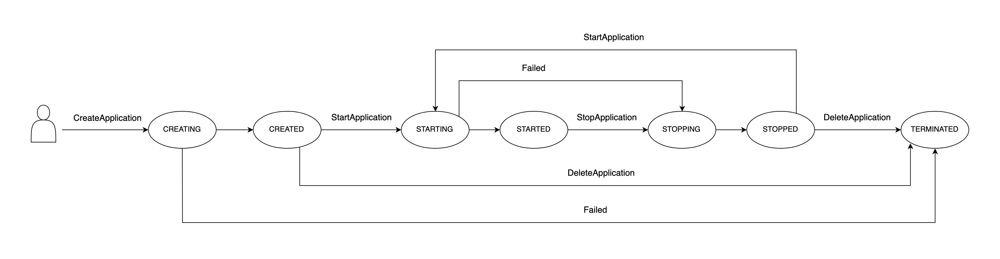

# Interact with and configure an EMR Serverless application

This section covers how to interact with your Amazon EMR Serverless application with the
AWS CLI. It also describes configuration of an application, performing customizations, and defaults for Spark and Hive engines.

###### Topics

- [Application states](#application-states "#application-states")
- [Creating an EMR Serverless application from the EMR Studio
  console](studio.md "studio.md")
- [Interacting with your EMR Serverless application on the
  AWS CLI](applications-cli.md "applications-cli.md")
- [Configuring an application when working with EMR Serverless](application-capacity.md "application-capacity.md")
- [Customizing an EMR Serverless image](application-custom-image.md "application-custom-image.md")
- [Configuring VPC access for EMR Serverless applications to connect to data](vpc-access.md "vpc-access.md")
- [Amazon EMR Serverless architecture options](architecture.md "architecture.md")
- [Job concurrency and queuing for an EMR Serverless application](applications-concurrency-queuing.md "applications-concurrency-queuing.md")

## Application states

When you create an application with EMR Serverless, the application run enters the
`CREATING` state. It then passes through the following states until it succeeds
(exits with code `0`) or fails (exits with a non-zero code).

Applications can have the following states:

| State          | Description                                                                                                                                                 |
| -------------- | ----------------------------------------------------------------------------------------------------------------------------------------------------------- |
| **Creating**   | The application is being prepared and isn't ready to use yet.                                                                                               |
| **Created**    | The application has been created but hasn't provisioned capacity yet. You can modify the application to change its initial capacity configuration.       |
| **Starting**   | The application is starting and is provisioning capacity.                                                                                                   |
| **Started**    | The application is ready to accept new jobs. The application only accepts jobs when it's in this state.                                                  |
| **Stopping**   | All jobs have completed and the application is releasing its capacity.                                                                                      |
| **Stopped**    | The application is stopped and no resources are running on the application. You can modify the application to change its initial capacity configuration. |
| **Terminated** | The application has been terminated and doesn't appear on your application list.                                                                            |

The following diagram illustrates the trajectory of EMR Serverless application states.

