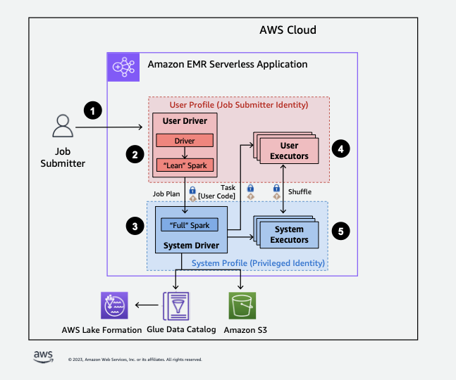

# Using EMR Serverless with AWS Lake Formation for fine-grained access control

## Overview

With Amazon EMR releases 7.2.0 and higher, leverage AWS Lake Formation to apply fine-grained access controls on
Data Catalog tables that are backed by S3. This capability lets you configure table, row, column,
and cell level access controls for read queries within your
Amazon EMR Serverless Spark jobs.
To configure fine-grained access control for Apache Spark batch jobs and interactive sessions,
use EMR Studio. See the following sections to learn more about Lake Formation and how to use it with EMR Serverless.

Using Amazon EMR Serverless with AWS Lake Formation incurs additional charges. For more
information, refer to [Amazon EMR
pricing](https://aws.amazon.com/emr/pricing/ "https://aws.amazon.com/emr/pricing/").

## How EMR Serverless works with

AWS Lake Formation

Using EMR Serverless with Lake Formation lets you enforce a layer of permissions on each Spark
job to apply Lake Formation permissions control when EMR Serverless executes jobs.
EMR Serverless uses [Spark resource profiles](https://spark.apache.org/docs/latest/api/java/org/apache/spark/resource/ResourceProfile.html "https://spark.apache.org/docs/latest/api/java/org/apache/spark/resource/ResourceProfile.html") to create two profiles to effectively execute
jobs. The user profile executes user-supplied code, while the system profile enforces
Lake Formation policies. For more information, refer to [What is AWS Lake Formation](../../../lake-formation/latest/dg/what-is-lake-formation.md "../../../lake-formation/latest/dg/what-is-lake-formation.md")
and [Considerations and limitations](emr-serverless-lf-enable-considerations.md "emr-serverless-lf-enable-considerations.md").

When you use pre-initialized capacity with Lake Formation, we suggest that you have a minimum
of two Spark drivers. Each Lake Formation-enabled job utilizes two Spark drivers, one for the user
profile and one for the system profile. For the best performance, use double
the number of drivers for Lake Formation-enabled jobs compared to if you don't use Lake Formation.

When you run Spark jobs on EMR Serverless, also consider the impact of dynamic allocation
on resource management and cluster performance. The configuration `spark.dynamicAllocation.maxExecutors` of the maximum number of
executors per resource profile applies to user and system executors. If you configure that number to be equal to the
maximum allowed number of executors, your job run might get stuck because of one type of executor that uses all available resources, which
prevents the other executor when you run jobs jobs.

So you don't run out of resources, EMR Serverless sets the default maximum number of executors per resource profile to 90% of the
`spark.dynamicAllocation.maxExecutors` value. You can override this configuration when you specify
`spark.dynamicAllocation.maxExecutorsRatio` with a value between 0 and 1. Additionally, also configure the following properties to
optimize resource allocation and overall performance:

- `spark.dynamicAllocation.cachedExecutorIdleTimeout`
- `spark.dynamicAllocation.shuffleTracking.timeout`
- `spark.cleaner.periodicGC.interval`

The following is a high-level overview of how EMR Serverless gets access to data
protected by Lake Formation security policies.



1. A user submits Spark job to an AWS Lake Formation-enabled EMR Serverless application.
2. EMR Serverless sends the job to a user driver and runs the job in the user profile.
   The user driver runs a lean version of Spark that has no ability to launch tasks, request
   executors, access S3 or the Glue Catalog. It builds a job plan.
3. EMR Serverless sets up a second driver called the system driver and runs it in the system profile
   (with a privileged identity). EMR Serverless sets up an encrypted TLS channel between the
   two drivers for communication. The user driver uses the channel to send the
   job plans to the system driver. The system driver does not run user-submitted code.
   It runs full Spark and communicates with S3,
   and the Data Catalog for data access. It request executors and compiles the Job Plan into a
   sequence of execution stages.
4. EMR Serverless then runs the stages on executors with the user driver or system driver. User code
   in any stage is run exclusively on user profile executors.
5. Stages that read data from Data Catalog tables protected by AWS Lake Formation or those that
   apply security filters are delegated to system executors.

## Enabling Lake Formation in Amazon EMR

To enable Lake Formation, set `spark.emr-serverless.lakeformation.enabled`
to `true` under `spark-defaults` classification for the
runtime-configuration parameter when [creating an EMR Serverless application](getting-started.md#gs-application-console "getting-started.md#gs-application-console").

```
aws emr-serverless create-application \
    --release-label emr-7.10.0 \
    --runtime-configuration '{
     "classification": "spark-defaults",
     "properties": {
      "spark.emr-serverless.lakeformation.enabled": "true"
      }
    }' \
    --type "SPARK"
```

You can also enable Lake Formation when you create a new application in EMR Studio. Choose
**Use Lake Formation for fine-grained access control**, available under
**Additional configurations**.

[Inter-worker encryption](interworker-encryption.md "interworker-encryption.md") is enabled by default
when you use Lake Formation with EMR Serverless, so you do not need to explicitly enable inter-worker encryption again.

**Enabling Lake Formation for Spark jobs**

To enable Lake Formation for individual Spark jobs, set `spark.emr-serverless.lakeformation.enabled` to true when using `spark-submit`.

```
--conf spark.emr-serverless.lakeformation.enabled=true
```

## Job runtime role IAM

permissions

Lake Formation permissions control access to AWS Glue Data Catalog resources, Amazon S3 locations, and the
underlying data at those locations. IAM permissions control access to the Lake Formation and
AWS Glue APIs and resources. Although you might have the Lake Formation permission to access a table
in the Data Catalog (SELECT), your operation fails if you don’t have the IAM permission on
the `glue:Get*` API operation.

The following is an example policy of how to provide IAM permissions to access a
script in S3, uploading logs to S3, AWS Glue API permissions, and permission to access
Lake Formation.

JSON

```
`{
 "Version":"2012-10-17",
 "Statement": [
 {
 "Sid": "ScriptAccess",
 "Effect": "Allow",
 "Action": [
 "s3:GetObject",
 "s3:ListBucket"
 ],
 "Resource": [
 "arn:aws:s3:::*.amzn-s3-demo-bucket/scripts",
 "arn:aws:s3:::*.amzn-s3-demo-bucket/*"
 ]
 },
 {
 "Sid": "LoggingAccess",
 "Effect": "Allow",
 "Action": [
 "s3:PutObject"
 ],
 "Resource": [
 "arn:aws:s3:::amzn-s3-demo-bucket/logs/*"
 ]
 },
 {
 "Sid": "GlueCatalogAccess",
 "Effect": "Allow",
 "Action": [
 "glue:Get*",
 "glue:Create*",
 "glue:Update*"
 ],
 "Resource": [
 "*"
 ]
 },
 {
 "Sid": "LakeFormationAccess",
 "Effect": "Allow",
 "Action": [
 "lakeformation:GetDataAccess"
 ],
 "Resource": [
 "*"
 ]
 }
 ]
}`

```

## Setting up Lake Formation permissions

for job runtime role

First, register the location of your Hive table with Lake Formation. Then create permissions for
your job runtime role on your desired table. For more details about Lake Formation, refer to [What is AWS Lake Formation?](../../../lake-formation/latest/dg/what-is-lake-formation.md "../../../lake-formation/latest/dg/what-is-lake-formation.md") in the _AWS Lake Formation Developer Guide_.

After you set up the Lake Formation permissions, submit Spark jobs on
Amazon EMR Serverless. For more information about Spark jobs, refer to [Spark
examples](jobs-spark.md#spark-examples "jobs-spark.md#spark-examples").

## Submitting a job run

After you finish setting up the Lake Formation grants, you can [submit Spark jobs on EMR Serverless.](jobs-spark.md#spark-examples "jobs-spark.md#spark-examples") The section that follows shows examples of how to configure and submit job run properties.

## Open-table format support

EMR Serverless supports Apache Hive, Apache Iceberg, and as of release 7.6.0, Delta Lake and Apache Hudi. For information about operation support, refer to the following tabs.

Hive

| Operations                             | Notes                               |
| -------------------------------------- | ----------------------------------- |
| Read operations                        | Fully supported                     |
| Incremental queries                    | Not applicable                      |
| Time travel queries                    | Not applicable to this table format |
| `DML INSERT`                           | With IAM permissions only           |
| DML UPDATE                             | Not applicable to this table format |
| `DML DELETE`                           | Not applicable to this table format |
| DDL commands                           | With IAM permissions only           |
| Metadata tables                        | Not applicable to this table format |
| Stored procedures                      | Not applicable                      |
| Table maintenance and utility features | Not applicable                      |

Iceberg

| Operations                             | Notes                                                                                                                                                                                                                     |
| -------------------------------------- | ------------------------------------------------------------------------------------------------------------------------------------------------------------------------------------------------------------------------- |
| Read operations                        | Fully supported                                                                                                                                                                                                           |
| Incremental queries                    | Fully supported                                                                                                                                                                                                           |
| Time travel queries                    | Fully supported                                                                                                                                                                                                           |
| `DML INSERT`                           | With IAM permissions only                                                                                                                                                                                                 |
| DML UPDATE                             | With IAM permissions only                                                                                                                                                                                                 |
| `DML DELETE`                           | With IAM permissions only                                                                                                                                                                                                 |
| DDL commands                           | With IAM permissions only                                                                                                                                                                                                 |
| Metadata tables                        | Supported, but certain tables are hidden. Refer to [considerations and limitations](emr-serverless-lf-enable-considerations.md "emr-serverless-lf-enable-considerations.md") for more information.                        |
| Stored procedures                      | Supported with the exceptions of `register_table` and `migrate`. Refer to [considerations and limitations](emr-serverless-lf-enable-considerations.md "emr-serverless-lf-enable-considerations.md") for more information. |
| Table maintenance and utility features | Not applicable                                                                                                                                                                                                            |

**Spark configuration for Iceberg:** The following sample shows how to configure Spark with Iceberg. To run Iceberg jobs, provide the following `spark-submit` properties.

```
--conf spark.sql.catalog.spark_catalog=org.apache.iceberg.spark.SparkSessionCatalog
--conf spark.sql.catalog.spark_catalog.warehouse=<`S3_DATA_LOCATION`>
--conf spark.sql.catalog.spark_catalog.glue.account-id=<`ACCOUNT_ID`>
--conf spark.sql.catalog.spark_catalog.client.region=<`REGION`>
--conf spark.sql.catalog.spark_catalog.glue.endpoint=https://glue.<`REGION`>.amazonaws.com
```

Hudi

| Operations                             | Notes                     |
| -------------------------------------- | ------------------------- |
| Read operations                        | Fully supported           |
| Incremental queries                    | Fully supported           |
| Time travel queries                    | Fully supported           |
| `DML INSERT`                           | With IAM permissions only |
| DML UPDATE                             | With IAM permissions only |
| `DML DELETE`                           | With IAM permissions only |
| DDL commands                           | With IAM permissions only |
| Metadata tables                        | Not supported             |
| Stored procedures                      | Not applicable            |
| Table maintenance and utility features | Not supported             |

The following samples configure Spark with Hudi, specifying file locations and other properties necessary for use.

**Spark config for Hudi:** This snippet when used in a notebook specifies the path to the Hudi Spark bundle JAR file, which enables Hudi functionality in Spark. It also configures Spark to
use the AWS Glue Data Catalog as the metastore.

```
%%configure -f
{
    "conf": {
        "spark.jars": "/usr/lib/hudi/hudi-spark-bundle.jar",
        "spark.hadoop.hive.metastore.client.factory.class": "com.amazonaws.glue.catalog.metastore.AWSGlueDataCatalogHiveClientFactory",
        "spark.serializer": "org.apache.spark.serializer.JavaSerializer",
        "spark.sql.catalog.spark_catalog": "org.apache.spark.sql.hudi.catalog.HoodieCatalog",
        "spark.sql.extensions": "org.apache.spark.sql.hudi.HoodieSparkSessionExtension"
    }
}
```

**Spark config for Hudi with AWS Glue:** This snippet when used in a notebook enables Hudi as a supported data-lake format
and ensures that Hudi libraries and dependencies are available.

```
%%configure
{
    "--conf": "spark.serializer=org.apache.spark.serializer.JavaSerializer --conf
spark.sql.catalog.spark_catalog=org.apache.spark.sql.hudi.catalog.HoodieCatalog --conf
spark.sql.extensions=org.apache.spark.sql.hudi.HoodieSparkSessionExtension",
    "--datalake-formats": "hudi",
    "--enable-glue-datacatalog": True,
    "--enable-lakeformation-fine-grained-access": "true"
}
```

Delta Lake

| Operations                             | Notes                     |
| -------------------------------------- | ------------------------- |
| Read operations                        | Fully supported           |
| Incremental queries                    | Fully supported           |
| Time travel queries                    | Fully supported           |
| `DML INSERT`                           | With IAM permissions only |
| DML UPDATE                             | With IAM permissions only |
| `DML DELETE`                           | With IAM permissions only |
| DDL commands                           | With IAM permissions only |
| Metadata tables                        | Not supported             |
| Stored procedures                      | Not applicable            |
| Table maintenance and utility features | Not supported             |

**EMR Serverless with Delta Lake:** To use Delta Lake with Lake Formation on EMR Serverless, run the following command:

```
spark-sql \
  --conf spark.sql.extensions=io.delta.sql.DeltaSparkSessionExtension,com.amazonaws.emr.recordserver.connector.spark.sql.RecordServerSQLExtension \
  --conf spark.sql.catalog.spark_catalog=org.apache.spark.sql.delta.catalog.DeltaCatalog \
```
