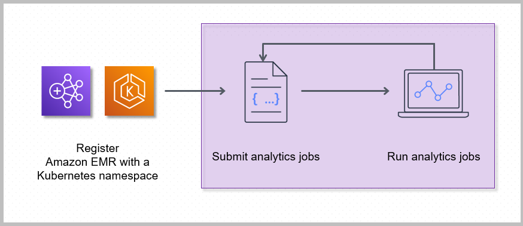

# What happens when you submit work to an Amazon EMR on EKS virtual cluster

Registering Amazon EMR with a Kubernetes namespace on Amazon EKS creates a virtual cluster. Amazon EMR can
then run analytics workloads on that namespace. When you use Amazon EMR on EKS to submit Spark jobs to
the virtual cluster, Amazon EMR on EKS requests the Kubernetes scheduler on Amazon EKS to schedule
pods.

The following steps and diagram illustrate the Amazon EMR on EKS workflow:

- Use an existing Amazon EKS cluster or create one by using the [eksctl](../../../eks/latest/userguide/getting-started-eksctl.md "../../../eks/latest/userguide/getting-started-eksctl.md") command line utility or Amazon EKS console.
- Create a virtual cluster by registering Amazon EMR with a namespace on an EKS cluster.
- Submit your job to the virtual cluster using the AWS CLI or SDK.

For each job that you run, Amazon EMR on EKS creates a container with an Amazon Linux 2 base image,
Apache Spark, and associated dependencies. Each job runs in a pod that downloads the container
and starts to run it. The pod terminates after the job terminates. If the container’s image has
been previously deployed to the node, then a cached image is used and the download is bypassed.
Sidecar containers, such as log or metric forwarders, can be deployed to the pod. After the job
terminates, you can still debug it using Spark application UI in the Amazon EMR console.
