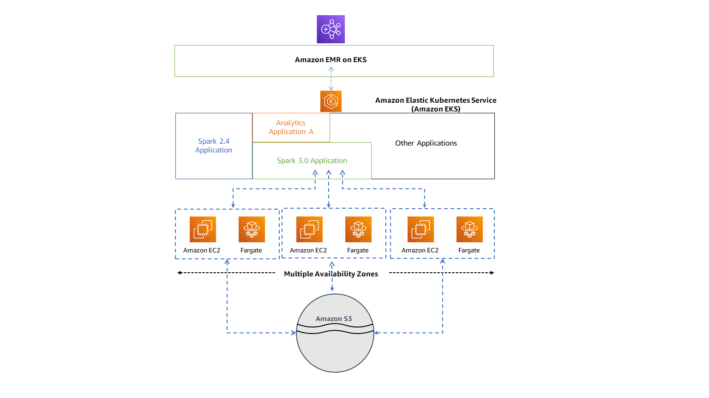

# Architecture for Amazon EMR on EKS

Amazon EMR on EKS loosely couples applications to the infrastructure that they run on. Each
infrastructure layer provides orchestration for the subsequent layer. When you submit a job to
Amazon EMR, your job definition contains all of its application-specific parameters. Amazon EMR uses these
parameters to instruct Amazon EKS about which pods and containers to deploy. Amazon EKS then brings online
the computing resources from Amazon EC2 and AWS Fargate required to run the job.

With this loose coupling of services, you can run multiple, securely isolated jobs
simultaneously. You can also benchmark the same job with different compute backends or spread
your job across multiple Availability Zones to improve availability.

The following diagram illustrates how Amazon EMR on EKS works with other AWS services.

