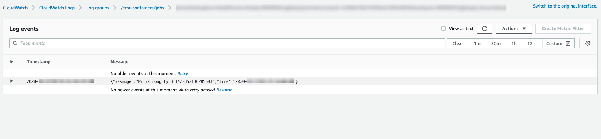

# Getting started with Amazon EMR on EKS

This topic helps you get started using Amazon EMR on EKS by deploying a Spark application on a
virtual cluster. It includes steps to set up the correct permissions and to start a job. Before you begin, make sure that you've completed the steps in [Setting up Amazon EMR on EKS](setting-up.md "setting-up.md"). This helps you get tools like the AWS CLI set up prior to creating your virtual
cluster. For other templates that can help you get
started, see our [EMR
Containers Best Practices Guide](https://aws.github.io/aws-emr-containers-best-practices/ "https://aws.github.io/aws-emr-containers-best-practices/") on GitHub.

You will need the following information from the setup steps:

- Virtual cluster ID for the Amazon EKS cluster and Kubernetes namespace registered with
  Amazon EMR

###### Important

When creating an EKS cluster, make sure to use m5.xlarge as the instance type, or any
other instance type with a higher CPU and memory. Using an instance type with lower CPU or
memory than m5.xlarge may lead to job failure due to insufficient resources available in
the cluster.

- Name of the IAM role used for job execution
- Release label for the Amazon EMR release (for example, `emr-6.4.0-latest`)
- Destination targets for logging and monitoring:
  - Amazon CloudWatch log group name and log stream prefix
  - Amazon S3 location to store event and container logs

###### Important

Amazon EMR on EKS jobs use Amazon CloudWatch and Amazon S3 as destination targets for monitoring and logging.
You can monitor job progress and troubleshoot failures by viewing the job logs sent to these
destinations. To enable logging, the IAM policy associated with the IAM role for job execution
must have the required permissions to access the target resources. If the IAM policy doesn't
have the required permissions, you must follow the steps outlined in [Update the trust policy of the job execution
role](setting-up-trust-policy.md "setting-up-trust-policy.md"), [Configure
a job run to use Amazon S3 logs](emr-eks-jobs-CLI.md#emr-eks-jobs-s3 "emr-eks-jobs-CLI.md#emr-eks-jobs-s3"), and [Configure a job run to use CloudWatch Logs](emr-eks-jobs-CLI.md#emr-eks-jobs-cloudwatch "emr-eks-jobs-CLI.md#emr-eks-jobs-cloudwatch") before running this sample job.

## Run a Spark application

Take the following steps to run a simple Spark application on Amazon EMR on EKS. The application
`entryPoint` file for a Spark Python application is located at
`s3://`REGION`.elasticmapreduce/emr-containers/samples/wordcount/scripts/wordcount.py`.
The `REGION` is the Region in which your Amazon EMR on EKS virtual cluster
resides, such as `us-east-1`.

1. Update the IAM policy for the job execution role with the required permissions, as the
   following policy statements demonstrate.

JSON

```
`{
 "Version":"2012-10-17",
 "Statement": [
 {
 "Sid": "ReadFromLoggingAndInputScriptBuckets",
 "Effect": "Allow",
 "Action": [
 "s3:GetObject",
 "s3:ListBucket"
 ],
 "Resource": [
 "arn:aws:s3:::*.elasticmapreduce",
 "arn:aws:s3:::*.elasticmapreduce/*",
 "arn:aws:s3:::`amzn-s3-demo-bucket`",
 "arn:aws:s3:::`amzn-s3-demo-bucket`/*",
 "arn:aws:s3:::`amzn-s3-demo-bucket-b`",
 "arn:aws:s3:::`amzn-s3-demo-bucket-b`/*"
 ]
 },
 {
 "Sid": "WriteToLoggingAndOutputDataBuckets",
 "Effect": "Allow",
 "Action": [
 "s3:PutObject",
 "s3:DeleteObject"
 ],
 "Resource": [
 "arn:aws:s3:::`amzn-s3-demo-bucket`/*",
 "arn:aws:s3:::`amzn-s3-demo-bucket-b`/*"
 ]
 },
 {
 "Sid": "DescribeAndCreateCloudwatchLogStream",
 "Effect": "Allow",
 "Action": [
 "logs:CreateLogStream",
 "logs:DescribeLogGroups",
 "logs:DescribeLogStreams"
 ],
 "Resource": [
 "arn:aws:logs:*:*:*"
 ]
 },
 {
 "Sid": "WriteToCloudwatchLogs",
 "Effect": "Allow",
 "Action": [
 "logs:PutLogEvents"
 ],
 "Resource": [
 "arn:aws:logs:*:*:log-group:`my_log_group_name`:log-stream:`my_log_stream_prefix`/*"
 ]
 }
 ]
}`

```

    * The first statement `ReadFromLoggingAndInputScriptBuckets` in this
     policy grants `ListBucket` and `GetObjects` access to the
     following Amazon S3 buckets:


    	+ ``REGION`.elasticmapreduce` ‐ the
    	 bucket where the application `entryPoint` file is located.
    	+ `amzn-s3-demo-destination-bucket` ‐ a bucket that you
    	 define for your output data.
    	+ `amzn-s3-demo-logging-bucket` ‐ a bucket that you
    	 define for your logging data.
    * The second statement `WriteToLoggingAndOutputDataBuckets` in this
     policy grants the job permissions to write data to your output and logging buckets
     respectively.
    * The third statement `DescribeAndCreateCloudwatchLogStream` grants the
     job with permissions to describe and create Amazon CloudWatch Logs.
    * The fourth statement `WriteToCloudwatchLogs` grants permissions to
     write logs to an Amazon CloudWatch log group named
     ``my_log_group_name`` under a log stream named
     ``my_log_stream_prefix``.

2. To run a Spark Python application, use the following command. Replace all the
   replaceable `red italicized` values with appropriate values. The
   `REGION` is the Region in which your Amazon EMR on EKS virtual cluster
   resides, such as `us-east-1`.

```
aws emr-containers start-job-run \
--virtual-cluster-id `cluster_id` \
--name `sample-job-name` \
--execution-role-arn `execution-role-arn` \
--release-label `emr-6.4.0-latest` \
--job-driver '{
  "sparkSubmitJobDriver": {
    "entryPoint": "s3://`REGION`.elasticmapreduce/emr-containers/samples/wordcount/scripts/wordcount.py",
    "entryPointArguments": ["s3://`amzn-s3-demo-destination-bucket`/wordcount_output"],
    "sparkSubmitParameters": "--conf spark.executor.instances=2 --conf spark.executor.memory=2G --conf spark.executor.cores=2 --conf spark.driver.cores=1"
  }
}' \
--configuration-overrides '{
  "monitoringConfiguration": {
    "cloudWatchMonitoringConfiguration": {
      "logGroupName": "`my_log_group_name`",
      "logStreamNamePrefix": "`my_log_stream_prefix`"
    },
    "s3MonitoringConfiguration": {
       "logUri": "s3://`amzn-s3-demo-logging-bucket`"
    }
  }
}'
```

The output data from this job will be available at
`s3://`amzn-s3-demo-destination-bucket`/wordcount_output`.

You can also create a JSON file with specified parameters for your job run. Then run
the `start-job-run` command with a path to the JSON file. For more information,
see [Submit a job run with
StartJobRun](emr-eks-jobs-submit.md "emr-eks-jobs-submit.md"). For more
details about configuring job run parameters, see [Options for configuring a job run](emr-eks-jobs-CLI.md#emr-eks-jobs-parameters "emr-eks-jobs-CLI.md#emr-eks-jobs-parameters"). 3. To run a Spark SQL application, use the following command. Replace all the
`red italicized` values with appropriate values. The
`REGION` is the Region in which your Amazon EMR on EKS virtual
cluster resides, such as `us-east-1`.

```
aws emr-containers start-job-run \
--virtual-cluster-id `cluster_id` \
--name `sample-job-name` \
--execution-role-arn `execution-role-arn` \
--release-label `emr-6.7.0-latest` \
--job-driver '{
  "sparkSqlJobDriver": {
    "entryPoint": "s3://`query-file`.sql",
    "sparkSqlParameters": "--conf spark.executor.instances=2 --conf spark.executor.memory=2G --conf spark.executor.cores=2 --conf spark.driver.cores=1"
  }
}' \
--configuration-overrides '{
  "monitoringConfiguration": {
    "cloudWatchMonitoringConfiguration": {
      "logGroupName": "`my_log_group_name`",
      "logStreamNamePrefix": "`my_log_stream_prefix`"
    },
    "s3MonitoringConfiguration": {
       "logUri": "s3://`amzn-s3-demo-logging-bucket`"
    }
  }
}'
```

A sample SQL query file is shown below. You must have an external file store, such as
S3, where the data for the tables is stored.

```
CREATE DATABASE demo;
CREATE EXTERNAL TABLE IF NOT EXISTS demo.amazonreview( marketplace string, customer_id string, review_id  string, product_id  string, product_parent  string, product_title  string, star_rating  integer, helpful_votes  integer, total_votes  integer, vine  string, verified_purchase  string, review_headline  string, review_body  string, review_date  date, year  integer) STORED AS PARQUET LOCATION 's3://`URI to parquet files`';
SELECT count(*) FROM demo.amazonreview;
SELECT count(*) FROM demo.amazonreview WHERE star_rating = 3;
```

The output for this job will available in the driver’s stdout logs in S3 or
CloudWatch, depending on the `monitoringConfiguration` that is
configured. 4. You can also create a JSON file with specified parameters for your job run. Then run
the start-job-run command with a path to the JSON file. For more information, see Submit a
job run. For more details about configuring job run parameters, see Options for
configuring a job run.

To monitor the progress of the job or to debug failures, you can inspect logs uploaded
to Amazon S3, CloudWatch Logs, or both. Refer to log path in Amazon S3 at [Configure a job run to use S3 logs](emr-eks-jobs-CLI.md#emr-eks-jobs-s3 "emr-eks-jobs-CLI.md#emr-eks-jobs-s3") and for Cloudwatch logs at [Configure a job run to use CloudWatch Logs](emr-eks-jobs-CLI.md#emr-eks-jobs-cloudwatch "emr-eks-jobs-CLI.md#emr-eks-jobs-cloudwatch"). To see logs in CloudWatch Logs, follow the
instructions below.

    * Open the CloudWatch console at [https://console.aws.amazon.com/cloudwatch/](https://console.aws.amazon.com/cloudwatch/ "https://console.aws.amazon.com/cloudwatch/").
    * In the **Navigation** pane, choose **Logs**.
     Then choose **Log groups**.
    * Choose the log group for Amazon EMR on EKS and then view the uploaded log events.



###### Important

Jobs have a [default configured retry policy](jobruns-using-retry-policies.md#retry-config "jobruns-using-retry-policies.md#retry-config").
For information on how to modify or disable the configuration, refer to [Using job retry policies](jobruns-using-retry-policies.md "jobruns-using-retry-policies.md").
