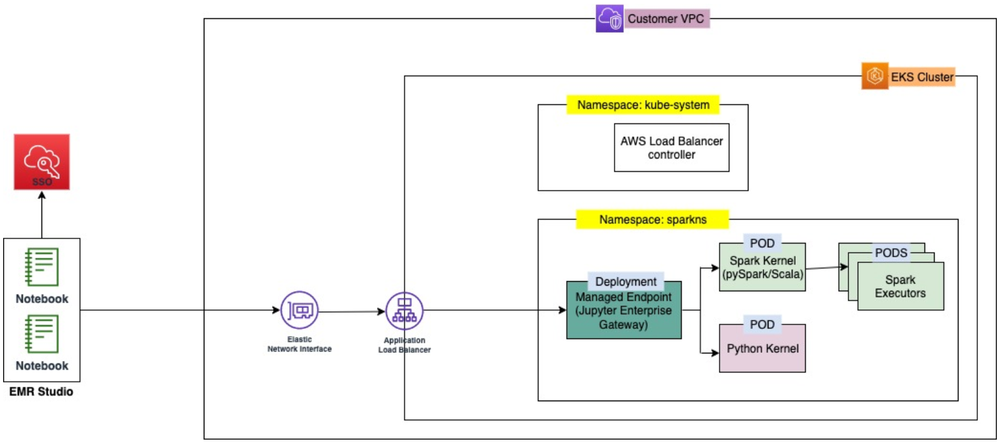

# Overview of interactive endpoints

An _interactive endpoint_ provides the capability for interactive
clients like Amazon EMR Studio to connect to Amazon EMR on EKS clusters to run interactive workloads. The
interactive endpoint is backed by a Jupyter Enterprise Gateway that provides the remote kernel
lifecycle management capability that interactive clients need. _Kernels_
are language-specific processes that interact with the Jupyter-based Amazon EMR Studio client to
run interactive workloads.

Interactive endpoints support the following kernels:

- Python 3
- PySpark on Kubernetes
- Apache Spark with Scala

###### Note

Amazon EMR on EKS pricing applies for the interactive endpoints and kernels. For more
information, see the [Amazon EMR on EKS pricing
page](https://aws.amazon.com/emr/pricing/#Amazon_EMR_on_Amazon_EKS "https://aws.amazon.com/emr/pricing/#Amazon_EMR_on_Amazon_EKS").

The following entities are required for EMR Studio to connect with
Amazon EMR on EKS.

- **Amazon EMR on EKS virtual cluster** – A
  _virtual cluster_ is a Kubernetes namespace that you register Amazon EMR
  with. Amazon EMR uses virtual clusters to run jobs and host endpoints. You can back multiple
  virtual clusters with the same physical cluster. However, each virtual cluster maps to one
  namespace on an Amazon EKS cluster. Virtual clusters don't create any active resources that
  contribute to your bill or that require lifecycle management outside the service.
- **Amazon EMR on EKS interactive endpoint** – An
  _interactive endpoint_ is an HTTPS endpoint to which EMR Studio
  users can connect a workspace. You can only access the HTTPS endpoints from your
  EMR Studio, and you create them in a private subnet of the Amazon Virtual Private Cloud (Amazon VPC) for your
  Amazon EKS cluster.

The Python, PySpark, and Spark Scala kernels use the permissions defined in your
Amazon EMR on EKS job execution role to invoke other AWS services. All kernels and users that
connect to the interactive endpoint utilize the role that you specified when you created
the endpoint. We recommend that you create separate endpoints for different users, and
that the users have different AWS Identity and Access Management (IAM) roles.

- **AWS Application Load Balancer controller** – The _AWS
  Application Load Balancer controller_ manages Elastic Load Balancing for an Amazon EKS Kubernetes cluster. The
  controller provisions an Application Load Balancer (ALB) when you create a Kubernetes Ingress resource. An ALB
  exposes a Kubernetes service, such as an interactive endpoint, outside of the Amazon EKS
  cluster but within the same Amazon VPC. When you create an interactive endpoint, an Ingress
  resource is also deployed that exposes the interactive endpoint by means of the ALB for
  interactive clients to connect to. You only need to install one AWS Application Load Balancer controller for
  each Amazon EKS cluster.
  The following diagram depicts the interactive endpoints architecture in Amazon EMR on EKS. An
  Amazon EKS cluster comprises the _compute_ to run the analytic workloads, and the _interactive endpoint_. The
  Application Load Balancer controller runs in the `kube-system` namespace; the
  workloads and interactive endpoints run in the namespace that you specify when you create the virtual
  cluster. When you create an interactive endpoint, the Amazon EMR on EKS control plane creates
  the interactive endpoint deployment in the Amazon EKS cluster. Additionally, an instance of the
  application load balancer ingress is created by the AWS load balancer controller. The
  application load balancer provides the external interface for clients like EMR Studio to
  connect to the Amazon EMR cluster and run interactive workloads.

