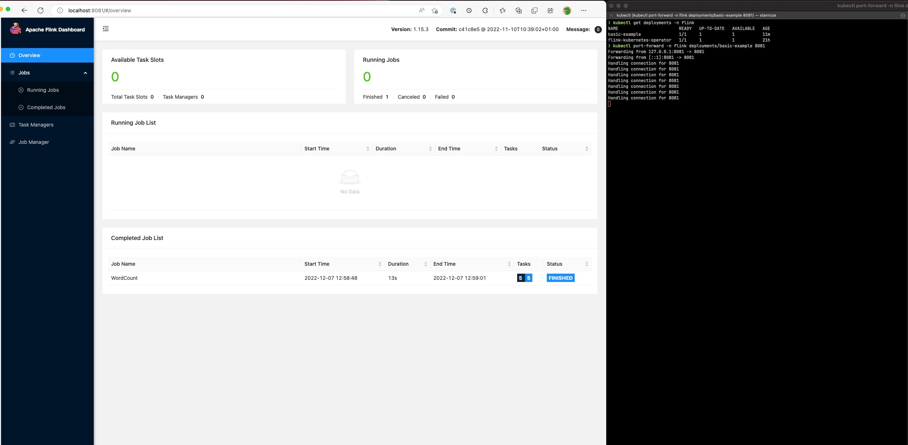

# Use the Flink UI to monitor Flink jobs

To monitor the health and performance of a running Flink application, use the
_Flink Web Dashboard_. This dashboard provides information about the status of the job,
the number of TaskManagers, and the metrics and logs for the job. It also lets you
view and modify the configuration of the Flink job, and to interact with the Flink cluster
to submit or cancel jobs.

To access the Flink Web Dashboard for a running Flink application on Kubernetes:

1. Use the `kubectl port-forward` command to forward a local port to the port on which the Flink Web Dashboard
   is running in the Flink application's TaskManager pods. By default, this port is 8081. Replace `deployment-name`
   with the name of the Flink application deployment from above.

```
kubectl get deployments -n `namespace`
```

Example output:

```

kubectl get deployments -n flink-namespace
NAME                        READY   UP-TO-DATE   AVAILABLE  AGE
basic-example               1/1       1            1           11m
flink-kubernetes-operator   1/1       1            1           21h
```

```
kubectl port-forward deployments/`deployment-name` 8081 -n `namespace`
```

2. If you want to use a different port locally, use the `local-port`:8081 parameter.

```
kubectl port-forward -n flink deployments/basic-example `8080`:8081
```

3. In a web browser, navigate to `http://localhost:8081`
   (or `http://localhost:`local-port`` if you used a custom local port)
   to access the Flink Web Dashboard. This dashboard shows information about the running
   Flink application, such as the status of the job, the number of TaskManagers, and
   the metrics and logs for the job.


