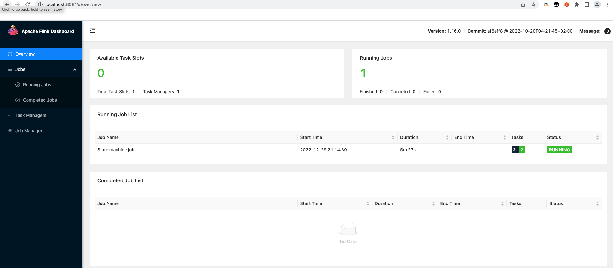

# Getting started with Flink native Kubernetes for Amazon EMR on EKS

These steps show you how to configure, set up a service account for, and run a Flink application. Flink Native Kubernetes is used to deploy
Flink on a running Kubernetes cluster.

## Configure and run a Flink application

Amazon EMR 6.13.0 and higher supports Flink Native Kubernetes for running
Flink applications on an Amazon EKS cluster. To run a Flink application, follow these steps:

1. Before you can run a Flink application with the Flink Native Kubernetes command, complete the steps in
   [Setting up Flink Native Kubernetes for Amazon EMR on EKS](jobruns-flink-native-kubernetes-setup.md "jobruns-flink-native-kubernetes-setup.md").
2. [Download and install Flink](https://nightlies.apache.org/flink/flink-docs-release-1.18/docs/try-flink/local_installation "https://nightlies.apache.org/flink/flink-docs-release-1.18/docs/try-flink/local_installation").
3. Set the values for the following environment variables.

```
#Export the FLINK_HOME environment variable to your local installation of Flink
export FLINK_HOME=`/usr/local/bin/flink` #Will vary depending on your installation
export NAMESPACE=flink
export CLUSTER_ID=flink-application-cluster
export IMAGE=<123456789012.dkr.ecr.sample-AWS Region-.amazonaws.com/flink/emr-6.13.0-flink:latest>
export FLINK_SERVICE_ACCOUNT=emr-containers-sa-flink
export FLINK_CLUSTER_ROLE_BINDING=emr-containers-crb-flink
```

4. Create a service account to manage Kubernetes resources.

```
kubectl create serviceaccount $FLINK_SERVICE_ACCOUNT -n $NAMESPACE
kubectl create clusterrolebinding $FLINK_CLUSTER_ROLE_BINDING --clusterrole=edit --serviceaccount=$NAMESPACE:$FLINK_SERVICE_ACCOUNT
```

5. Run the `run-application` CLI command.

```
$FLINK_HOME/bin/flink run-application \
    --target kubernetes-application \
    -Dkubernetes.namespace=$NAMESPACE \
    -Dkubernetes.cluster-id=$CLUSTER_ID \
    -Dkubernetes.container.image.ref=$IMAGE \
    -Dkubernetes.service-account=$FLINK_SERVICE_ACCOUNT \
    local:///opt/flink/examples/streaming/Iteration.jar
2022-12-29 21:13:06,947 INFO  org.apache.flink.kubernetes.utils.KubernetesUtils            [] - Kubernetes deployment requires a fixed port. Configuration blob.server.port will be set to 6124
2022-12-29 21:13:06,948 INFO  org.apache.flink.kubernetes.utils.KubernetesUtils            [] - Kubernetes deployment requires a fixed port. Configuration taskmanager.rpc.port will be set to 6122
2022-12-29 21:13:07,861 WARN  org.apache.flink.kubernetes.KubernetesClusterDescriptor      [] - Please note that Flink client operations(e.g. cancel, list, stop, savepoint, etc.) won't work from outside the Kubernetes cluster since 'kubernetes.rest-service.exposed.type' has been set to ClusterIP.
2022-12-29 21:13:07,868 INFO  org.apache.flink.kubernetes.KubernetesClusterDescriptor      [] - Create flink application cluster flink-application-cluster successfully, JobManager Web Interface: http://flink-application-cluster-rest.flink:8081

```

6. Examine the created Kubernetes resources.

```
kubectl get all -n <namespace>
NAME READY STATUS RESTARTS AGE
pod/flink-application-cluster-546687cb47-w2p2z 1/1 Running 0 3m37s
pod/flink-application-cluster-taskmanager-1-1 1/1 Running 0 3m24s

NAME TYPE CLUSTER-IP EXTERNAL-IP PORT(S) AGE
service/flink-application-cluster ClusterIP None <none> 6123/TCP,6124/TCP 3m38s
service/flink-application-cluster-rest ClusterIP 10.100.132.158 <none> 8081/TCP 3m38s

NAME READY UP-TO-DATE AVAILABLE AGE
deployment.apps/flink-application-cluster 1/1 1 1 3m38s

NAME DESIRED CURRENT READY AGE
replicaset.apps/flink-application-cluster-546687cb47 1 1 1 3m38s

```

7. Port forward to 8081.

```
kubectl port-forward service/flink-application-cluster-rest 8081 -n <namespace>
Forwarding from 127.0.0.1:8081 -> 8081
```

8. Locally access the Flink UI.

 9. Delete the Flink application.

```
kubectl delete deployment.apps/flink-application-cluster -n <namespace>
deployment.apps "flink-application-cluster" deleted
```

For more information about submitting applications to Flink, see [Native Kubernetes](https://nightlies.apache.org/flink/flink-docs-master/docs/deployment/resource-providers/native_kubernetes/ "https://nightlies.apache.org/flink/flink-docs-master/docs/deployment/resource-providers/native_kubernetes/") in the Apache Flink documentation.
