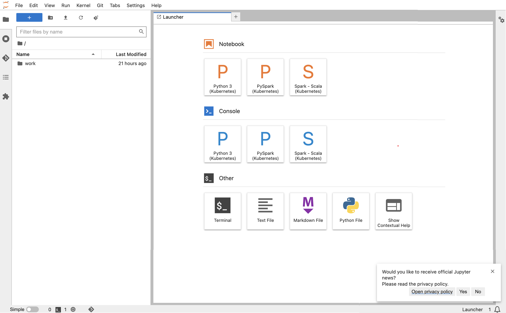
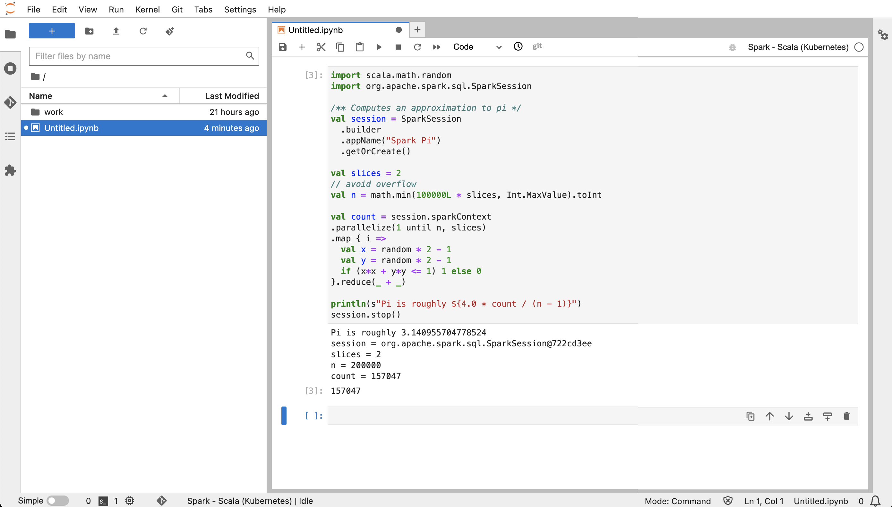

# Using self-hosted Jupyter notebooks

You can host and manage Jupyter or JupyterLab notebooks on an Amazon EC2 instance or on your
own Amazon EKS cluster as a _self-hosted Jupyter notebook_. You can then run
interactive workloads with your self-hosted Jupyter notebooks. The following sections walk
through the process to set up and deploy a self-hosted Jupyter notebook on an Amazon EKS
cluster.

###### Creating a self-hosted Jupyter notebook on an EKS cluster

- [Create a security group](#managed-endpoints-self-hosted-security "#managed-endpoints-self-hosted-security")
- [Create an Amazon EMR on EKS interactive
  endpoint](#managed-endpoints-self-hosted-create-me "#managed-endpoints-self-hosted-create-me")
- [Retrieve the gateway server URL of
  your interactive endpoint](#managed-endpoints-self-hosted-gateway "#managed-endpoints-self-hosted-gateway")
- [Retrieve an auth token to connect to
  the interactive endpoint](#managed-endpoints-self-hosted-auth "#managed-endpoints-self-hosted-auth")
- [Example: Deploy a JupyterLab
  notebook](#managed-endpoints-self-hosted-example "#managed-endpoints-self-hosted-example")
- [Delete a self-hosted Jupyter
  notebook](#managed-endpoints-self-hosted-cleanup "#managed-endpoints-self-hosted-cleanup")

## Create a security group

Before you can create an interactive endpoint and run a self-hosted Jupyter or
JupyterLab notebook, you must create a security group to control the traffic between your
notebook and the interactive endpoint. To use the Amazon EC2 console or Amazon EC2 SDK to create the
security group, refer to the steps in [Create a security group](../../../AWSEC2/latest/UserGuide/working-with-security-groups.md#creating-security-group "../../../AWSEC2/latest/UserGuide/working-with-security-groups.md#creating-security-group") in the _Amazon EC2 User Guide_. You should
create the security group in the VPC where you want to deploy your notebook server.

To follow the example in this guide, use the same VPC as your Amazon EKS cluster. If you want
to host your notebook in a VPC that is different from the VPC for your Amazon EKS cluster, you
might need to create a peering connection between those two VPCs. For steps to create a
peering connection between two VPCs, see [Create a VPC peering
connection](../../../vpc/latest/peering/create-vpc-peering-connection.md "../../../vpc/latest/peering/create-vpc-peering-connection.md") in the Amazon VPC Getting Started Guide.

You need the ID for the security group to [create an Amazon EMR on EKS interactive
endpoint](../../../index.md "../../../index.md") in the next step.

## Create an Amazon EMR on EKS interactive

endpoint

After you create security group for your notebook, use the steps provided in [Creating an interactive endpoint for your virtual
cluster](create-managed-endpoint.md "create-managed-endpoint.md") to create an
interactive endpoint. You must provide the security group ID that you created for your
notebook in [Create a security group](#managed-endpoints-self-hosted-security "#managed-endpoints-self-hosted-security").

Insert the security ID in place of
`your-notebook-security-group-id` in the following configuration
override settings:

```
--configuration-overrides '{
    "applicationConfiguration": [
        {
            "classification": "endpoint-configuration",
            "properties": {
                "notebook-security-group-id": "`your-notebook-security-group-id`"
            }
        }
    ],
    "monitoringConfiguration": {
    ...'
```

## Retrieve the gateway server URL of

your interactive endpoint

After you create an interactive endpoint, retrieve the gateway server URL with the
`describe-managed-endpoint` command in the AWS CLI. You need this URL to connect
your notebook to the endpoint. The gateway server URL is a private endpoint.

```
aws emr-containers describe-managed-endpoint \
--region `region` \
--virtual-cluster-id `virtualClusterId` \
--id `endpointId`
```

Initially, your endpoint is in the **CREATING** state. After a few minutes, it transitions to the
**ACTIVE** state. When the endpoint is
**ACTIVE**, it's ready to use.

Take note of the `serverUrl` attribute that the `aws emr-containers
 describe-managed-endpoint` command returns from the active endpoint. You need this
URL to connect your notebook to the endpoint when you [deploy your self-hosted Jupyter or
JupyterLab notebook](../../../index.md "../../../index.md").

## Retrieve an auth token to connect to

the interactive endpoint

To connect to an interactive endpoint from a Jupyter or JupyterLab notebook, you must
generate a session token with the `GetManagedEndpointSessionCredentials` API. The
token acts as proof of authentication to connect to the interactive endpoint server.

The following command is explained in more detail with an output example below.

```
aws emr-containers get-managed-endpoint-session-credentials \
--endpoint-identifier `endpointArn` \
--virtual-cluster-identifier `virtualClusterArn` \
--execution-role-arn `executionRoleArn` \
--credential-type "TOKEN" \
--duration-in-seconds `durationInSeconds` \
--region `region`
```

**`endpointArn`**

The ARN of your endpoint. You can find the ARN in the result of a
`describe-managed-endpoint` call.

**`virtualClusterArn`**

The ARN of the virtual cluster.

**`executionRoleArn`**

The ARN of the execution role.

**`durationInSeconds`**

The duration in seconds for which the token is valid. The default duration is 15
minutes (`900`), and the maximum is 12 hours (`43200`).

**`region`**

The same region as your endpoint.

Your output should resemble the following example. Take note of the
`session-token` value that you will use when you
[deploy your
self-hosted Jupyter or JupyterLab notebook](../../../index.md "../../../index.md").

```
{
    "id": "`credentialsId`",
    "credentials": {
        "token": "`session-token`"
    },
    "expiresAt": "2022-07-05T17:49:38Z"
}
```

## Example: Deploy a JupyterLab

notebook

Once you've completed the steps above, you can try this example procedure to deploy a
JupyterLab notebook into the Amazon EKS cluster with your interactive endpoint.

1. Create a namespace to run the notebook server.
2. Create a file locally, `notebook.yaml`, with the following contents. The
   file contents are described below.

```
apiVersion: v1
kind: Pod
metadata:
  name: jupyter-notebook
  namespace: `namespace`
spec:
  containers:
  - name: minimal-notebook
    image: jupyter/all-spark-notebook:lab-3.1.4 # open source image
    ports:
    - containerPort: 8888
    command: ["start-notebook.sh"]
    args: ["--LabApp.token=''"]
    env:
    - name: JUPYTER_ENABLE_LAB
      value: "yes"
    - name: KERNEL_LAUNCH_TIMEOUT
      value: "400"
    - name: JUPYTER_GATEWAY_URL
      value: "`serverUrl`"
    - name: JUPYTER_GATEWAY_VALIDATE_CERT
      value: "false"
    - name: JUPYTER_GATEWAY_AUTH_TOKEN
      value: "`session-token`"
```

If you are deploying Jupyter notebook to a Fargate-only cluster, label the Jupyter
pod with a `role` label as shown in the following example:

```
...
metadata:
  name: jupyter-notebook
  namespace: default
  labels:
    role: `example-role-name-label`
spec:
            ...
```

**`namespace`**

The Kubernetes namespace that the notebook deploys into.

**`serverUrl`**

The `serverUrl` attribute that the
`describe-managed-endpoint` command returned in [Retrieve the gateway server URL of
your interactive endpoint](#managed-endpoints-self-hosted-gateway "#managed-endpoints-self-hosted-gateway") .

**`session-token`**

The `session-token` attribute that the
`get-managed-endpoint-session-credentials` command returned in [Retrieve an auth token to connect to
the interactive endpoint](#managed-endpoints-self-hosted-auth "#managed-endpoints-self-hosted-auth").

**`KERNEL_LAUNCH_TIMEOUT`**

The amount of time in seconds that the interactive endpoint waits for the
kernel to come to **RUNNING** state.
Ensure sufficient time for kernel launch to complete by setting the kernel launch
timeout to an appropriate value (maximum 400 seconds).

**`KERNEL_EXTRA_SPARK_OPTS`**

Optionally, you can pass additional Spark configurations for the Spark
kernels. Set this environment variable with the values as the Spark configuration
property as shown in the following example:

```
- name: KERNEL_EXTRA_SPARK_OPTS
  value: "--conf spark.driver.cores=2
          --conf spark.driver.memory=2G
          --conf spark.executor.instances=2
          --conf spark.executor.cores=2
          --conf spark.executor.memory=2G
          --conf spark.dynamicAllocation.enabled=true
          --conf spark.dynamicAllocation.shuffleTracking.enabled=true
          --conf spark.dynamicAllocation.minExecutors=1
          --conf spark.dynamicAllocation.maxExecutors=5
          --conf spark.dynamicAllocation.initialExecutors=1
          "
```

3. Deploy the pod spec to your Amazon EKS cluster:

```
kubectl apply -f notebook.yaml -n `namespace`
```

This will start up a minimal JupyterLab notebook connected to your Amazon EMR on EKS
interactive endpoint. Wait until the pod is **RUNNING**. You can check its status with the following
command:

```
kubectl get pod jupyter-notebook -n `namespace`
```

When the pod is ready, the `get pod` command returns output similar to
this:

```
NAME              READY  STATUS   RESTARTS  AGE
jupyter-notebook  1/1    Running  0         46s
```

4. Attach the notebook security group to the node where the notebook is
   scheduled.
   1. First, identify the node where `jupyter-notebook` pod is scheduled
      with the `describe pod` command.

   ```
   kubectl describe pod jupyter-notebook -n `namespace`
   ```

   2. Open the Amazon EKS console at [https://console.aws.amazon.com/eks/home#/clusters](https://console.aws.amazon.com/eks/home#/clusters "https://console.aws.amazon.com/eks/home#/clusters").
   3. Navigate to the **Compute** tab for your Amazon EKS cluster and
      select the node identified by the `describe pod` command. Select the
      instance ID for the node.
   4. From the **Actions** menu, select **Security**
      > **Change security groups** to attach the security group that you
      > created in [Create a security group](#managed-endpoints-self-hosted-security "#managed-endpoints-self-hosted-security").
   5. If you are deploying Jupyter notebook pod on AWS Fargate, create a `SecurityGroupPolicy` to
      apply to the Jupyter notebook pod with the role label:

   ```
   cat >my-security-group-policy.yaml <<EOF
   apiVersion: vpcresources.k8s.aws/v1beta1
   kind: SecurityGroupPolicy
   metadata:
     name: `example-security-group-policy-name`
     namespace: default
   spec:
     podSelector:
       matchLabels:
         role: `example-role-name-label`
     securityGroups:
       groupIds:
         - `your-notebook-security-group-id`
   EOF
   ```

5. Now, port-forward so that you can locally access the JupyterLab interface:

```
kubectl port-forward jupyter-notebook 8888:8888 -n `namespace`
```

Once that is running, navigate to your local browser and visit
`localhost:8888` to see the JupyterLab interface:

 6. From JupyterLab, create a new Scala notebook. Here is a sample code snippet that you
can run to approximate the value of Pi:

```
import scala.math.random
import org.apache.spark.sql.SparkSession

/** Computes an approximation to pi */
val session = SparkSession
  .builder
  .appName("Spark Pi")
  .getOrCreate()

val slices = 2
// avoid overflow
val n = math.min(100000L * slices, Int.MaxValue).toInt

val count = session.sparkContext
.parallelize(1 until n, slices)
.map { i =>
  val x = random * 2 - 1
  val y = random * 2 - 1
  if (x*x + y*y <= 1) 1 else 0
}.reduce(_ + _)

println(s"Pi is roughly ${4.0 * count / (n - 1)}")
session.stop()
```



## Delete a self-hosted Jupyter

notebook

When you're ready to delete your self-hosted notebook, you can also delete the
interactive endpoint and security group, too. Perform the actions in the following
order:

1. Use the following command to delete the `jupyter-notebook` pod:

```
kubectl delete pod jupyter-notebook -n `namespace`
```

2. Then, delete your interactive endpoint with the `delete-managed-endpoint`
   command. For steps to delete an interactive endpoint, see [Delete an interactive endpoint](delete-managed-endpoint.md "delete-managed-endpoint.md").
   Initially, your endpoint will be in the **TERMINATING** state. Once all resources have been cleaned up,
   it transitions to the **TERMINATED**
   state.
3. If you don’t plan to use the notebook security group that you created in [Create a security group](#managed-endpoints-self-hosted-security "#managed-endpoints-self-hosted-security") for other Jupyter notebook
   deployments, you can delete it. See [Delete a security group](../../../AWSEC2/latest/UserGuide/working-with-security-groups.md#deleting-security-group "../../../AWSEC2/latest/UserGuide/working-with-security-groups.md#deleting-security-group") in the Amazon EC2 User Guide for more information.
