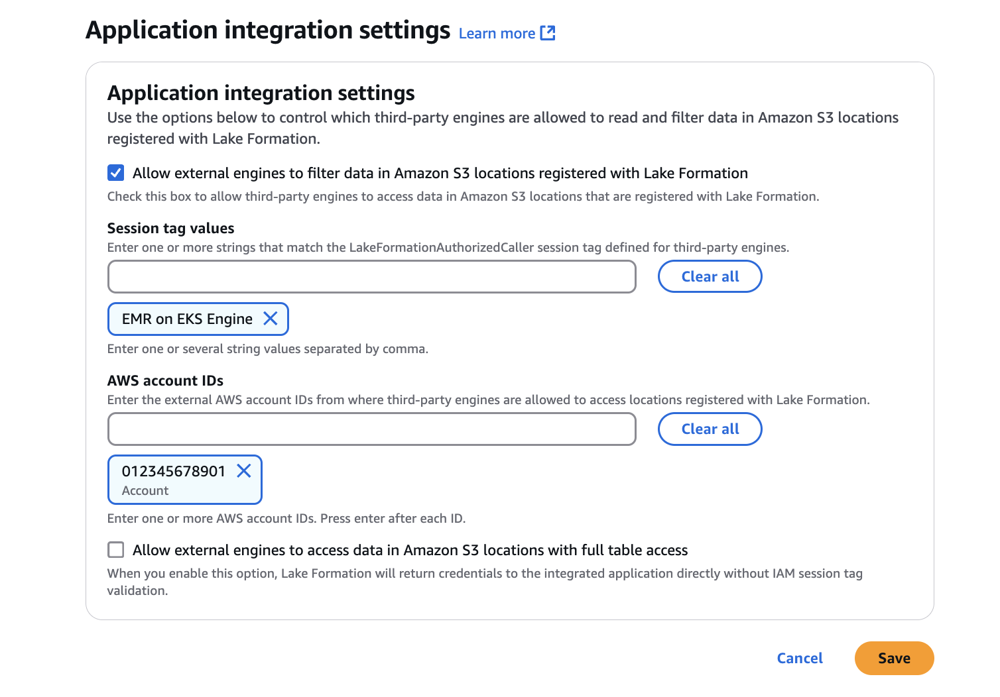

# Enable Lake Formation with Amazon EMR on EKS

With Amazon EMR release 7.7 and higher, you can leverage AWS Lake Formation to apply fine-grained access controls on Data Catalog tables that are backed by Amazon S3. This capability lets
you configure table, row, column, and cell level access controls for read queries within your Amazon EMR on EKS Spark Jobs.

This section covers how to create a security configuration and set up Lake Formation to work with Amazon EMR. It also describes how
to create a virtual cluster with the Security Configuration that you created
for Lake Formation. These sections are meant to be completed in sequence.

## Step 1: Set up Lake Formation-based column, row, or cell-level permissions

First, to apply row and column level permissions with Lake Formation, the data lake administrator for Lake Formation must set the **LakeFormationAuthorizedCaller** Session Tag. Lake Formation uses
this session tag to authorize callers and provide access to the data lake.

Navigate to the AWS Lake Formation console and select the **Application integration settings** option from the **Administration** section in
the sidebar. Then, check the box **Allow external engines to filter data in Amazon S3 locations registered with Lake Formation**. Add the **AWS Account IDs** where the Spark Jobs
would be running, and the **Session tag Values**.



Note that the **LakeFormationAuthorizedCaller** Session Tag passed here is passed in the **SecurityConfiguration** later when you set up IAM roles, in section 3.

## Step 2: Setup EKS RBAC permissions

Second, you set up permissions for role-based access control.

### Provide EKS Cluster Permissions to the Amazon EMR on EKS service

The Amazon EMR on EKS Service must have EKS Cluster Role permissions so that it can create cross namespace permissions for the System Driver to spin
off User executors in the User namespace.

**Create Cluster Role**

This sample defines permissions for a collection of resources.

```
vim emr-containers-cluster-role.yaml
---
apiVersion: rbac.authorization.k8s.io/v1
kind: ClusterRole
metadata:
  name: emr-containers
rules:
  - apiGroups: [""]
    resources: ["namespaces"]
    verbs: ["get"]
  - apiGroups: [""]
    resources: ["serviceaccounts", "services", "configmaps", "events", "pods", "pods/log"]
    verbs: ["get", "list", "watch", "describe", "create", "edit", "delete", "deletecollection", "annotate", "patch", "label"]
  - apiGroups: [""]
    resources: ["secrets"]
    verbs: ["create", "patch", "delete", "watch"]
  - apiGroups: ["apps"]
    resources: ["statefulsets", "deployments"]
    verbs: ["get", "list", "watch", "describe", "create", "edit", "delete", "annotate", "patch", "label"]
  - apiGroups: ["batch"]
    resources: ["jobs"]
    verbs: ["get", "list", "watch", "describe", "create", "edit", "delete", "annotate", "patch", "label"]
  - apiGroups: ["extensions", "networking.k8s.io"]
    resources: ["ingresses"]
    verbs: ["get", "list", "watch", "describe", "create", "edit", "delete", "annotate", "patch", "label"]
  - apiGroups: ["rbac.authorization.k8s.io"]
    resources: ["clusterroles","clusterrolebindings","roles", "rolebindings"]
    verbs: ["get", "list", "watch", "describe", "create", "edit", "delete", "deletecollection", "annotate", "patch", "label"]
  - apiGroups: [""]
    resources: ["persistentvolumeclaims"]
    verbs: ["get", "list", "watch", "describe", "create", "edit", "delete",  "deletecollection", "annotate", "patch", "label"]
  - apiGroups: ["kyverno.io"]
    resources: ["clusterpolicies"]
    verbs: ["create", "delete"]
---
```

```
kubectl apply -f emr-containers-cluster-role.yaml
```

**Create Cluster Role Bindings**

```
vim emr-containers-cluster-role-binding.yaml
---
apiVersion: rbac.authorization.k8s.io/v1
kind: ClusterRoleBinding
metadata:
  name: emr-containers
subjects:
- kind: User
  name: emr-containers
  apiGroup: rbac.authorization.k8s.io
roleRef:
  kind: ClusterRole
  name: emr-containers
  apiGroup: rbac.authorization.k8s.io
---
```

```
kubectl apply -f emr-containers-cluster-role-binding.yaml
```

### Provide Namespace access to the Amazon EMR on EKS service

Create two Kubernetes namespaces, one for User driver and executors, and another for System driver & executors, and enable Amazon EMR on EKS service
access to submit Jobs in both User and System Namespaces. Follow the existing guide to provide access for each
namespace, which is available at [Enable cluster
access using `aws-auth`](setting-up-cluster-access.md#setting-up-cluster-access-aws-auth "setting-up-cluster-access.md#setting-up-cluster-access-aws-auth").

## Step 3: Setup IAM Roles for user and system profile components

Third, you set up roles for specific components. A Lake Formation-enabled Spark Job has two components, User and System. The User driver and executors run in User namespace, and are tied to the JobExecutionRole that is
passed in the StartJobRun API. The System driver and executors run in the System namespace, and are tied to the **QueryEngine** role.

### Configure Query Engine role

The QueryEngine role is tied to the System Space Components, and would have permissions to assume the **JobExecutionRole** with **LakeFormationAuthorizedCaller** Session tag. The
IAM Permissions Policy of Query Engine role is the following:

JSON

```
`{
 "Version":"2012-10-17",
 "Statement": [
 {
 "Sid": "AssumeJobRoleWithSessionTagAccessForSystemDriver",
 "Effect": "Allow",
 "Action": [
 "sts:AssumeRole",
 "sts:TagSession"
 ],
 "Resource": [
 "arn:aws:iam::*:role/`JobExecutionRole`"
 ],
 "Condition": {
 "StringLike": {
 "aws:RequestTag/LakeFormationAuthorizedCaller": "EMR on EKS Engine"
 }
 }
 },
 {
 "Sid": "AssumeJobRoleWithSessionTagAccessForSystemExecutor",
 "Effect": "Allow",
 "Action": [
 "sts:AssumeRole"
 ],
 "Resource": [
 "arn:aws:iam::*:role/`JobExecutionRole`"
 ]
 },
 {
 "Sid": "CreateCertificateAccessForTLS",
 "Effect": "Allow",
 "Action": [
 "emr-containers:CreateCertificate"
 ],
 "Resource": [
 "*"
 ]
 }
 ]
}`

```

Configure the Trust policy of Query Engine role to trust the Kubernetes System namespace.

```

aws emr-containers update-role-trust-policy \
    --cluster-name `eks cluster` \
    --namespace `eks system namespace` \
    --role-name `query_engine_iam_role_name`

```

For more information, see [Updating the role trust policy](setting-up-trust-policy.md "setting-up-trust-policy.md").

### Configure the Job Execution Role

Lake Formation permissions control access to AWS Glue Data Catalog resources, Amazon S3 locations, and the underlying data at those locations. IAM permissions control access
to the Lake Formation and AWS Glue APIs and resources. Although you might have the Lake Formation permission to access a table in the Data Catalog (SELECT), your
operation fails if you don’t have the IAM permission on the `glue:Get*` API operations.

IAM Permissions Policy of **JobExecutionRole**: The **JobExecution** Role should have the Policy Statements
in its Permissions Policy.

JSON

```
`{
 "Version":"2012-10-17",
 "Statement": [
 {
 "Sid": "GlueCatalogAccess",
 "Effect": "Allow",
 "Action": [
 "glue:Get*",
 "glue:Create*",
 "glue:Update*"
 ],
 "Resource": [
 "*"
 ]
 },
 {
 "Sid": "LakeFormationAccess",
 "Effect": "Allow",
 "Action": [
 "lakeformation:GetDataAccess"
 ],
 "Resource": [
 "*"
 ]
 },
 {
 "Sid": "CreateCertificateAccessForTLS",
 "Effect": "Allow",
 "Action": [
 "emr-containers:CreateCertificate"
 ],
 "Resource": [
 "*"
 ]
 }
 ]
}`

```

IAM Trust Policy for **JobExecutionRole**:

JSON

```
`{
 "Version":"2012-10-17",
 "Statement": [
 {
 "Sid": "TrustQueryEngineRoleForSystemDriver",
 "Effect": "Allow",
 "Action": [
 "sts:AssumeRole",
 "sts:TagSession"
 ],
 "Resource": [
 "arn:aws:iam::*:role/`QueryExecutionRole`"
 ],
 "Condition": {
 "StringLike": {
 "aws:RequestTag/LakeFormationAuthorizedCaller": "EMR on EKS Engine"
 }
 }
 },
 {
 "Sid": "TrustQueryEngineRoleForSystemExecutor",
 "Effect": "Allow",
 "Action": [
 "sts:AssumeRole"
 ],
 "Resource": [
 "arn:aws:iam::*:role/`QueryEngineRole`"
 ]
 }
 ]
}`

```

Configure the Trust Policy of Job execution Role to trust the Kubernetes user namespace:

```
aws emr-containers update-role-trust-policy \
    --cluster-name `eks cluster` \
    --namespace `eks User namespace` \
    --role-name `job_execution_role_name`

```

For more information, see [Update the trust policy of the job execution role](setting-up-trust-policy.md "setting-up-trust-policy.md").

## Step 4: Setup security configuration

To run a Lake Formation-enabled job, you must create a security configuration.

```
aws emr-containers create-security-configuration \
    --name 'security-configuration-name' \
    --security-configuration '{
        "authorizationConfiguration": {
            "lakeFormationConfiguration": {
                "authorizedSessionTagValue": "`SessionTag configured in LakeFormation`",
                "secureNamespaceInfo": {
                    "clusterId": "`eks-cluster-name`",
                    "namespace": "`system-namespace-name`"
                },
                "queryEngineRoleArn": "`query-engine-IAM-role-ARN`"
            }
        }
    }'
```

Ensure that the Session Tag passed in the field **authorizedSessionTagValue** can authorize Lake Formation. Set
the value to the one configured in Lake Formation, in [Step 1: Set up Lake Formation-based column, row, or cell-level permissions](#security_iam_fgac-lf-enable-permissions "#security_iam_fgac-lf-enable-permissions").

## Step 5: Create a virtual cluster

Create a Amazon EMR on EKS virtual cluster with a security configuration.

```
aws emr-containers create-virtual-cluster \
--name my-lf-enabled-vc \
--container-provider '{
    "id": "`eks-cluster`",
    "type": "EKS",
    "info": {
        "eksInfo": {
            "namespace": "`user-namespace`"
        }
    }
}' \
--security-configuration-id `SecurityConfiguraionId`

```

Ensure the **SecurityConfiguration** Id from the previous step is passed, so that the Lake Formation authorization configuration is
applied to all Jobs running on the virtual cluster. For more information, see Register the Amazon EKS cluster with Amazon EMR.

## Step 6: Submit a Job in the FGAC Enabled VirtualCluster

The Process for Job Submission is same for both non Lake Formation and Lake Formation jobs. For more
information, see [Submit a job run with `StartJobRun`](emr-eks-jobs-submit.md "emr-eks-jobs-submit.md").

The Spark Driver, Executor and Event Logs of the System Driver are stored in AWS Service Account’s S3 Bucket for debugging. We recommend configuring
a customer-managed KMS Key in the Job Run to encrypt all logs stored in the AWS service bucket. For more information about enabling log encryption,
see [Encrypting Amazon EMR on EKS logs](security_iam_fgac-logging-kms.md "security_iam_fgac-logging-kms.md").
