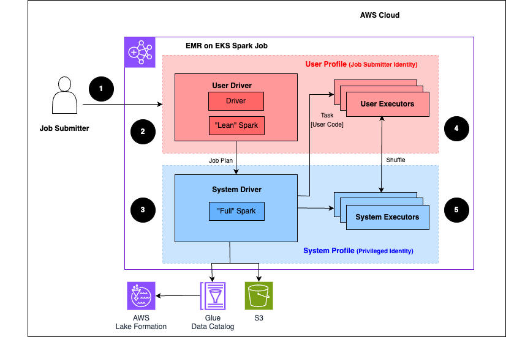

# How Amazon EMR on EKS works with AWS Lake Formation

Using Amazon EMR on EKS with Lake Formation lets you enforce a layer of permissions on each Spark Job to apply Lake Formation permission control
when Amazon EMR on EKS executes jobs. Amazon EMR on EKS uses [Spark resource profiles](https://spark.apache.org/docs/latest/api/java/org/apache/spark/resource/ResourceProfile.html "https://spark.apache.org/docs/latest/api/java/org/apache/spark/resource/ResourceProfile.html") to
create two profiles to effectively execute jobs. The User Profile executes user-supplied code, while the system profile enforces Lake Formation policies.
Each Lake Formation enabled Job utilizes two Spark drivers, one for the User profile, and another for the System profile. For more information, see
What is [AWS Lake Formation](../../../lake-formation/latest/dg/what-is-lake-formation.md "../../../lake-formation/latest/dg/what-is-lake-formation.md").

The following is a high-level overview of how Amazon EMR on EKS gets access to data protected by Lake Formation security policies.

The following steps describe this process:

1. A user submits a Spark Job to an AWS Lake Formation-enabled Amazon EMR on EKS virtual cluster.
2. The Amazon EMR on EKS service sets up the User Driver and runs the job in the User Profile. The User Driver runs a lean version of Spark that has no ability to
   launch tasks, requests executors, access Amazon S3 or the Glue Data Catalog. It only builds a Job plan.
3. The Amazon EMR on EKS service sets up a second driver called a System Driver and runs it in the System Profile (with a privileged identity). Amazon EKS sets up an
   encrypted TLS channel between the two drivers for communication. The User Driver uses the channel to send the job plans to the System Driver. The System Driver does
   not run user-submitted code. It runs full Spark and communicates with Amazon S3 and the Data Catalog for data access. It requests executors and
   compiles the Job Plan into a sequence of execution stages.
4. Amazon EMR on EKS service then runs the stages on executors. User Code in any stage is run exclusively on User profile executors.
5. Stages that read data from Data Catalog tables protected by Lake Formation or those that apply security filters are delegated
   to System executors.
