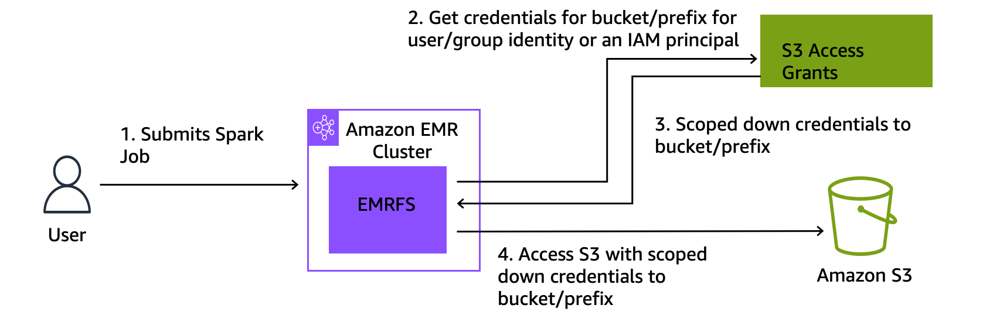

# Using Amazon S3 Access Grants with Amazon EMR

## S3 Access Grants overview for Amazon EMR

With Amazon EMR releases 6.15.0 and higher, Amazon S3 Access Grants provide a scalable access control
solution that you can use to augment access to your Amazon S3 data from Amazon EMR. If you have a
complex or large permission configuration for your S3 data, you can use Access Grants to
scale S3 data permissions for users, roles, and applications on your cluster.

Use S3 Access Grants to augment access to Amazon S3 data beyond the permissions that are granted by the
runtime role or the IAM roles that are attached to the identities with access to your
EMR cluster. For more information, see [Managing access with
S3 Access Grants](../../../AmazonS3/latest/userguide/access-grants.md "../../../AmazonS3/latest/userguide/access-grants.md") in the _Amazon S3 User Guide_.

For steps to use S3 Access Grants with other Amazon EMR deployments, see the following documentation:

- [Using S3 Access Grants
  with Amazon EMR on EKS](../EMR-on-EKS-DevelopmentGuide/access-grants.md "../EMR-on-EKS-DevelopmentGuide/access-grants.md")
- [Using S3 Access Grants
  with Amazon EMR Serverless](../EMR-Serverless-UserGuide/access-grants.md "../EMR-Serverless-UserGuide/access-grants.md")

## How Amazon EMR works with S3 Access Grants

Amazon EMR releases 6.15.0 and higher provide a native integration with S3 Access Grants. You can
enable S3 Access Grants on Amazon EMR and run Spark jobs. When a Spark job makes a request for S3 data,
Amazon S3 provides temporary credentials that are scoped to the specific bucket, prefix, or
object.

The following is a high-level overview of how Amazon EMR gets access to data that's
protected by S3 Access Grants.



1. A user submits an Amazon EMR Spark job that uses data stored in Amazon S3.
2. Amazon EMR makes a request for S3 Access Grants to allow access to the bucket, prefix, or
   object on behalf of that user.
3. Amazon S3 returns temporary credentials in the form of an AWS Security Token Service (STS) token for
   the user. The token is scoped to access the S3 bucket, prefix, or object.
4. Amazon EMR uses the STS token to retrieve data from S3.
5. Amazon EMR receives the data from S3 and returns the results to the user.

## S3 Access Grants considerations with

Amazon EMR

Take note of the following behaviors and limitations when you use S3 Access Grants with
Amazon EMR.

### Feature support

- S3 Access Grants is supported with Amazon EMR releases 6.15.0 and higher.
- Spark is the only supported query engine when you use S3 Access Grants with
  Amazon EMR.
- Delta Lake and Hudi are the only supported open-table formats when you use
  S3 Access Grants with Amazon EMR.
- The following Amazon EMR capabilities are not supported for use with
  S3 Access Grants:
  - Apache Iceberg tables
  - LDAP native authentication
  - Apache Ranger native authentication
  - AWS CLI requests to Amazon S3 that use IAM roles
  - S3 access through the open-source S3A
    protocol

- The `fallbackToIAM` option isn't supported for EMR clusters
  that use trusted identity propagation with IAM Identity Center.
- [S3 Access Grants with AWS Lake Formation](#emr-access-grants-lf "#emr-access-grants-lf") is only
  supported with Amazon EMR clusters that run on Amazon EC2.

### Behavioral considerations

- The Apache Ranger native integration with Amazon EMR holds functionality that
  is congruent with S3 Access Grants as part of the EMRFS S3 Apache Ranger plugin. If
  you use Apache Ranger for fine-grained access control (FGAC), we recommend
  that you use that plugin instead of S3 Access Grants.
- Amazon EMR provides a credentials cache in EMRFS to ensure that a user doesn't
  need to make repeated requests for the same credentials within a Spark job.
  Therefore, Amazon EMR always requests the default-level privilege when it
  requests credentials. For more information, see [Request
  access to S3 data](../../../AmazonS3/latest/userguide/access-grants-credentials.md "../../../AmazonS3/latest/userguide/access-grants-credentials.md") in the
  _Amazon S3 User Guide_.
- In the case that a user performs an action that S3 Access Grants doesn't support,
  Amazon EMR is set to use the IAM role that was specified for job execution. For
  more information, see [Fall back to IAM roles](#emr-access-grants-fallback "#emr-access-grants-fallback").

## Launch an Amazon EMR cluster with

S3 Access Grants

This section describes how to launch an EMR cluster that runs on Amazon EC2, and uses
S3 Access Grants to manage access to data in Amazon S3. For steps to use S3 Access Grants with other Amazon EMR
deployments, see the following documentation:

- [Using S3 Access Grants
  with Amazon EMR on EKS](../EMR-on-EKS-DevelopmentGuide/access-grants.md "../EMR-on-EKS-DevelopmentGuide/access-grants.md")
- [Using S3 Access Grants
  with EMR Serverless](../EMR-Serverless-UserGuide/access-grants.md "../EMR-Serverless-UserGuide/access-grants.md")

Use the following steps to launch an EMR cluster that runs on Amazon EC2, and uses
S3 Access Grants to manage access to data in Amazon S3.

1. Set up a job execution role for your EMR cluster. Include the required IAM
   permissions that you need to run Spark jobs, `s3:GetDataAccess` and
   `s3:GetAccessGrantsInstanceForPrefix`:

```
{
    "Effect": "Allow",
    "Action": [
    "s3:GetDataAccess",
    "s3:GetAccessGrantsInstanceForPrefix"
    ],
    "Resource": [     //LIST ALL INSTANCE ARNS THAT THE ROLE IS ALLOWED TO QUERY
         "arn:`aws_partition`:s3:`Region`:`account-id1`:access-grants/default",
         "arn:`aws_partition`:s3:`Region`:`account-id2`:access-grants/default"
    ]
}
```

###### Note

With Amazon EMR, S3 Access Grants augment the permissions that are set in IAM roles. If
the IAM roles that you specify for job execution contain permissions to
access S3 directly, then users might be able to access more data than just
the data that you define in S3 Access Grants. 2. Next, use the AWS CLI to create a cluster with Amazon EMR 6.15 or higher and the
`emrfs-site` classification to enable S3 Access Grants, similar to the
following example:

```
aws emr create-cluster
  --release-label emr-6.15.0 \
  --instance-count 3 \
  --instance-type m5.xlarge \
  --configurations '[{"Classification":"emrfs-site", "Properties":{"fs.s3.s3AccessGrants.enabled":"true", "fs.s3.s3AccessGrants.fallbackToIAM":"false"}}]'
```

## S3 Access Grants with AWS Lake Formation

If you use Amazon EMR with the [AWS Lake Formation
integration](emr-lake-formation.md "emr-lake-formation.md"), you can use Amazon S3 Access Grants for direct or tabular access to data
in Amazon S3.

###### Note

S3 Access Grants with AWS Lake Formation is only supported with Amazon EMR clusters that run on
Amazon EC2.

**Direct access**

Direct access involves all calls to access S3 data that don't invoke the
API for the AWS Glue service that Lake Formation uses as a metastore with Amazon EMR, for
example, to call `spark.read`:

```
spark.read.csv("s3://...")
```

When you use S3 Access Grants with AWS Lake Formation on Amazon EMR, all direct access patterns go
through S3 Access Grants to get temporary S3 credentials.

**Tabular access**

Tabular access occurs when Lake Formation invokes the metastore API to access your
S3 location, for example, to query table data:

```
spark.sql("select * from test_tbl")
```

When you use S3 Access Grants with AWS Lake Formation on Amazon EMR, all tabular access patterns go
through Lake Formation.

## Fall back to IAM roles

If a user attempts to perform an action that S3 Access Grants doesn't support, Amazon EMR defaults to
the IAM role that was specified for job execution when the `fallbackToIAM`
configuration is `true`. This allows users to fall back on their job
execution role to give credentials for S3 access in scenarios that S3 Access Grants doesn't
cover.

With `fallbackToIAM` enabled, users can access the data that the Access
Grant allows. If there isn't an S3 Access Grants token for the target data, then Amazon EMR checks for
the permission on their job execution role.

###### Note

We recommend that you test your access permissions with the
`fallbackToIAM` configuration enabled even if you plan to disable the
option for production workloads. With Spark jobs, there are other ways that users
might be able to access all permission sets with their IAM credentials. When
enabled on EMR clusters, grants from S3 give Spark jobs access to S3 locations.
You should ensure that you protect these S3 locations from access outside of EMRFS.
For example, you should protect the S3 locations from access by S3 clients used in
notebooks, or by applications that aren't supported by S3 Access Grants such as Hive or
Presto.
