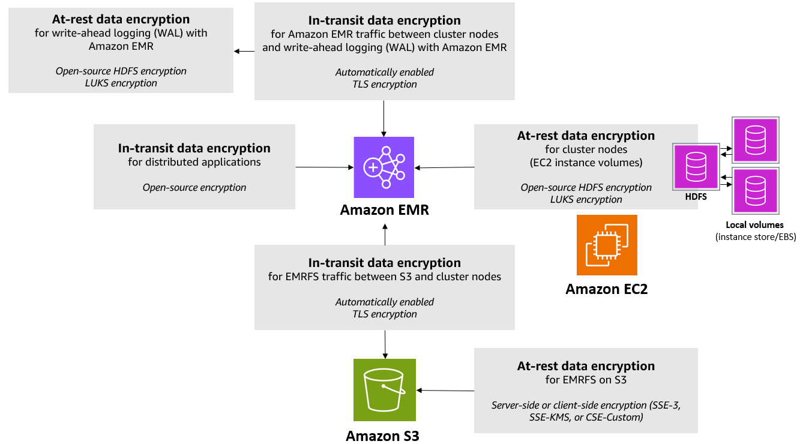

# Encryption options for Amazon EMR

With Amazon EMR releases 4.8.0 and higher, you can use a security configuration to
specify settings for encrypting data at rest, data in transit, or both. When you
enable at-rest data encryption, you can choose to encrypt EMRFS data in Amazon S3, data
in local disks, or both. Each security configuration that you create is stored in
Amazon EMR rather than in the cluster configuration, so you can easily reuse a
configuration to specify data encryption settings whenever you create a cluster. For
more information, see [Create a security
configuration with the Amazon EMR console or with the AWS CLI](emr-create-security-configuration.md "emr-create-security-configuration.md").

The following diagram shows the different data encryption options available with
security configurations.

The following encryption options are also available and are not configured using a
security configuration:

- Optionally, with Amazon EMR versions 4.1.0 and later, you can choose to
  configure transparent encryption in HDFS. For more information, see [Transparent
  encryption in HDFS on Amazon EMR](../ReleaseGuide/emr-encryption-tdehdfs.md "../ReleaseGuide/emr-encryption-tdehdfs.md") in the
  _Amazon EMR Release Guide_.
- If you are using a release version of Amazon EMR that does not support security
  configurations, you can configure encryption for EMRFS data in Amazon S3
  manually. For more information, see [Specifying Amazon S3
  encryption using EMRFS properties](../ReleaseGuide/emr-emrfs-encryption.md "../ReleaseGuide/emr-emrfs-encryption.md").
- If you are using an Amazon EMR version earlier than 5.24.0, an encrypted EBS
  root device volume is supported only when using a custom AMI. For more
  information, see [Creating a custom AMI with an encrypted Amazon EBS root device
  volume](emr-custom-ami.md#emr-custom-ami-encrypted "emr-custom-ami.md#emr-custom-ami-encrypted") in the _Amazon EMR Management Guide_.

###### Note

Beginning with Amazon EMR version 5.24.0, you can use a security configuration option to
encrypt EBS root device and storage volumes when you specify AWS KMS as your key provider. For more information, see [Local disk encryption](#emr-encryption-localdisk "#emr-encryption-localdisk").

Data encryption requires keys and certificates. A security configuration gives you
the flexibility to choose from several options, including keys managed by AWS Key Management Service,
keys managed by Amazon S3, and keys and certificates from custom providers that you
supply. When using AWS KMS as your key provider, charges apply for the storage and use
of encryption keys. For more information, see [AWS KMS pricing](https://aws.amazon.com/kms/pricing/ "https://aws.amazon.com/kms/pricing/").

Before you specify encryption options, decide on the key and certificate
management systems you want to use, so you can first create the keys and
certificates or the custom providers that you specify as part of encryption
settings.

## Encryption at rest for EMRFS data in

Amazon S3

Amazon S3 encryption works with the Amazon EMR File System (EMRFS) objects read from and
written to Amazon S3. You specify Amazon S3 server-side encryption (SSE) or client-side
encryption (CSE) as the **Default encryption mode** when you
enable encryption at rest. Optionally, you can specify different encryption
methods for individual buckets using **Per bucket encryption
overrides**. Regardless of whether Amazon S3 encryption is enabled,
Transport Layer Security (TLS) encrypts the EMRFS objects in transit between
EMR cluster nodes and Amazon S3. For more information about Amazon S3 encryption, see
[Protecting data using
encryption](../../../AmazonS3/latest/userguide/UsingEncryption.md "../../../AmazonS3/latest/userguide/UsingEncryption.md") in the _Amazon Simple Storage Service User Guide_.

###### Note

When you use AWS KMS, charges apply for the storage and use of encryption keys. For
more information, see [AWS KMS Pricing](https://aws.amazon.com/kms/pricing/ "https://aws.amazon.com/kms/pricing/").

### Amazon S3 server-side encryption

All Amazon S3 buckets have encryption configured by default, and all new objects that are uploaded to an S3 bucket are automatically encrypted at rest, Amazon S3 encrypts data at the object level as it writes
the data to disk and decrypts the data when it is accessed. For more information
about SSE, see [Protecting data
using server-side encryption](../../../AmazonS3/latest/userguide/serv-side-encryption.md "../../../AmazonS3/latest/userguide/serv-side-encryption.md") in the
_Amazon Simple Storage Service User Guide_.

You can choose between two different key management systems when you specify
SSE in Amazon EMR:

- **SSE-S3** – Amazon S3 manages keys for
  you.
- **SSE-KMS** – You use an AWS KMS key to set up with policies suitable for Amazon EMR. For more information about key requirements for Amazon EMR,
  see [Using AWS KMS keys for encryption](emr-encryption-enable.md#emr-awskms-keys "emr-encryption-enable.md#emr-awskms-keys").

SSE with customer-provided keys (SSE-C) is not available for use with
Amazon EMR.

### Amazon S3 client-side encryption

With Amazon S3 client-side encryption, the Amazon S3 encryption and decryption takes place in the EMRFS
client on your cluster. Objects are encrypted before being uploaded to Amazon S3 and
decrypted after they are downloaded. The provider you specify supplies the
encryption key that the client uses. The client can use keys provided by AWS KMS
(CSE-KMS) or a custom Java class that provides the client-side root key
(CSE-C). The encryption specifics are slightly different between CSE-KMS and
CSE-C, depending on the specified provider and the metadata of the object being
decrypted or encrypted. For more information about these differences, see [Protecting data using client-side encryption](../../../AmazonS3/latest/userguide/UsingClientSideEncryption.md "../../../AmazonS3/latest/userguide/UsingClientSideEncryption.md") in the _Amazon Simple Storage Service User Guide_.

###### Note

Amazon S3 CSE only ensures that EMRFS data exchanged with Amazon S3 is encrypted;
not all data on cluster instance volumes is encrypted. Furthermore, because
Hue does not use EMRFS, objects that the Hue S3 File Browser writes to Amazon S3
are not encrypted.

## Encryption at rest for data in Amazon EMR

WAL

When you set up server-side encryption (SSE) for write-ahead logging (WAL),
Amazon EMR encrypts data at rest. You can choose from two different key management
systems when you specify SSE in Amazon EMR:

**SSE-EMR-WAL**

Amazon EMR manages keys for you. By default, Amazon EMR encrypts the data
that you stored in Amazon EMR WAL with SSE-EMR-WAL.

**SSE-KMS-WAL**

You use an AWS KMS key to set up policies that apply to Amazon EMR WAL.
For more information about configuring encryption at rest for EMR WAL using a customer KMS key, see [Encryption at rest using a customer
KMS key for the EMR WAL service](encryption-at-rest-kms.md "encryption-at-rest-kms.md").

###### Note

You can't use your own key with SSE when you enable WAL with Amazon EMR. For more
information, see [Write-ahead logs (WAL) for
Amazon EMR](../ReleaseGuide/emr-hbase-wal.md "../ReleaseGuide/emr-hbase-wal.md").

## Local disk encryption

The following mechanisms work together to encrypt local disks when you enable
local disk encryption using an Amazon EMR security configuration.

### Open-source HDFS encryption

HDFS exchanges data between cluster instances during distributed
processing. It also reads from and writes data to instance store volumes and
the EBS volumes attached to instances. The following open-source Hadoop
encryption options are activated when you enable local disk
encryption:

- [Secure Hadoop RPC](https://hadoop.apache.org/docs/r2.7.2/hadoop-project-dist/hadoop-common/SecureMode.html#Data_Encryption_on_RPC "https://hadoop.apache.org/docs/r2.7.2/hadoop-project-dist/hadoop-common/SecureMode.html#Data_Encryption_on_RPC") is set to `Privacy`, which
  uses Simple Authentication Security Layer (SASL).
- [Data encryption on HDFS block data transfer](https://hadoop.apache.org/docs/r2.7.2/hadoop-project-dist/hadoop-common/SecureMode.html#Data_Encryption_on_Block_data_transfer. "https://hadoop.apache.org/docs/r2.7.2/hadoop-project-dist/hadoop-common/SecureMode.html#Data_Encryption_on_Block_data_transfer.") is set to
  `true` and is configured to use AES 256
  encryption.

###### Note

You can activate additional Apache Hadoop encryption by enabling
in-transit encryption. For more information, see [Encryption in transit](#emr-encryption-intransit "#emr-encryption-intransit"). These encryption
settings do not activate HDFS transparent encryption, which you can
configure manually. For more information, see [Transparent encryption in HDFS on Amazon EMR](../ReleaseGuide/emr-encryption-tdehdfs.md "../ReleaseGuide/emr-encryption-tdehdfs.md") in the
_Amazon EMR Release Guide_.

### Instance store encryption

For EC2 instance types that use NVMe-based SSDs as the instance store
volume, NVMe encryption is used regardless of Amazon EMR encryption settings. For
more information, see [NVMe SSD volumes](../../../AWSEC2/latest/UserGuide/ssd-instance-store.md#nvme-ssd-volumes "../../../AWSEC2/latest/UserGuide/ssd-instance-store.md#nvme-ssd-volumes") in the _Amazon EC2 User Guide_.
For other instance store volumes, Amazon EMR uses LUKS to encrypt the instance
store volume when local disk encryption is enabled regardless of whether EBS
volumes are encrypted using EBS encryption or LUKS.

### EBS volume encryption

If you create a cluster in a Region where Amazon EC2 encryption
of EBS volumes is enabled by default for your account, EBS volumes are
encrypted even if local disk encryption is not enabled. For more
information, see [Encryption by default](../../../AWSEC2/latest/UserGuide/EBSEncryption.md#encryption-by-default "../../../AWSEC2/latest/UserGuide/EBSEncryption.md#encryption-by-default") in the
_Amazon EC2 User Guide_. With local disk encryption
enabled in a security configuration, the Amazon EMR settings take precedence over
the Amazon EC2 encryption-by-default settings for cluster EC2 instances.

The following options are available to encrypt EBS volumes using a
security configuration:

- **EBS encryption** – Beginning
  with Amazon EMR version 5.24.0, you can choose to enable EBS encryption.
  The EBS encryption option encrypts the EBS root device volume and
  attached storage volumes. The EBS encryption option is available
  only when you specify AWS Key Management Service as your key provider. We recommend
  using EBS encryption.
- **LUKS encryption** – If you
  choose to use LUKS encryption for Amazon EBS volumes, the LUKS encryption
  applies only to attached storage volumes, not to the root device
  volume. For more information about LUKS encryption, see the [LUKS on-disk specification](https://gitlab.com/cryptsetup/cryptsetup/wikis/Specification "https://gitlab.com/cryptsetup/cryptsetup/wikis/Specification").

For your key provider, you can set up an AWS KMS key with
policies suitable for Amazon EMR, or a custom Java class that provides
the encryption artifacts. When you use AWS KMS, charges apply for the
storage and use of encryption keys. For more information, see [AWS KMS
pricing](https://aws.amazon.com/kms/pricing/ "https://aws.amazon.com/kms/pricing/").

###### Note

To check if EBS encryption is enabled on your cluster, it is
recommended that you use `DescribeVolumes` API call. For more
information, see [DescribeVolumes](../../../AWSEC2/latest/APIReference/API_DescribeVolumes.md "../../../AWSEC2/latest/APIReference/API_DescribeVolumes.md"). Running `lsblk` on the cluster
will only check the status of LUKS encryption, instead of EBS
encryption.

## Encryption in transit

Several encryption mechanisms are enabled with in-transit encryption. These
are open-source features, are application-specific, and might vary by Amazon EMR
release. To enable in-transit encryption, use [Create a security
configuration with the Amazon EMR console or with the AWS CLI](emr-create-security-configuration.md "emr-create-security-configuration.md") in Amazon EMR. For
EMR clusters with in-transit encryption enabled, Amazon EMR automatically
configures the open-source application configurations to enable in-transit encryption. For
advanced use cases, you can configure open-source application configurations directly to override the default behavior in Amazon EMR. For more information, see
[in-transit encryption support matrix](emr-encryption-support-matrix.md "emr-encryption-support-matrix.md") and
[Configure applications](../ReleaseGuide/emr-configure-apps.md "../ReleaseGuide/emr-configure-apps.md").

See the following to learn more specific details about open-source applications relevant to in-transit encryption:

- When you enable in-transit encryption with a security configuration, Amazon EMR enables in-transit encryption for all open-source
  application endpoints that support in-transit encryption. Support for in-transit encryption for different application endpoints varies by
  the Amazon EMR release version. For more information, see the [in-transit encryption support matrix](../../../index.md "../../../index.md").
- You can override open-source configurations, which lets you do the following:

      + Disable TLS hostname verification if your user-provided TLS certificates doesn't meet requirements
      + Disable in-transit encryption for certain endpoints based on your performance and compatibility requirements
      + Control which TLS versions and cipher suites to use.

  You can find more details about the application-specific configurations in the [in-transit encryption support matrix](emr-encryption-support-matrix.md "emr-encryption-support-matrix.md")

- Aside from enabling in-transit encryption with a security configuration, some communication channels also require additional security configurations
  for you to enable in-transit encryption. For example, some open-source application endpoints
  use Simple Authentication and Security Layer (SASL) for in-transit encryption, which requires that Kerberos authentication is enabled in the
  security configuration of the EMR cluster. To learn more about these endpoints, see the [in-transit encryption support matrix](emr-encryption-support-matrix.md "emr-encryption-support-matrix.md").
- We recommend that you use software that support TLS v1.2 or higher. Amazon EMR on EC2 ships the default Corretto JDK
  distribution, which determines which TLS versions, cipher suites, and key sizes are allowed by the open-source networks that
  run on Java. At this time, most open-source frameworks enforce TLS v1.2 or higher for Amazon EMR 7.0.0 and higher releases. This is because most open-source
  frameworks run on Java 17 for Amazon EMR 7.0.0 and higher. Older Amazon EMR release versions might support TLS v1.0 and v1.1 because they
  consume older Java versions, but Corretto JDK might
  change which TLS versions that Java supports, which might impact existing Amazon EMR releases.

You specify the encryption artifacts used for in-transit encryption in one of
two ways: either by providing a zipped file of certificates that you upload to
Amazon S3, or by referencing a custom Java class that provides encryption artifacts.
For more information, see [Providing certificates for
encrypting data in transit with Amazon EMR encryption](emr-encryption-enable.md#emr-encryption-certificates "emr-encryption-enable.md#emr-encryption-certificates").
