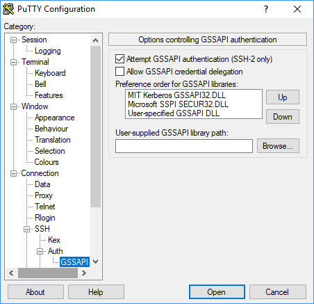

# Using SSH to connect to Kerberized

clusters with Amazon EMR

This section demonstrates the steps for a Kerberos-authenticated user to connect
to the primary node of an EMR cluster.

Each computer that is used for an SSH connection must have SSH client and Kerberos
client applications installed. Linux computers most likely include these by default.
For example, OpenSSH is installed on most Linux, Unix, and macOS operating systems.
You can check for an SSH client by typing **ssh** at the command
line. If your computer does not recognize the command, install an SSH client to
connect to the primary node. The OpenSSH project provides a free implementation of
the full suite of SSH tools. For more information, see the [OpenSSH](http://www.openssh.org/ "http://www.openssh.org/") website. Windows users can use
applications such as [PuTTY](http://www.chiark.greenend.org.uk/~sgtatham/putty/ "http://www.chiark.greenend.org.uk/~sgtatham/putty/") as an SSH client.

For more information about SSH connections, see [Connect to an Amazon EMR cluster](emr-connect-master-node.md "emr-connect-master-node.md").

SSH uses GSSAPI for authenticating Kerberos clients, and you must enable GSSAPI
authentication for the SSH service on the cluster primary node. For more information,
see [Enabling GSSAPI for SSH](emr-kerberos-configuration-users.md#emr-kerberos-ssh-config "emr-kerberos-configuration-users.md#emr-kerberos-ssh-config"). SSH clients must also use GSSAPI.

In the following examples, for `MasterPublicDNS` use the
value that appears for **Master public DNS** on the
**Summary** tab of the cluster details pane—for example,
`ec2-11-222-33-44.compute-1.amazonaws.com`.

## Prerequisite for krb5.conf (non-Active

Directory)

When using a configuration without Active Directory integration, in addition
to the SSH client and Kerberos client applications, each client computer must
have a copy of the `/etc/krb5.conf` file that matches the
`/etc/krb5.conf` file on the cluster primary node.

###### To copy the krb5.conf file

1. Use SSH to connect to the primary node using an EC2 key pair and the
   default `hadoop` user—for example,
   `hadoop@`MasterPublicDNS``.
   For detailed instructions, see [Connect to an Amazon EMR cluster](emr-connect-master-node.md "emr-connect-master-node.md").
2. From the primary node, copy the contents of the
   `/etc/krb5.conf` file . For more information, see [Connect to an Amazon EMR cluster](emr-connect-master-node.md "emr-connect-master-node.md").
3. On each client computer that will connect to the cluster, create an
   identical `/etc/krb5.conf` file based on the copy that you
   made in the previous step.

## Using kinit and SSH

Each time a user connects from a client computer using Kerberos credentials,
the user must first renew Kerberos tickets for their user on the client
computer. In addition, the SSH client must be configured to use GSSAPI
authentication.

###### To use SSH to connect to a Kerberized EMR cluster

1. Use `kinit` to renew your Kerberos tickets as shown in the
   following example

```
kinit `user1`
```

2. Use an `ssh` client along with the principal that you
   created in the cluster-dedicated KDC or Active Directory user name. Make
   sure that GSSAPI authentication is enabled as shown in the following
   examples.

**Example: Linux users**

The `-K` option specifies GSSAPI authentication.

```
ssh -K `user1`@`MasterPublicDNS`
```

**Example: Windows users (PuTTY)**

Make sure that the GSSAPI authentication option for the session is
enabled as shown:


