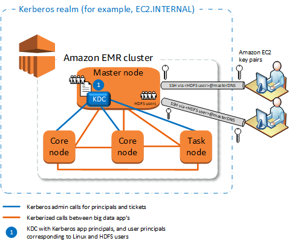
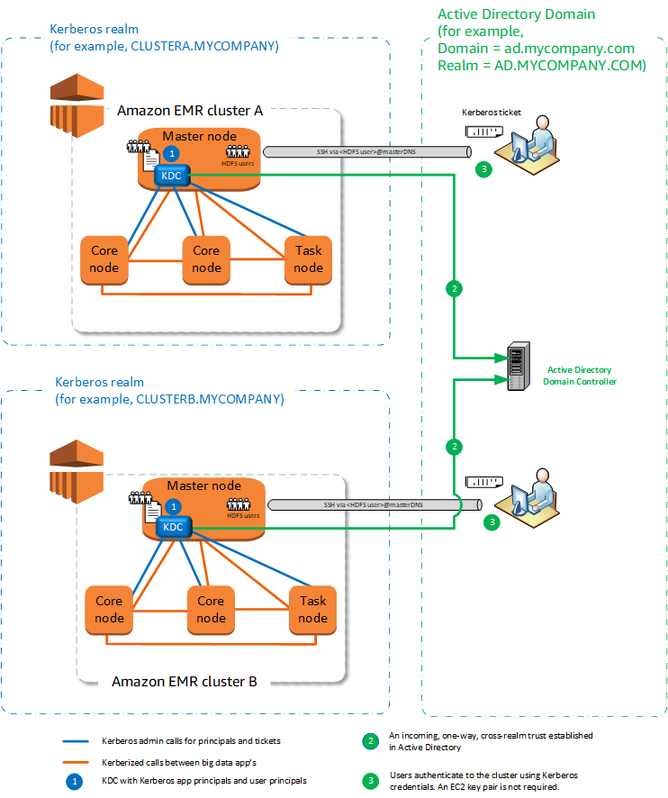
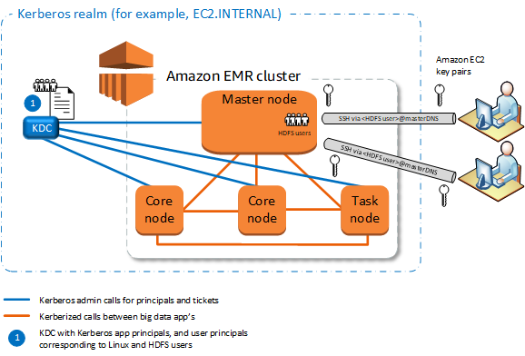
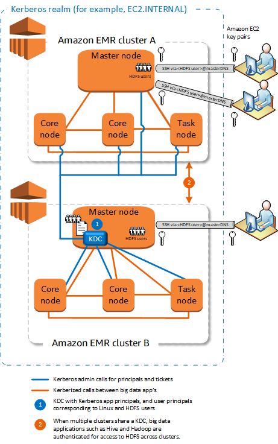
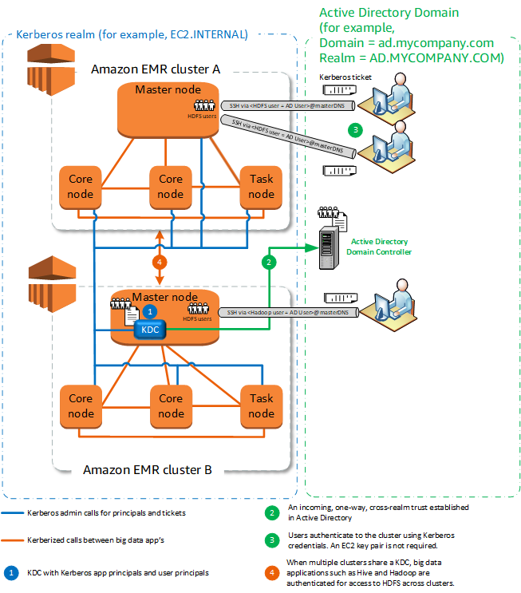

# Kerberos architecture options with Amazon EMR

When you use Kerberos with Amazon EMR, you can choose from the architectures listed in
this section. Regardless of the architecture that you choose, you configure Kerberos
using the same steps. You create a security configuration, you specify the security
configuration and compatible cluster-specific Kerberos options when you create the
cluster, and you create HDFS directories for Linux users on the cluster that match
user principals in the KDC. For an explanation of configuration options and example
configurations for each architecture, see [Configuring Kerberos on Amazon EMR](emr-kerberos-configure.md "emr-kerberos-configure.md").

## Cluster-dedicated KDC (KDC on

primary node)

This configuration is available with Amazon EMR releases 5.10.0 and higher.

###### Advantages

- Amazon EMR has full ownership of the KDC.
- The KDC on the EMR cluster is independent from centralized KDC
  implementations such as Microsoft Active Directory or
  AWS Managed Microsoft AD.
- Performance impact is minimal because the KDC manages authentication
  only for local nodes within the cluster.
- Optionally, other Kerberized clusters can reference the KDC as an
  external KDC. For more information, see [External
  KDC—primary node on a different cluster](#emr-kerberos-extkdc-cluster-summary "#emr-kerberos-extkdc-cluster-summary").

###### Considerations and limitations

- Kerberized clusters can not authenticate to one another, so
  applications can not interoperate. If cluster applications need to
  interoperate, you must establish a cross-realm trust between clusters,
  or set up one cluster as the external KDC for other clusters. If a
  cross-realm trust is established, the KDCs must have different Kerberos
  realms.
- You must create Linux users on the EC2 instance of the primary node
  that correspond to KDC user principals, along with the HDFS directories
  for each user.
- User principals must use an EC2 private key file and
  `kinit` credentials to connect to the cluster using
  SSH.

## Cross-realm trust

In this configuration, principals (usually users) from a different Kerberos
realm authenticate to application components on a Kerberized EMR cluster, which
has its own KDC. The KDC on the primary node establishes a trust relationship
with another KDC using a _cross-realm principal_ that exists
in both KDCs. The principal name and the password match precisely in each KDC.
Cross-realm trusts are most common with Active Directory implementations, as
shown in the following diagram. Cross-realm trusts with an external MIT KDC or a
KDC on another Amazon EMR cluster are also supported.

###### Advantages

- The EMR cluster on which the KDC is installed maintains full ownership
  of the KDC.
- With Active Directory, Amazon EMR automatically creates Linux users that
  correspond to user principals from the KDC. You still must create HDFS
  directories for each user. In addition, user principals in the Active
  Directory domain can access Kerberized clusters using `kinit`
  credentials, without the EC2 private key file. This eliminates the need
  to share the private key file among cluster users.
- Because each cluster KDC manages authentication for the nodes in the
  cluster, the effects of network latency and processing overhead for a
  large number of nodes across clusters is minimized.

###### Considerations and limitations

- If you are establishing a trust with an Active Directory realm, you
  must provide an Active Directory user name and password with permissions
  to join principals to the domain when you create the cluster.
- Cross-realm trusts cannot be established between Kerberos realms with
  the same name.
- Cross-realm trusts must be established explicitly. For example, if
  Cluster A and Cluster B both establish a cross-realm trust with a KDC,
  they do not inherently trust one another and their applications cannot
  authenticate to one another to interoperate.
- KDCs must be maintained independently and coordinated so that
  credentials of user principals match precisely.

## External KDC

Configurations with an External KDC are supported with Amazon EMR 5.20.0 and
later.

- [External KDC—MIT
  KDC](#emr-kerberos-extkdc-mit-summary "#emr-kerberos-extkdc-mit-summary")
- [External
  KDC—primary node on a different cluster](#emr-kerberos-extkdc-cluster-summary "#emr-kerberos-extkdc-cluster-summary")
- [External
  KDC—cluster KDC on a different cluster with Active Directory
  cross-realm trust](#emr-kerberos-extkdc-ad-trust-summary "#emr-kerberos-extkdc-ad-trust-summary")

### External KDC—MIT

KDC

This configuration allows one or more EMR clusters to use principals
defined and maintained in an MIT KDC server.

###### Advantages

- Managing principals is consolidated in a single KDC.
- Multiple clusters can use the same KDC in the same Kerberos realm. For more information, see [Requirements for using multiple
  clusters with the same KDC](#emr-kerberos-multi-kdc "#emr-kerberos-multi-kdc").
- The primary node on a Kerberized cluster does not have the
  performance burden associated with maintaining the KDC.

###### Considerations and limitations

- You must create Linux users on the EC2 instance of each Kerberized
  cluster's primary node that correspond to KDC user principals, along
  with the HDFS directories for each user.
- User principals must use an EC2 private key file and
  `kinit` credentials to connect to Kerberized clusters
  using SSH.
- Each node in Kerberized EMR clusters must have a network route to
  the KDC.
- Each node in Kerberized clusters places an authentication burden
  on the external KDC, so the configuration of the KDC affects cluster
  performance. When you configure the hardware of the KDC server,
  consider the maximum number of Amazon EMR nodes to be supported
  simultaneously.
- Cluster performance is dependent on the network latency between
  nodes in Kerberized clusters and the KDC.
- Troubleshooting can be more difficult because of
  interdependencies.

### External

KDC—primary node on a different cluster

This configuration is nearly identical to the external MIT KDC
implementation above, except that the KDC is on the primary node of an EMR
cluster. For more information, see [Cluster-dedicated KDC (KDC on
primary node)](#emr-kerberos-localkdc-summary "#emr-kerberos-localkdc-summary") and [Tutorial: Configure a cross-realm trust
with an Active Directory domain](emr-kerberos-cross-realm.md "emr-kerberos-cross-realm.md").

###### Advantages

- Managing principals is consolidated in a single KDC.
- Multiple clusters can use the same KDC in the same Kerberos realm. For more information, see [Requirements for using multiple
  clusters with the same KDC](#emr-kerberos-multi-kdc "#emr-kerberos-multi-kdc").

###### Considerations and limitations

- You must create Linux users on the EC2 instance of each Kerberized
  cluster's primary node that correspond to KDC user principals, along
  with the HDFS directories for each user.
- User principals must use an EC2 private key file and
  `kinit` credentials to connect to Kerberized clusters
  using SSH.
- Each node in each EMR cluster must have a network route to the
  KDC.
- Each Amazon EMR node in Kerberized clusters places an authentication
  burden on the external KDC, so the configuration of the KDC affects
  cluster performance. When you configure the hardware of the KDC
  server, consider the maximum number of Amazon EMR nodes to be supported
  simultaneously.
- Cluster performance is dependent on the network latency between
  nodes in the clusters and the KDC.
- Troubleshooting can be more difficult because of
  interdependencies.

### External

KDC—cluster KDC on a different cluster with Active Directory
cross-realm trust

In this configuration, you first create a cluster with a cluster-dedicated
KDC that has a one-way cross-realm trust with Active Directory. For a
detailed tutorial, see [Tutorial: Configure a cross-realm trust
with an Active Directory domain](emr-kerberos-cross-realm.md "emr-kerberos-cross-realm.md"). You then launch additional
clusters, referencing the cluster KDC that has the trust as an external KDC.
For an example, see [External cluster
KDC with Active Directory cross-realm trust](emr-kerberos-config-examples.md#emr-kerberos-example-extkdc-ad-trust "emr-kerberos-config-examples.md#emr-kerberos-example-extkdc-ad-trust"). This allows each
Amazon EMR cluster that uses the external KDC to authenticate principals defined
and maintained in a Microsoft Active Directory domain.

###### Advantages

- Managing principals is consolidated in the Active Directory
  domain.
- Amazon EMR joins the Active Directory realm, which eliminates the need
  to create Linux users that correspond Active Directory users. You
  still must create HDFS directories for each user.
- Multiple clusters can use the same KDC in the same Kerberos realm. For more information, see [Requirements for using multiple
  clusters with the same KDC](#emr-kerberos-multi-kdc "#emr-kerberos-multi-kdc").
- User principals in the Active Directory domain can access
  Kerberized clusters using `kinit` credentials, without
  the EC2 private key file. This eliminates the need to share the
  private key file among cluster users.
- Only one Amazon EMR primary node has the burden of maintaining the KDC,
  and only that cluster must be created with Active Directory
  credentials for the cross-realm trust between the KDC and Active
  Directory.

###### Considerations and limitations

- Each node in each EMR cluster must have a network route to the KDC
  and the Active Directory domain controller.
- Each Amazon EMR node places an authentication burden on the external
  KDC, so the configuration of the KDC affects cluster performance.
  When you configure the hardware of the KDC server, consider the
  maximum number of Amazon EMR nodes to be supported simultaneously.
- Cluster performance is dependent on the network latency between
  nodes in the clusters and the KDC server.
- Troubleshooting can be more difficult because of
  interdependencies.

## Requirements for using multiple

clusters with the same KDC

Multiple clusters can use the same KDC in the same Kerberos realm. However, if
the clusters concurrently run, then the clusters might fail if they use Kerberos
ServicePrincipal names that conflict.

If you have multiple concurrent clusters with the same external KDC, then
ensure that the clusters use different Kerberos realms. If the clusters must use
the same Kerberos realm, then ensure that the clusters are in different subnets,
and that their CIDR ranges don’t overlap.
