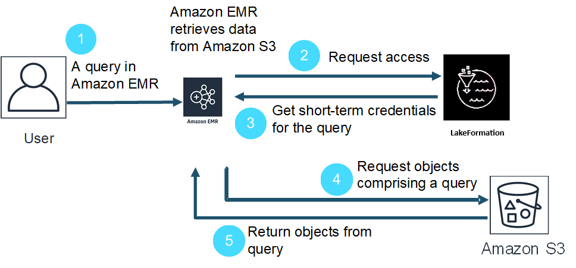

# Integrate Amazon EMR with AWS Lake Formation

AWS Lake Formation is a managed service that helps you discover, catalog, cleanse, and secure data
in an Amazon Simple Storage Service (S3) data lake. Lake Formation provides fine-grained access at the column, row, or cell
level to databases and tables in the AWS Glue Data Catalog. For more information, see [What is
AWS Lake Formation?](../../../lake-formation/latest/dg/what-is-lake-formation.md "../../../lake-formation/latest/dg/what-is-lake-formation.md")

With Amazon EMR release 6.7.0 and later, you can apply Lake Formation based access control to Spark,
Hive, and Presto jobs that you submit to Amazon EMR clusters. To integrate with Lake Formation, you must
create an EMR cluster with a _runtime role_. A runtime role is an
AWS Identity and Access Management (IAM) role that you associate with Amazon EMR jobs or queries. Amazon EMR then uses this
role to access AWS resources. For more information, see [Runtime roles for Amazon EMR steps](emr-steps-runtime-roles.md "emr-steps-runtime-roles.md").

## How Amazon EMR works with Lake Formation

After you integrate Amazon EMR with Lake Formation, you can execute queries to Amazon EMR clusters with
the [`Step` API](../APIReference/API_Step.md "../APIReference/API_Step.md") or with SageMaker AI Studio. Then, Lake Formation provides access
to data through temporary credentials for Amazon EMR. This process is called credential
vending. For more information, see [What is
AWS Lake Formation?](../../../lake-formation/latest/dg/what-is-lake-formation.md "../../../lake-formation/latest/dg/what-is-lake-formation.md")

The following is a high-level overview of how Amazon EMR gets access to data protected by
Lake Formation security policies.

1. A user submits an Amazon EMR query for data in Lake Formation.
2. Amazon EMR requests temporary credentials from Lake Formation to give the user data
   access.
3. Lake Formation returns temporary credentials.
4. Amazon EMR sends the query request to retrieve data from Amazon S3.
5. Amazon EMR receives the data from Amazon S3, filters it, and returns results based on
   the user permissions that the user defined in Lake Formation.

For more information about adding users and groups to Lake Formation policies, see [Granting Data
Catalog permissions](../../../lake-formation/latest/dg/granting-catalog-permissions.md "../../../lake-formation/latest/dg/granting-catalog-permissions.md").

## Prerequisites

You must meet the following requirements before you integrate Amazon EMR and Lake Formation:

- Turn on runtime role authorization on your Amazon EMR cluster.
- Use the AWS Glue Data Catalog as your metadata store.
- Define and manage permissions in Lake Formation to access databases, tables, and columns
  in AWS Glue Data Catalog. For more information, see [What is
  AWS Lake Formation?](../../../lake-formation/latest/dg/what-is-lake-formation.md "../../../lake-formation/latest/dg/what-is-lake-formation.md")
