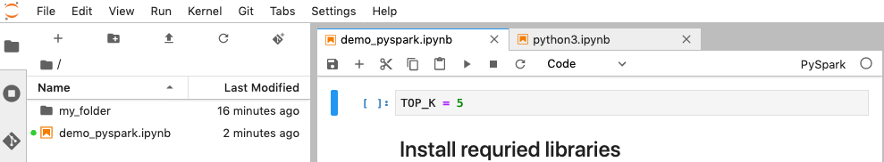
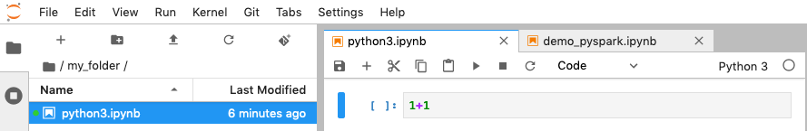
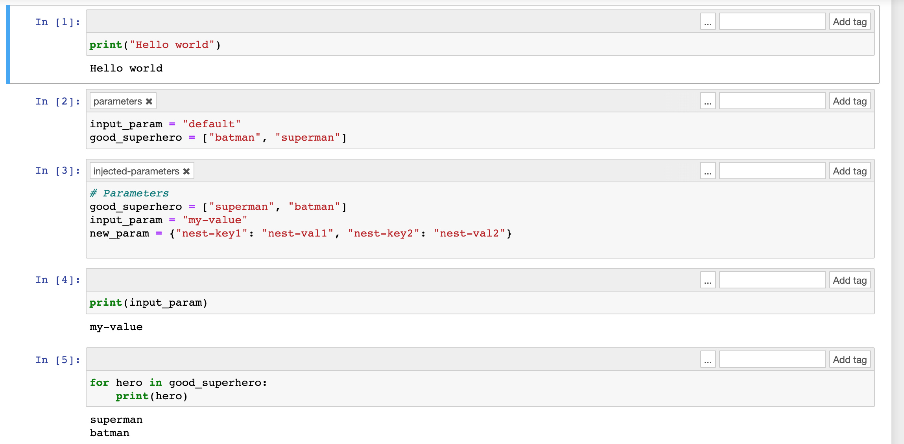

# Notebook CLI command

samples in EMR Studio

This topic shows CLI command samples for an EMR notebook. The example uses the demo notebook from the EMR Notebooks console. To
locate the notebook, use the file path relative to the home directory. In this
example, there are two notebook files that you can run:
`demo_pyspark.ipynb` and `my_folder/python3.ipynb`.

###### Note

EMR Notebooks are available as EMR Studio Workspaces in the console. The **Create Workspace** button in the console lets you create new notebooks. To access or create Workspaces, EMR Notebooks users need additional IAM role permissions. For more information, see [Amazon EMR Notebooks are Amazon EMR Studio Workspaces in the console](emr-managed-notebooks-migration.md "emr-managed-notebooks-migration.md") and [Amazon EMR console](whats-new-in-console.md "whats-new-in-console.md").

The relative path for file `demo_pyspark.ipynb` is
`demo_pyspark.ipynb`, shown below.


The relative path for `python3.ipynb` is
`my_folder/python3.ipynb`, shown below.


For information about the Amazon EMR API `NotebookExecution` actions, see
[Amazon EMR API actions.](../APIReference/API_Operations.md "../APIReference/API_Operations.md").

## Run a notebook

You can use the AWS CLI to run your notebook with the
`start-notebook-execution` action, as the following examples
demonstrate.

###### Example – Executing an EMR notebook in an EMR Studio

Workspace with an Amazon EMR (running on Amazon EC2) cluster

```
aws emr --region `us-east-1` \
start-notebook-execution \
--editor-id `e-ABCDEFG123456` \
--notebook-params '{"input_param":"`my-value`", "`good_superhero`":["`superman`", "`batman`"]}' \
--relative-path `test.ipynb` \
--notebook-execution-name `my-execution` \
--execution-engine '{"Id" : "`j-1234ABCD123`"}' \
--service-role EMR_Notebooks_DefaultRole

{
    "NotebookExecutionId": "`ex-ABCDEFGHIJ1234ABCD`"
}
```

###### Example – Executing an EMR notebook in an EMR Studio

Workspace with an EMR Notebooks cluster

```
aws emr start-notebook-execution \
    --region `us-east-1` \
    --service-role EMR_Notebooks_DefaultRole \
    --environment-variables '{"KERNEL_EXTRA_SPARK_OPTS": "--conf spark.executor.instances=1", "KERNEL_LAUNCH_TIMEOUT": "350"}' \
    --output-notebook-format HTML \
    --execution-engine Id=arn:aws:emr-containers:us-west-2:`account-id`:/virtualclusters/`ABCDEFG`/endpoints/`ABCDEF`,Type=EMR_ON_EKS,ExecutionRoleArn=arn:aws:iam::`account-id`:role/`execution-role` \
    --editor-id e-`ABCDEFG` \
    --relative-path `EMRonEKS-spark_python.ipynb`
```

###### Example – Executing an EMR notebook specifying its Amazon S3

location

```
aws emr start-notebook-execution \
    --region `us-east-1` \
    --notebook-execution-name `my-execution-on-emr-on-eks-cluster` \
    --service-role EMR_Notebooks_DefaultRole \
    --environment-variables '{"KERNEL_EXTRA_SPARK_OPTS": "--conf spark.executor.instances=1", "KERNEL_LAUNCH_TIMEOUT": "350"}' \
    --output-notebook-format HTML \
    --execution-engine Id=arn:aws:emr-containers:us-west-2:`account-id`:/virtualclusters/`ABCDEF`/endpoints/`ABCDEF`,Type=EMR_ON_EKS,ExecutionRoleArn=arn:aws:iam::`account-id`:role/`execution-role` \
    --notebook-s3-location '{"Bucket": "`amzn-s3-demo-bucket`","Key": "`s3-prefix-to-notebook-location`/EMRonEKS-spark_python.ipynb"}' \
    --output-notebook-s3-location '{"Bucket": "`amzn-s3-demo-bucket`","Key": "`s3-prefix-for-storing-output-notebook`"}'
```

## Notebook

output

Here's the output from a sample notebook. Cell 3 shows the newly-injected
parameter values.



## Describe a

notebook

You can use the `describe-notebook-execution` action to access
information about a specific notebook execution.

```
aws emr --region us-east-1 \
describe-notebook-execution --notebook-execution-id ex-IZWZZVR9DKQ9WQ7VZWXJZR29UGHTE

{
    "NotebookExecution": {
        "NotebookExecutionId": "ex-IZWZZVR9DKQ9WQ7VZWXJZR29UGHTE",
        "EditorId": "e-BKTM2DIHXBEDRU44ANWRKIU8N",
        "ExecutionEngine": {
            "Id": "j-2QMOV6JAX1TS2",
            "Type": "EMR",
            "MasterInstanceSecurityGroupId": "sg-05ce12e58cd4f715e"
        },
        "NotebookExecutionName": "my-execution",
        "NotebookParams": "{\"input_param\":\"my-value\", \"good_superhero\":[\"superman\", \"batman\"]}",
        "Status": "FINISHED",
        "StartTime": 1593490857.009,
        "Arn": "arn:aws:elasticmapreduce:us-east-1:123456789012:notebook-execution/ex-IZWZZVR9DKQ9WQ7VZWXJZR29UGHTE",
        "LastStateChangeReason": "Execution is finished for cluster j-2QMOV6JAX1TS2.",
        "NotebookInstanceSecurityGroupId": "sg-0683b0a39966d4a6a",
        "Tags": []
    }
}

```

## Stop a

notebook

If your notebook is running an execution that you'd like to stop, you can do
so with the `stop-notebook-execution` command.

```
# stop a running execution
aws emr --region us-east-1 \
stop-notebook-execution --notebook-execution-id ex-IZWZX78UVPAATC8LHJR129B1RBN4T


# describe it
aws emr --region us-east-1 \
describe-notebook-execution --notebook-execution-id ex-IZWZX78UVPAATC8LHJR129B1RBN4T

{
    "NotebookExecution": {
        "NotebookExecutionId": "ex-IZWZX78UVPAATC8LHJR129B1RBN4T",
        "EditorId": "e-BKTM2DIHXBEDRU44ANWRKIU8N",
        "ExecutionEngine": {
            "Id": "j-2QMOV6JAX1TS2",
            "Type": "EMR"
        },
        "NotebookExecutionName": "my-execution",
        "NotebookParams": "{\"input_param\":\"my-value\", \"good_superhero\":[\"superman\", \"batman\"]}",
        "Status": "STOPPED",
        "StartTime": 1593490876.241,
        "Arn": "arn:aws:elasticmapreduce:us-east-1:123456789012:editor-execution/ex-IZWZX78UVPAATC8LHJR129B1RBN4T",
        "LastStateChangeReason": "Execution is stopped for cluster j-2QMOV6JAX1TS2. Internal error",
        "Tags": []
    }
}

```

## List the executions

for a notebook by start time

You can pass a `--from` parameter to
`list-notebook-executions` to list your notebook's executions by
start time.

```
# filter by start time
aws emr --region us-east-1 \
list-notebook-executions --from 1593400000.000

{
    "NotebookExecutions": [
        {
            "NotebookExecutionId": "ex-IZWZX78UVPAATC8LHJR129B1RBN4T",
            "EditorId": "e-BKTM2DIHXBEDRU44ANWRKIU8N",
            "NotebookExecutionName": "my-execution",
            "Status": "STOPPED",
            "StartTime": 1593490876.241
        },
        {
            "NotebookExecutionId": "ex-IZWZZVR9DKQ9WQ7VZWXJZR29UGHTE",
            "EditorId": "e-BKTM2DIHXBEDRU44ANWRKIU8N",
            "NotebookExecutionName": "my-execution",
            "Status": "RUNNING",
            "StartTime": 1593490857.009
        },
        {
            "NotebookExecutionId": "ex-IZWZYRS0M14L5V95WZ9OQ399SKMNW",
            "EditorId": "e-BKTM2DIHXBEDRU44ANWRKIU8N",
            "NotebookExecutionName": "my-execution",
            "Status": "STOPPED",
            "StartTime": 1593490292.995
        },
        {
            "NotebookExecutionId": "ex-IZX009ZK83IVY5E33VH8MDMELVK8K",
            "EditorId": "e-BKTM2DIHXBEDRU44ANWRKIU8N",
            "NotebookExecutionName": "my-execution",
            "Status": "FINISHED",
            "StartTime": 1593489834.765
        },
        {
            "NotebookExecutionId": "ex-IZWZXOZF88JWDF9J09GJ91R57VI0N",
            "EditorId": "e-BKTM2DIHXBEDRU44ANWRKIU8N",
            "NotebookExecutionName": "my-execution",
            "Status": "FAILED",
            "StartTime": 1593488934.688
        }
    ]
}

```

## List the executions

for a notebook by start time and status

The `list-notebook-executions` command can also take a
`--status` parameter to filter results.

```
# filter by start time and status
aws emr --region us-east-1 \
list-notebook-executions --from 1593400000.000 --status FINISHED
{
    "NotebookExecutions": [
        {
            "NotebookExecutionId": "ex-IZWZZVR9DKQ9WQ7VZWXJZR29UGHTE",
            "EditorId": "e-BKTM2DIHXBEDRU44ANWRKIU8N",
            "NotebookExecutionName": "my-execution",
            "Status": "FINISHED",
            "StartTime": 1593490857.009
        },
        {
            "NotebookExecutionId": "ex-IZX009ZK83IVY5E33VH8MDMELVK8K",
            "EditorId": "e-BKTM2DIHXBEDRU44ANWRKIU8N",
            "NotebookExecutionName": "my-execution",
            "Status": "FINISHED",
            "StartTime": 1593489834.765
        }
    ]
}

```
