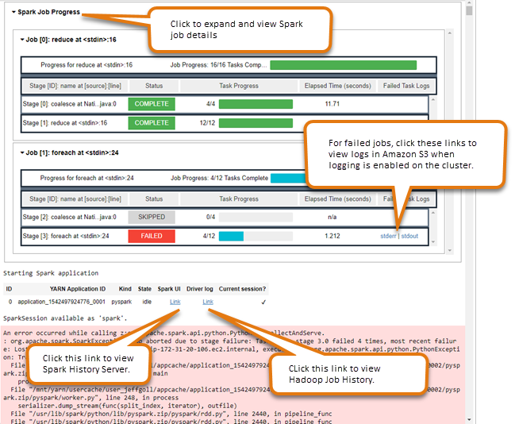

# Enabling user impersonation to

monitor Spark user and job activity

EMR Notebooks allows you to configure user impersonation on a Spark cluster. This
feature helps you track job activity initiated from within the notebook editor. In
addition, EMR Notebooks has a built-in Jupyter Notebook widget to view Spark job details
alongside query output in the notebook editor. The widget is available by default and
requires no special configuration. However, to view the history servers, your client
must be configured to view Amazon EMR web interfaces that are hosted on the primary
node.

###### Note

EMR Notebooks are available as EMR Studio Workspaces in the console. The **Create Workspace** button in the console lets you create new notebooks. To access or create Workspaces, EMR Notebooks users need additional IAM role permissions. For more information, see [Amazon EMR Notebooks are Amazon EMR Studio Workspaces in the console](emr-managed-notebooks-migration.md "emr-managed-notebooks-migration.md") and [Amazon EMR console](whats-new-in-console.md "whats-new-in-console.md").

## Setting up Spark user

impersonation

By default, Spark jobs that users submit using the notebook editor appear to
originate from an indistinct `livy` user identity. You can configure user
impersonation for the cluster so that these jobs are associated with the a user
identity that ran the code instead. HDFS user directories on the primary node are
created for each user identity that runs code in the notebook. For example, if user
`NbUser1` runs code from the notebook editor, you can connect to the
primary node and see that `hadoop fs -ls /user` shows the directory
`/user/user_NbUser1`.

You enable this feature by setting properties in the `core-site` and
`livy-conf` configuration classifications. This feature is not
available by default when you have Amazon EMR create a cluster along with a notebook. For
more information about using configuration classifications to customize
applications, see [Configuring
applications](../ReleaseGuide/emr-configure-apps.md "../ReleaseGuide/emr-configure-apps.md") in the _Amazon EMR Release Guide_.

Use the following configuration classifications and values to enable user
impersonation for EMR Notebooks:

```
[
    {
        "Classification": "core-site",
        "Properties": {
          "hadoop.proxyuser.livy.groups": "*",
          "hadoop.proxyuser.livy.hosts": "*"
        }
    },
    {
        "Classification": "livy-conf",
        "Properties": {
          "livy.impersonation.enabled": "true"
        }
    }
]
```

## Using the Spark job

monitoring widget

When you run code in the notebook editor that execute Spark jobs on the
EMR cluster, the output includes a Jupyter Notebook widget for Spark job
monitoring. The widget provides job details and useful links to the Spark history
server page and the Hadoop job history page, along with convenient links to job logs
in Amazon S3 for any failed jobs.

To view history server pages on the cluster primary node, you must set up an SSH
client and proxy as appropriate. For more information, see [View web interfaces hosted on Amazon EMR
clusters](emr-web-interfaces.md "emr-web-interfaces.md"). To view logs
in Amazon S3, cluster logging must be enabled, which is the default for new clusters. For
more information, see [View log files archived to Amazon S3](emr-manage-view-web-log-files.md#emr-manage-view-web-log-files-s3 "emr-manage-view-web-log-files.md#emr-manage-view-web-log-files-s3").

The following is an example of the Spark job monitoring.


