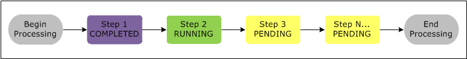
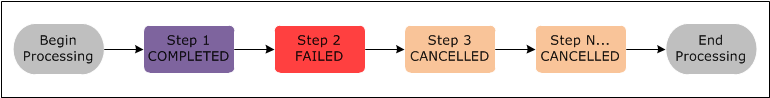
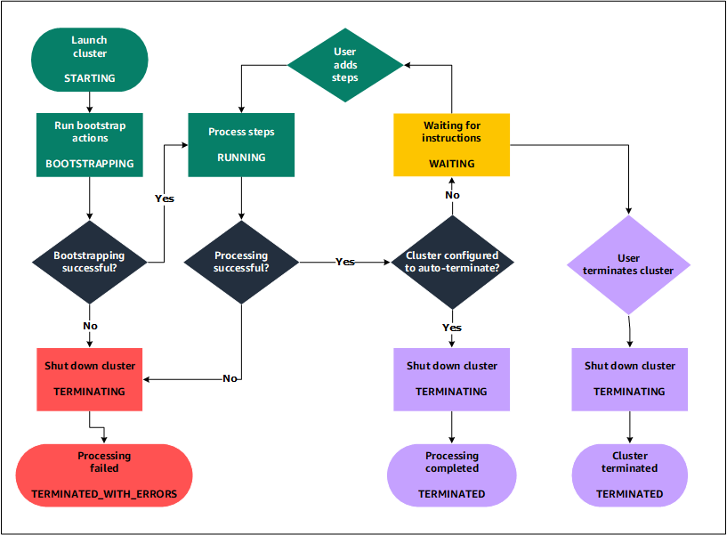

# Understanding how to create and work with Amazon EMR clusters

This topic provides an overview of Amazon EMR clusters, including how to submit work to a
cluster, how that data is processed, and the various states that the cluster goes
through during processing.

###### In This Topic

- [Getting familiar with clusters and nodes](#emr-overview-clusters "#emr-overview-clusters")
- [Submitting work to a cluster](#emr-work-cluster "#emr-work-cluster")
- [Processing data](#emr-overview-data-processing "#emr-overview-data-processing")
- [Understanding the cluster
  lifecycle](#emr-overview-cluster-lifecycle "#emr-overview-cluster-lifecycle")

## Getting familiar with clusters and nodes

The central component of Amazon EMR is the _cluster_. A cluster
is a collection of Amazon Elastic Compute Cloud (Amazon EC2) instances. Each instance in the cluster is
called a _node_. Each node has a role within the cluster,
referred to as the _node type_. Amazon EMR also installs different
software components on each node type, giving each node a role in a distributed
application like Apache Hadoop.

The node types in Amazon EMR are as follows:

- **Primary node**: A node that manages the
  cluster by running software components to coordinate the distribution of
  data and tasks among other nodes for processing. The primary node tracks the
  status of tasks and monitors the health of the cluster. Every cluster has a
  primary node, and it's possible to create a single-node cluster with only the
  primary node.
- **Core node**: A node with software
  components that run tasks and store data in the Hadoop Distributed File
  System (HDFS) on your cluster. Multi-node clusters have at least one core
  node.
- **Task node**: A node with software
  components that only runs tasks and does not store data in HDFS. Task nodes
  are optional.

## Submitting work to a cluster

When you run a cluster on Amazon EMR, you have several options as to how you specify
the work that needs to be done.

- Provide the entire definition of the work to be done in functions that you
  specify as steps when you create a cluster. This is typically done for
  clusters that process a set amount of data and then terminate when
  processing is complete.
- Create a long-running cluster and use the Amazon EMR console, the Amazon EMR API, or
  the AWS CLI to submit steps, which may contain one or more jobs. For more
  information, see [Submit work to an Amazon EMR cluster](emr-work-with-steps.md "emr-work-with-steps.md").
- Create a cluster, connect to the primary node and other nodes as required
  using SSH, and use the interfaces that the installed applications provide to
  perform tasks and submit queries, either scripted or interactively. For more
  information, see the [Amazon EMR Release Guide](../ReleaseGuide.md "../ReleaseGuide.md").

## Processing data

When you launch your cluster, you choose the frameworks and applications to
install for your data processing needs. To process data in your Amazon EMR cluster,
you can submit jobs or queries directly to installed applications, or you can run
_steps_ in the cluster.

### Submitting jobs directly to

applications

You can submit jobs and interact directly with the software that is installed
in your Amazon EMR cluster. To do this, you typically connect to the primary node
over a secure connection and access the interfaces and tools that are available
for the software that runs directly on your cluster. For more information, see
[Connect to an Amazon EMR cluster](emr-connect-master-node.md "emr-connect-master-node.md").

### Running steps to process data

You can submit one or more ordered steps to an Amazon EMR cluster. Each step is
a unit of work that contains instructions to manipulate data for processing by
software installed on the cluster.

The following is an example process using four steps:

1. Submit an input dataset for processing.
2. Process the output of the first step by using a Pig program.
3. Process a second input dataset by using a Hive program.
4. Write an output dataset.

Generally, when you process data in Amazon EMR, the input is data stored as
files in your chosen underlying file system, such as Amazon S3 or HDFS. This data
passes from one step to the next in the processing sequence. The final step
writes the output data to a specified location, such as an Amazon S3 bucket.

Steps are run in the following sequence:

1. A request is submitted to begin processing steps.
2. The state of all steps is set to **PENDING**.
3. When the first step in the sequence starts, its state changes to
   **RUNNING**. The other steps remain in the
   **PENDING** state.
4. After the first step completes, its state changes to
   **COMPLETED**.
5. The next step in the sequence starts, and its state changes to
   **RUNNING**. When it completes, its state changes
   to **COMPLETED**.
6. This pattern repeats for each step until they all complete and
   processing ends.

The following diagram represents the step sequence and change of state for the
steps as they are processed.

If a step fails during processing, its state changes to
**FAILED**. You can determine what happens next for each
step. By default, any remaining steps in the sequence are set to
**CANCELLED** and do not run if a preceeding step fails.
You can also choose to ignore the failure and allow remaining steps to proceed,
or to terminate the cluster immediately.

The following diagram represents the step sequence and default change of state
when a step fails during processing.

## Understanding the cluster

lifecycle

A successful Amazon EMR cluster follows this process:

1. Amazon EMR first provisions EC2 instances in the cluster for each instance
   according to your specifications. For more information, see [Configure Amazon EMR cluster hardware and networking](emr-plan-instances.md "emr-plan-instances.md"). For
   all instances, Amazon EMR uses the default AMI for Amazon EMR or a custom Amazon Linux
   AMI that you specify. For more information, see [Using a custom AMI to provide more flexibility for Amazon EMR cluster configuration](emr-custom-ami.md "emr-custom-ami.md"). During this
   phase, the cluster state is `STARTING`.
2. Amazon EMR runs _bootstrap actions_ that you specify on each
   instance. You can use bootstrap actions to install custom applications and
   perform customizations that you require. For more information, see [Create bootstrap actions to install additional
   software with an Amazon EMR cluster](emr-plan-bootstrap.md "emr-plan-bootstrap.md").
   During this phase, the cluster state is `BOOTSTRAPPING`.
3. Amazon EMR installs the native applications that you specify when you create
   the cluster, such as Hive, Hadoop, Spark, and so on.
4. After bootstrap actions are successfully completed and native applications
   are installed, the cluster state is `RUNNING`. At this point, you
   can connect to cluster instances, and the cluster sequentially runs any
   steps that you specified when you created the cluster. You can submit
   additional steps, which run after any previous steps complete. For more
   information, see [Submit work to an Amazon EMR cluster](emr-work-with-steps.md "emr-work-with-steps.md").
5. After steps run successfully, the cluster goes into a `WAITING`
   state. If a cluster is configured to auto-terminate after the last step is
   complete, it goes into a `TERMINATING` state and then into the
   `TERMINATED` state. If the cluster is configured to wait, you
   must manually shut it down when you no longer need it. After you manually
   shut down the cluster, it goes into the `TERMINATING` state and
   then into the `TERMINATED` state.

A failure during the cluster lifecycle causes Amazon EMR to terminate the cluster and
all of its instances unless you enable termination protection. If a cluster
terminates because of a failure, any data stored on the cluster is deleted, and the
cluster state is set to `TERMINATED_WITH_ERRORS`. If you enabled
termination protection, you can retrieve data from your cluster, and then remove
termination protection and terminate the cluster. For more information, see [Using termination protection to protect your Amazon EMR clusters from
accidental shut down](UsingEMR_TerminationProtection.md "UsingEMR_TerminationProtection.md").

The following diagram represents the lifecycle of a cluster, and how each stage of
the lifecycle maps to a particular cluster state.

