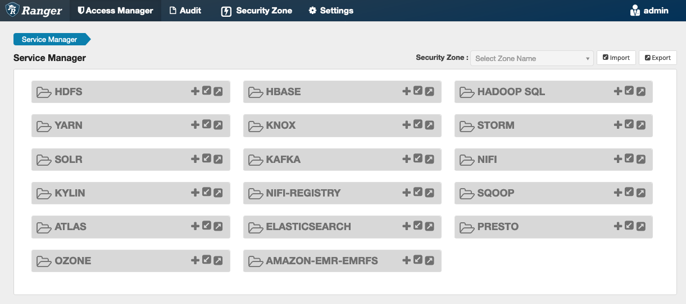
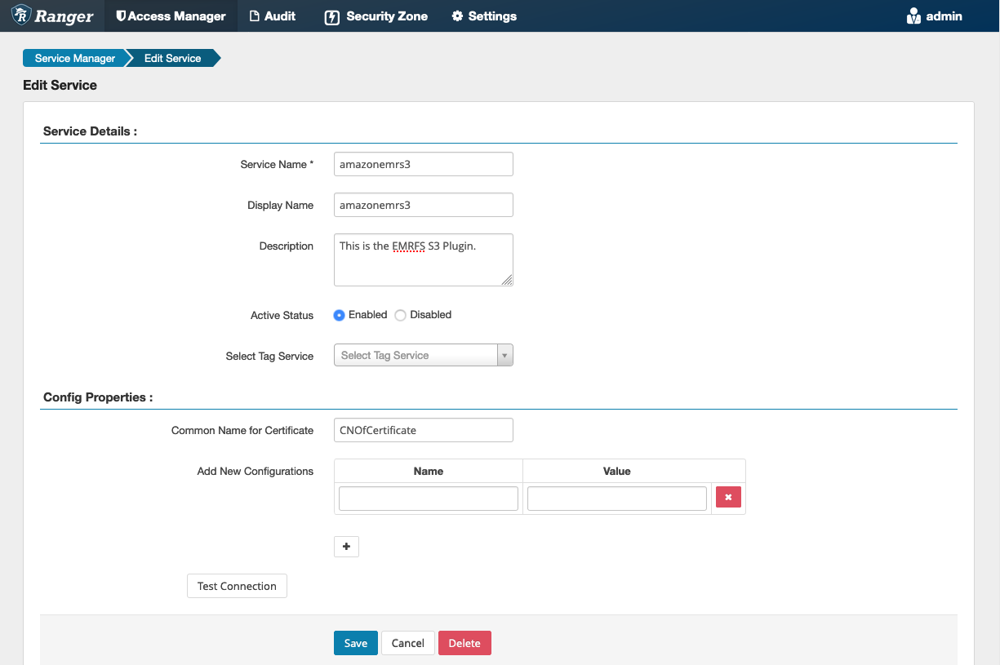
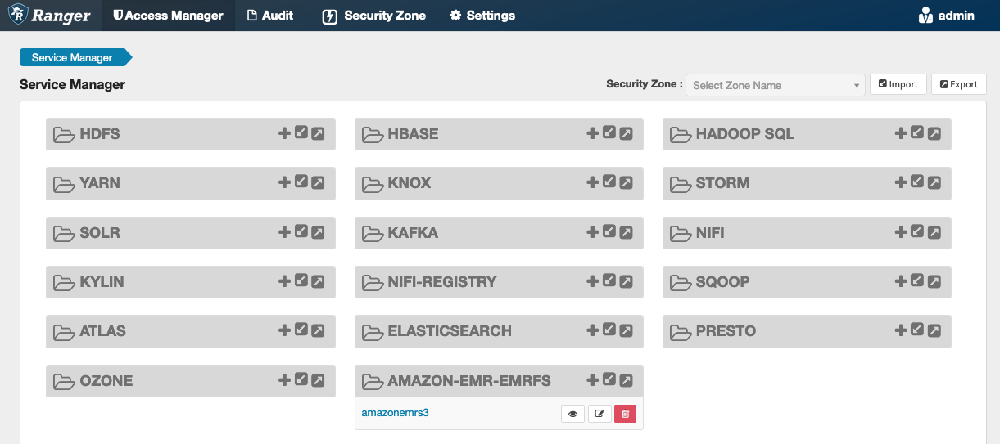
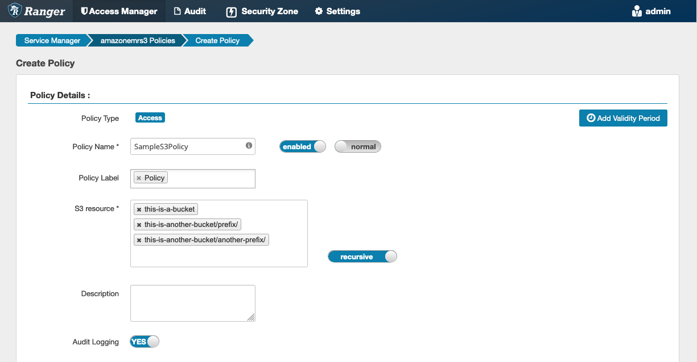
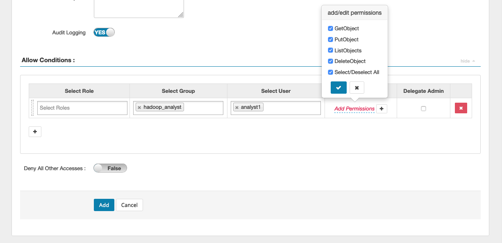

# EMRFS S3 plugin for Ranger integration with Amazon EMR

To make it easier to provide access controls against objects in S3 on a
multi-tenant cluster, the EMRFS S3 plugin provides access controls to the data
within S3 when accessing it through EMRFS. You can allow access to S3 resources at a
user and group level.

To achieve this, when your application attempts to access data within S3, EMRFS
sends a request for credentials to the Secret Agent process, where the request is
authenticated and authorized against an Apache Ranger plugin. If the request is
authorized, then the Secret Agent assumes the IAM role for Apache Ranger Engines
with a restricted policy to generate credentials that only have access to the Ranger
policy that allowed the access. The credentials are then passed back to EMRFS to
access S3.

###### Topics

- [Supported features](#emr-ranger-emrfs-features "#emr-ranger-emrfs-features")
- [Installation of service
  configuration](#emr-ranger-emrfs-service-config "#emr-ranger-emrfs-service-config")
- [Creating EMRFS S3
  policies](#emr-ranger-emrfs-create-policies "#emr-ranger-emrfs-create-policies")
- [EMRFS S3 policies usage
  notes](#emr-ranger-emrfs-considerations "#emr-ranger-emrfs-considerations")
- [Limitations](#emr-ranger-emrfs-limitations "#emr-ranger-emrfs-limitations")

## Supported features

EMRFS S3 plugin provides storage level authorization. Policies can be created
to provide access to users and groups to S3 buckets and prefixes. Authorization
is done only against EMRFS.

## Installation of service

configuration

To install the EMRFS service definition, you must set up the Ranger
Admin server. To set up the server, see [Set up a Ranger Admin server to integrate with Amazon EMR](emr-ranger-admin.md "emr-ranger-admin.md").

Follow these steps to install the EMRFS service definition.

**Step 1: SSH into the Apache Ranger Admin
server**.

For example:

```
ssh ec2-user@ip-xxx-xxx-xxx-xxx.ec2.internal
```

**Step 2: Download the EMRFS service definition**.

In a temporary directory, download the Amazon EMR service definition. This service
definition is supported by Ranger 2.x versions.

```
wget https://s3.amazonaws.com/elasticmapreduce/ranger/service-definitions/version-2.0/ranger-servicedef-amazon-emr-emrfs.json
```

**Step 3: Register EMRFS S3 service
definition**.

```
curl -u *<admin users login>*:*_<_**_password_ **_for_** _ranger admin user_**_>_* -X POST -d @ranger-servicedef-amazon-emr-emrfs.json \
-H "Accept: application/json" \
-H "Content-Type: application/json" \
-k 'https://*<RANGER SERVER ADDRESS>*:6182/service/public/v2/api/servicedef'
```

If this command runs successfully, you see a new service in the Ranger Admin
UI called "AMAZON-EMR-S3", as shown in the following image (Ranger version 2.0
is shown).



**Step 4: Create an instance of the AMAZON-EMR-EMRFS
application**.

Create an instance of the service definition.

- Click on the **+** next to AMAZON-EMR-EMRFS.

Fill in the following fields:

**Service Name (If displayed)**: The suggested
value is `amazonemrs3`. Note this service name as it
will be needed when creating an EMR security configuration.

**Display Name**: The name displayed for this
service. The suggested value is `amazonemrs3`.

**Common Name For Certificate**: The CN field
within the certificate used to connect to the admin server from a client plugin.
This value must match the CN field in the TLS certificate that was created for
the plugin.



###### Note

The TLS certificate for this plugin should have been registered in the
trust store on the Ranger Admin server. See [TLS certificates for Apache Ranger integration with Amazon EMR](emr-ranger-admin-tls.md "emr-ranger-admin-tls.md")
for more details.

When the service is created, the Service Manager includes "AMAZON-EMR-EMRFS",
as shown in the following image.



## Creating EMRFS S3

policies

To create a new policy in the **Create policy** page of the
Service Manager, fill in the following fields.

**Policy Name**: The name of this policy.

**Policy Label**: A label that you can put on
this policy.

**S3 Resource**: A resource starting with the
bucket and optional prefix. See [EMRFS S3 policies usage
notes](#emr-ranger-emrfs-considerations "#emr-ranger-emrfs-considerations") for information on best
practices. Resources in Ranger Admin server should not contain
`s3://`, `s3a://` or
`s3n://`.



You can specify users and groups to grant permissions. You can also specify
exclusions for **allow** conditions and
**deny** conditions.



###### Note

A maximum of three resources are allowed for each policy. Adding more than
three resources may result in an error when this policy is used on an EMR
cluster. Adding more than three policies displays a reminder about the
policy limit.

## EMRFS S3 policies usage

notes

When creating S3 policies within Apache Ranger, there are some usage
considerations to be aware of.

### Permissions to

multiple S3 objects

You can use recursive policies and wildcard expressions to give
permissions to multiple S3 objects with common prefixes. Recursive policies
give permissions to all objects with a common prefix. Wildcard expressions
select multiple prefixes. Together, they give permissions to all objects
with multiple common prefixes as shown in the following examples.

###### Example Using a recursive policy

Suppose you want permissions to list all the parquet files in an S3
bucket organized as follows.

````
s3://sales-reports/americas/
    +- year=2000
|      +- data-q1.parquet
|      +- data-q2.parquet +- year=2019
|      +- data-q1.json
|      +- data-q2.json
|      +- data-q3.json
|      +- data-q4.json
| +- year=2020
|      +- data-q1.parquet
|      +- data-q2.parquet
|      +- data-q3.parquet
|      +- data-q4.parquet
|      +- annual-summary.parquet +- year=2021 ``` First, consider the parquet files with the prefix `s3://sales-reports/americas/year=2000`. You can grant GetObject permissions to all of them in two ways: **Using non-recursive policies**: One option is to use two separate non-recursive policies, one for the directory and the other for the files. The first policy grants permission to the prefix `s3://sales-reports/americas/year=2020` (there is no trailing `/`). ``` <br>• S3 resource = "sales-reports/americas/year=2000" <br>• permission = "GetObject" <br>• user = "analyst" ``` The second policy uses wildcard expression to grant permissions all the files with prefix `sales-reports/americas/year=2020/` (note the trailing `/`). ``` <br>• S3 resource = "sales-reports/americas/year=2020/*" <br>• permission = "GetObject" <br>• user = "analyst" ``` **Using a recursive policy**: A more convenient alternative is to use a single recursive policy and grant recursive permission to the prefix. ``` <br>• S3 resource = "sales-reports/americas/year=2020" <br>• permission = "GetObject" <br>• user = "analyst" <br>• is recursive = "True" ``` So far, only the parquet files with the prefix `s3://sales-reports/americas/year=2000` have been included. You can now also include the parquet files with a different prefix, `s3://sales-reports/americas/year=2020`, into the same recursive policy by introducing a wildcard expression as follows. ``` <br>• S3 resource = "sales-reports/americas/year=20?0" <br>• permission = "GetObject" <br>• user = "analyst" <br>• is recursive = "True" ``` ### Policies for PutObject and DeleteObject permissions Writing policies for `PutObject` and `DeleteObject` permissions to files on EMRFS need special care because, unlike GetObject permissions, they need additional recursive permissions granted to the prefix. ###### Example Policies for PutObject and DeleteObject permissions For example, deleting the file `annual-summary.parquet` requires not only a DeleteObject permission to the actual file. ``` <br>• S3 resource = "sales-reports/americas/year=2020/annual-summary.parquet" <br>• permission = "DeleteObject" <br>• user = "analyst" ``` It also requires a policy granting recursive `GetObject` and `PutObject` permissions to its prefix. Similarly, modifying the file `annual-summary.parquet`, requires not only a `PutObject` permission to the actual file. ``` <br>• S3 resource = "sales-reports/americas/year=2020/annual-summary.parquet" <br>• permission = "PutObject" <br>• user = "analyst" ``` It also requires a policy granting recursive `GetObject` permission to its prefix. ``` <br>• S3 resource = "sales-reports/americas/year=2020" <br>• permission = "GetObject" <br>• user = "analyst" <br>• is recursive = "True" ``` ### Wildcards in policies There are two areas in which wildcards can be specified. When specifying an S3 resource, the "\*" and "?" can be used. The "\*" provides matching against an S3 path and matches everything after the prefix. For example, the following policy. ``` S3 resource = "sales-reports/americas/*" ``` This matches the following S3 paths. ``` sales-reports/americas/year=2020/ sales-reports/americas/year=2019/ sales-reports/americas/year=2019/month=12/day=1/afile.parquet sales-reports/americas/year=2018/month=6/day=1/afile.parquet sales-reports/americas/year=2017/afile.parquet ``` The "?" wildcard matches only a single character. For example, for the policy. ``` S3 resource = "sales-reports/americas/year=201?/" ``` This matches the following S3 paths. ``` sales-reports/americas/year=2019/ sales-reports/americas/year=2018/ sales-reports/americas/year=2017/ ``` ### Wildcards in users There are two built-in wildcards when assigning users to provide access to users. The first is the "{USER}" wildcard that provides access to all users. The second wildcard is "{OWNER}", which provides access to the owner of a particular object or directly. However, the "{USER}" wildcard is currently not supported. ## Limitations The following are current limitations of the EMRFS S3 plugin: <br>• Apache Ranger policies can have at most three policies. <br>• Access to S3 must be done through EMRFS and can be used with Hadoop-related applications. The following is not supported: <br>• Boto3 libraries <br>• AWS SDK and AWK CLI <br>• S3A open source connector <br>• Apache Ranger deny policies are not supported. <br>• Operations on S3 with keys having CSE-KMS encryption are currently not supported. <br>• Cross-Region support is not supported. <br>• Apache Ranger’s Security Zone feature is not supported. Access control restrictions defined using the Security Zone feature are not applied on your Amazon EMR clusters. <br>• The Hadoop user does not generate any audit events as Hadoop always accesses the EC2 Instance Profile. <br>• It's recommended that you disable Amazon EMR Consistency View. S3 is strongly consistent, so it's no longer needed. See [Amazon S3 strong consistency](https://aws.amazon.com/s3/consistency/ "https://aws.amazon.com/s3/consistency/") for more information. <br>• The EMRFS S3 plugin makes numerous STS calls. It's advised that you do load testing on a development account and monitor STS call volume. It is also recommended that you make an STS request to raise AssumeRole service limits. <br>• The Ranger Admin server doesn't support auto-complete.
````
