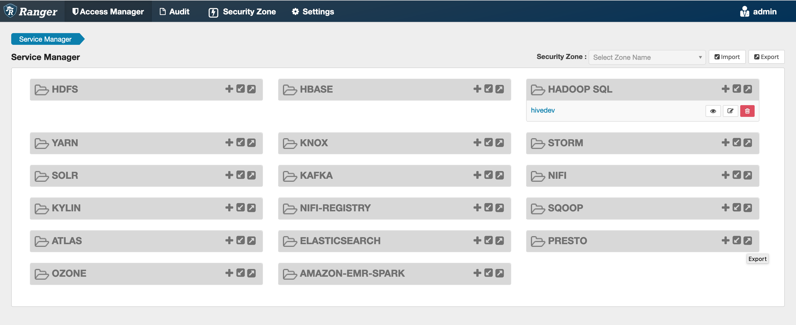
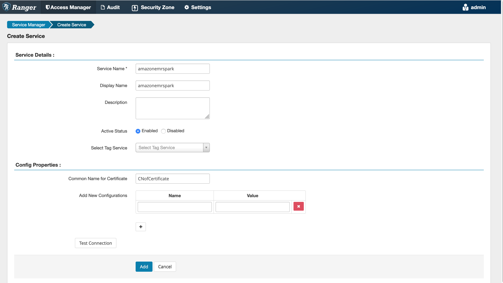
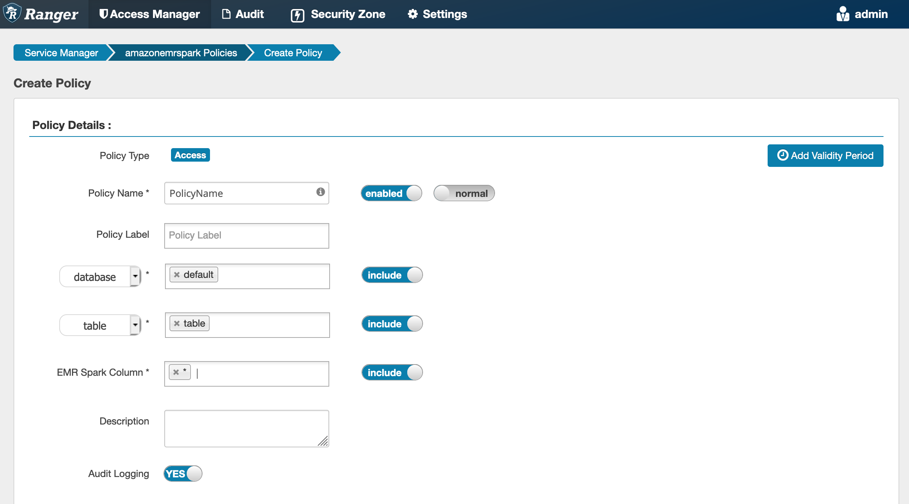
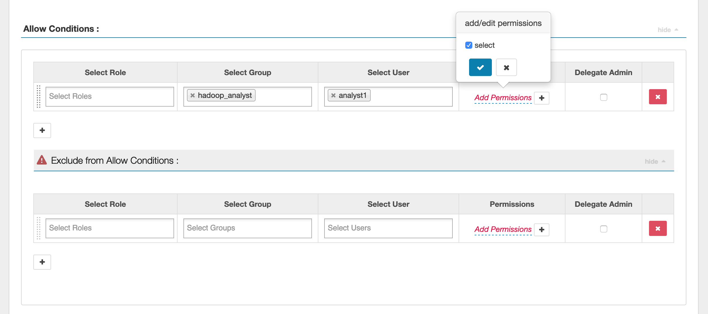

# Apache Spark plugin for Ranger integration with Amazon EMR

Amazon EMR has integrated EMR RecordServer to provide fine-grained access control for
SparkSQL. EMR's RecordServer is a privileged process running on all nodes on an
Apache Ranger-enabled cluster. When a Spark driver or executor runs a SparkSQL
statement, all metadata and data requests go through the RecordServer. To learn more
about EMR RecordServer, see the [Amazon EMR components for use with Apache Ranger](emr-ranger-components.md "emr-ranger-components.md") page.

###### Topics

- [Supported features](#emr-ranger-spark-supported-features "#emr-ranger-spark-supported-features")
- [Redeploy service
  definition to use INSERT, ALTER, or DDL statements](#emr-ranger-spark-redeploy-service-definition "#emr-ranger-spark-redeploy-service-definition")
- [Installation of service
  definition](#emr-ranger-spark-install-servicedef "#emr-ranger-spark-install-servicedef")
- [Creating SparkSQL
  policies](#emr-ranger-spark-create-sparksql "#emr-ranger-spark-create-sparksql")
- [Considerations](#emr-ranger-spark-considerations "#emr-ranger-spark-considerations")
- [Limitations](#emr-ranger-spark-limitations "#emr-ranger-spark-limitations")

## Supported features

| SQL statement/Ranger action | STATUS        | Supported EMR release |
| --------------------------- | ------------- | --------------------- |
| SELECT                      | Supported     | As of 5.32            |
| SHOW DATABASES              | Supported     | As of 5.32            |
| SHOW COLUMNS                | Supported     | As of 5.32            |
| SHOW TABLES                 | Supported     | As of 5.32            |
| SHOW TABLE PROPERTIES       | Supported     | As of 5.32            |
| DESCRIBE TABLE              | Supported     | As of 5.32            |
| INSERT OVERWRITE            | Supported     | As of 5.34 and 6.4    |
| INSERT INTO                 | Supported     | As of 5.34 and 6.4    |
| ALTER TABLE                 | Supported     | As of 6.4             |
| CREATE TABLE                | Supported     | As of 5.35 and 6.7    |
| CREATE DATABASE             | Supported     | As of 5.35 and 6.7    |
| DROP TABLE                  | Supported     | As of 5.35 and 6.7    |
| DROP DATABASE               | Supported     | As of 5.35 and 6.7    |
| DROP VIEW                   | Supported     | As of 5.35 and 6.7    |
| CREATE VIEW                 | Not Supported |                       |

The following features are supported when using SparkSQL:

- Fine-grained access control on tables within the Hive Metastore, and
  policies can be created at a database, table, and column level.
- Apache Ranger policies can include grant policies and deny policies to
  users and groups.
- Audit events are submitted to CloudWatch Logs.

## Redeploy service

definition to use INSERT, ALTER, or DDL statements

###### Note

Starting with Amazon EMR 6.4, you can use Spark SQL with the statements: INSERT
INTO, INSERT OVERWRITE, or ALTER TABLE. Starting with Amazon EMR 6.7, you can use
Spark SQL to create or drop databases and tables. If you have an existing
installation on Apache Ranger server with Apache Spark service definitions
deployed, use the following code to redeploy the service definitions.

```
# Get existing Spark service definition id calling Ranger REST API and JSON processor
curl --silent -f -u `<admin_user_login>`:`<password_for_ranger_admin_user>` \
-H "Accept: application/json" \
-H "Content-Type: application/json" \
-k 'https://*`<RANGER SERVER ADDRESS>`*:6182/service/public/v2/api/servicedef/name/amazon-emr-spark' | jq .id

# Download the latest Service definition
wget https://s3.amazonaws.com/elasticmapreduce/ranger/service-definitions/version-2.0/ranger-servicedef-amazon-emr-spark.json

# Update the service definition using the Ranger REST API
curl -u `<admin_user_login>`:`<password_for_ranger_admin_user>` -X PUT -d @ranger-servicedef-amazon-emr-spark.json \
-H "Accept: application/json" \
-H "Content-Type: application/json" \
-k 'https://*`<RANGER SERVER ADDRESS>`*:6182/service/public/v2/api/servicedef/`<Spark service definition id from step 1>`'
```

## Installation of service

definition

The installation of EMR's Apache Spark service definition requires the Ranger
Admin server to be setup. See [Set up a Ranger Admin server to integrate with Amazon EMR](emr-ranger-admin.md "emr-ranger-admin.md").

Follow these steps to install the Apache Spark service definition:

**Step 1: SSH into the Apache Ranger Admin
server**

For example:

```
ssh ec2-user@ip-xxx-xxx-xxx-xxx.ec2.internal
```

**Step 2: Download the service definition and Apache
Ranger Admin server plugin**

In a temporary directory, download the service definition. This service
definition is supported by Ranger 2.x versions.

```
mkdir /tmp/emr-spark-plugin/
cd /tmp/emr-spark-plugin/

wget https://s3.amazonaws.com/elasticmapreduce/ranger/service-definitions/version-2.0/ranger-spark-plugin-2.x.jar
wget https://s3.amazonaws.com/elasticmapreduce/ranger/service-definitions/version-2.0/ranger-servicedef-amazon-emr-spark.json
```

**Step 3: Install the Apache Spark plugin for
Amazon EMR**

```
export RANGER_HOME=.. # Replace this Ranger Admin's home directory eg /usr/lib/ranger/ranger-2.0.0-admin
mkdir $RANGER_HOME/ews/webapp/WEB-INF/classes/ranger-plugins/amazon-emr-spark
mv ranger-spark-plugin-2.x.jar $RANGER_HOME/ews/webapp/WEB-INF/classes/ranger-plugins/amazon-emr-spark
```

**Step 4: Register the Apache Spark service definition for
Amazon EMR**

```
curl -u *<admin users login>*:*_<_**_password_ **_for_** _ranger admin user_**_>_* -X POST -d @ranger-servicedef-amazon-emr-spark.json \
-H "Accept: application/json" \
-H "Content-Type: application/json" \
-k 'https://*<RANGER SERVER ADDRESS>*:6182/service/public/v2/api/servicedef'
```

If this command runs successfully, you see a new service in your Ranger Admin
UI called "AMAZON-EMR-SPARK", as shown in the following image (Ranger version
2.0 is shown).



**Step 5: Create an instance of the AMAZON-EMR-SPARK
application**

**Service Name (If displayed):** The service name
that will be used. The suggested value is `amazonemrspark`.
Note this service name as it will be needed when creating an EMR security
configuration.

**Display Name:** The name to be displayed for
this instance. The suggested value is
`amazonemrspark`.

**Common Name For Certificate:** The CN field
within the certificate used to connect to the admin server from a client plugin.
This value must match the CN field in your TLS certificate that was created for
the plugin.



###### Note

The TLS certificate for this plugin should have been registered in the
trust store on the Ranger Admin server. See [TLS certificates for Apache Ranger integration with Amazon EMR](emr-ranger-admin-tls.md "emr-ranger-admin-tls.md")
for more details.

## Creating SparkSQL

policies

When creating a new policy, the fields to fill in are:

**Policy Name**: The name of this policy.

**Policy Label**: A label that you can put on
this policy.

**Database**: The database that this policy
applies to. The wildcard "\*" represents all databases.

**Table**: The tables that this policy applies
to. The wildcard "\*" represents all tables.

**EMR Spark Column**: The columns that this
policy applies to. The wildcard "\*" represents all columns.

**Description**: A description of this
policy.



To specify the users and groups, enter the users and groups below to grant
permissions. You can also specify exclusions for the **allow**
conditions and **deny** conditions.



After specifying the allow and deny conditions, click
**Save**.

## Considerations

Each node within the EMR cluster must be able to connect to the main node on
port 9083.

## Limitations

The following are current limitations for the Apache Spark plugin:

- Record Server will always connect to HMS running on an Amazon EMR cluster.
  Configure HMS to connect to Remote Mode, if required. You should not put
  config values inside the Apache Spark Hive-site.xml configuration
  file.
- Tables created using Spark datasources on CSV or Avro are not readable
  using EMR RecordServer. Use Hive to create and write data, and read
  using Record.
- Delta Lake, Hudi and Iceberg tables aren't supported.
- Users must have access to the default database. This is a requirement
  for Apache Spark.
- Ranger Admin server does not support auto-complete.
- The SparkSQL plugin for Amazon EMR does not support row filters or data
  masking.
- When using ALTER TABLE with Spark SQL, a partition location must be
  the child directory of a table location. Inserting data into a partition
  where the partition location is different from the table location is not
  supported.
