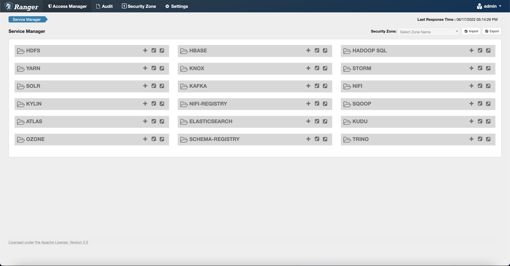
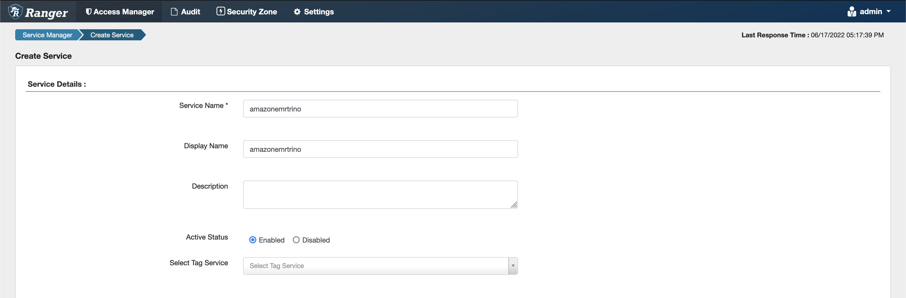
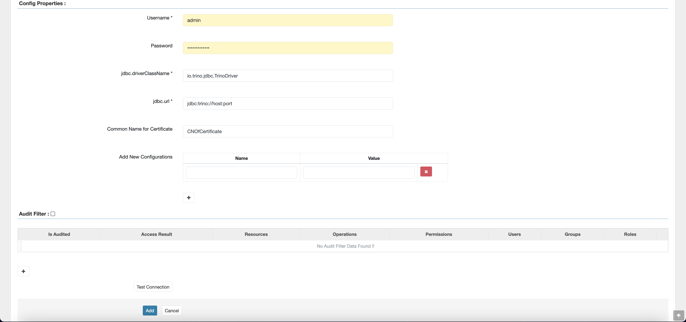
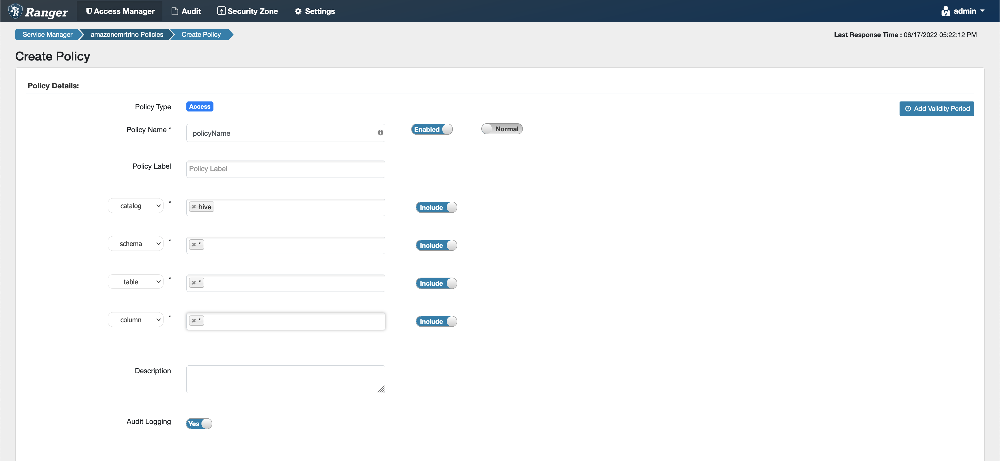
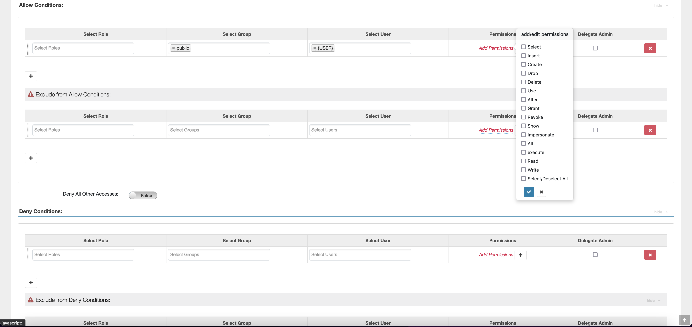

# Trino plugin for Ranger integration with Amazon EMR

Trino (previously PrestoSQL) is a SQL query engine that you can use to run queries
on data sources such as HDFS, object storage, relational databases, and NoSQL
databases. It eliminates the need to migrate data into a central location and allows
you to query the data from wherever it sits. Amazon EMR provides an Apache Ranger plugin
to provide fine-grained access controls for Trino. The plugin is compatible with
open source Apache Ranger Admin server version 2.0 and later.

###### Topics

- [Supported features](#emr-ranger-trino-features "#emr-ranger-trino-features")
- [Installation of service
  configuration](#emr-ranger-trino-service-config "#emr-ranger-trino-service-config")
- [Creating Trino
  policies](#emr-ranger-trino-create-policies "#emr-ranger-trino-create-policies")
- [Considerations](#emr-ranger-trino-considerations "#emr-ranger-trino-considerations")
- [Limitations](#emr-ranger-trino-limitations "#emr-ranger-trino-limitations")

## Supported features

The Apache Ranger plugin for Trino on Amazon EMR supports all the functionality of
the Trino query engine that is protected by fine-grained access control. This
includes database, table, column level access controls and row filtering and
data masking. Apache Ranger policies can include grant policies and deny
policies to users and groups. Audit events are also submitted to CloudWatch
logs.

## Installation of service

configuration

The installation of the Trino service definition requires that the Ranger
Admin server be set up. To set up the Ranger Admin sever, see [Set up a Ranger Admin server to integrate with Amazon EMR](emr-ranger-admin.md "emr-ranger-admin.md").

Follow these steps to install the Trino service definition.

1. SSH into the Apache Ranger Admin server.

```
ssh ec2-user@ip-xxx-xxx-xxx-xxx.ec2.internal
```

2. Uninstall the Presto server plugin, if it exists. Run the following
   command. If this errors out with a “Service not found” error, this means
   the Presto server plugin wasn't installed on your server. Proceed to the
   next step.

```
curl -f -u *<admin users login>*:*_<_**_password_ **_for_** _ranger admin user_**_>_* -X DELETE -k 'https://*<RANGER SERVER ADDRESS>*:6182/service/public/v2/api/servicedef/name/presto'
```

3. Download the service definition and Apache Ranger Admin server plugin.
   In a temporary directory, download the service definition. This service
   definition is supported by Ranger 2.x versions.

```
wget https://s3.amazonaws.com/elasticmapreduce/ranger/service-definitions/version-2.0/ranger-servicedef-amazon-emr-trino.json
```

4. Register the Apache Trino service definition for Amazon EMR.

```
curl -u *<admin users login>*:*_<_**_password_ **_for_** _ranger admin user_**_>_* -X POST -d @ranger-servicedef-amazon-emr-trino.json \
-H "Accept: application/json" \
-H "Content-Type: application/json" \
-k 'https://*<RANGER SERVER ADDRESS>*:6182/service/public/v2/api/servicedef'
```

If this command runs successfully, you see a new service in your
Ranger Admin UI called `TRINO`, as shown in the following
image.

 5. Create an instance of the `TRINO` application, entering the
following information.

**Service Name**: The service name that you'll use.
The suggested value is `amazonemrtrino`. Note this service
name, as it will be needed when creating an Amazon EMR security
configuration.

**Display Name**: The name to be displayed for this
instance. The suggested value is `amazonemrtrino`.



**jdbc.driver.ClassName**: The class name of JDBC
class for Trino connectivity. You can use the default value.

**jdbc.url**: The JDBC connection string to use when
connecting to Trino coordinator.

**Common Name For Certificate**: The CN field within
the certificate used to connect to the admin server from a client
plugin. This value must match the CN field in your TLS certificate that
was created for the plugin.



Note that the TLS certificate for this plugin should have been
registered in the trust store on the Ranger Admin server. For more
information, see [TLS
certificates](emr-ranger-admin-tls.md "emr-ranger-admin-tls.md").

## Creating Trino

policies

When you create a new policy, fill in the following fields.

**Policy Name**: The name of this policy.

**Policy Label**: A label that you can put on
this policy.

**Catalog**: The catalog that this policy applies
to. The wildcard "\*" represents all catalogs.

**Schema**: The schemas that this policy applies
to. The wildcard "\*" represents all schemas.

**Table**: The tables that this policy applies
to. The wildcard "\*" represents all tables.

**Column**: The columns that this policy applies
to. The wildcard "\*" represents all columns.

**Description**: A description of this
policy.

Other types of policies exist for the **Trino User** (for
user impersonation access), the **Trino System/Session
Property** (for altering engine system or session properties),
**Functions/Procedures** (for allowing function or
procedure calls), and the **URL** (for granting read/write
access to the engine on data locations).



To grant permissions to specific users and groups, enter the users and groups.
You can also specify exclusions for **allow** conditions and
**deny** conditions.



After specifying the allow and deny conditions, choose
**Save**.

## Considerations

When creating Trino policies within Apache Ranger, there are some usage
considerations to be aware of.

**Hive metadata server**

The Hive metadata server can only be accessed by trusted engines, specifically
the Trino engine, to protect against unauthorized access. The Hive metadata
server is also accessed by all nodes on the cluster. The required port 9083
provides all nodes access to the main node.

**Authentication**

By default, Trino is configured to authenticate using Kerberos as configured
in the Amazon EMR security configuration.

**In-transit encryption required**

The Trino plugin requires you to have in-transit encryption enabled in the
Amazon EMR security configuration. To enable encryption, see [Encryption in transit](emr-data-encryption-options.md#emr-encryption-intransit "emr-data-encryption-options.md#emr-encryption-intransit").

## Limitations

The following are current limitations of the Trino plugin:

- Ranger Admin server doesn't support auto-complete.
