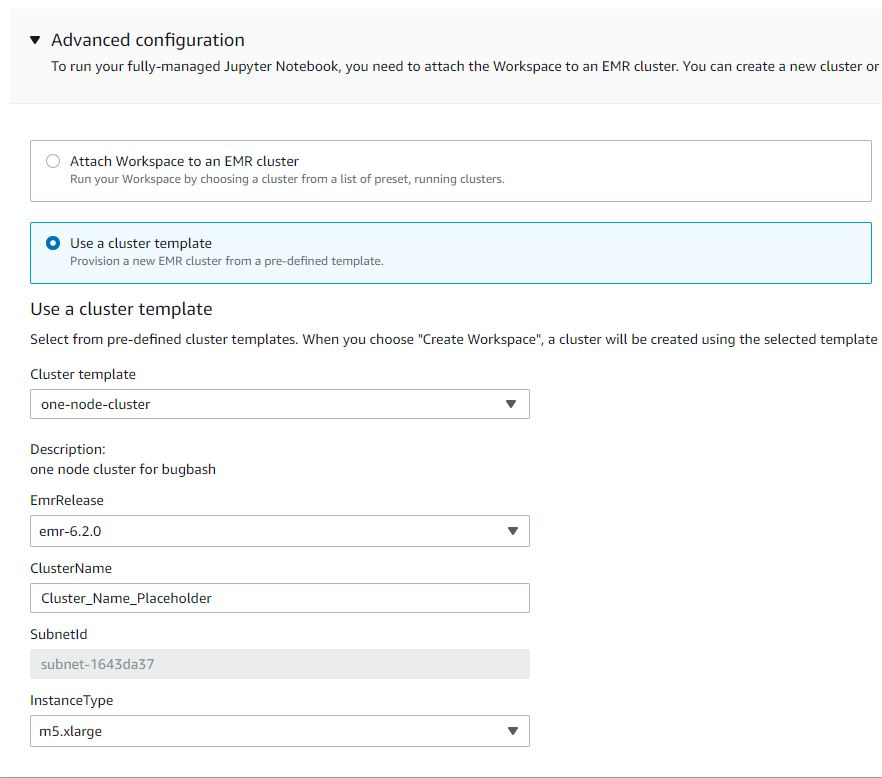

# Create AWS CloudFormation templates

for Amazon EMR Studio

## About EMR Studio cluster

templates

You can create AWS CloudFormation templates to help EMR Studio users
launch new Amazon EMR clusters in a Workspace. CloudFormation templates are formatted text
files in JSON or YAML. In a template, you describe a stack of AWS resources and tell
CloudFormation how to provision those resources for you. For EMR Studio, you can create one
or more templates that describe an Amazon EMR cluster.

You organize your templates in AWS Service Catalog.
AWS Service Catalog lets you create and manage commonly deployed IT services
called _products_ on AWS. You collect your templates as
products in a _portfolio_ that you share with your
EMR Studio users. After you create cluster templates, Studio users can launch a
new cluster for a Workspace with one of your templates. Users must have permission
to create new clusters from templates. You can set user permissions in your [EMR Studio permissions policies](emr-studio-user-permissions.md "emr-studio-user-permissions.md").

To learn more about CloudFormation templates, see [Templates](../../../AWSCloudFormation/latest/UserGuide/cfn-whatis-concepts.md#w2ab1b5c15b7 "../../../AWSCloudFormation/latest/UserGuide/cfn-whatis-concepts.md#w2ab1b5c15b7") in the _AWS CloudFormation User
Guide_. For more information about AWS Service Catalog, see [What is
AWS Service Catalog](../../../servicecatalog/latest/adminguide/introduction.md "../../../servicecatalog/latest/adminguide/introduction.md").

The following video demonstrates how to set up cluster templates in
AWS Service Catalog for EMR Studio. You can also learn more in the [Build a self-service environment for each line of business using Amazon EMR and Service Catalog](https://aws.amazon.com/blogs/big-data/build-a-self-service-environment-for-each-line-of-business-using-amazon-emr-and-aws-service-catalog/ "https://aws.amazon.com/blogs/big-data/build-a-self-service-environment-for-each-line-of-business-using-amazon-emr-and-aws-service-catalog/")
blog post.

### Optional template

parameters

You can include additional options in the [`Parameters`](../../../AWSCloudFormation/latest/UserGuide/parameters-section-structure.md "../../../AWSCloudFormation/latest/UserGuide/parameters-section-structure.md") section of your template. _Parameters_ let Studio users input or select custom values for a
cluster. For example, you could add a parameter that lets users select a particular Amazon EMR
release. For more information, see [Parameters](../../../AWSCloudFormation/latest/UserGuide/parameters-section-structure.md "../../../AWSCloudFormation/latest/UserGuide/parameters-section-structure.md") in the _AWS CloudFormation User Guide_.

The following example `Parameters` section defines additional input
parameters such as `ClusterName`, `EmrRelease` version, and
`ClusterInstanceType`.

```
Parameters:
  ClusterName:
    Type: "String"
    Default: "Cluster_Name_Placeholder"
  EmrRelease:
    Type: "String"
    Default: "emr-6.2.0"
    AllowedValues:
    - "emr-6.2.0"
    - "emr-5.32.0"
  ClusterInstanceType:
    Type: "String"
    Default: "m5.xlarge"
    AllowedValues:
    - "m5.xlarge"
    - "m5.2xlarge"
```

When you add parameters, Studio users see additional form options after
selecting a cluster template. The following image shows additional form options for
**EmrRelease** version, **ClusterName**, and **InstanceType**.



## Prerequisites

Before you create a cluster template, make sure you have IAM permissions to access the
Service Catalog administrator console view. You also need the required IAM permissions to perform Service Catalog
administrative tasks. For more information, see [Grant permissions to Service Catalog
administrators](../../../servicecatalog/latest/adminguide/getstarted-iamadmin.md "../../../servicecatalog/latest/adminguide/getstarted-iamadmin.md").

## Create EMR cluster templates

###### To create EMR cluster templates using Service Catalog

1. Create one or more CloudFormation templates. Where you store your templates is up to
   you. Since templates are formatted text files, you can upload them to Amazon S3
   or keep them in your local file system. To learn more about CloudFormation templates, see
   [Templates](../../../AWSCloudFormation/latest/UserGuide/cfn-whatis-concepts.md#w2ab1b5c15b7 "../../../AWSCloudFormation/latest/UserGuide/cfn-whatis-concepts.md#w2ab1b5c15b7") in the _AWS CloudFormation User
   Guide_.

Use the following rules to name your templates, or check your names against the
pattern `[a-zA-Z0-9][a-zA-Z0-9._-]*`.

    * Template names must start with a letter or a number.
    * Template names can only consist of letters, numbers, periods (.), underscores
     (\_), and hyphens (-).

Each cluster template that you create must include the following options:

**Input parameters**

    * ClusterName – A name for the cluster to help users identify it after it
     has been provisioned.

**Output**

    * `ClusterId` – The ID of the newly-provisioned
     EMR cluster.

Following is an example AWS CloudFormation template in YAML format for a cluster with two nodes.
The example template includes the required template options and defines additional input
parameters for `EmrRelease` and `ClusterInstanceType`.

```
awsTemplateFormatVersion: 2010-09-09

Parameters:
  ClusterName:
    Type: "String"
    Default: "Example_Two_Node_Cluster"
  EmrRelease:
    Type: "String"
    Default: "emr-6.2.0"
    AllowedValues:
    - "emr-6.2.0"
    - "emr-5.32.0"
  ClusterInstanceType:
    Type: "String"
    Default: "m5.xlarge"
    AllowedValues:
    - "m5.xlarge"
    - "m5.2xlarge"

Resources:
  EmrCluster:
    Type: AWS::EMR::Cluster
    Properties:
      Applications:
      - Name: Spark
      - Name: Livy
      - Name: JupyterEnterpriseGateway
      - Name: Hive
      EbsRootVolumeSize: '10'
      Name: !Ref ClusterName
      JobFlowRole: EMR_EC2_DefaultRole
      ServiceRole: EMR_DefaultRole_V2
      ReleaseLabel: !Ref EmrRelease
      VisibleToAllUsers: true
      LogUri:
        Fn::Sub: 's3://aws-logs-${AWS::AccountId}-${AWS::Region}/elasticmapreduce/'
      Instances:
        TerminationProtected: false
        Ec2SubnetId: 'subnet-ab12345c'
        MasterInstanceGroup:
          InstanceCount: 1
          InstanceType: !Ref ClusterInstanceType
        CoreInstanceGroup:
          InstanceCount: 1
          InstanceType: !Ref ClusterInstanceType
          Market: ON_DEMAND
          Name: Core

Outputs:
  ClusterId:
    Value:
      Ref: EmrCluster
    Description: The ID of the  EMR cluster
```

2. Create a portfolio for your cluster templates in the same AWS account as your
   Studio.
   1. Open the AWS Service Catalog console at
      [https://console.aws.amazon.com/servicecatalog/](https://console.aws.amazon.com/servicecatalog/ "https://console.aws.amazon.com/servicecatalog/").
   2. Choose **Portfolios** in the left navigation menu.
   3. Enter the requested information on the **Create portfolio**
      page.
   4. Choose **Create**. AWS Service Catalog creates the
      portfolio and displays the portfolio details.

3. Use the following steps to add your cluster templates as
   AWS Service Catalog products.
   1. Navigate to the **Products** page under
      **Administration** in the AWS Service Catalog
      management console.
   2. Choose **Upload new product**.
   3. Enter a **Product name** and **Owner**.
   4. Specify your template file under **Version details**.
   5. Choose **Review** to review your product settings, then choose
      **Create product**.

4. Complete the following steps to add your products to your portfolio.
   1. Navigate to the **Products** page in the
      AWS Service Catalog management console.
   2. Choose your product, choose **Actions**, then choose
      **Add product to portfolio**.
   3. Choose your portfolio, then choose **Add product to
      portfolio**.

5. Create a launch constraint for your products. A launch constraint is an IAM role
   that specifies user permissions for launching a product. You can tailor your launch
   constraints, but must allow permissions to use CloudFormation, Amazon EMR, and
   AWS Service Catalog. For more information and instructions, see [Service Catalog launch constraints](../../../servicecatalog/latest/adminguide/constraints-launch.md "../../../servicecatalog/latest/adminguide/constraints-launch.md").
6. Apply your launch constraint to each product in your portfolio. You must apply the
   launch constraint to each product individually.
   1. Select your portfolio from the **Portfolios** page in the
      AWS Service Catalog management console.
   2. Choose the **Constraints** tab and choose **Create
      constraint**.
   3. Choose your product and choose **Launch** under
      **Constraint type**. Choose **Continue**.
   4. Select your launch constraint role in the **Launch constraint**
      section, then choose **Create**.

7. Grant access to your portfolio.
   1. Select your portfolio from the **Portfolios** page in the
      AWS Service Catalog management console.
   2. Expand the **Groups, roles, and users** tab and choose
      **Add groups, roles, users**.
   3. Search for your EMR Studio IAM role in the **Roles** tab,
      select your role, and choose **Add access**.

| If you use....                 | Grant access to...                                                                                                                                   |
| ------------------------------ | ---------------------------------------------------------------------------------------------------------------------------------------------------- |
| IAM authentication             | Your native a users                                                                                                                                  |
| IAM federation                 | Your IAM role for federation                                                                                                                         |
| IAM Identity Center federation | Your [EMR Studio user role](emr-studio-user-permissions.md#emr-studio-create-user-role "emr-studio-user-permissions.md#emr-studio-create-user-role") |
