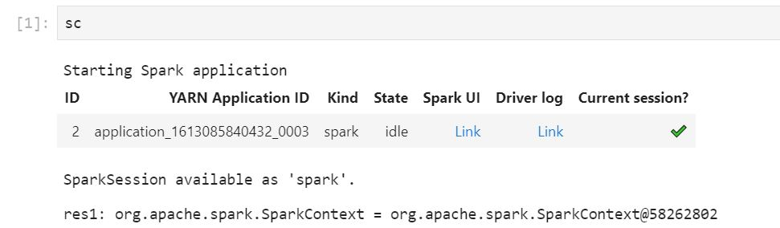

# Debug applications and jobs with EMR Studio

With Amazon EMR Studio, you can launch data application interfaces to analyze applications and
job runs in the browser.

You can also launch the persistent, off-cluster user interfaces for Amazon EMR running on EC2
clusters from the Amazon EMR console. For more information, see [View persistent application user
interfaces in Amazon EMR](app-history-spark-UI.md "app-history-spark-UI.md").

###### Note

Depending on your browser settings, you might need to enable pop-ups for an application
UI to open.

For information about configuring and using the application interfaces, see [The YARN Timeline Server](https://hadoop.apache.org/docs/current/hadoop-yarn/hadoop-yarn-site/TimelineServer.html "https://hadoop.apache.org/docs/current/hadoop-yarn/hadoop-yarn-site/TimelineServer.html"), [Monitoring and
instrumentation](https://spark.apache.org/docs/latest/monitoring.html "https://spark.apache.org/docs/latest/monitoring.html"), or [Tez UI
overview](https://tez.apache.org/tez-ui.html "https://tez.apache.org/tez-ui.html").

## Debug Amazon EMR running on Amazon EC2 jobs

Workspace UI

###### Launch an on-cluster UI from a notebook file

When you use Amazon EMR release versions 5.33.0 and later, you can launch the Spark
web user interface (the Spark UI or Spark History Server) from a notebook in your
Workspace.

On-cluster UIs work with the PySpark, Spark, or SparkR kernels. The maximum
viewable file size for Spark event logs or container logs is 10 MB. If your log
files exceed 10 MB, we recommend that you use the persistent Spark History Server
instead of the on-cluster Spark UI to debug jobs.

###### Important

In order for EMR Studio to launch on-cluster application user interfaces
from a Workspace, a cluster must be able to communicate with the
Amazon API Gateway. You must configure the EMR cluster to allow outgoing network traffic
to Amazon API Gateway, and make sure that Amazon API Gateway is reachable from the cluster.

The Spark UI accesses container logs by resolving hostnames. If you use a
custom domain name, you must make sure that the hostnames of your cluster nodes
can be resolved by Amazon DNS or by the DNS server you specify. To do so, set the
Dynamic Host Configuration Protocol (DHCP) options for the Amazon Virtual Private Cloud (VPC) that is
associated with your cluster. For more information about DHCP options, see [DHCP
option sets](../../../vpc/latest/userguide/VPC_DHCP_Options.md "../../../vpc/latest/userguide/VPC_DHCP_Options.md") in the _Amazon Virtual Private Cloud_
_User Guide._

1. In your EMR Studio, open the Workspace that you want to use and
   make sure that it is attached to an Amazon EMR cluster running on EC2. For
   instructions, see [Attach a compute to an EMR Studio
   Workspace](emr-studio-create-use-clusters.md "emr-studio-create-use-clusters.md").
2. Open a notebook file and use the PySpark, Spark, or SparkR kernel. To select a
   kernel, choose the kernel name from the upper right of the notebook toolbar to
   open the **Select Kernel** dialog box. The name appears as
   **No Kernel!** if no kernel has been selected.
3. Run your notebook code. The following appears as output in the notebook when
   you start the Spark context. It might take a few seconds to appear. If you have
   started the Spark context, you can run the `%%info` command to access a
   link to the Spark UI at any time.

###### Note

If the Spark UI links do not work or do not appear after a few seconds,
create a new notebook cell and run the `%%info` command to regenerate
the links.

 4. To launch the Spark UI, choose **Link** under **Spark
UI**. If your Spark application is running, the Spark UI opens in a new
tab. If the application has completed, the Spark History Server opens
instead.

After you launch the Spark UI, you can modify the URL in the browser to open
the YARN ResourceManager or the Yarn Timeline Server. Add one of the following
paths after `amazonaws.com`.

| Web UI               | Path | Example modified URL                                                    |
| -------------------- | ---- | ----------------------------------------------------------------------- |
| YARN ResourceManager | /rm  | https://`j-examplebby5ij`.emrappui-prod.`eu-west-1`.amazonaws.com`/rm`  |
| Yarn Timeline Server | /yts | https://`j-examplebby5ij`.emrappui-prod.`eu-west-1`.amazonaws.com`/yts` |
| Spark History Server | /shs | https://`j-examplebby5ij`.emrappui-prod.`eu-west-1`.amazonaws.com`/shs` |

Studio UI

###### Launch the persistent YARN Timeline Server, Spark History Server, or Tez UI

from the EMR Studio UI

1. In your EMR Studio, select **Amazon EMR on EC2** on the left
   side of the page to open the **Amazon EMR on EC2** clusters list.
2. Filter the list of clusters by **name**,
   **state**, or **ID**
   by entering values in the search box. You can also search by creation **time range**.
3. Select a cluster and then choose **Launch application
   UIs** to select an application user interface. The Application UI opens
   in a new browser tab and might take some time to load.

## Debug EMR Studio running on

EMR Serverless

Similar to Amazon EMR running on Amazon EC2, you can use the Workspace user interface to analyze
your EMR Serverless applications. From the Workspace UI, when you use Amazon EMR releases 6.14.0
and higher, you can launch the Spark web user interface (the Spark UI or Spark History
Server) from a notebook in your Workspace. For your convenience, we also provide a link to
the driver log for quick access the Spark driver logs.

## Debug Amazon EMR on EKS job runs with the Spark History

Server

When you submit a job run to an Amazon EMR on EKS cluster, you can access logs for that job run
using the Spark History Server. The Spark History Server provides tools for monitoring Spark
applications, such as a list of scheduler stages and tasks, a summary of RDD sizes and
memory usage, and environmental information. You can launch the Spark History Server for
Amazon EMR on EKS job runs in the following ways:

- When you submit a job run using EMR Studio with an Amazon EMR on EKS managed endpoint,
  you can launch the Spark History Server from a notebook file in your
  Workspace.
- When you submit a job run using the AWS CLI or AWS SDK for Amazon EMR on EKS, you can launch
  the Spark History Server from the EMR Studio UI.

For information about how to use the Spark History Server, see [Monitoring and
Instrumentation](https://spark.apache.org/docs/latest/monitoring.html "https://spark.apache.org/docs/latest/monitoring.html") in the Apache Spark documentation. For more information about job
runs, see [Concepts and
components](../EMR-on-EKS-DevelopmentGuide/emr-eks-concepts.md "../EMR-on-EKS-DevelopmentGuide/emr-eks-concepts.md") in the _Amazon EMR on EKS Development Guide_.

###### To launch the Spark History Server from a notebook file in your EMR Studio

Workspace

1. Open a Workspace that is connected to an Amazon EMR on EKS cluster.
2. Select and open your notebook file in the Workspace.
3. Choose **Spark UI** at the top of the notebook file to open the
   persistent Spark History Server in a new tab.

###### To launch the Spark History Server from the EMR Studio UI

###### Note

The **Jobs** list in the EMR Studio UI displays only job runs
that you submit using the AWS CLI or AWS SDK for Amazon EMR on EKS.

1. In your EMR Studio, select **Amazon EMR on EKS** on the left side of
   the page.
2. Search for the Amazon EMR on EKS virtual cluster that you used to submit your job run. You
   can filter the list of clusters by **status** or **ID** by entering values in the search box.
3. Select the cluster to open its detail page. The detail page displays information
   about the cluster, such as ID, namespace, and status. The page also shows a list of all
   the job runs submitted to that cluster.
4. From the cluster detail page, select a job run to debug.
5. In the upper right of the **Jobs** list, choose **Launch
   Spark History Server** to open the application interface in a new browser
   tab.
