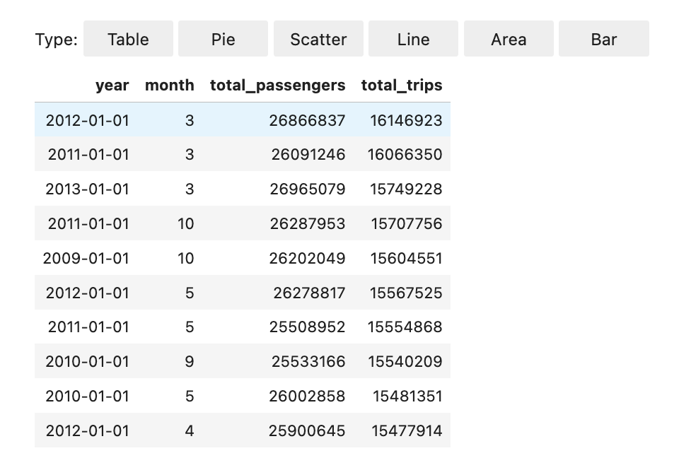
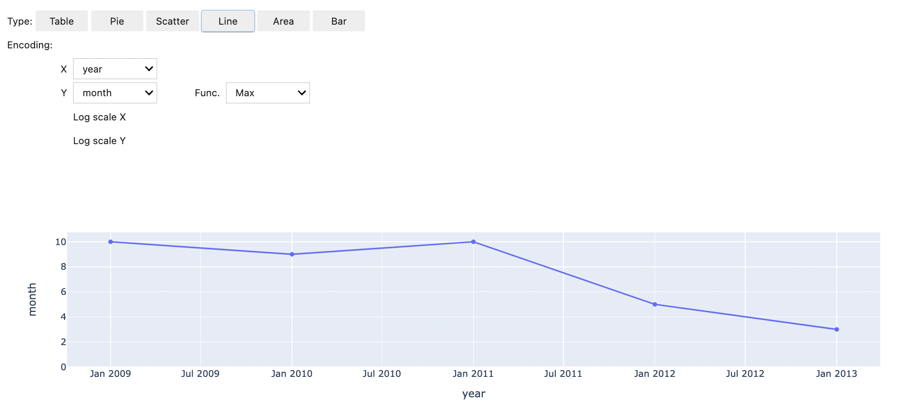

# Enhance kernels with magic commands in EMR Studio

## Overview

EMR Studio and EMR Notebooks support magic commands.
Magic commands, or _magics_,
are enhancements that the IPython kernel provides to help you run and analyze data. IPython
is an interactive shell environment that is built with Python.

Amazon EMR also supports Sparkmagic, a package that provides Spark-related
kernels (PySpark, SparkR, and Scala kernels) with specific magic commands and that uses
Livy on the cluster to submit Spark jobs.

You can use magic commands as long as you have a Python kernel in your
EMR notebook. Similarly, any Spark-related kernel supports Sparkmagic
commands.

Magic commands, also called _magics_, come in two
varieties:

- **Line magics** – These magic commands are
  denoted by a single `%` prefix and operate on a single line of code
- **Cell magics** – These magic commands are
  denoted by a double `%%` prefix and operate on multiple lines of code

For all available magics, see [List magic and Sparkmagic
commands](#accessing-all-magic-commands "#accessing-all-magic-commands").

## Considerations and limitations

- EMR Serverless doesn't support `%%sh` to run `spark-submit`.
  It doesn't support the EMR Notebooks magics.
- Amazon EMR on EKS clusters don't support Sparkmagic commands for
  EMR Studio. This is because Spark kernels that you use with managed endpoints are
  built into Kubernetes, and they aren't supported by Sparkmagic and Livy.
  You can set the Spark configuration directly into the SparkContext object as a
  workaround, as the following example demonstrates.

```
spark.conf.set("spark.driver.maxResultSize", '6g')
```

- The following magic commands and actions are prohibited by AWS:
  - `%alias`
  - `%alias_magic`
  - `%automagic`
  - `%macro`
  - Modifying `proxy_user` with `%configure`
  - Modifying `KERNEL_USERNAME` with `%env` or
    `%set_env`

## List magic and Sparkmagic

commands

Use the following commands to list the available magic commands:

- `%lsmagic` lists all currently-available magic functions.
- `%%help` lists currently-available Spark-related magic functions
  provided by the Sparkmagic package.

## Use `%%configure` to configure

Spark

One of the most useful Sparkmagic commands is the
`%%configure` command, which configures the session creation parameters. Using
`conf` settings, you can configure any Spark configuration that's mentioned in
the [configuration
documentation for Apache Spark](https://spark.apache.org/docs/latest/configuration.html "https://spark.apache.org/docs/latest/configuration.html").

###### Example Add external JAR file to EMR Notebooks from Maven repository or Amazon S3

You can use the following approach to add an external JAR file dependency to any
Spark-related kernel that's supported by Sparkmagic.

```
%%configure -f
{"conf": {
    "spark.jars.packages": "com.jsuereth:scala-arm_2.11:2.0,ml.combust.bundle:bundle-ml_2.11:0.13.0,com.databricks:dbutils-api_2.11:0.0.3",
    "spark.jars": "s3://`amzn-s3-demo-bucket`/my-jar.jar"
    }
}
```

###### Example : Configure Hudi

You can use the notebook editor to configure your EMR notebook to use
Hudi.

```
%%configure
{ "conf": {
     "spark.jars": "hdfs://apps/hudi/lib/hudi-spark-bundle.jar,hdfs:///apps/hudi/lib/spark-spark-avro.jar",
     "spark.serializer": "org.apache.spark.serializer.KryoSerializer",
     "spark.sql.hive.convertMetastoreParquet":"false"
     }
}
```

## Use `%%sh` to run

`spark-submit`

The `%%sh` magic runs shell commands in a subprocess on an instance of your
attached cluster. Typically, you'd use one of the Spark-related kernels to run Spark
applications on your attached cluster. However, if you want to use a Python kernel to submit
a Spark application, you can use the following magic, replacing the bucket name with your
bucket name in lowercase.

```
%%sh
spark-submit --master yarn --deploy-mode cluster s3://`amzn-s3-demo-bucket`/test.py
```

In this example, the cluster needs access to the location of
`s3://`amzn-s3-demo-bucket`/test.py`, or the command
will fail.

You can use any Linux command with the `%%sh` magic. If you want to run any
Spark or YARN commands, use one of the following options to create an
`emr-notebook` Hadoop user and grant the user permissions to run the
commands:

- You can explicitly create a new user by running the following commands.

```
hadoop fs -mkdir /user/emr-notebook
hadoop fs -chown emr-notebook /user/emr-notebook
```

- You can turn on user impersonation in Livy, which automatically creates the user.
  See [Enabling user impersonation to
  monitor Spark user and job activity](emr-managed-notebooks-spark-monitor.md "emr-managed-notebooks-spark-monitor.md") for more information.

## Use `%%display` to visualize Spark

dataframes

You can use the `%%display` magic to visualize a Spark dataframe. To use
this magic, run the following command.

```
%%display df
```

Choose to view the results in a table format, as the following image shows.



You can also choose to visualize your data with five types of charts. Your options
include pie, scatter, line, area, and bar charts.



## Use EMR Notebooks magics

Amazon EMR provides the following EMR Notebooks magics that you can use with Python3 and
Spark-based kernels:

- `%mount_workspace_dir` - Mounts your Workspace directory to your
  cluster so that you can import and run code from other files in your
  Workspace

###### Note

With `%mount_workspace_dir`, only the Python 3 kernel can access your
local file systems. Spark executors will not have access to the mounted directory with
this kernel.

- `%umount_workspace_dir` - Unmounts your Workspace directory from
  your cluster
- `%generate_s3_download_url` - Generates a temporary download link in your
  notebook output for an Amazon S3 object

### Prerequisites

Before you install EMR Notebooks magics, complete the following tasks:

- Make sure that your [Service role for cluster EC2 instances (EC2
  instance profile)](emr-iam-role-for-ec2.md "emr-iam-role-for-ec2.md") has read access for Amazon S3. The
  `EMR_EC2_DefaultRole` with the
  `AmazonElasticMapReduceforEC2Role` managed policy fulfills this
  requirement. If you use a custom role or policy, make sure that it has the necessary
  S3 permissions.

###### Note

EMR Notebooks magics run on a cluster as the notebook user and use the EC2
instance profile to interact with Amazon S3. When you mount a Workspace
directory on an EMR cluster, all Workspaces and EMR notebooks
with permission to attach to that cluster can access the mounted directory.

Directories are mounted as read-only by default. While `s3fs-fuse`
and `goofys` allow read-write mounts, we strongly recommend that you do
not modify mount parameters to mount directories in read-write mode. If you allow
write access, any changes made to the directory are written to the S3 bucket. To
avoid accidental deletion or overwriting, you can enable versioning for your S3
bucket. To learn more, see [Using versioning in S3
buckets](../../../AmazonS3/latest/userguide/Versioning.md "../../../AmazonS3/latest/userguide/Versioning.md").

- Run one of the following scripts on your cluster to install the dependencies for
  EMR Notebooks magics. To run a script, you can either [Use custom bootstrap actions](emr-plan-bootstrap.md#bootstrapCustom "emr-plan-bootstrap.md#bootstrapCustom") or follow the instructions in [Run
  commands and scripts on an Amazon EMR cluster](../ReleaseGuide/emr-commandrunner.md "../ReleaseGuide/emr-commandrunner.md") when you already have a running
  cluster.

You can choose which dependency to install. Both [s3fs-fuse](https://github.com/s3fs-fuse/s3fs-fuse "https://github.com/s3fs-fuse/s3fs-fuse") and [goofys](https://github.com/kahing/goofys "https://github.com/kahing/goofys") are FUSE (Filesystem in
Userspace) tools that let you mount an Amazon S3 bucket as a local file system
on a cluster. The `s3fs` tool provides an experience similar to POSIX. The
`goofys` tool is a good choice when you prefer performance over a
POSIX-compliant file system.

The Amazon EMR 7.x series uses Amazon Linux 2023, which doesn't support EPEL repositories. If you're running Amazon EMR 7.x, follow the
[s3fs-fuse GitHub](https://github.com/s3fs-fuse/s3fs-fuse/blob/master/COMPILATION.md "https://github.com/s3fs-fuse/s3fs-fuse/blob/master/COMPILATION.md")
instructions to install `s3fs-fuse`. If you use the 5.x or 6.x series, use the following commands to install `s3fs-fuse`.

```
#!/bin/sh

# Install the s3fs dependency for EMR Notebooks magics
sudo amazon-linux-extras install epel -y
sudo yum install s3fs-fuse -y
```

**OR**

```
#!/bin/sh

# Install the goofys dependency for EMR Notebooks magics
sudo wget https://github.com/kahing/goofys/releases/latest/download/goofys -P /usr/bin/
sudo chmod ugo+x /usr/bin/goofys
```

### Install EMR Notebooks magics

###### Note

With Amazon EMR releases 6.0 through 6.9.0, and 5.0 through 5.36.0, only
`emr-notebooks-magics` package versions 0.2.0 and higher support
`%mount_workspace_dir` magic.

Complete the following steps to install EMR Notebooks magics.

1. In your notebook, run the following commands to install the [`emr-notebooks-magics`](https://pypi.org/project/emr-notebooks-magics/ "https://pypi.org/project/emr-notebooks-magics/") package.

```
%pip install boto3 --upgrade
%pip install botocore --upgrade
%pip install emr-notebooks-magics --upgrade
```

2. Restart your kernel to load the EMR Notebooks magics.
3. Verify your installation with the following command, which should display output
   help text for `%mount_workspace_dir`.

```
%mount_workspace_dir?
```

### Mount a Workspace directory with

`%mount_workspace_dir`

The `%mount_workspace_dir` magic lets you mount your Workspace
directory onto your EMR cluster so that you can import and run other files, modules, or
packages stored in your directory.

The following example mounts the entire Workspace directory onto a cluster,
and specifies the optional
`<--fuse-type>` argument to use goofys
for mounting the directory.

```
%mount_workspace_dir . `<--fuse-type goofys>`
```

To verify that your Workspace directory is mounted, use the following example
to display the current working directory with the `ls` command. The output
should display all of the files in your Workspace.

```
%%sh
ls
```

When you're done making changes in your Workspace, you can unmount the
Workspace directory with the following command:

###### Note

Your Workspace directory stays mounted to your cluster even when the
Workspace is stopped or detached. You must explicitly unmount your
Workspace directory.

```
%umount_workspace_dir
```

### Download an Amazon S3 object

with `%generate_s3_download_url`

The `generate_s3_download_url` command creates a presigned URL for an
object stored in Amazon S3. You can use the presigned URL to download the object
to your local machine. For example, you might run `generate_s3_download_url` to
download the result of a SQL query that your code writes to Amazon S3.

The presigned URL is valid for 60 minutes by default. You can change the expiration
time by specifying a number of seconds for the `--expires-in` flag. For
example, `--expires-in 1800` creates a URL that is valid for 30
minutes.

The following example generates a download link for an object by specifying the full
Amazon S3 path:
`s3://EXAMPLE-DOC-BUCKET/path/to/my/object`.

```
%generate_s3_download_url ``s3://EXAMPLE-DOC-BUCKET/path/to/my/object``
```

To learn more about using `generate_s3_download_url`, run the following
command to display help text.

```
%generate_s3_download_url?
```

### Run a notebook in headless mode with

`%execute_notebook`

With `%execute_notebook` magic, you can run another notebook in headless
mode and view the output for each cell that you've run. This magic requires additional
permissions for the instance role that Amazon EMR and Amazon EC2 share. For more details on how to
grant additional permissions, run the command `%execute_notebook?`.

During a long-running job, your system might go to sleep because of inactivity, or
might temporarily lose internet connectivity. This might disrupt the connection between
your browser and the Jupyter Server. In this case, you might lose the output from the
cells that you've run and sent from the Jupyter Server.

If you run the notebook in headless mode with `%execute_notebook` magic,
EMR Notebooks captures output from the cells that have run, even if the local network
experiences disruption. EMR Notebooks saves the output incrementally in a new notebook with
the same name as the notebook that you've run. EMR Notebooks then places the notebook into a
new folder within the workspace. Headless runs occur on the same cluster and uses service
role `EMR_Notebook_DefaultRole`, but additional arguments can alter the default
values.

To run a notebook in headless mode, use the following command:

```
%execute_notebook `<relative-file-path>`
```

To specify a cluster ID and service role for a headless run, use the following
command:

```
%execute_notebook `<notebook_name>`.ipynb --cluster-id <emr-cluster-id> --service-role <emr-notebook-service-role>
```

When Amazon EMR and Amazon EC2 share an instance role, the role requires the following
additional permissions:

JSON

```
`{
 "Version":"2012-10-17",
 "Statement": [
 {
 "Effect": "Allow",
 "Action": [
 "elasticmapreduce:StartNotebookExecution",
 "elasticmapreduce:DescribeNotebookExecution",
 "ec2:DescribeInstances"
 ],
 "Resource": [
 "*"
 ],
 "Sid": "AllowELASTICMAPREDUCEStartnotebookexecution"
 },
 {
 "Effect": "Allow",
 "Action": [
 "iam:PassRole"
 ],
 "Resource": [
 "arn:aws:iam::123456789012:role/EMR_Notebooks_DefaultRole"
 ],
 "Sid": "AllowIAMPassrole"
 }
 ]
}`

```

###### Note

To use `%execute_notebook` magic, install the
`emr-notebooks-magics` package, version 0.2.3 or higher.
