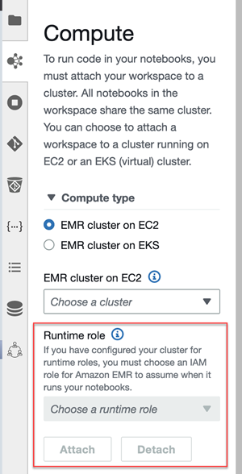

# Run an EMR Studio Workspace with a runtime

role

###### Note

The runtime role functionality described on this page only applies to Amazon EMR running on
Amazon EC2, and doesn't refer to the runtime role functionality in EMR Serverless interactive
applications. To learn more about how to use runtime roles in EMR Serverless, see [Job runtime
roles](../EMR-Serverless-UserGuide/security-iam-runtime-role.md "../EMR-Serverless-UserGuide/security-iam-runtime-role.md") in the _Amazon EMR Serverless User Guide_.

A _runtime role_ is an AWS Identity and Access Management (IAM) role that you can specify when
you submit a job or query to an Amazon EMR cluster. The job or query that you submit to your
EMR cluster uses the runtime role to access AWS resources, such as objects in Amazon S3.

When you attach an EMR Studio Workspace to an EMR cluster that uses Amazon EMR
6.11 or higher, you can select a runtime role for the job or query that you submit to use when
it accesses AWS resources. However, if the EMR cluster doesn't support runtime roles, the
EMR cluster won't assume the role when it accesses AWS resources.

Before you can use a runtime role with an Amazon EMR Studio Workspace, an administrator must
configure user permissions so that the Studio user can call the
`elasticmapreduce:GetClusterSessionCredentials` API on the runtime role. Then,
launch a new cluster with a runtime role that you can use with your Amazon EMR Studio
Workspace.

###### On this page

- [Configure user permissions for the
  runtime role](#emr-studio-runtime-setup-permissions "#emr-studio-runtime-setup-permissions")
- [Launch a new cluster with a runtime
  role](#emr-studio-runtime-setup-cluster "#emr-studio-runtime-setup-cluster")
- [Use the EMR cluster with a runtime role in
  Workspaces](#emr-studio-runtime-use "#emr-studio-runtime-use")
- [Considerations](#emr-studio-runtime-considerations "#emr-studio-runtime-considerations")

## Configure user permissions for the

runtime role

Configure user permissions so that the Studio user can call the
`elasticmapreduce:GetClusterSessionCredentials` API on the runtime role that
the user wants to use. You must also configure [Configure EMR Studio user permissions for
Amazon EC2 or Amazon EKS](emr-studio-user-permissions.md "emr-studio-user-permissions.md")
before the user can start using Studio.

###### Warning

To grant this permission, create a condition based on the
`elasticmapreduce:ExecutionRoleArn` context key when you grant a caller
access to call the `GetClusterSessionCredentials` APIs. The following examples
demonstrate how to do so.

```
{
      "Sid": "AllowSpecificExecRoleArn",
      "Effect": "Allow",
      "Action": [
          "elasticmapreduce:GetClusterSessionCredentials"
      ],
      "Resource": "*",
      "Condition": {
          "StringEquals": {
              "elasticmapreduce:ExecutionRoleArn": [
                  "arn:aws:iam::111122223333:role/test-emr-demo1",
                  "arn:aws:iam::111122223333:role/test-emr-demo2"
              ]
          }
      }
  }
```

The following example demonstrates how to allow an IAM principal to use an IAM role
named `test-emr-demo3` as the runtime role. Additionally, the policy holder will
only be able to access Amazon EMR clusters with the cluster ID
`j-123456789`.

```
{
    "Sid":"AllowSpecificExecRoleArn",
    "Effect":"Allow",
    "Action":[
        "elasticmapreduce:GetClusterSessionCredentials"
    ],
    "Resource": [
          "arn:aws:elasticmapreduce:<region>:111122223333:cluster/j-123456789"
     ],
    "Condition":{
        "StringEquals":{
            "elasticmapreduce:ExecutionRoleArn":[
                "arn:aws:iam::111122223333:role/test-emr-demo3"
            ]
        }
    }
}
```

The following example lets an IAM principal use any IAM role with a name starting
with the string `test-emr-demo4` as the runtime role. Additionally, the policy
holder will only be able to access Amazon EMR clusters tagged with the key-value pair
`tagKey: tagValue`.

```
{
    "Sid":"AllowSpecificExecRoleArn",
    "Effect":"Allow",
    "Action":[
        "elasticmapreduce:GetClusterSessionCredentials"
    ],
    "Resource": "*",
    "Condition":{
        "StringEquals":{
             "elasticmapreduce:ResourceTag/tagKey": "tagValue"
        },
        "StringLike":{
            "elasticmapreduce:ExecutionRoleArn":[
                "arn:aws:iam::111122223333:role/test-emr-demo4*"
            ]
        }
    }
}
```

## Launch a new cluster with a runtime

role

Now that you have the required permissions, launch a new cluster with a runtime role
that you can use with your Amazon EMR Studio Workspace.

If you have already launched a new cluster with a runtime role, you can skip to the
[Use the EMR cluster with a runtime role in
Workspaces](#emr-studio-runtime-use "#emr-studio-runtime-use") section.

1. First, complete the prerequisites in the [Runtime roles for Amazon EMR steps](emr-steps-runtime-roles.md#emr-steps-runtime-roles-configure "emr-steps-runtime-roles.md#emr-steps-runtime-roles-configure")
   section.
2. Then, launch a cluster with the following settings to use runtime roles with
   Amazon EMR Studio Workspaces. For instructions on how to launch your cluster, see
   [Specify a security configuration
   for an Amazon EMR cluster](emr-specify-security-configuration.md "emr-specify-security-configuration.md").
   - Choose release label emr-6.11.0 or later.
   - Select Spark, Livy, and Jupyter Enterprise Gateway as your cluster
     applications.
   - Use the security configuration that you created in the previous step.
   - Optionally, you can enable Lake Formation for your EMR cluster. For more information,
     see [Enable Lake Formation with Amazon EMR](emr-lf-enable.md "emr-lf-enable.md").

After you launch your cluster, you're ready to [use the runtime role-enabled cluster with an EMR Studio
Workspace](#emr-studio-runtime-use "#emr-studio-runtime-use").

###### Note

The [ExecutionRoleArn](../APIReference/API_ExecutionEngineConfig.md#EMR-Type-ExecutionEngineConfig-ExecutionRoleArn "../APIReference/API_ExecutionEngineConfig.md#EMR-Type-ExecutionEngineConfig-ExecutionRoleArn")
value is currently not supported with the [StartNotebookExecution](../APIReference/API_StartNotebookExecution.md "../APIReference/API_StartNotebookExecution.md") API operation when the
`ExecutionEngineConfig.Type` value is `EMR`.

## Use the EMR cluster with a runtime role in

Workspaces

Once you have set up and launched your cluster, you can use the runtime role-enabled
cluster with your EMR Studio Workspace.

1. Create a new workspace or launch an existing workspace. For more information, see
   [Create an EMR Studio
   Workspace](emr-studio-create-workspace.md "emr-studio-create-workspace.md").
2. Choose the **EMR clusters** tab in the left sidebar of your open
   Workspace, expand the **Compute type** section, and choose
   your cluster from the **EMR cluster on EC2** menu, and the runtime role
   from the **Runtime role** menu.

 3. Choose **Attach** to attach the cluster with runtime role to your
Workspace.

###### Note

When you choose a runtime role, note that it can have underlying managed policies associated with it. In most cases we recommend choosing limited resources, such as specific
notebooks. If you choose a runtime role that includes access for all of your notebooks, for instance, the managed policy associated with the role provides full access.

## Considerations

Keep in mind the following considerations when you use a runtime role-enabled cluster
with your Amazon EMR Studio Workspace:

- You can only select a runtime role when you attach an EMR Studio
  Workspace to an EMR cluster that uses Amazon EMR release 6.11 or higher.
- The runtime role functionality described on this page is only supported with Amazon EMR
  running on Amazon EC2, and isn't supported with EMR Serverless interactive applications. To
  learn more about runtime roles for EMR Serverless, see [Job runtime
  roles](../EMR-Serverless-UserGuide/security-iam-runtime-role.md "../EMR-Serverless-UserGuide/security-iam-runtime-role.md") in the _Amazon EMR Serverless User Guide_.
- Although you need to configure additional permissions before you can specify a
  runtime role when submitting a job to a cluster, you don't need additional permissions
  to access the files generated by an EMR Studio Workspace. The permissions
  for such files are the same as files generated from clusters without runtime
  roles.
- You can't use SQL Explorer in an EMR Studio Workspace with a cluster
  that has a runtime role. Amazon EMR disables SQL Explorer in the UI when a Workspace is
  attached to a runtime role-enabled EMR cluster.
- You can't use collaboration mode in an EMR Studio Workspace with a
  cluster that has a runtime role. Amazon EMR disables Workspace collaboration capabilities
  when a Workspace is attached to a runtime role-enabled EMR cluster. The Workspace will
  remain accessible only to the user who attached the Workspace.
- You can't use runtime roles in a Studio with IAM Identity Center trusted identity propagation enabled.
- You might encounter a warning **"Page may not be safe!"** from
  Spark UI for a runtime role-enabled cluster that uses Amazon EMR release 7.4.0 and lower. If this happens, bypass the alert to
  continue to see the Spark UI.
