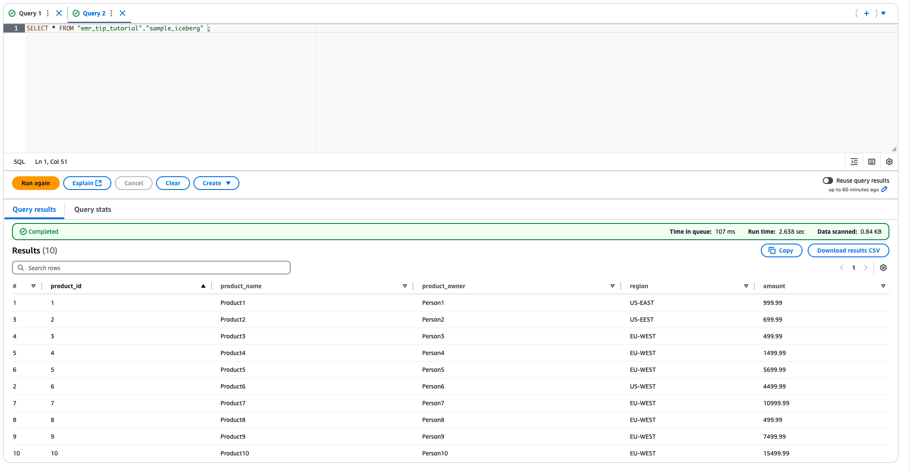
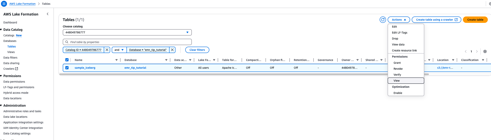
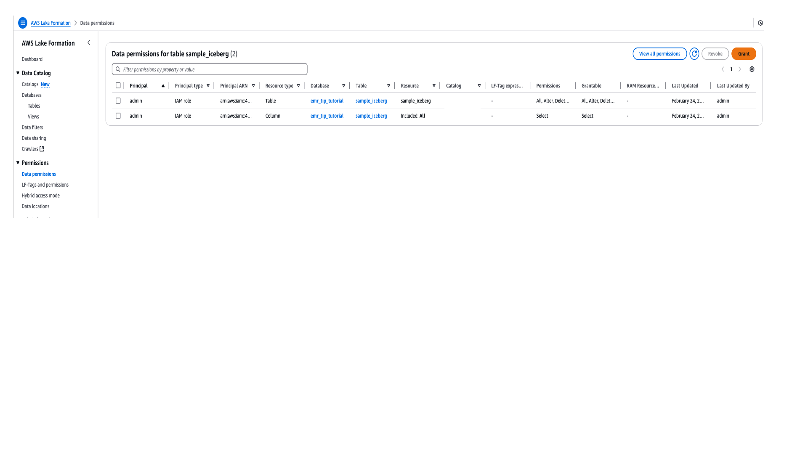
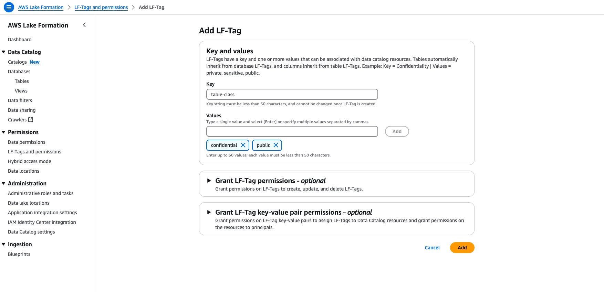
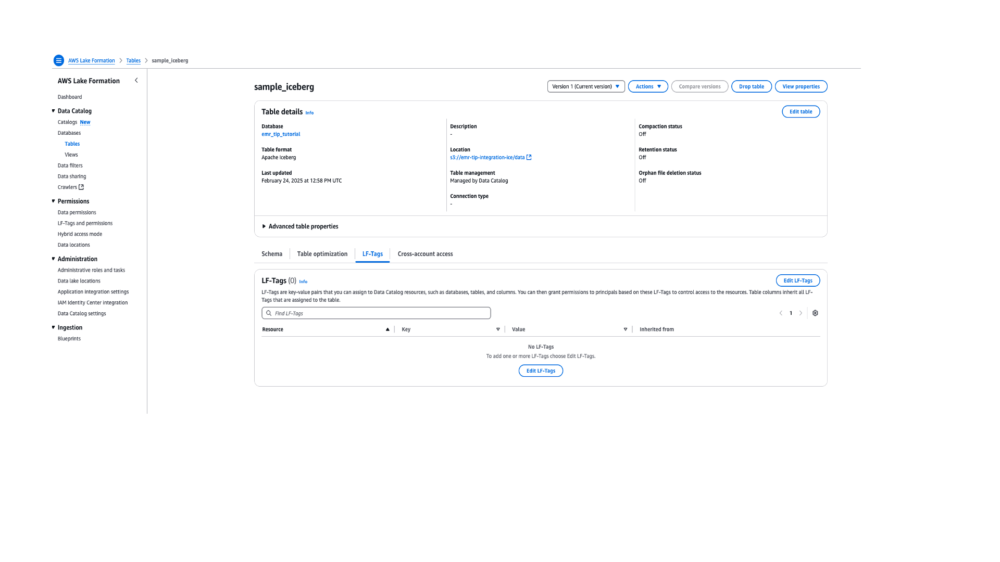
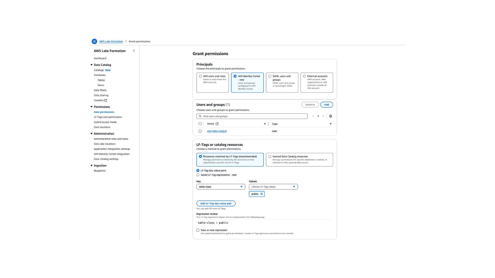

# Using Identity based federation with Iceberg tables

## Overview

This tutorial demonstrates how to use trusted-identity with an EMR on EC2 cluster to propagate user identities to AWS Lake Formation for data-access authorization
for Iceberg tables. The IDC user will use EMR-Studio to run analysis on the table. We will see permission management using Named Data Catalog Resource as well with Tag Based
permission. In this tutorial we grant access to the Iceberg table to the IAM Identity Center user _aws-dataengineer_ using Named Catalog method and IDC
user _aws-datanalyst_ using the LF-Tag based method.

### Prerequisites

Follow the prerequisites section to create and integrated trusted identity enabled EMR Security configuration, integrate EMR studio and Lake Formation with Identity center and
trusted identity propagation.

### Setup EMR cluster with trusted identity propagation and Iceberg enabled

1. **Create EMR Cluster with Iceberg and trusted-identity propagation Security configuration** – Create EMR cluster with the below sample command. Replace the `corresponding values` based
   on your configurations. Refer to the Prerequisites to create the IAM roles and security configurations:

```
 aws emr create-cluster \
 --name "EMRWithTIP-Iceberg-NoS3AG" \
 --log-uri "`S3 log location example s3://aws-logs-xxxxxxx-us-east-1/logs`" \
 --release-label "emr-7.7.0" \
 --service-role "`EMR service role example - arn:aws:iam::12345678934:role/tipblogupdated4-EMREC2ServiceRole-MCwLOR8VNJVG"` \
 --security-configuration "`Name of EMR security configuration example: TIP-EMRSecurityConfig`" \
 --ec2-attributes '{"InstanceProfile":"`EC2 Instance profile name example: AmazonEMR-InstanceProfile-20250217T165212`","EmrManagedMasterSecurityGroup":"`security group name`","EmrManagedSlaveSecurityGroup":"`security group name`","AdditionalMasterSecurityGroups":[],"AdditionalSlaveSecurityGroups":[],"SubnetId":"`Subnet-id`"}' \
 --tags 'for-use-with-amazon-emr-managed-policies=true' \
 --applications Name=Hadoop Name=JupyterEnterpriseGateway Name=Livy Name=Spark \
 --configurations '[{"Classification":"iceberg-defaults","Properties":{"iceberg.enabled":"true"}},{"Classification":"spark-hive-site","Properties":{"hive.metastore.client.factory.class":"com.amazonaws.glue.catalog.metastore.AWSGlueDataCatalogHiveClientFactory"}}]' \
 --instance-groups '[{"InstanceCount":1,"InstanceGroupType":"MASTER","Name":"cfnMaster","InstanceType":"m5.2xlarge","EbsConfiguration":{"EbsBlockDeviceConfigs":[{"VolumeSpecification":{"VolumeType":"gp2","SizeInGB":32},"VolumesPerInstance":4}]}},{"InstanceCount":1,"InstanceGroupType":"CORE","Name":"cfnCore","InstanceType":"m5.2xlarge","EbsConfiguration":{"EbsBlockDeviceConfigs":[{"VolumeSpecification":{"VolumeType":"gp2","SizeInGB":32},"VolumesPerInstance":4}]}}]' \
 --scale-down-behavior "TERMINATE_AT_TASK_COMPLETION" \
 --auto-termination-policy '{"IdleTimeout":3600}' \
 --region "`Region example: us-east-1`"
```

```
aws emr create-cluster \
 --name "EMRWithTIP-Iceberg-NoS3AG" \
 --log-uri "s3://tip-blog-s3-emrtorage-workspace-temp/logs/emr-ec2" \
 --release-label "emr-7.7.0" \
 --service-role "arn:aws:iam::012345678910:role/tipblogupdated4-EMREC2ServiceRole-MCwLOR8VNJVG" \
 --security-configuration "TIP-EMRSecurityConfig" \
 --kerberos-attributes '{"Realm":"EC2.INTERNAL","KdcAdminPassword":"","ADDomainJoinUser":""}' \
 --unhealthy-node-replacement \
 --ec2-attributes '{"InstanceProfile":"tipblogupdated4-EMREC2InstanceRole-jZ9gwbZLBbKI","EmrManagedMasterSecurityGroup":"sg-0936c4e24010174b1","EmrManagedSlaveSecurityGroup":"sg-0c2f72078082a66dc","AdditionalMasterSecurityGroups":[],"AdditionalSlaveSecurityGroups":[],"ServiceAccessSecurityGroup":"sg-0fca96c7fe95e1a06","SubnetId":"subnet-085a5092061044f77"}' \
 --tags 'for-use-with-amazon-emr-managed-policies=true' \
 --applications Name=Hadoop Name=JupyterEnterpriseGateway Name=Livy Name=Spark \
 --configurations '[{"Classification":"iceberg-defaults","Properties":{"iceberg.enabled":"true"}}]' \
 --instance-groups '[{"InstanceCount":1,"InstanceGroupType":"MASTER","Name":"cfnMaster","InstanceType":"m5.2xlarge","EbsConfiguration":{"EbsBlockDeviceConfigs":[{"VolumeSpecification":{"VolumeType":"gp2","SizeInGB":32},"VolumesPerInstance":4}]}},{"InstanceCount":1,"InstanceGroupType":"CORE","Name":"cfnCore","InstanceType":"m5.2xlarge","EbsConfiguration":{"EbsBlockDeviceConfigs":[{"VolumeSpecification":{"VolumeType":"gp2","SizeInGB":32},"VolumesPerInstance":4}]}}]' \
 --scale-down-behavior "TERMINATE_AT_TASK_COMPLETION" \
 --auto-termination-policy '{"IdleTimeout":7200}' \
 --region "us-east-1"
```

In your EMR console, you should be able to see the below screenshots after the cluster is created. 2. **Sample Iceberg table (Optional):** Create a sample Iceberg table with the below command. Ignore if you already
have an existing Iceberg table.

Run the below command in Amazon Athena to create a sample Iceberg table. Replace _your S3 bucket_ with the S3BucketLocation from the **Outputs** tab of
your CloudFormation stack.

```
CREATE TABLE emr_tip_tutorial.sample_iceberg (
    product_id int,
    product_name string,
    product_owner string,
    region string,
    amount double
)
PARTITIONED BY (region)
LOCATION 's3://tip-blog-s3-lf-`account_id`/iceberg/'
TBLPROPERTIES (
    'table_type' = 'ICEBERG'
);
```

Insert data with below sample queries:

```
INSERT INTO emr_tip_tutorial.sample_iceberg
VALUES
(1, 'Product1', 'Person1', 'US-EAST', 999.99),
(2, 'Product2', 'Person2', 'US-EEST', 699.99),
(3, 'Product3', 'Person3', 'EU-WEST', 499.99),
(4, 'Product4', 'Person4', 'EU-WEST', 1499.99),
(5, 'Product5', 'Person5', 'EU-WEST', 5699.99),
(6, 'Product6', 'Person6', 'US-WEST', 4499.99),
(7, 'Product7', 'Person7', 'EU-WEST', 10999.99),
(8, 'Product8', 'Person8', 'EU-WEST', 499.99),
(9, 'Product9', 'Person9', 'EU-WEST', 7499.99),
(10, 'Product10', 'Person10', 'EU-WEST', 15499.99)
```

Sample data in the table:



SELECT query 3. **Grant LakeFormation permission to IDC user (Named Data Catalog Resource)** – Current permissions: No access to IDC
user _aws-dataengineer_.



LF permissions

Grant permissions: Follow below steps to grant the permissions.



LF tags and permissions 4. **Grant LakeFormation permission to IDC user (using LF-Tags)** – Before doing this, add tags to the table created above. We do this step manually from the console for
demo purposes and you can also use automations/CLI to do this.

Create a LF-Tag names table-class with values as **confidential**, **public**.



Add LF.

In the table **sample\_iceberg** created earlier, assign the tag.



Adding a table

In LakeFormation **Data permissions** tab, click **Grant** and proceed to grant permissions on the LF-Tag to _aws-datanalyst_ IDC user. We grant the
tag value as Public to this user. As the table is tagged **“confidential”** as shown in the previous step, this table should
not be accessible to the user.



Data permissions for LF

### Query Iceberg tables from EMR cluster with trusted-identity propagation and Delta Lake enabled

1. Login to EMR Studio with the IDC user you granted permissions to in the
   above steps.
2. Navigate to **Workspaces** and create a workspace in EMR Studio. Now click that
   workspace to open it.
3. Attach the workspace to EMR on EC2 cluster created for Iceberg in above step.
4. Upload the notebook Iceberg.ipynb, to configure the Spark session for Iceberg and
   query the table.
