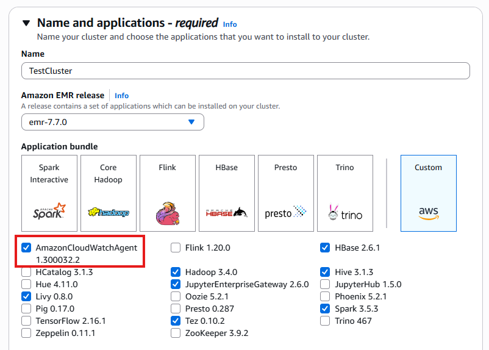
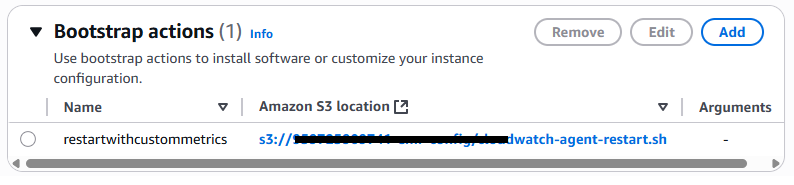
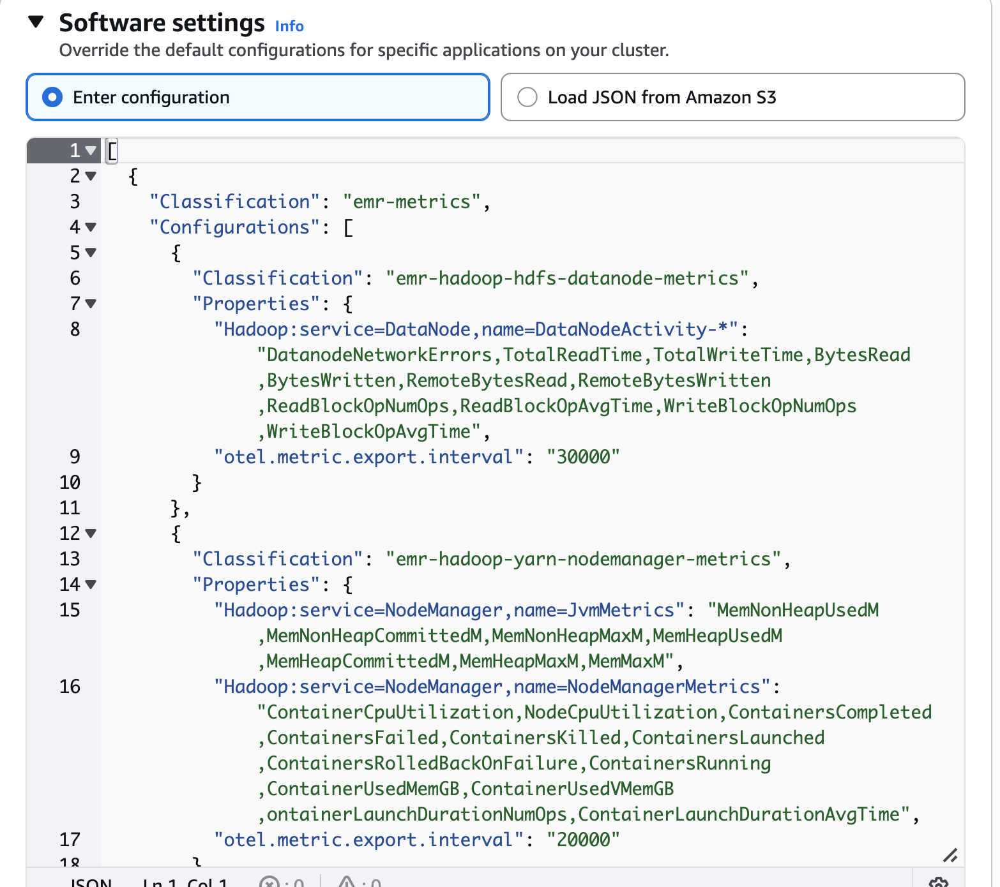
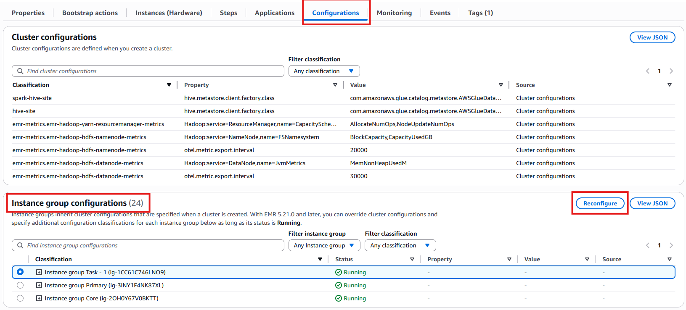
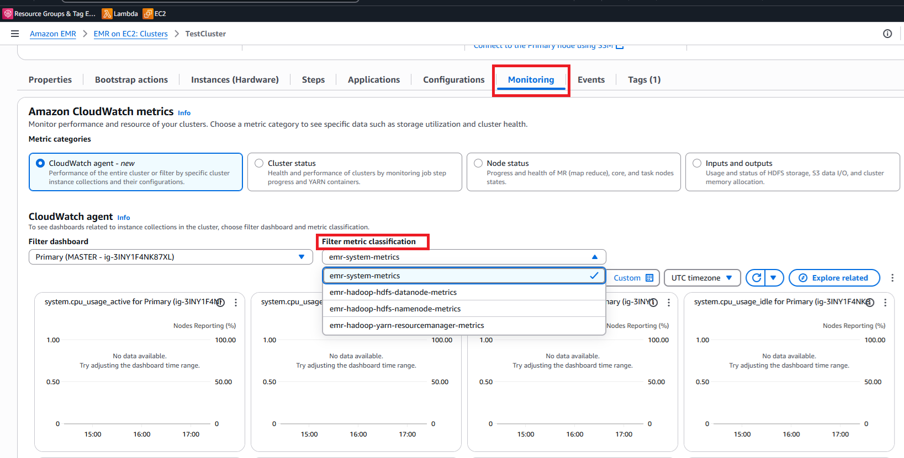

# Amazon EMR on EC2 – Enhanced Monitoring with CloudWatch using custom metrics and logs

## Overview

Amazon EMR provides powerful, cost-effective big data processing capabilities. To maximize performance and resource utilization, effective
monitoring is essential. Amazon CloudWatch offers comprehensive observability for EMR clusters, enabling you to track metrics and logs in real-time. This document
outlines how to:

1. Configure the CloudWatch agent to send EMR on EC2 logs to CloudWatch
2. Add custom Hadoop, YARN, and HBase metrics through classifications
3. Monitor metrics through built-in dashboards
4. Track cluster logs via CloudWatch log groups

## Prerequisites and Background

By default, Amazon EMR sends basic metrics to CloudWatch every five minutes at no additional cost. With EMR Release 7.0+, you can deploy the CloudWatch Agent to:

- Collect 34 additional detailed metrics at one-minute intervals (additional charges apply)
- Gather metrics from all cluster nodes
- Aggregate data on the primary node before sending to CloudWatch
- Access metrics through the EMR console's Monitoring tab or CloudWatch Console

EMR 7.1 extends these capabilities, allowing you to configure the agent to capture specialized metrics from Hadoop, YARN, and HBase components. For
environments using Prometheus, metrics can be forwarded to Amazon Managed Service for Prometheus.

## CloudWatch Agent Configuration for Logs

To capture EMR logs in CloudWatch, create a _cloudwatch-config.json_ file that defines which log files to collect:

**cloudwatch-config.json**

```
{
  "logs": {
    "logs_collected": {
      "files": {
        "collect_list": [
          {
            "file_path": "/mnt/var/log/hadoop-yarn/hadoop-yarn-resourcemanager-*",
            "log_group_name": "/emr/yarn/resourcemnger",
            "log_stream_name": "{instance_id}",
            "publish_multi_logs" : true
          },
          {
            "file_path": "/var/log/hadoop-hdfs/hadoop-hdfs-namenode-*",
            "log_group_name": "/emr/hdfs/namenode",
            "log_stream_name": "{instance_id}",
            "publish_multi_logs" : true
          }
        ]
      }
    }
}
```

## Bootstrap Script for CloudWatch Agent Configuration

To apply your custom CloudWatch configuration to EMR nodes, create a bootstrap script that will restart the CloudWatch agent with your settings. This script
ensures the agent runs with your specific log collection parameters after cluster provisioning.

### Creating the Bootstrap Script

Create a file named _cloudwatch-agent-bootstrap.sh_ with the following content:

```
#!/bin/bash
set -xe

EMR_SECONDARY_BA_SCRIPT=$(cat <<'EOF'
while true; do
NODEPROVISIONSTATE=$(sed -n '/localInstance [{]/,/[}]/ {/nodeProvisionCheckinRecord [{]/,/[}]/ {/status:/ p}}' /emr/instance-controller/lib/info/job-flow-state.txt | awk '{ print $2 }')

if [ "$NODEPROVISIONSTATE" == "SUCCESSFUL" ]; then
sleep 10
echo "Running my post provision bootstrap"
NODETYPE=$(cat /mnt/var/lib/instance-controller/extraInstanceData.json | jq -r '.instanceRole' | awk '{print tolower($0)}')

# Copy config file on the instance
sudo aws s3 cp s3://`amzn-s3-demo-bucket1`/cloudwatch-config.json /opt/aws/amazon-cloudwatch-agent/etc/stdout_log_config.json

# Start the agent with the created config file
sudo /opt/aws/amazon-cloudwatch-agent/bin/amazon-cloudwatch-agent-ctl -m ec2 -a append-config -c file:/opt/aws/amazon-cloudwatch-agent/etc/stdout_log_config.json

# Restart CW Agent
sudo systemctl restart amazon-cloudwatch-agent

# Status CW Agent
echo "Status CW Agent"
sudo /usr/bin/amazon-cloudwatch-agent-ctl -m ec2 -a status

exit
fi

sleep 10
done
EOF
)

echo "${EMR_SECONDARY_BA_SCRIPT}" | tee -a /tmp/emr-secondary-ba.sh
chmod u+x /tmp/emr-secondary-ba.sh
/tmp/emr-secondary-ba.sh > /tmp/emr-secondary-ba.log 2>&1 &
exit 0
```

Replace the sample bucket with your bucket name.

### Important Configuration Note

###### Important

Before uploading the script, replace `<amzn-s3-demo-bucket1>` with the actual name of your S3 bucket where you stored the _cloudwatch-config.json_ file from the previous step. This ensures the bootstrap script can retrieve your configuration file during cluster initialization.

This bootstrap script will:

- Wait for node provisioning to complete
- Download your custom CloudWatch configuration
- Stop any running CloudWatch agent
- Restart the agent with your specific configuration
- Log the agent's status for troubleshooting

## Custom Metric Classifications for Hadoop, YARN, and HBase

In addition to the default CloudWatch metrics, you can enhance your monitoring capabilities by configuring custom application-specific metrics
for your EMR cluster components. Amazon EMR's configuration API provides a flexible way to define exactly which metrics you want to collect.

### Configuring Custom Metrics

You can implement custom metric collection in two ways:

- During cluster creation for new clusters
- As a reconfiguration for existing clusters through the EMR console

### Creating a Classification File

The classification file defines which specific component metrics should be collected from your cluster. Below is a sample structure for collecting custom Hadoop metrics:

```
[
  {
    "Classification": "emr-metrics",
    "Configurations": [
      {
        "Classification": "emr-hadoop-hdfs-datanode-metrics",
        "Properties": {
          "Hadoop:service=DataNode,name=DataNodeActivity-*": "DatanodeNetworkErrors,TotalReadTime,TotalWriteTime,BytesRead,BytesWritten,RemoteBytesRead,RemoteBytesWritten,ReadBlockOpNumOps,ReadBlockOpAvgTime,WriteBlockOpNumOps,WriteBlockOpAvgTime",
          "otel.metric.export.interval": "30000"
        }
      },
      {
        "Classification": "emr-hadoop-yarn-nodemanager-metrics",
        "Properties": {
          "Hadoop:service=NodeManager,name=JvmMetrics": "MemNonHeapUsedM,MemNonHeapCommittedM,MemNonHeapMaxM,MemHeapUsedM,MemHeapCommittedM,MemHeapMaxM,MemMaxM",
          "Hadoop:service=NodeManager,name=NodeManagerMetrics": "ContainerCpuUtilization,NodeCpuUtilization,ContainersCompleted,ContainersFailed,ContainersKilled,ContainersLaunched,ContainersRolledBackOnFailure,ContainersRunning,ContainerUsedMemGB,ContainerUsedVMemGB,ContainerLaunchDurationNumOps,ContainerLaunchDurationAvgTime",
          "otel.metric.export.interval": "20000"
        }
      }
    ],
    "Properties": {}
  }
]
```

### Implementation Steps

1. Create a JSON file with your desired metric classifications.
2. Customize the metrics based on your monitoring requirements.
3. Save the file and upload it to your S3 bucket.
4. Reference this file when creating a new cluster or reconfiguring an existing one.

### Best Practices

- Only collect metrics that provide meaningful insights for your workloads.
- Consider the metrics collection interval based on your monitoring needs.
- Review AWS documentation for the complete list of available metrics for each component.
- Group related metrics within the same classification for better organization.

This approach allows you to focus your monitoring on the most critical metrics for your specific EMR applications, giving you deeper visibility into cluster performance.

## Deploying an EMR Cluster with CloudWatch Integration

Follow these steps to create an Amazon EMR cluster that automatically sends logs and custom metrics to CloudWatch:

### Step 1: Enable the CloudWatch Agent

When creating your EMR cluster through the AWS Management Console:

1. Navigate to the **Applications** section during cluster creation.
2. Select the checkboxes for your primary applications (Hadoop, Spark, etc.).
3. Scroll to find and select the **Amazon CloudWatch Agent** option.
4. This enables the agent on your cluster, which is essential for collecting enhanced metrics and logs.

The CloudWatch Agent will be installed on all nodes in your cluster, allowing it to gather system and application metrics at
the configured intervals.

### Name and applications



Creating a cluster and showing the available bundles.

###### Note

The CloudWatch Agent is available in EMR release 7.0 and later. Enabling this component is required for the custom metric collection and log
forwarding described in this guide.

### Step 2: Add the Bootstrap Action for Log Collection

To configure the CloudWatch agent to collect and forward specific log files to CloudWatch:

1. In the EMR cluster creation wizard, navigate to the **Bootstrap Actions** section
2. Click **Add bootstrap action**
3. Select **Custom action** from the dropdown menu
4. Provide a name for your bootstrap action (e.g., **Configure CloudWatch Agent**)
5. In the **Script location** field, enter the S3 path to your cloudwatch-agent-bootstrap.sh script (e.g., s3://your-bucket-name/cloudwatch-agent-bootstrap.sh)
6. Click **Add** to save the bootstrap action

This bootstrap action will execute during cluster startup, ensuring that the CloudWatchagent is properly configured with your custom settings to collect and forward the
log files specified in your configuration file.

The agent will automatically begin collecting logs once the nodes are provisioned, providing near real-time visibility into your
cluster operations through CloudWatch Logs.

### Bootstrap actions



Using bootstrap actions.

### Step 3: Configure Custom Metrics Collection

To enable the collection of custom Hadoop, YARN, or HBase metrics beyond the default set:

1. In the EMR cluster creation wizard, navigate to the **Configurations** section.
2. Click the **Edit configurations** button to expand configuration options.
3. Select **Load JSON from Amazon S3** option from the configuration
   method dropdown.
4. Enter the S3 URI path to your custom metrics classification file (e.g., s3://amzn-s3-demo-bucket1/emr-metrics-classification.json).
5. Click **Load** to parse the configuration.
6. Verify that the configuration appears correctly in the console interface.
7. Click **Save changes** to apply these metric configurations to your cluster.

This step instructs the CloudWatch agent to collect the specific component metrics defined in your classification file. The metrics
will be gathered at the intervals specified in your configuration and published to CloudWatch, where they can be visualized and analyzed.

Custom metrics provide deeper insights into your cluster's performance characteristics, allowing for more precise monitoring and troubleshooting
of your EMR applications.

### Software settings



Override the default configurations.

### Updating Metrics Configuration for Running Clusters

You can modify the metrics collection settings for an existing EMR cluster without disrupting operations by following these steps:

1. Navigate to your active EMR cluster in the AWS Management Console.
2. Select the **Configurations** tab in the cluster details view.
3. Find the **Instance group configurations** section.
4. Click the **Reconfigure** button to modify settings.
5. Choose **Load JSON from Amazon S3** or directly edit the configuration.
6. Enter your updated metrics classification file location or make changes in the editor.
7. Apply the changes to update the metrics collection behavior.

This reconfiguration capability allows you to fine-tune your monitoring approach as your workload requirements evolve. The CloudWatch agent will automatically
adapt to the new configuration, collecting the updated set of metrics without requiring cluster restarts or downtime.

###### Important

Configuration changes may take several minutes to propagate across all nodes in the cluster. Continue monitoring your CloudWatch dashboards
to confirm the new metrics appear as expected.

### Cluster configurations



Instance group configurations.

## Validating your CloudWatch integration

After completing the configuration steps, it's time to verify that your monitoring setup is working correctly:

### Step 1: Deploy Your EMR Cluster

1. Review all configuration settings for accuracy.
2. Ensure bootstrap actions and classification files are correctly referenced.
3. Click **Create cluster** to launch your EMR environment.
4. Wait for the cluster to reach the **Running** state (typically 5-15 minutes).

### Step 2: Execute Test Applications

Submit several test Spark applications to generate meaningful metrics:

- Run a simple Spark job that processes sample data.
- Execute a longer-running analytics task to observe resource utilization.
- Test different application configurations to compare performance metrics.

After your applications complete (or while they're running):

- Navigate to the CloudWatch console.
- Check your configured log groups for application logs.
- Examine the metrics dashboards to observe CPU, memory, and application-specific metrics.
- Verify that custom metrics defined in your classification file appear in CloudWatch.

This validation process confirms that your CloudWatch integration is properly capturing both logs and metrics, providing you with
comprehensive visibility into your EMR cluster's performance and application behavior.

## Accessing EMR Logs in CloudWatch Log Groups

After your EMR cluster is running and the CloudWatch agent is properly configured, your application and system logs will be
available in CloudWatch Logs. Follow these steps to access and analyze them:

### Viewing Your Log Groups

1. Navigate to the CloudWatch console in AWS Management Console.
2. Select **Log groups** from the left navigation pane.
3. Look for the log groups created by your configuration, such as:
   - /emr/yarn/resourcemnger for YARN ResourceManager logs.
   - /emr/hdfs/namenode for HDFS NameNode logs.
   - Any additional log groups specified in your configuration file.

Each log group contains log streams organized by instance ID, allowing you to trace logs to specific nodes in your cluster.

### Working with Log Data

- _Search Log Data:_ Use CloudWatch Logs Insights to perform structured queries across your log groups.
- _Create Metrics:_ Extract metrics from log patterns to create custom CloudWatch metrics.
- _Set Alerts:_ Configure alarms based on specific error patterns or log frequencies.
- _Export Logs:_ Download logs for offline analysis or archiving.

### Log Retention

###### Note

By default, logs are retained for 30 days. You can modify the retention policy for each log group to keep logs for longer periods
if needed for compliance or analysis purposes.

CloudWatch Logs provides a centralized location for all your EMR log data, eliminating the need to SSH into individual cluster
nodes to troubleshoot issues or analyze application behavior.

## Viewing Custom Metrics in the EMR Monitoring Dashboard

After your EMR cluster is running with the CloudWatch agent and custom metrics configuration, you can easily monitor these metrics directly in the EMR console:

### Accessing Your Custom Metrics

1. Navigate to your EMR cluster in the AWS Management Console.
2. Select the **Monitoring** tab in the cluster details page.
3. Locate the **Filter metric classification** dropdown near the top of the monitoring dashboards.
4. Use this filter to select specific metric categories:
   - Choose **HDFS** to view NameNode and DataNode metrics.
   - Select **YARN** to see ResourceManager and container metrics.
   - Pick **HBase** for HBase-specific performance data.
   - Select custom metric classifications you defined.

The dashboard will dynamically update to display graphs for your selected metrics, showing performance trends over time.

### Working with Metric Visualizations

- _Adjust time ranges:_ Change the time window to view recent activity or historical trends.
- _Compare metrics:_ Display multiple related metrics side-by-side for correlation analysis.
- _Zoom features:_ Focus on specific time periods where anomalies or patterns appear.
- _Refresh data:_ Update visualizations with the latest metrics data in near real-time.

This integrated monitoring approach allows you to track both standard EMR metrics and your custom metrics in a unified dashboard,
making it easier to identify performance issues, resource constraints, or application bottlenecks without leaving the EMR console.

### CloudWatch metrics



Filtering metrics classification.
