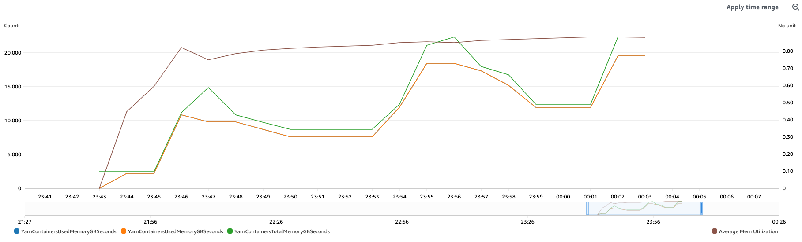

# Advanced Scaling for Amazon EMR

Starting with Amazon EMR on EC2 version 7.0, you can leverage Advanced
Scaling to control your cluster's resource utilization. Advanced Scaling introduces a utilization-performance scale for tuning your
resource utilization and performance level according to your business needs. The value you set determines whether your cluster is weighted more to resource conservation or to
scaling up to handle service-level-agreement (SLA) sensitive workloads, where quick completion is critical. When the scaling value
is adjusted, managed scaling interprets
your intent and intelligently scales to optimize resources. For more information about managed scaling,
see [Configure managed scaling for Amazon EMR](managed-scaling-configure.md "managed-scaling-configure.md").

## Advanced Scaling settings

The value your set for Advanced Scaling optimizes your cluster to your requirements. Values range from **1**-**100**. Possible values are **1**,
**25**, **50**, **75** and
**100**. If you set the index to values other than these, it results in a validation error.

Scaling values map to resource-utilization strategies. The following list defines several of these:

- **Utilization optimized [1]** – This setting prevents resource over provisioning. Use a low value
  when you want to keep costs low and to prioritize efficient
  resource utilization. It causes the cluster to scale up less aggressively. This works well for the use case when there are regularly occurring workload
  spikes and you don't want resources to ramp up too quickly.
- **Balanced [50]** – This balances resource utilization and job performance. This setting is suitable
  for steady workloads where most stages have a stable runtime. It's also suitable for workloads with a mix of short and long-running stages. We
  recommend starting with this setting if you aren't sure which to choose.
- **Performance optimized [100]** – This strategy prioritizes performance. The cluster scales up aggressively
  to ensure that jobs complete quickly and meet performance targets. Performance optimized is suitable for service-level-agreement (SLA) sensitive workloads
  where fast run time is critical.

###### Note

The intermediate values available provide a middle ground between strategies in order to fine tune your cluster's Advanced
Scaling behavior.

## Benefits of Advanced Scaling

As you have variability in your environment and requirements, such as changing data volumes, cost-target adjustments, and SLA implementations,
cluster scaling can help you adjust your cluster configuration to achieve your objectives. Key benefits include:

- **Enhanced granular control** – The introduction of the utilization-performance setting allows you to easily adjust your
  cluster's scaling behavior according to your requirements. You can scale up to meet demand for compute resources or scale down to save resources, based on your use patterns.
- **Improved cost optimization** – You can choose a low utilization value as requirements dictate to more easily
  meet your cost objectives.

## Getting started with optimization

**Setup and configuration**

Use these steps to set the performance index and optimize your scaling strategy.

1. The following command updates an existing cluster with the utilization-optimized `[1]` scaling strategy:

```
aws emr put-managed-scaling-policy --cluster-id '`cluster-id`' \
 --managed-scaling-policy '{
  "ComputeLimits": {
    "UnitType": "Instances",
    "MinimumCapacityUnits": 1,
    "MaximumCapacityUnits": 2,
    "MaximumOnDemandCapacityUnits": 2,
    "MaximumCoreCapacityUnits": 2
  },
  "ScalingStrategy": "ADVANCED",
  "UtilizationPerformanceIndex": "1"
}' \
 --region "`region-name`"
```

The attributes `ScalingStrategy` and `UtilizationPerformanceIndex` are new and relevant to scaling optimization. You can select different
scaling strategies by setting corresponding values (1, 25, 50, 75, and 100) for the `UtilizationPerformanceIndex` attribute in
the managed-scaling policy. 2. To revert to the default managed-scaling strategy, run the `put-managed-scaling-policy` command without including
the `ScalingStrategy` and `UtilizationPerformanceIndex` attributes. (This is optional.) This sample shows how to do this:

```
aws emr put-managed-scaling-policy \
--cluster-id '`cluster-id`' \
--managed-scaling-policy '{"ComputeLimits":{"UnitType":"Instances","MinimumCapacityUnits":1,"MaximumCapacityUnits":2,"MaximumOnDemandCapacityUnits":2,"MaximumCoreCapacityUnits":2}}' \
--region "`region-name`"
```

**Using monitoring metrics to track cluster utilization**

Starting with EMR version 7.3.0, Amazon EMR publishes four new metrics related to memory and virtual CPU. You can use these to
measure cluster utilization across scaling strategies. These metrics are available for any use case, but you can use the details provided here for monitoring
Advanced Scaling.

Helpful metrics available include the following:

- **YarnContainersUsedMemoryGBSeconds** – Amount of memory consumed by applications managed by YARN.
- **YarnContainersTotalMemoryGBSeconds** – Total memory capacity allocated to YARN within the cluster.
- **YarnNodesUsedVCPUSeconds** – Total VCPU seconds for each application managed by YARN.
- **YarnNodesTotalVCPUSeconds** – Aggregated total VCPU seconds for memory consumed, including the
  time window when yarn is not ready.

You can analyze resource metrics using Amazon CloudWatch Logs Insights. Features include a purpose-built query language that helps you extract metrics specific to resource
use and scaling.

The following query, which you can run in the Amazon CloudWatch console, uses metric math to calculate the average memory utilization (e1) by dividing the running sum of
consumed memory (e2) by the running sum of total memory (e3):

```
{
    "metrics": [
        [ { "expression": "e2/e3", "label": "Average Mem Utilization", "id": "e1", "yAxis": "right" } ],
        [ { "expression": "RUNNING_SUM(m1)", "label": "RunningTotal-YarnContainersUsedMemoryGBSeconds", "id": "e2", "visible": false } ],
        [ { "expression": "RUNNING_SUM(m2)", "label": "RunningTotal-YarnContainersTotalMemoryGBSeconds", "id": "e3", "visible": false } ],
        [ "AWS_EMR_ManagedResize", "YarnContainersUsedMemoryGBSeconds", "ACCOUNT_ID", "793684541905", "COMPONENT", "ManagerService", "JOB_FLOW_ID", "cluster-id", { "id": "m1", "label": "YarnContainersUsedMemoryGBSeconds" } ],
        [ ".", "YarnContainersTotalMemoryGBSeconds", ".", ".", ".", ".", ".", ".", { "id": "m2", "label": "YarnContainersTotalMemoryGBSeconds" } ]
    ],
    "view": "timeSeries",
    "stacked": false,
    "region": "region",
    "period": 60,
    "stat": "Sum",
    "title": "Memory Utilization"
}
```

To query logs, you can select CloudWatch in the AWS console. For more information about writing queries for CloudWatch, see [Analyzing log data with CloudWatch Logs Insights](../../../AmazonCloudWatch/latest/logs/AnalyzingLogData.md "../../../AmazonCloudWatch/latest/logs/AnalyzingLogData.md") in the Amazon CloudWatch Logs
User Guide.

The following image shows these metrics for a sample cluster:



## Considerations and limitations

- The effectiveness of scaling strategies might vary, depending on your unique workload characteristics
  and cluster configuration. We encourage you to experiment with the scaling setting to determine an optimal index value for your use case.
- Amazon EMR Advanced Scaling is particularly well suited for batch workloads. For SQL/data-warehousing and streaming
  workloads, we recommend using the default managed-scaling strategy for optimal performance.
- Amazon EMR Advanced Scaling is not supported when Node Label Configurations are enabled in the cluster. If both Advanced Scaling and
  Node Label Configurations are enabled together in a cluster, then the scaling behavior would be as if the default managed scaling setting was enabled.
- The performance-optimized scaling strategy enables faster job execution by maintaining high compute resources for a longer period than the default
  managed-scaling strategy. This mode prioritizes quickly scaling up to meet resource demands, resulting in quicker job completion. This might result in higher costs when compared with the default strategy.
- In cases where the cluster is already optimized and fully utilized, enabling Advanced Scaling might not provide additional benefits. In some situations, enabling
  Advanced Scaling might lead to increased costs as workloads may run longer. In these cases, we recommend using the default managed-scaling strategy to
  ensure optimal resource allocation and cost efficiency.
- In the context of managed scaling, the emphasis shifts towards resource utilization over execution time as the setting is adjusted from
  performance-optimized [**100**] to utilization-optimized [**1**]. However, it is important to note that the outcomes might
  vary, based on the nature of the workload and the cluster's topology. To ensure optimal results for your use case, we strongly recommend testing the scaling
  strategies with your workloads to determine the most suitable setting.
- The **PerformanceUtilizationIndex** accepts only the following values:
  - **1**
  - **25**
  - **50**
  - **75**
  - **100**Any other values submitted result in a validation error.
