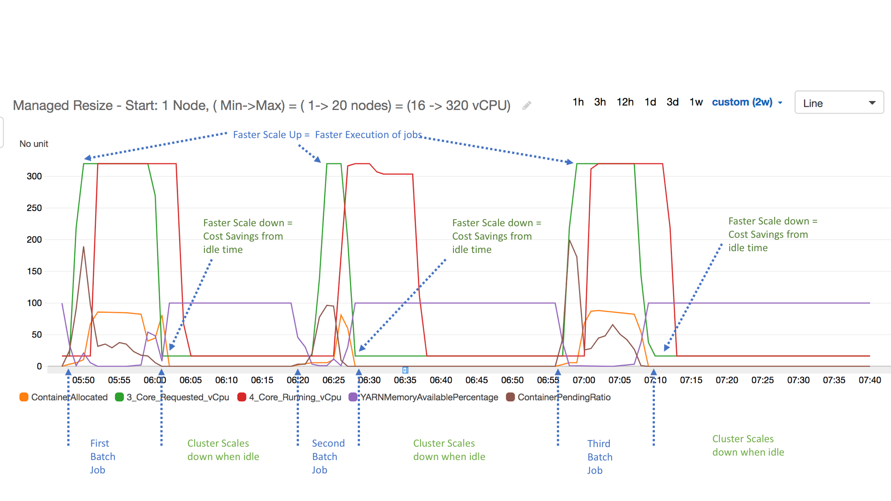
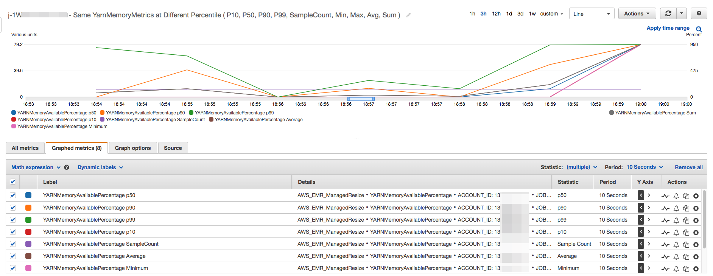

# Understanding managed scaling

metrics in Amazon EMR

Amazon EMR publishes high-resolution metrics with data at a one-minute granularity when
managed scaling is enabled for a cluster. You can view events on every resize
initiation and completion controlled by managed scaling with the Amazon EMR console or
the Amazon CloudWatch console. CloudWatch metrics are critical for Amazon EMR managed scaling to
operate. We recommend that you closely monitor CloudWatch metrics to make sure data is not
missing. For more information about how you can configure CloudWatch alarms to detect
missing metrics, see [Using
Amazon CloudWatch alarms](../../../AmazonCloudWatch/latest/monitoring/AlarmThatSendsEmail.md "../../../AmazonCloudWatch/latest/monitoring/AlarmThatSendsEmail.md"). For more information about using CloudWatch events with
Amazon EMR, see [Monitor CloudWatch
events](emr-manage-cloudwatch-events.md "emr-manage-cloudwatch-events.md").

The following metrics indicate the current or target capacities of a cluster.
These metrics are only available when managed scaling is enabled. For clusters
composed of instance fleets, the cluster capacity metrics are measured in
`Units`. For clusters composed of instance groups, the cluster
capacity metrics are measured in `Nodes` or `vCPU` based on
the unit type used in the managed scaling policy.

| Metric                                                                             | Description                                                                                                                                                                                                                                                                                                                                                                                                                                                                                                                                                                                                                                                |
| ---------------------------------------------------------------------------------- | ---------------------------------------------------------------------------------------------------------------------------------------------------------------------------------------------------------------------------------------------------------------------------------------------------------------------------------------------------------------------------------------------------------------------------------------------------------------------------------------------------------------------------------------------------------------------------------------------------------------------------------------------------------- | ---------------------------------------------------------------------------------------------------------------------------------------------------------------------------------------------------------------------------------------------------------------------------------------------------------------------------------------------------------------------------------------------------------------- | ------------------------------------------------------------------------------------------------------------------------------------------------------------------------------------------------------------------------------------------------------------------------------------------------------------------------------------------------------------------------------------------------------------------------------------------------------------------------------------------------------------------------------------------------------------------------------------------------------------------------------------------------------------------------------------------------------------------------------------------------------------------------------------------------------------------------------------------------------------------------------------------------------------------------------------------------------------------------------------------------------------------------------------------------------------------------------------------------------------------------------------------------------------------------------------------------------------------------------------------------------------------------------------------------------------------------------------------------------------------------------------------------------------------------------------------------------------------------------------------------------------------------------------------------ |
|  • `TotalUnitsRequested`  • `TotalNodesRequested`  • `TotalVCPURequested` | The target total number of units/nodes/vCPUs in a cluster as determined by managed scaling. Units: _Count_                                                                                                                                                                                                                                                                                                                                                                                                                                                                                                                                                 |
|  • `TotalUnitsRunning`  • `TotalNodesRunning`  • `TotalVCPURunning`       | The current total number of units/nodes/vCPUs available in a running cluster. When a cluster resize is requested, this metric will be updated after the new instances are added or removed from the cluster. Units: _Count_                                                                                                                                                                                                                                                                                                                                                                                                                                |
|  • `CoreUnitsRequested`  • `CoreNodesRequested`  • `CoreVCPURequested`    | The target number of CORE units/nodes/vCPUs in a cluster as determined by managed scaling. Units: _Count_                                                                                                                                                                                                                                                                                                                                                                                                                                                                                                                                                  |
|  • `CoreUnitsRunning`  • `CoreNodesRunning`  • `CoreVCPURunning`          | The current number of CORE units/nodes/vCPUs running in a cluster. Units: _Count_                                                                                                                                                                                                                                                                                                                                                                                                                                                                                                                                                                          |
|  • `TaskUnitsRequested`  • `TaskNodesRequested`  • `TaskVCPURequested`    | The target number of TASK units/nodes/vCPUs in a cluster as determined by managed scaling. Units: _Count_                                                                                                                                                                                                                                                                                                                                                                                                                                                                                                                                                  |
|  • `TaskUnitsRunning`  • `TaskNodesRunning`  • `TaskVCPURunning`          | The current number of TASK units/nodes/vCPUs running in a cluster. Units: _Count_                                                                                                                                                                                                                                                                                                                                                                                                                                                                                                                                                                          | The following metrics indicate the usage status of cluster and applications. These metrics are available for all Amazon EMR features, but are published at a higher resolution with data at a one-minute granularity when managed scaling is enabled for a cluster. You can correlate the following metrics with the cluster capacity metrics in the previous table to understand the managed scaling decisions. |
| Metric                                                                             | Description                                                                                                                                                                                                                                                                                                                                                                                                                                                                                                                                                                                                                                                |
| ---                                                                                | ---                                                                                                                                                                                                                                                                                                                                                                                                                                                                                                                                                                                                                                                        |
| `AppsCompleted`                                                                    | The number of applications submitted to YARN that have completed. Use case: Monitor cluster progress Units: _Count_                                                                                                                                                                                                                                                                                                                                                                                                                                                                                                                                        |
| `AppsPending`                                                                      | The number of applications submitted to YARN that are in a pending state. Use case: Monitor cluster progress Units: _Count_                                                                                                                                                                                                                                                                                                                                                                                                                                                                                                                                |
| `AppsRunning`                                                                      | The number of applications submitted to YARN that are running. Use case: Monitor cluster progress Units: _Count_                                                                                                                                                                                                                                                                                                                                                                                                                                                                                                                                           |
| `ContainerAllocated`                                                               | The number of resource containers allocated by the ResourceManager. Use case: Monitor cluster progress Units: _Count_                                                                                                                                                                                                                                                                                                                                                                                                                                                                                                                                      |
| `ContainerPending`                                                                 | The number of containers in the queue that have not yet been allocated. Use case: Monitor cluster progress Units: _Count_                                                                                                                                                                                                                                                                                                                                                                                                                                                                                                                                  |
| `ContainerPendingRatio`                                                            | The ratio of pending containers to containers allocated (ContainerPendingRatio = ContainerPending / ContainerAllocated). If ContainerAllocated = 0, then ContainerPendingRatio = ContainerPending. The value of ContainerPendingRatio represents a number, not a percentage. This value is useful for scaling cluster resources based on container allocation behavior. Units: _Count_                                                                                                                                                                                                                                                                     |
| `HDFSUtilization`                                                                  | The percentage of HDFS storage currently used. Use case: Analyze cluster performance Units: _Percent_                                                                                                                                                                                                                                                                                                                                                                                                                                                                                                                                                      |
| `IsIdle`                                                                           | Indicates that a cluster is no longer performing work, but is still alive and accruing charges. It is set to 1 if no tasks are running and no jobs are running, and set to 0 otherwise. This value is checked at five-minute intervals and a value of 1 indicates only that the cluster was idle when checked, not that it was idle for the entire five minutes. To avoid false positives, you should raise an alarm when this value has been 1 for more than one consecutive five-minute check. For example, you might raise an alarm on this value if it has been 1 for thirty minutes or longer. Use case: Monitor cluster performance Units: _Boolean_ |
| `MemoryAvailableMB`                                                                | The amount of memory available to be allocated. Use case: Monitor cluster progress Units: _Count_                                                                                                                                                                                                                                                                                                                                                                                                                                                                                                                                                          |
| `MRActiveNodes`                                                                    | The number of nodes presently running MapReduce tasks or jobs. Equivalent to YARN metric `mapred.resourcemanager.NoOfActiveNodes`. Use case: Monitor cluster progress Units: _Count_                                                                                                                                                                                                                                                                                                                                                                                                                                                                       |
| `YARNMemoryAvailablePercentage`                                                    | The percentage of remaining memory available to YARN (YARNMemoryAvailablePercentage = MemoryAvailableMB / MemoryTotalMB). This value is useful for scaling cluster resources based on YARN memory usage. Units: _Percent_                                                                                                                                                                                                                                                                                                                                                                                                                                  | The following metrics provide information about resources used by YARN containers and nodes. These metrics from the YARN resource manager offer insights into the resources used by containers and nodes running in the cluster. Comparing these metrics to the previous table’s cluster capacity metrics provides a clearer picture of the impact of managed scaling:                                           |
| Metric                                                                             | Associated releases                                                                                                                                                                                                                                                                                                                                                                                                                                                                                                                                                                                                                                        | Description                                                                                                                                                                                                                                                                                                                                                                                                      |
| ---                                                                                | ---                                                                                                                                                                                                                                                                                                                                                                                                                                                                                                                                                                                                                                                        | ---                                                                                                                                                                                                                                                                                                                                                                                                              |
| `YarnContainersUsedMemoryGBSeconds`                                                | Available to release label 7.3.0 and higher                                                                                                                                                                                                                                                                                                                                                                                                                                                                                                                                                                                                                | The consumed container memory \* seconds for the publishing period. **Units:** GB \* seconds                                                                                                                                                                                                                                                                                                                     |
| `YarnContainersTotalMemoryGBSeconds`                                               | Available to release label 7.3.0 and higher                                                                                                                                                                                                                                                                                                                                                                                                                                                                                                                                                                                                                | The total yarn container \* seconds for the publishing period. **Units:** GB \* seconds                                                                                                                                                                                                                                                                                                                          |
| `YarnContainersUsedVCPUSeconds`                                                    | Available to release label 7.5.0 and higher                                                                                                                                                                                                                                                                                                                                                                                                                                                                                                                                                                                                                | The consumed container VCPU \* seconds for the publishing period. **Units:** VCPU \* seconds                                                                                                                                                                                                                                                                                                                     |
| `YarnContainersTotalVCPUSeconds`                                                   | Available to release label 7.5.0 and higher                                                                                                                                                                                                                                                                                                                                                                                                                                                                                                                                                                                                                | The total container VCPU \* seconds for the publishing period. **Units:** VCPU \* seconds                                                                                                                                                                                                                                                                                                                        |
| `YarnNodesUsedMemoryGBSeconds`                                                     | Available to release label 7.5.0 and higher                                                                                                                                                                                                                                                                                                                                                                                                                                                                                                                                                                                                                | The consumed node memory \* seconds for the publishing period. **Units:** GB \* seconds                                                                                                                                                                                                                                                                                                                          |
| `YarnNodesTotalMemoryGBSeconds`                                                    | Available to release label 7.5.0 and higher                                                                                                                                                                                                                                                                                                                                                                                                                                                                                                                                                                                                                | The total node memory \* seconds for the publishing period. **Units:** GB \* seconds                                                                                                                                                                                                                                                                                                                             |
| `YarnNodesUsedVCPUSeconds`                                                         | Available to release label 7.3.0 and higher                                                                                                                                                                                                                                                                                                                                                                                                                                                                                                                                                                                                                | The consumed node VCPU \* seconds for the publishing period. **Units:** VCPU \* seconds                                                                                                                                                                                                                                                                                                                          |
| `YarnNodesTotalVCPUSeconds`                                                        | Available to release label 7.3.0 and higher                                                                                                                                                                                                                                                                                                                                                                                                                                                                                                                                                                                                                | The total node VCPU \* seconds for the publishing period. **Units:** VCPU \* seconds                                                                                                                                                                                                                                                                                                                             | ## Graphing managed scaling metrics You can graph metrics to visualize your cluster's workload patterns and corresponding scaling decisions made by Amazon EMR managed scaling as the following steps demonstrate. ###### To graph managed scaling metrics in the CloudWatch console 1. Open the [CloudWatch console](https://console.aws.amazon.com/cloudwatch/ "https://console.aws.amazon.com/cloudwatch/"). 2. In the navigation pane, choose **Amazon EMR**. You can search on the cluster identifier of the cluster to monitor. 3. Scroll down to the metric to graph. Open a metric to display the graph. 4. To graph one or more metrics, select the check box next to each metric. The following example illustrates the Amazon EMR managed scaling activity of a cluster. The graph shows three automatic scale-down periods, which save costs when there is a less active workload.  All the cluster capacity and usage metrics are published at one-minute intervals. Additional statistical information is also associated with each one-minute data, which allows you to plot various functions such as `Percentiles`, `Min`, `Max`, `Sum`, `Average`, `SampleCount`. For example, the following graph plots the same `YARNMemoryAvailablePercentage` metric at different percentiles, P10, P50, P90, P99, along with `Sum`, `Average`, `Min`, `SampleCount`.  |
