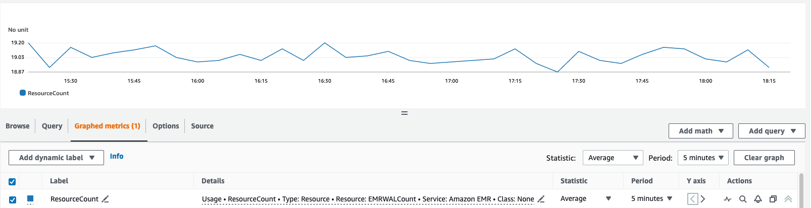
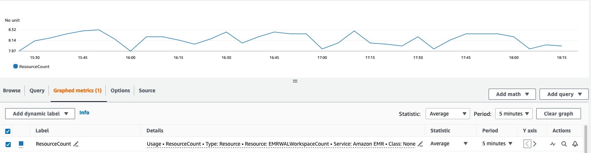

# Understanding Amazon EMR WAL pricing and

metrics

| Core feature billing unit | Details                                                                                                                                                                                                                                                                                                                                                                                                 |
| ------------------------- | ------------------------------------------------------------------------------------------------------------------------------------------------------------------------------------------------------------------------------------------------------------------------------------------------------------------------------------------------------------------------------------------------------- | ---------------------------------------------------------------------------------------------------------------------------------------------------------------------------------------------------------------------------------------------------------------------------------------------- |
| EMR-WAL-Read-GiB          | API calls to read data from your table are billed as ReadRequestGiB. This includes Get and Scan operations. Reads are charged based on the sizes of the read items. Amazon EMR bills at a minimum of 1 byte. For example, if you read a 1234.12 bytes item, you're charged for 1235 bytes. Reads are aggregated every hour for billing and shown as GiBs.                                               |
| EMR-WAL-Write-GiB         | API calls to write data from your table are billed as Write-GiB. This includes Put operations. Writes are charged based on the sizes of the written items. Amazon EMR bills at a minimum of 1 byte. For example, if you write a 1234.12 bytes item, you're charged for 1235 bytes. Writes are aggregated every hour for billing and shown as GiBs.                                                      |
| EMR-WAL-WALHours          | The number of WALs that you store on the service are billed as `EMR-WAL-WALHours`. Amazon EMR creates one WAL per HBase Region. For example, if you create 20 HBase tables including system tables, and each table has two HBase Regions, then you use 28,800 WAL hours, calculated as: `20 tables x  2 Regions per table x  1 WAL per Region x 30 days x 24 hours ----------- 28,800 EMR-WAL-WALHours` | **Example `EMRWALCount`:**  **Example `EMRWALWorkspaceCount`:**  |
