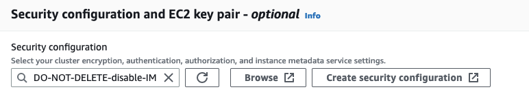

# Using security configurations with Amazon EMR

WAL

Amazon EMR automatically encrypts both data in transit between your cluster and Amazon EMR
WAL service, and the data at rest in Amazon EMR WAL. For more information, see [Encryption at rest for Amazon EMR WAL](../ManagementGuide/emr-data-encryption-options.md#emr-encryption-WAL "../ManagementGuide/emr-data-encryption-options.md#emr-encryption-WAL"). You can also use a security configuration
to bring your own keys from AWS Key Management Service (KMS) service and encrypt the data that you store
in Amazon EMR WAL.

Use one of the following methods to select a security configuration when you create a
cluster:

Console
From the AWS Management Console, specify the configuration under **Security
configuration and EC2 key pair**.

CLI
From the AWS CLI, set the `--security-configuration` parameter
when you use the [create-cluster](../../../cli/latest/reference/emr/create-cluster.md "../../../cli/latest/reference/emr/create-cluster.md") command.

For more information, see [Encryption at rest for Amazon EMR WAL](../ManagementGuide/emr-data-encryption-options.md#emr-encryption-WAL "../ManagementGuide/emr-data-encryption-options.md#emr-encryption-WAL") and [Use security
configurations to set up cluster security](../ManagementGuide/emr-security-configurations.md "../ManagementGuide/emr-security-configurations.md") in the
_Amazon EMR Management Guide_.

For more security-related information about WAL, see [Using
service-linked roles for write-ahead logging](../ManagementGuide/using-service-linked-roles-wal.md "../ManagementGuide/using-service-linked-roles-wal.md").
