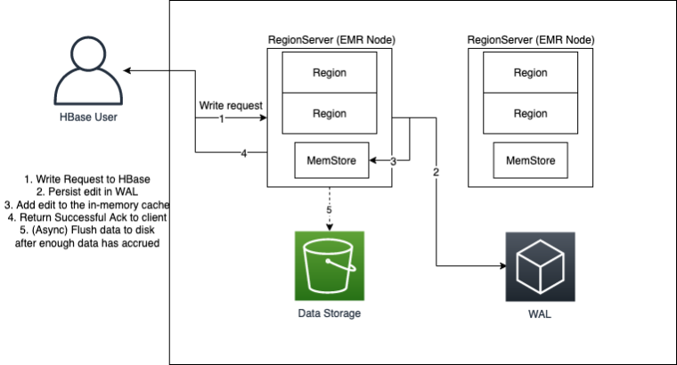

# Amazon EMR WAL workspaces

Amazon EMR WAL adds the concept of WAL workspaces. A _WAL workspace_ is
a logical container of WALs. Each write-ahead log in Amazon EMR WAL is encapsulated by a WAL
workspace. An EMR cluster writes WALs to exactly one WAL workspace that you configure
at cluster launch, or to the `defaultWALworkspace` if you don't specify a
workspace. WAL workspaces are not related to any existing HBase terminologies such as
namespaces.

You can use WAL workspaces to scope down Amazon EMR WAL IAM permissions to only include
the workspaces that the cluster needs to access. You can also tag your WAL workspace for
tag-based access control. For more information on tagging, see [Tagging WAL workspaces](emr-hbase-wal-tagging.md "emr-hbase-wal-tagging.md").

