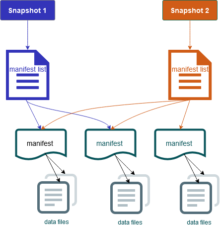

# How Iceberg works

Iceberg tracks individual data files in a table instead of in directories. This way,
writers can create data files in place (files are not moved or changed). Also, writers
can only add files to the table in an explicit commit. The table state is maintained in
metadata files. All changes to the table state create a new metadata file that
atomically replaces the older metadata. The table metadata file tracks the table schema,
partitioning configuration, and other properties.

It also includes snapshots of the table contents. Each snapshot is a complete set of
data files in the table at a point in time. Snapshots are listed in the metadata file,
but the files in a snapshot are stored in separate manifest files. The atomic
transitions from one table metadata file to the next provide snapshot isolation. Readers
use the snapshot that was current when they loaded the table metadata. Readers aren't
affected by changes until they refresh and pick up a new metadata location. Data files
in snapshots are stored in one or more manifest files that contain a row for each data
file in the table, its partition data, and its metrics. A snapshot is the union of all
files in its manifests. Manifest files can also be shared between snapshots to avoid
rewriting metadata that changes infrequently.

**Iceberg snapshot diagram**

Iceberg offers the following features:

- Supports ACID transactions and time travel in your Amazon S3 data
  lake.
- Commit retries benefit from the performance advantages of [optimistic
  concurrency](https://iceberg.apache.org/spec/#optimistic-concurrency "https://iceberg.apache.org/spec/#optimistic-concurrency").
- File-level conflict resolution results in high concurrency.
- With min-max statistics per column in metadata, you can skip files, which
  boosts performance for selective queries.
- You can organize tables into flexible partition layouts, with partition
  evolution enabling updates to partition schemes. Queries and data volumes can
  then change without relying on physical directories.
- Supports [schema evolution](https://iceberg.apache.org/docs/latest/evolution/#schema-evolution "https://iceberg.apache.org/docs/latest/evolution/#schema-evolution") and enforcement.
- Iceberg tables act as idempotent sinks and replayable sources. This enables
  streaming and batch support with exactly-once pipelines. Idempotent sinks track
  write operations that have succeeded in the past. Therefore, the sink can
  request data again in case of a failure, and drop data if it has been sent
  multiple times.
- View history and lineage, including table evolution, operations history, and
  statistics for each commit.
- Migrate from an existing dataset with a choice of data format (Parquet, ORC,
  Avro) and analytics engine (Spark, Trino, PrestoDB, Flink, Hive).
