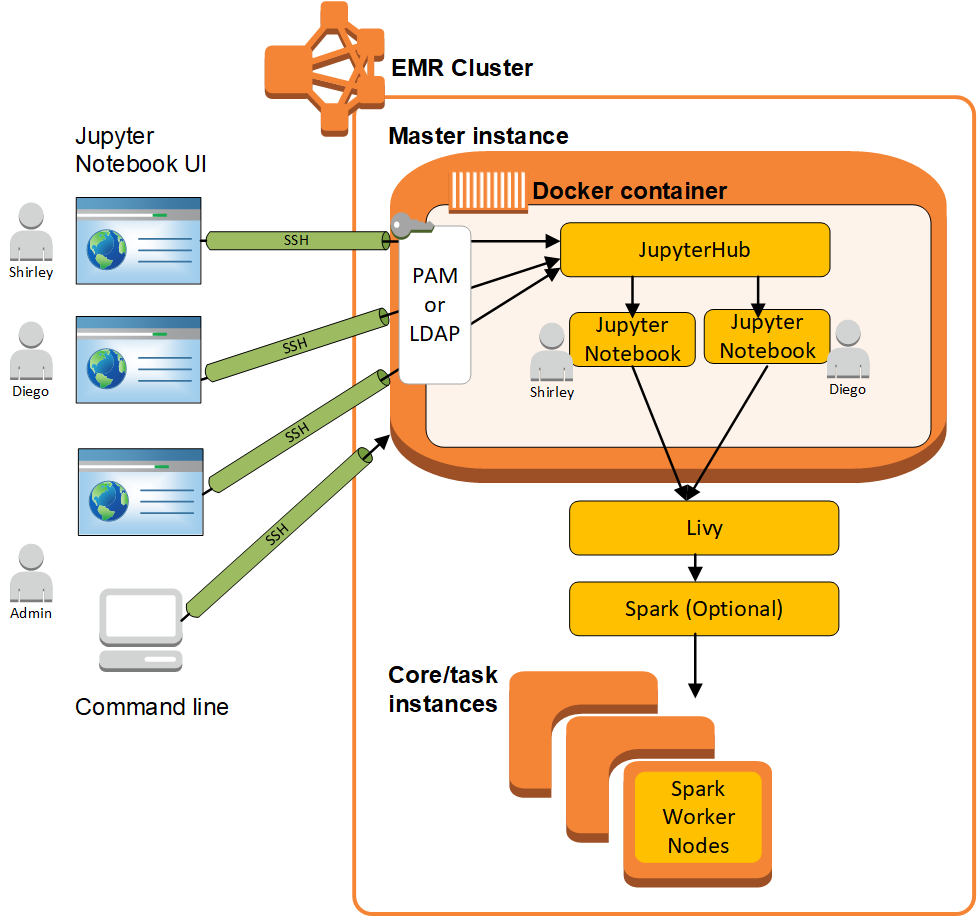

# JupyterHub

[Jupyter Notebook](https://jupyter.org/ "https://jupyter.org/") is an open-source web application that you can use to create and share documents that contain live code, equations, visualizations, and narrative text. [JupyterHub](https://jupyterhub.readthedocs.io/en/latest/ "https://jupyterhub.readthedocs.io/en/latest/") allows you to host
multiple instances of a single-user Jupyter notebook server. When you create a cluster with
JupyterHub, Amazon EMR creates a Docker container on the cluster's master node. JupyterHub, all
the components required for Jupyter, and [Sparkmagic](https://github.com/jupyter-incubator/sparkmagic/blob/master/README.md "https://github.com/jupyter-incubator/sparkmagic/blob/master/README.md") run within the container.

Sparkmagic is a library of kernels that allows Jupyter notebooks to interact with [Apache Spark](https://aws.amazon.com/big-data/what-is-spark/ "https://aws.amazon.com/big-data/what-is-spark/") running on
Amazon EMR through [Apache Livy](emr-livy.md "emr-livy.md"), which is a REST server
for Spark. Spark and Apache Livy are installed automatically when you create a cluster with
JupyterHub. The default Python 3 kernel for Jupyter is available along with the PySpark 3, PySpark, and Spark kernels that are available with Sparkmagic. You can use these kernels to
run ad-hoc Spark code and interactive SQL queries using Python and Scala. You can
install additional kernels within the Docker container manually. For more information, see
[Installing additional kernels and libraries](emr-jupyterhub-install-kernels-libs.md "emr-jupyterhub-install-kernels-libs.md").

The following diagram depicts the components of JupyterHub on Amazon EMR with corresponding authentication methods for notebook users and the administrator. For more information, see [Adding Jupyter Notebook users and administrators](emr-jupyterhub-user-access.md "emr-jupyterhub-user-access.md").


The following table lists the version of JupyterHub included in the latest release of the Amazon EMR 7.x series, along with the components that Amazon EMR installs with JupyterHub.

For the version of components installed with JupyterHub in this release, see [Release 7.12.0 Component Versions](emr-7120-release.md "emr-7120-release.md").

| JupyterHub version information for emr-7.12.0 | Amazon EMR Release Label | JupyterHub Version                                                                                                                                                                                                                                                                                                                                     | Components Installed With JupyterHub |
| --------------------------------------------- | ------------------------ | ------------------------------------------------------------------------------------------------------------------------------------------------------------------------------------------------------------------------------------------------------------------------------------------------------------------------------------------------------ | ------------------------------------ |
| emr-7.12.0                                    | JupyterHub 1.5.0         | emrfs, emr-goodies, emr-ddb, hadoop-client, hadoop-hdfs-datanode, hadoop-hdfs-library, hadoop-hdfs-namenode, hadoop-hdfs-zkfc, hadoop-kms-server, hadoop-yarn-nodemanager, hadoop-yarn-resourcemanager, hadoop-yarn-timeline-server, hudi, hudi-spark, r, spark-client, spark-history-server, spark-on-yarn, spark-yarn-slave, livy-server, jupyterhub |

The following table lists the version of JupyterHub included in the latest release of the Amazon EMR 6.x series, along with the components that Amazon EMR installs with JupyterHub.

For the version of components installed with JupyterHub in this release, see [Release 6.15.0 Component Versions](emr-6150-release.md "emr-6150-release.md").

| JupyterHub version information for emr-6.15.0 | Amazon EMR Release Label | JupyterHub Version                                                                                                                                                                                                                                                                                                                                            | Components Installed With JupyterHub |
| --------------------------------------------- | ------------------------ | ------------------------------------------------------------------------------------------------------------------------------------------------------------------------------------------------------------------------------------------------------------------------------------------------------------------------------------------------------------- | ------------------------------------ |
| emr-6.15.0                                    | JupyterHub 1.5.0         | aws-sagemaker-spark-sdk, emrfs, emr-goodies, emr-ddb, hadoop-client, hadoop-hdfs-datanode, hadoop-hdfs-library, hadoop-hdfs-namenode, hadoop-kms-server, hadoop-yarn-nodemanager, hadoop-yarn-resourcemanager, hadoop-yarn-timeline-server, hudi, hudi-spark, r, spark-client, spark-history-server, spark-on-yarn, spark-yarn-slave, livy-server, jupyterhub |

The following table lists the version of JupyterHub included in the latest release of the Amazon EMR 5.x series, along with the components that Amazon EMR installs with JupyterHub.

For the version of components installed with JupyterHub in this release, see [Release 5.36.2 Component Versions](emr-5362-release.md "emr-5362-release.md").

| JupyterHub version information for emr-5.36.2 | Amazon EMR Release Label | JupyterHub Version                                                                                                                                                                                                                                                                                                                                            | Components Installed With JupyterHub |
| --------------------------------------------- | ------------------------ | ------------------------------------------------------------------------------------------------------------------------------------------------------------------------------------------------------------------------------------------------------------------------------------------------------------------------------------------------------------- | ------------------------------------ |
| emr-5.36.2                                    | JupyterHub 1.4.1         | aws-sagemaker-spark-sdk, emrfs, emr-goodies, emr-ddb, hadoop-client, hadoop-hdfs-datanode, hadoop-hdfs-library, hadoop-hdfs-namenode, hadoop-kms-server, hadoop-yarn-nodemanager, hadoop-yarn-resourcemanager, hadoop-yarn-timeline-server, hudi, hudi-spark, r, spark-client, spark-history-server, spark-on-yarn, spark-yarn-slave, livy-server, jupyterhub |

The Python 3 kernel included with JupyterHub on Amazon EMR is 3.6.4.

The libraries installed within the `jupyterhub` container may vary between Amazon EMR release versions and Amazon EC2 AMI versions.

###### To list installed libraries using `conda`

- Run the following command on the master node command line:

```
sudo docker exec jupyterhub bash -c "conda list"
```

###### To list installed libraries using `pip`

- Run the following command on the master node command line:

```
sudo docker exec jupyterhub bash -c "pip freeze"
```

###### Topics

- [Create a cluster with JupyterHub](emr-jupyterhub-launch.md "emr-jupyterhub-launch.md")
- [Considerations when using JupyterHub on Amazon EMR](emr-jupyterhub-considerations.md "emr-jupyterhub-considerations.md")
- [Configuring JupyterHub](emr-jupyterhub-configure.md "emr-jupyterhub-configure.md")
- [Configuring persistence for notebooks in Amazon S3](emr-jupyterhub-s3.md "emr-jupyterhub-s3.md")
- [Connecting to the master node and Notebook servers](emr-jupyterhub-connect.md "emr-jupyterhub-connect.md")
- [JupyterHub configuration and administration](emr-jupyterhub-administer.md "emr-jupyterhub-administer.md")
- [Adding Jupyter Notebook users and administrators](emr-jupyterhub-user-access.md "emr-jupyterhub-user-access.md")
- [Installing additional kernels and libraries](emr-jupyterhub-install-kernels-libs.md "emr-jupyterhub-install-kernels-libs.md")
- [JupyterHub release history](JupyterHub-release-history.md "JupyterHub-release-history.md")
