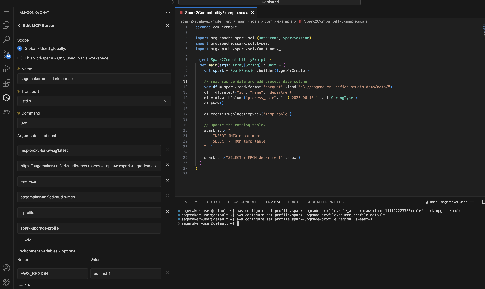

# Using the Upgrade Agent

## Supported Deployment Modes

Apache Spark Upgrade Agent for Amazon EMR support the following two deployment mode for the end-to-end Spark application upgrade experience including build file upgrade, script/dependency upgrade, local test and validation with target EMR cluster or EMR Serverless application, and data quality validation.

- EMR on EC2
- EMR Serverless

Please refer to [Features and Capabilities](emr-spark-upgrade-agent-features.md "emr-spark-upgrade-agent-features.md") to understand the detailed features, capacities and limitations.

## Supported Interfaces

### Integration With Amazon SageMaker Unified Studio VS Code Editor Spaces

On Amazon SageMaker Unified Studio VS Code Editor Spaces, you can configure the IAM profile and MCP config as described in the Setup for Upgrade Agent by simply following the screenshot below:



A demonstration of the EMR on EC2 upgrade experience with SMUS VS code editor. It starts with a simple prompt to ask to the Agent start the Spark Upgrade process.

```
Upgrade my Spark application <local-project-path> from EMR version 6.0.0 to 7.12.0.
Use EMR-EC2 Cluster <cluster-id> to run the validation and s3 paths
s3://<please fill in your staging bucket path> to store updated application artifacts.
Use spark-upgrade-profile for AWS CLI operations.
```

### Integration With Kiro CLI (QCLI)

Start Kiro CLI or your AI Assistant and verify the loaded tools for the upgrade agent.

```
...
spark-upgrade (MCP):
- check_and_update_build_environment     * not trusted
- check_and_update_python_environment    * not trusted
- check_job_status                       * not trusted
- compile_and_build_project              * not trusted
...
```

A demonstration of the EMR Serverless upgrade experience with Kiro CLI. You can simply start the Upgrade process with the following prompt:

```
Upgrade my Spark application <local-project-path> from EMR version 6.0.0 to 7.12.0.
Use EMR-Serverless Applicaion <application-id> and execution role <your EMR Serverless job execution role> to run the validation and s3 paths
s3://<please fill in your staging bucket path> to store updated application artifacts.
```

### Integration with Other IDEs

The [configuration](emr-spark-upgrade-agent-setup.md#spark-upgrade-agent-setup-resources "emr-spark-upgrade-agent-setup.md#spark-upgrade-agent-setup-resources") can also be used in other IDEs to connect to the Managed MCP server:

- **Integration With Cline** - To use the MCP Server with Cline, modify the `cline_mcp_settings.json` and add the configuration above. Consult
  [Cline's documentation](https://docs.cline.bot/mcp/configuring-mcp-servers "https://docs.cline.bot/mcp/configuring-mcp-servers") for more information on how to manage MCP configuration.
- **Integration With Claude Code** To use the MCP Server with Claude Code, modify the configuration file to include the MCP configuration. The file path varies depending on your operating system. Refer to
  [https://code.claude.com/docs/en/mcp](https://code.claude.com/docs/en/mcp "https://code.claude.com/docs/en/mcp") for detailed setup.
- **Integration With GitHub Copilot** - To use the MCP server with GitHub Copilot, follow the instruction in
  [https://docs.github.com/en/copilot/how-tos/provide-context/use-mcp/extend-copilot-chat-with-mcp](https://docs.github.com/en/copilot/how-tos/provide-context/use-mcp/extend-copilot-chat-with-mcp "https://docs.github.com/en/copilot/how-tos/provide-context/use-mcp/extend-copilot-chat-with-mcp") to modify the corresponding configuration file and follow the instructions per each IDE to activate the setup.

## Setup EMR Cluster or EMR Serverless Application for the Target Version

Create the EMR cluster or EMR Serverless application with the expected Spark version that you plan to use for the upgraded application. The target EMR Cluster or EMR-S Application will be used to submit the validation job runs after the Spark application artifacts are upgraded to verify successful upgrade or fix additional errors encountered during the validation. If you already have a target EMR cluster or EMR Serverless application, you can refer to the existing one and skip this step. Use non-production developer accounts and select sample mock datasets that represent your production data but are smaller in size for validation with Spark Upgrades. Please refer to this page for the guidance to create a target EMR cluster or EMR Serverless application from existing ones: [Creating target EMR Cluster/EMR-S application from existing ones](emr-spark-upgrade-agent-target-cluster.md "emr-spark-upgrade-agent-target-cluster.md").
