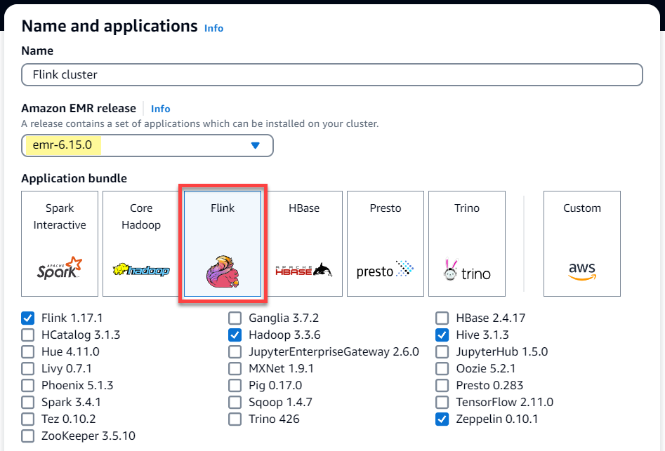
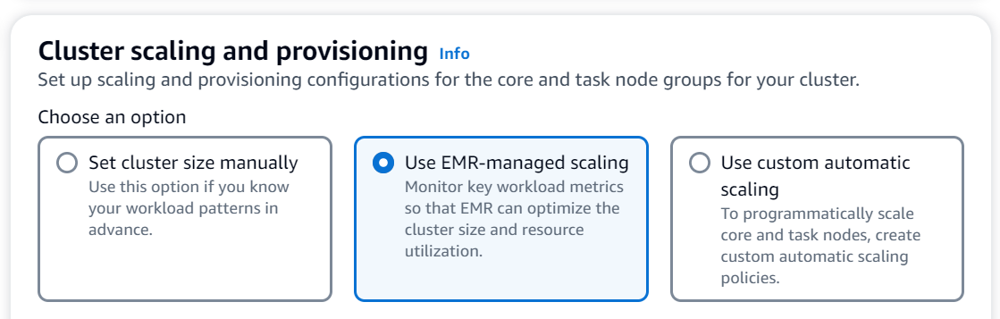

# Flink autoscaler

## Overview

Amazon EMR releases 6.15.0 and higher support _Flink autoscaler_. The
job autoscaler functionality collects metrics from running Flink streaming jobs, and
automatically scales the individual job vertexes. This reduces the backpressure and
satisfies the utilization target that you set.

For more information, see the [Autoscaler](https://nightlies.apache.org/flink/flink-kubernetes-operator-docs-main/docs/custom-resource/autoscaler/ "https://nightlies.apache.org/flink/flink-kubernetes-operator-docs-main/docs/custom-resource/autoscaler/") section of the _Apache Flink Kubernetes
Operator_ documentation.

## Considerations

- Flink autoscaler is supported with Amazon EMR 6.15.0 and higher.
- Flink autoscaler is supported only for streaming jobs.
- Only adaptive scheduler is supported. The default scheduler is not
  supported.
- We recommend that you enable cluster scaling to allow dynamic resource
  provision. Amazon EMR managed scaling is preferred `because the metric evaluation
  occurs every 5–10 seconds. At this interval, your cluster can more readily
  adjust to the change in the required cluster resources.

## Enable autoscaler

Use the following steps to enable the Flink autoscaler when you create an Amazon EMR on EC2
cluster.

1. In the Amazon EMR console, create a new EMR cluster:
   1. Choose Amazon EMR release `emr-6.15.0` or higher. Select the
      **Flink** application bundle, and select any other
      applications that you might want to include on your cluster.

    2. For the **Cluster scaling and provisioning** option,
   select **Use EMR-managed scaling**.

   

2. In the **Software settings** section, enter the following
   configuration to enable Flink autoscaler. For testing scenarios, set the
   decision interval, metrics window interval, and stabilization interval to a
   lower value so that the job immediately makes a scaling decision for easier
   verification.

```
[
  {
    "Classification": "flink-conf",
    "Properties": {
      "job.autoscaler.enabled": "true",
      "jobmanager.scheduler": "adaptive",
      "job.autoscaler.stabilization.interval": "60s",
      "job.autoscaler.metrics.window": "60s",
      "job.autoscaler.decision.interval": "10s",
      "job.autoscaler.debug.logs.interval": "60s"
    }
  }
]
```

3. Select or configure any other settings as you prefer them, and create the
   Flink autoscaler-enabled cluster.

## Autoscaler configurations

This section covers most of the configurations that you can change based on your
specific needs.

###### Note

With time-based configurations like `time`, `interval` and
`window` settings, the default unit when no unit is specified is
milliseconds. So a value of `30` with no suffix equals
30 milliseconds. For other units of time, include the appropriate suffix of
`s` for _seconds_, `m` for
_minutes_, or `h` for
_hours_.

###### Topics

- [Loop configurations](#flink-autoscaler-config-loop "#flink-autoscaler-config-loop")
- [Metrics and history configurations](#flink-autoscaler-config-metrics "#flink-autoscaler-config-metrics")
- [Vertex configurations](#flink-autoscaler-config-vertex "#flink-autoscaler-config-vertex")
- [Backlog configurations](#flink-autoscaler-config-backlog "#flink-autoscaler-config-backlog")
- [Scale operation configurations](#flink-autoscaler-config-scale "#flink-autoscaler-config-scale")

### Autoscaler loop

configurations

Autoscaler fetches the job vertex level metrics for every few configurable time
interval, converts them into scale actionables, estimates new job vertex
parallelism, and recommends it to job scheduler. Metrics are collected only after
the job restart time and cluster stabilization interval.

| Config key                                               | Default value | Description                                                                                                                                                                                                     | Example values                                  |
| -------------------------------------------------------- | ------------- | --------------------------------------------------------------------------------------------------------------------------------------------------------------------------------------------------------------- | ----------------------------------------------- | ----------------------------------------------------------------------------------------------------------------------------------------------------------------------------------------------------------------------------------------------------------------------------------------------------------------------------------------------------------------------------------------------------------------------------------------------------------------------------------------------------------------------------------------------------------------------------------------------------------------------------------------------- |
| `job.autoscaler.enabled`                                 | `false`       | Enable autoscaling on your Flink cluster.                                                                                                                                                                       | `true`, `false`                                 |
| `job.autoscaler.decision.interval`                       | `60s`         | Autoscaler decision interval.                                                                                                                                                                                   | `30` (default unit is milliseconds), `5m`, `1h` |
| `job.autoscaler.restart.time`                            | `3m`          | Expected restart time to be used until the operator can determine it reliably from history.                                                                                                                     | `30` (default unit is milliseconds), `5m`, `1h` |
| `job.autoscaler.stabilization.interval`                  | `300s`        | Stabilization period in which no new scaling will be executed.                                                                                                                                                  | `30` (default unit is milliseconds), `5m`, `1h` |
| `job.autoscaler.debug.logs.interval`                     | `300s`        | Autoscaler debug logs interval.                                                                                                                                                                                 | `30` (default unit is milliseconds), `5m`, `1h` | ### Metrics aggregation and history configurations Autoscaler fetches the metrics, aggregates them over time based sliding window and these are evaluated into scaling decisions. The scaling decision history for each job vertex are utilised to estimate new parallelism. These have both age based expiry as well as history size (at-least 1).                                                                                                                                                                                                                                                                                             |
| Config key                                               | Default value | Description                                                                                                                                                                                                     | Example values                                  |
| ---                                                      | ---           | ---                                                                                                                                                                                                             | ---                                             |
| `job.autoscaler.metrics.window`                          | `600s`        | `Scaling metrics aggregation window size.`                                                                                                                                                                      | `30` (default unit is milliseconds), `5m`, `1h` |
| `job.autoscaler.history.max.count`                       | `3`           | Maximum number of past scaling decisions to retain per vertex.                                                                                                                                                  | `1` to `Integer.MAX_VALUE`                      |
| `job.autoscaler.history.max.age`                         | `24h`         | Minimum number of past scaling decisions to retain per vertex.                                                                                                                                                  | `30` (default unit is milliseconds), `5m`, `1h` | ### Job vertex level configurations The parallelism of each job vertex is modified on the basis of target utilisation and bounded by the min-max parallelism limits. It’s not recommended to set target utilisation close to 100% (i.e value of 1) and the utilisation boundary works as a buffer to handle the intermediate load fluctuations.                                                                                                                                                                                                                                                                                                 |
| Config key                                               | Default value | Description                                                                                                                                                                                                     | Example values                                  |
| ---                                                      | ---           | ---                                                                                                                                                                                                             | ---                                             |
| `job.autoscaler.target.utilization`                      | `0.7`         | Target vertex utilization.                                                                                                                                                                                      | `0` - `1`                                       |
| `job.autoscaler.target.utilization.boundary`             | `0.4`         | Target vertex utilization boundary. Scaling won't be performed if the current processing rate is within `[target_rate / (target_utilization - boundary)`, and `(target_rate / (target_utilization + boundary)]` | `0` - `1`                                       |
| `job.autoscaler.vertex.min-parallelism`                  | `1`           | The minimum parallelism that the autoscaler can use.                                                                                                                                                            | `0` - `200`                                     |
| `job.autoscaler.vertex.max-parallelism`                  | `200`         | The maximum parallelism the autoscaler can use. Note that this limit will be ignored if it is higher than the max parallelism configured in the Flink config or directly on each operator.                      | `0` - `200`                                     | ### Backlog processing configurations The job vertex needs extra resources to handle the pending events, or backlogs, that accumulate during the scale operation time period. This is also referred as the `catch-up` duration. If the time to process backlog exceeds the configured `lag -threshold` value, the job vertex target utilization increases to max level. This helps prevent unnecessary scaling operations while the backlog processes.                                                                                                                                                                                          |
| Config key                                               | Default value | Description                                                                                                                                                                                                     | Example values                                  |
| ---                                                      | ---           | ---                                                                                                                                                                                                             | ---                                             |
| `job.autoscaler.backlog-processing.lag-threshold`        | `5m`          | Lag threshold which will prevent unnecessary scalings while removing the pending messages responsible for the lag.                                                                                              | `30` (default unit is milliseconds), `5m`, `1h` |
| `job.autoscaler.catch-up.duration`                       | `15m`         | The target duration for fully processing any backlog after a scaling operation. Set to 0 to disable backlog based scaling.                                                                                      | `30` (default unit is milliseconds), `5m`, `1h` | ### Scale operation configurations Autoscaler doesn’t perform scale down operation immediately after a scale up operation within grace time period. This prevents un-necessary cycle of scale up-down-up-down operations caused by temporary load fluctuations. We can use the scale down operation ratio to gradually decrease the parallelism and release resources to cater for temporary load spike. It also helps to prevent un-necessary minor scale up operation post major scale down operation. We can detect an in-effective scale up operation based past job vertex scaling decision history to prevent further parallelism change. |
| Config key                                               | Default value | Description                                                                                                                                                                                                     | Example values                                  |
| ---                                                      | ---           | ---                                                                                                                                                                                                             | ---                                             |
| `job.autoscaler.scale-up.grace-period`                   | `1h`          | Duration in which no scale down of a vertex is allowed after it has been scaled up.                                                                                                                             | `30` (default unit is milliseconds), `5m`, `1h` |
| `job.autoscaler.scale-down.max-factor`                   | `0.6`         | Max scale down factor. A value of `1` means no limit on scale down; `0.6` means job can only be scaled down with 60% of the original parallelism.                                                               | `0` - `1`                                       |
| `job.autoscaler.scale-up.max-factor`                     | `100000.`     | Maximum scale up ratio. A value of `2.0` means job can only be scaled up with 200% of the current parallelism.                                                                                                  | `0` - `Integer.MAX_VALUE`                       |
| `job.autoscaler.scaling.effectiveness.detection.enabled` | `false`       | Whether to enable detection of ineffective scaling operations and allowing the autoscaler to block further scale ups.                                                                                           | `true`, `false`                                 |
