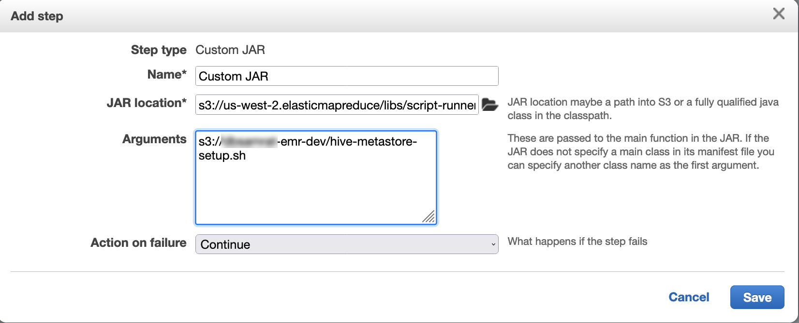

# Configuring Flink in Amazon EMR

## Configure Flink with Hive Metastore and Glue

Catalog

Amazon EMR releases 6.9.0 and higher support both Hive Metastore and AWS Glue Catalog with
the Apache Flink connector to Hive. This section outlines the steps required to
configure [AWS Glue Catalog](#flink-configure-hive-glue "#flink-configure-hive-glue") and [Hive Metastore](#flink-configure-hive-metastore "#flink-configure-hive-metastore") with
Flink.

###### Topics

- [Use the Hive Metastore](#flink-configure-hive-metastore "#flink-configure-hive-metastore")
- [Use the AWS Glue Data Catalog](#flink-configure-hive-glue "#flink-configure-hive-glue")

### Use the Hive Metastore

1. Create an EMR cluster with release 6.9.0 or higher and at least two
   applications: **Hive** and **Flink**.
2. Use [script
   runner](emr-commandrunner.md "emr-commandrunner.md") to execute the following script as a step
   function:

`hive-metastore-setup.sh`

```
sudo cp /usr/lib/hive/lib/antlr-runtime-3.5.2.jar /usr/lib/flink/lib
sudo cp /usr/lib/hive/lib/hive-exec-3.1.3*.jar /lib/flink/lib
sudo cp /usr/lib/hive/lib/libfb303-0.9.3.jar /lib/flink/lib
sudo cp /usr/lib/flink/opt/flink-connector-hive_2.12-1.15.2.jar /lib/flink/lib
sudo chmod 755 /usr/lib/flink/lib/antlr-runtime-3.5.2.jar
sudo chmod 755 /usr/lib/flink/lib/hive-exec-3.1.3*.jar
sudo chmod 755 /usr/lib/flink/lib/libfb303-0.9.3.jar
sudo chmod 755 /usr/lib/flink/lib/flink-connector-hive_2.12-1.15.2.jar
```



### Use the AWS Glue Data Catalog

1. Create an EMR cluster with release 6.9.0 or higher and at least two
   applications: **Hive** and **Flink**.
2. Select **Use for Hive table metadata** in the
   AWS Glue Data Catalog settings to enable Data Catalog in the cluster.
3. Use [script
   runner](emr-commandrunner.md "emr-commandrunner.md") to execute the following script as a step function:
   [Run commands
   and scripts on an Amazon EMR cluster](emr-commandrunner.md "emr-commandrunner.md"):

glue-catalog-setup.sh

```
sudo cp /usr/lib/hive/auxlib/aws-glue-datacatalog-hive3-client.jar /usr/lib/flink/lib
sudo cp /usr/lib/hive/lib/antlr-runtime-3.5.2.jar /usr/lib/flink/lib
sudo cp /usr/lib/hive/lib/hive-exec-3.1.3*.jar /lib/flink/lib
sudo cp /usr/lib/hive/lib/libfb303-0.9.3.jar /lib/flink/lib
sudo cp /usr/lib/flink/opt/flink-connector-hive_2.12-1.15.2.jar /lib/flink/lib
sudo chmod 755 /usr/lib/flink/lib/aws-glue-datacatalog-hive3-client.jar
sudo chmod 755 /usr/lib/flink/lib/antlr-runtime-3.5.2.jar
sudo chmod 755 /usr/lib/flink/lib/hive-exec-3.1.3*.jar
sudo chmod 755 /usr/lib/flink/lib/libfb303-0.9.3.jar
sudo chmod 755 /usr/lib/flink/lib/flink-connector-hive_2.12-1.15.2.jar

```


## Configure Flink with a configuration

file

You can use the Amazon EMR configuration API to configure Flink with a configuration
file. The files that are configurable within the API are:

- `flink-conf.yaml`
- `log4j.properties`
- `flink-log4j-session`
- `log4j-cli.properties`

The main configuration file for Flink is `flink-conf.yaml`.

###### To configure the number of task slots that are used for Flink from the

AWS CLI

1. Create a file, `configurations.json`, with the
   following content:

```
[
    {
      "Classification": "flink-conf",
      "Properties": {
        "taskmanager.numberOfTaskSlots":"2"
      }
    }
]
```

2. Next, create a cluster with the following configuration:

```
aws emr create-cluster --release-label `emr-7.11.0` \
--applications Name=Flink \
--configurations file://./configurations.json \
--region `us-east-1` \
--log-uri s3://`myLogUri` \
--instance-type m5.xlarge \
--instance-count `2` \
--service-role EMR_DefaultRole_V2 \
--ec2-attributes KeyName=`YourKeyName`,InstanceProfile=EMR_EC2_DefaultRole
```

###### Note

You can also change some configurations with the Flink API. For more
information, see [_Concepts_](https://ci.apache.org/projects/flink/flink-docs-release-1.12/concepts/index.html "https://ci.apache.org/projects/flink/flink-docs-release-1.12/concepts/index.html") in the Flink
documentation.

With Amazon EMR version 5.21.0 and later, you can override cluster configurations and specify additional configuration classifications for each instance group in a running cluster. You do this by using the Amazon EMR console, the AWS Command Line Interface (AWS CLI), or the AWS SDK. For more information, see [Supplying a Configuration for an Instance Group in a Running Cluster](emr-configure-apps-running-cluster.md "emr-configure-apps-running-cluster.md").

### Parallelism options

As the owner of your application, you know best what resources to assign to
tasks within Flink. For the examples in this documentation, use the same number
of tasks as the tasks instances that you use for the application. We generally
recommend this for the initial level of parallelism, but you can also increase
the granularity of parallelism with task slots, which should generally not
exceed the number of [virtual cores](https://aws.amazon.com/ec2/virtualcores/ "https://aws.amazon.com/ec2/virtualcores/") per instance. For more information about the Flink
architecture, see [_Concepts_](https://ci.apache.org/projects/flink/flink-docs-master/concepts/index.html "https://ci.apache.org/projects/flink/flink-docs-master/concepts/index.html") in the Flink
documentation.

## Configuring Flink on an EMR cluster with

multiple primary nodes

The JobManager of Flink remains available during the primary node failover process
in an Amazon EMR cluster with multiple primary nodes. Beginning with Amazon EMR 5.28.0, JobManager high availability
is also enabled automatically. No manual configuration is needed.

With Amazon EMR versions 5.27.0 or earlier, the JobManager is a single point of
failure. When the JobManager fails, it loses all job states and will not resume the
running jobs. You can enable JobManager high availability by configuring application
attempt count, checkpointing, and enabling ZooKeeper as state storage for Flink, as
the following example demonstrates:

```
[
  {
    "Classification": "yarn-site",
    "Properties": {
      "yarn.resourcemanager.am.max-attempts": "10"
    }
  },
  {
    "Classification": "flink-conf",
    "Properties": {
        "yarn.application-attempts": "10",
        "high-availability": "zookeeper",
        "high-availability.zookeeper.quorum": "%{hiera('hadoop::zk')}",
        "high-availability.storageDir": "hdfs:///user/flink/recovery",
        "high-availability.zookeeper.path.root": "/flink"
    }
  }
]
```

You must configure both maximum application master attempts for YARN and
application attempts for Flink. For more information, see [Configuration of YARN cluster high availability](https://ci.apache.org/projects/flink/flink-docs-release-1.8/ops/jobmanager_high_availability.html#maximum-application-master-attempts-yarn-sitexml "https://ci.apache.org/projects/flink/flink-docs-release-1.8/ops/jobmanager_high_availability.html#maximum-application-master-attempts-yarn-sitexml"). You may also want to
configure Flink checkpointing to make restarted JobManager recover running jobs from
previously completed checkpoints. For more information, see [Flink checkpointing](https://ci.apache.org/projects/flink/flink-docs-release-1.8/dev/stream/state/checkpointing.html "https://ci.apache.org/projects/flink/flink-docs-release-1.8/dev/stream/state/checkpointing.html").

## Configuring memory process size

For Amazon EMR versions that use Flink 1.11.x, you must configure the total memory
process size for both JobManager
(`jobmanager.memory.process.size`) and TaskManager
(`taskmanager.memory.process.size`) in
`flink-conf.yaml`. You can set these values by either
configuring the cluster with the configuration API or manually uncommenting these
fields via SSH. Flink provides the following default values.

- `jobmanager.memory.process.size`: 1600m
- `taskmanager.memory.process.size`: 1728m

To exclude JVM metaspace and overhead, use the total Flink memory size
(`taskmanager.memory.flink.size`) instead of
`taskmanager.memory.process.size`. The default value for
`taskmanager.memory.process.size` is 1280m. It's not
recommended to set both `taskmanager.memory.process.size` and
`taskmanager.memory.process.size`.

All Amazon EMR versions that use Flink 1.12.0 and later have the default values listed
in the open-source set for Flink as the default values on Amazon EMR, so you don't need
to configure them yourself.

## Configuring log output file size

Flink application containers create and write to three types of log files:
`.out` files, `.log` files, and `.err` files.
Only `.err` files are compressed and removed from the file system, while
`.log` and `.out` log files remain in the file system. To
ensure these output files remain manageable and the cluster remains stable, you can
configure log rotation in `log4j.properties` to set a maximum
number of files and limit their sizes.

**Amazon EMR versions 5.30.0 and later**

Starting with Amazon EMR 5.30.0, Flink uses the log4j2 logging framework with the
configuration classification name `flink-log4j.` The following example
configuration demonstrates the log4j2 format.

```
[
  {
    "Classification": "flink-log4j",
    "Properties": {
      "appender.main.name": "MainAppender",
      "appender.main.type": "RollingFile",
      "appender.main.append" : "false",
      "appender.main.fileName" : "${sys:log.file}",
      "appender.main.filePattern" : "${sys:log.file}.%i",
      "appender.main.layout.type" : "PatternLayout",
      "appender.main.layout.pattern" : "%d{yyyy-MM-dd HH:mm:ss,SSS} %-5p %-60c %x - %m%n",
      "appender.main.policies.type" : "Policies",
      "appender.main.policies.size.type" : "SizeBasedTriggeringPolicy",
      "appender.main.policies.size.size" : "100MB",
      "appender.main.strategy.type" : "DefaultRolloverStrategy",
      "appender.main.strategy.max" : "10"
    },
  }
]
```

**Amazon EMR versions 5.29.0 and earlier**

With Amazon EMR versions 5.29.0 and earlier, Flink uses the log4j logging framework.
The following example configuration demonstrates the log4j format.

```
[
  {
    "Classification": "flink-log4j",
    "Properties": {
      "log4j.appender.file": "org.apache.log4j.RollingFileAppender",
      "log4j.appender.file.append":"true",
      # keep up to 4 files and each file size is limited to 100MB
      "log4j.appender.file.MaxFileSize":"100MB",
      "log4j.appender.file.MaxBackupIndex":4,
      "log4j.appender.file.layout":"org.apache.log4j.PatternLayout",
      "log4j.appender.file.layout.ConversionPattern":"%d{yyyy-MM-dd HH:mm:ss,SSS} %-5p %-60c %x - %m%n"
    },
  }
]
```

## Configure Flink to run with

Java 11

Amazon EMR releases 6.12.0 and higher provide Java 11 runtime support for Flink.
The following sections describe how to configure the cluster to provide Java 11
runtime support for Flink.

###### Topics

- [Configure Flink for Java 11
  when you create a cluster](#flink-configure-java11-create "#flink-configure-java11-create")
- [Configure Flink for Java 11
  on a running cluster](#flink-configure-java11-update "#flink-configure-java11-update")
- [Confirm the Java runtime for
  Flink on a running cluster](#flink-configure-java11-confirm "#flink-configure-java11-confirm")

### Configure Flink for Java 11

when you create a cluster

Use the following steps to create an EMR cluster with Flink and Java 11
runtime. The configuration file where you add Java 11 runtime support is
`flink-conf.yaml`.

Console

###### To create a cluster with Flink and Java 11 runtime in

the console

1. Sign in to the AWS Management Console, and open the Amazon EMR console at
   [https://console.aws.amazon.com/emr](https://console.aws.amazon.com/emr "https://console.aws.amazon.com/emr").
2. Choose **Clusters** under **EMR
   on EC2** in the navigation pane, and then
   **Create cluster**.
3. Select Amazon EMR release 6.12.0 or higher, and choose to
   install the Flink application. Select any other applications
   that you want to install on your cluster.
4. Continue setting up your cluster. In the optional
   **Software settings** section, use the
   default **Enter configuration** option and
   enter the following configuration:

```
[
    {
      "Classification": "flink-conf",
      "Properties": {
        "containerized.taskmanager.env.JAVA_HOME":"/usr/lib/jvm/jre-11",
        "containerized.master.env.JAVA_HOME":"/usr/lib/jvm/jre-11",
        "env.java.home":"/usr/lib/jvm/jre-11"
      }
    }
]
```

5. Continue to set up and launch your cluster.

AWS CLI

###### To create a cluster with Flink and Java 11 runtime from

the CLI

1. Create a configuration file
   `configurations.json`that configures Flink to
   use Java 11.

```
[
    {
      "Classification": "flink-conf",
      "Properties": {
        "containerized.taskmanager.env.JAVA_HOME":"/usr/lib/jvm/jre-11",
        "containerized.master.env.JAVA_HOME":"/usr/lib/jvm/jre-11",
        "env.java.home":"/usr/lib/jvm/jre-11"
      }
    }
]
```

2. From the AWS CLI, create a new EMR cluster with Amazon EMR
   release 6.12.0 or higher, and install the Flink application,
   as shown in the following example:

```
aws emr create-cluster --release-label `emr-6.12.0` \
--applications Name=Flink \
--configurations file://./configurations.json \
--region `us-east-1` \
--log-uri s3://`myLogUri` \
--instance-type `m5.xlarge` \
--instance-count `2` \
--service-role EMR_DefaultRole_V2 \
--ec2-attributes KeyName=`YourKeyName`,InstanceProfile=EMR_EC2_DefaultRole

```

### Configure Flink for Java 11

on a running cluster

Use the following steps to update a running EMR cluster with Flink and
Java 11 runtime. The configuration file where you add Java 11 runtime
support is `flink-conf.yaml`.

Console

###### To update a running cluster with Flink and Java 11

runtime in the console

1. Sign in to the AWS Management Console, and open the Amazon EMR console at
   [https://console.aws.amazon.com/emr](https://console.aws.amazon.com/emr "https://console.aws.amazon.com/emr").
2. Choose **Clusters** under **EMR
   on EC2** in the navigation pane, and then
   select the cluster that you want to update.

###### Note

The cluster must use Amazon EMR release 6.12.0 or higher to
support Java 11. 3. Select the **Configurations** tab. 4. In the **Instance group configurations**
section, select the **Running**
instance group that you want to update and then choose
**Reconfigure** from the list actions
menu. 5. Reconfigure the instance group with the **Edit
attributes** option as follows. Select
**Add new configuration** after each
one.

| Classification | Property                                  | Value                 |
| -------------- | ----------------------------------------- | --------------------- |
| `flink-conf`   | `containerized.taskmanager.env.JAVA_HOME` | `/usr/lib/jvm/jre-11` |
| `flink-conf`   | `containerized.master.env.JAVA_HOME`      | `/usr/lib/jvm/jre-11` |
| `flink-conf`   | `env.java.home`                           | `/usr/lib/jvm/jre-11` |

6. Select **Save changes** to add the
   configurations.

AWS CLI

###### To update a running cluster to use Flink and Java 11

runtime from the CLI

Use the `modify-instance-groups` command to specify
a new configuration for an instance group in a running
cluster.

1. First, create a configuration file
   `configurations.json`that configures Flink to
   use Java 11. In the following example, replace
   `ig-1xxxxxxx9` with the ID for
   the instance group that you want to reconfigure. Save the
   file in the same directory where you will run the
   `modify-instance-groups` command.

```
[
   {
      "InstanceGroupId":"`ig-1xxxxxxx9`",
      "Configurations":[
         {
            "Classification":"flink-conf",
            "Properties":{
              "containerized.taskmanager.env.JAVA_HOME":"/usr/lib/jvm/jre-11",
              "containerized.master.env.JAVA_HOME":"/usr/lib/jvm/jre-11",
              "env.java.home":"/usr/lib/jvm/jre-11"
            },
            "Configurations":[]
         }
      ]
   }
]
```

2. From the AWS CLI, run the following command. Replace the ID
   for the instance group that you want to reconfigure:

```
aws emr modify-instance-groups --cluster-id `j-2AL4XXXXXX5T9` \
--instance-groups file://configurations.json
```

### Confirm the Java runtime for

Flink on a running cluster

To determine the Java runtime for a running cluster, log in to the primary
node with SSH as described in [Connect to the primary
node with SSH](../ManagementGuide/emr-connect-master-node-ssh.md "../ManagementGuide/emr-connect-master-node-ssh.md"). Then run the following command:

```
ps -ef | grep flink
```

The `ps` command with the `-ef` option lists all running
processes on the system. You can filter that output with `grep` to
find mentions of the string `flink`. Review the output for the Java
Runtime Environment (JRE) value, `jre-XX`. In the following output,
`jre-11` indicates that Java 11 is picked up at runtime for
Flink.

```
flink    19130     1  0 09:17 ?        00:00:15 /usr/lib/jvm/jre-11/bin/java -Djava.io.tmpdir=/mnt/tmp -Dlog.file=/usr/lib/flink/log/flink-flink-historyserver-0-ip-172-31-32-127.log -Dlog4j.configuration=file:/usr/lib/flink/conf/log4j.properties -Dlog4j.configurationFile=file:/usr/lib/flink/conf/log4j.properties -Dlogback.configurationFile=file:/usr/lib/flink/conf/logback.xml -classpath /usr/lib/flink/lib/flink-cep-1.17.0.jar:/usr/lib/flink/lib/flink-connector-files-1.17.0.jar:/usr/lib/flink/lib/flink-csv-1.17.0.jar:/usr/lib/flink/lib/flink-json-1.17.0.jar:/usr/lib/flink/lib/flink-scala_2.12-1.17.0.jar:/usr/lib/flink/lib/flink-table-api-java-uber-1.17.0.jar:/usr/lib/flink/lib/flink-table-api-scala-bridge_2.12-1.17.0.
```

Alternatively, [log
in to the primary node with SSH](../ManagementGuide/emr-connect-master-node-ssh.md "../ManagementGuide/emr-connect-master-node-ssh.md") and start a Flink YARN session with
command `flink-yarn-session -d`. The output shows the Java Virtual
Machine (JVM) for Flink, `java-11-amazon-corretto` in the following
example:

```
2023-05-29 10:38:14,129 INFO  org.apache.flink.configuration.GlobalConfiguration           [] - Loading configuration property: containerized.master.env.JAVA_HOME, /usr/lib/jvm/java-11-amazon-corretto.x86_64
```
