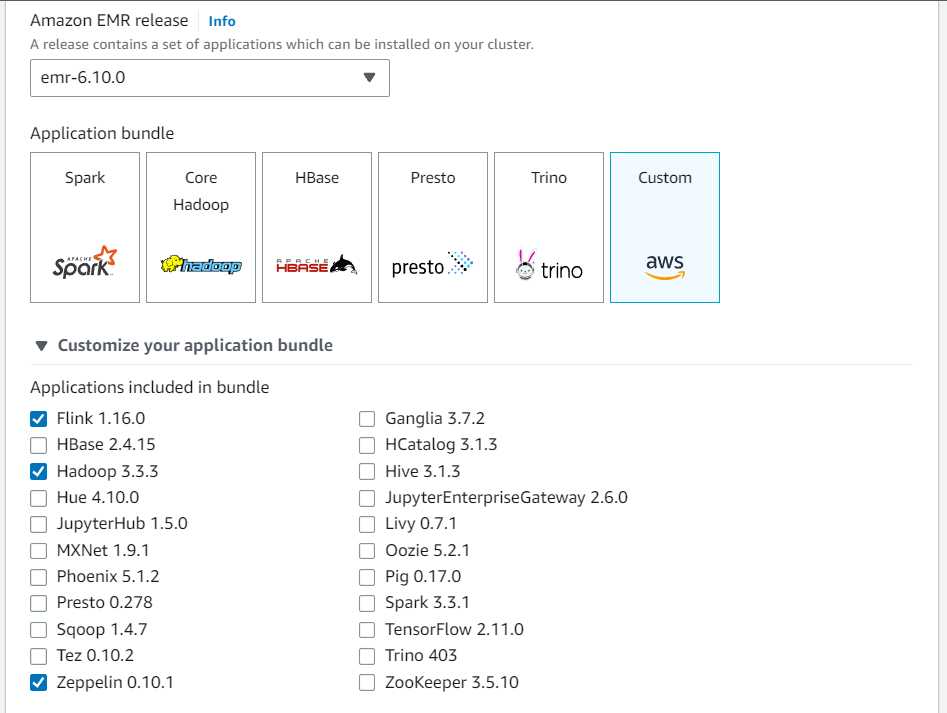
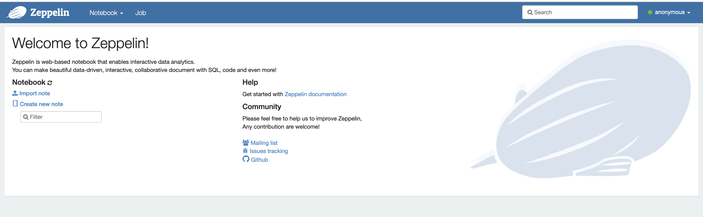
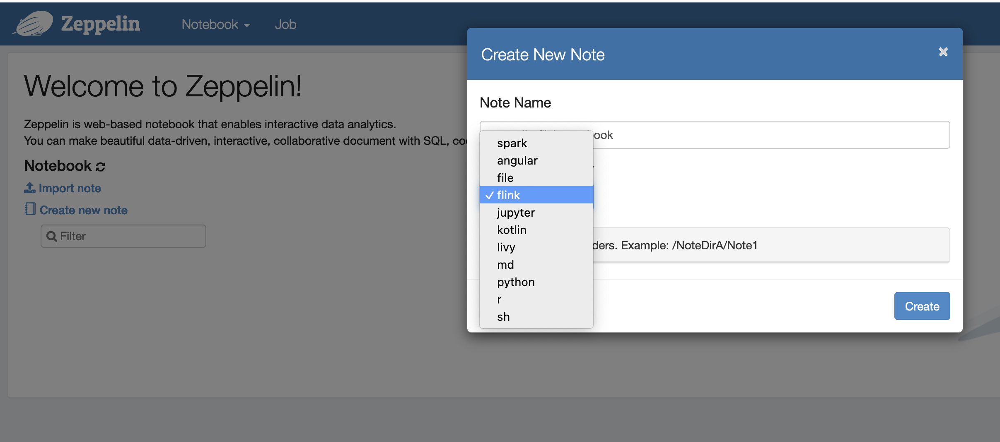
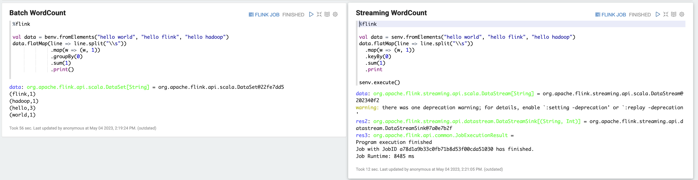
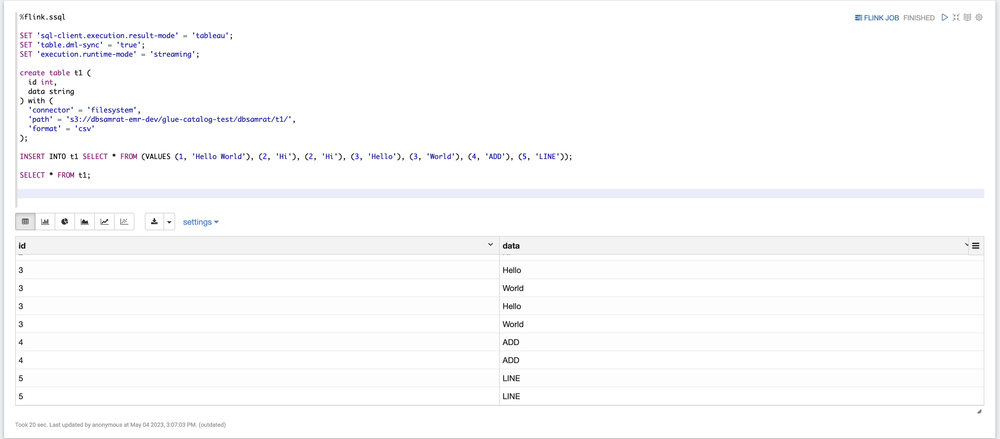
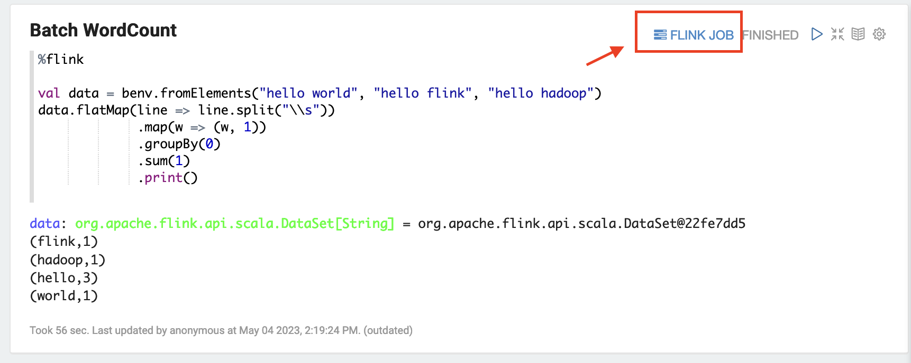
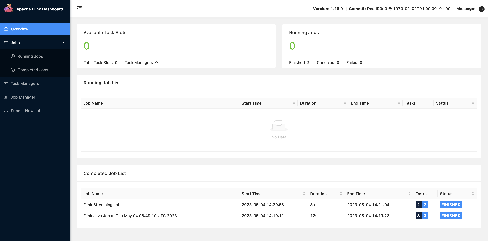

# Working with Flink jobs from Zeppelin in Amazon EMR

## Introduction

Amazon EMR releases 6.10.0 and higher support [Apache Zeppelin](emr-zeppelin.md "emr-zeppelin.md") integration with Apache Flink. You can
interactively submit Flink jobs through Zeppelin notebooks. With the Flink
interpreter, you can execute Flink queries, define Flink streaming and batch jobs,
and visualize the output within Zeppelin notebooks. The Flink interpreter is built
on top of the Flink REST API. This lets you access and manipulate Flink jobs from
within the Zeppelin environment to perform real-time data processing and
analysis.

There are four sub-interpreters in Flink interpreter. They serve different
purposes, but are all in the the JVM and share the same pre-configured entry points
to Flink (`ExecutionEnviroment`, `StreamExecutionEnvironment`,
`BatchTableEnvironment`, `StreamTableEnvironment`). The
interpreters are as follows:

- `%flink` – Creates `ExecutionEnvironment`,
  `StreamExecutionEnvironment`,
  `BatchTableEnvironment`, `StreamTableEnvironment`,
  and provides a Scala environment
- `%flink.pyflink` – Provides a Python environment
- `%flink.ssql` – Provides a streaming SQL
  environment
- `%flink.bsql` – Provides a batch SQL environment

## Prerequisites

- Zeppelin integration with Flink is supported for clusters created with
  Amazon EMR 6.10.0 and higher.
- To view web interfaces that are hosted on EMR clusters as required for
  these steps, you must configure an SSH tunnel to allow inbound access. For
  more information, see [Configure proxy settings to view websites hosted on the primary
  node](../ManagementGuide/emr-connect-master-node-proxy.md "../ManagementGuide/emr-connect-master-node-proxy.md").

## Configure Zeppelin-Flink on an

EMR cluster

Use the following steps to configure Apache Flink on Apache Zeppelin to run on an
EMR cluster:

1. Create a new cluster from the Amazon EMR console. Select emr-6.10.0 or higher
   for the Amazon EMR release. Then, choose to customize your application bundle
   with the Custom option. Include at least Flink, Hadoop, and Zeppelin in your
   bundle.

 2. Create the rest of your cluster with the settings that you prefer. 3. Once your cluster is running, select the cluster in the console to view
its details and open the Applications tab. Select Zeppelin from the
Application user interfaces section to open the Zeppelin web interface. Be
sure that you’ve set up access to the Zeppelin web interface with an SSH
tunnel to the primary node and a proxy connection as described in the [Prerequisites](#flink-zeppelin-prerequisites "#flink-zeppelin-prerequisites").

 4. Now, you can create a new note in a Zeppelin notebook with Flink as the
default interpreter.

 5. Refer to the following code examples that demonstrate how to run Flink
jobs from a Zeppelin notebook.

## Run Flink jobs with Zeppelin-Flink on an

EMR cluster

- Example 1, Flink Scala

a) Batch WordCount Example (SCALA)

```
%flink

val data = benv.fromElements("hello world", "hello flink", "hello hadoop")
data.flatMap(line => line.split("\\s"))
             .map(w => (w, 1))
             .groupBy(0)
             .sum(1)
             .print()
```

b) Streaming WordCount Example (SCALA)

```
%flink

val data = senv.fromElements("hello world", "hello flink", "hello hadoop")
data.flatMap(line => line.split("\\s"))
  .map(w => (w, 1))
  .keyBy(0)
  .sum(1)
  .print

senv.execute()
```



- Example 2, Flink Streaming SQL

```
%flink.ssql
SET 'sql-client.execution.result-mode' = 'tableau';
SET 'table.dml-sync' = 'true';
SET 'execution.runtime-mode' = 'streaming';

create table dummy_table (
  id int,
  data string
) with (
  'connector' = 'filesystem',
  'path' = 's3://`s3-bucket`/dummy_table',
  'format' = 'csv'
);

INSERT INTO dummy_table SELECT * FROM (VALUES (1, 'Hello World'), (2, 'Hi'), (2, 'Hi'), (3, 'Hello'), (3, 'World'), (4, 'ADD'), (5, 'LINE'));

SELECT * FROM dummy_table;
```



- Example 3, Pyflink. Note that you must upload your own sample text file named `word.txt` to your S3 bucket.

```
%flink.pyflink

import argparse
import logging
import sys

from pyflink.common import Row
from pyflink.table import (EnvironmentSettings, TableEnvironment, TableDescriptor, Schema,
                           DataTypes, FormatDescriptor)
from pyflink.table.expressions import lit, col
from pyflink.table.udf import udtf

def word_count(input_path, output_path):
    t_env = TableEnvironment.create(EnvironmentSettings.in_streaming_mode())
    # write all the data to one file
    t_env.get_config().set("parallelism.default", "1")

    # define the source
    if input_path is not None:
        t_env.create_temporary_table(
            'source',
            TableDescriptor.for_connector('filesystem')
                           .schema(Schema.new_builder()
                                   .column('word', DataTypes.STRING())
                                   .build())
                           .option('path', input_path)
                           .format('csv')
                           .build())
        tab = t_env.from_path('source')
    else:
        print("Executing word_count example with default input data set.")
        print("Use --input to specify file input.")
        tab = t_env.from_elements(map(lambda i: (i,), word_count_data),
                                  DataTypes.ROW([DataTypes.FIELD('line', DataTypes.STRING())]))

    # define the sink
    if output_path is not None:
        t_env.create_temporary_table(
            'sink',
            TableDescriptor.for_connector('filesystem')
                           .schema(Schema.new_builder()
                                   .column('word', DataTypes.STRING())
                                   .column('count', DataTypes.BIGINT())
                                   .build())
                           .option('path', output_path)
                           .format(FormatDescriptor.for_format('canal-json')
                                   .build())
                           .build())
    else:
        print("Printing result to stdout. Use --output to specify output path.")
        t_env.create_temporary_table(
            'sink',
            TableDescriptor.for_connector('print')
                           .schema(Schema.new_builder()
                                   .column('word', DataTypes.STRING())
                                   .column('count', DataTypes.BIGINT())
                                   .build())
                           .build())

    @udtf(result_types=[DataTypes.STRING()])
    def split(line: Row):
        for s in line[0].split():
            yield Row(s)

    # compute word count
    tab.flat_map(split).alias('word') \
       .group_by(col('word')) \
       .select(col('word'), lit(1).count) \
       .execute_insert('sink') \
       .wait()


logging.basicConfig(stream=sys.stdout, level=logging.INFO, format="%(message)s")


word_count("s3://`s3_bucket`/word.txt", "s3://`s3_bucket`/demo_output.txt")
```

1. Choose **FLINK JOB** in the Zeppelin UI to access and
   view the Flink Web UI.

 2. Choosing **FLINK JOB** routes to the Flink Web Console in
another tab of your browser.


