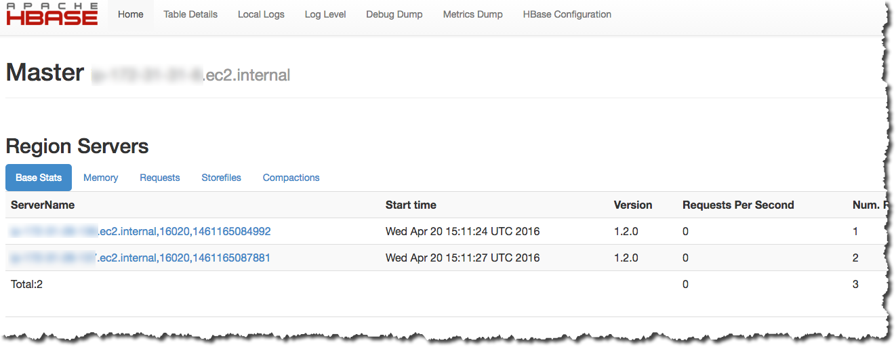
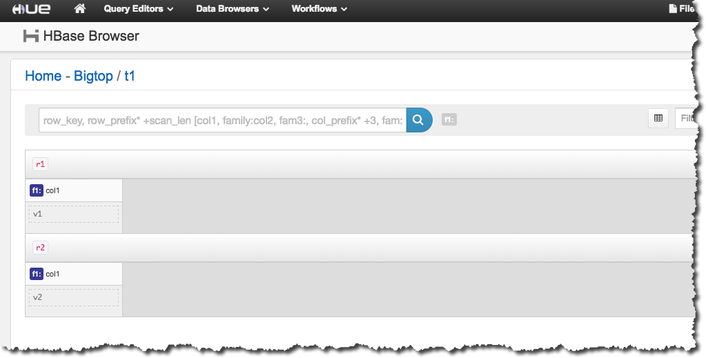

# View the HBase user interface

###### Note

The HBase user interface uses insecure HTTP connections by default. To enable secure HTTP (HTTPS), set the `hbase.ssl.enabled` property for the `hbase-site` classification to `true` in your [HBase configuration](emr-hbase-configure.md "emr-hbase-configure.md"). For more information about using secure HTTP (HTTPS) for the HBase web UI, see the [Apache HBase Reference Guide](https://hbase.apache.org/book.html#_using_secure_http_https_for_the_web_ui "https://hbase.apache.org/book.html#_using_secure_http_https_for_the_web_ui").

HBase provides a web-based user interface that you can use to monitor your HBase
cluster. When you run HBase on Amazon EMR, the web interface runs on the primary node and can
be viewed using port forwarding, also known as creating an SSH tunnel.

###### To view the HBase user interface

1. Use SSH to tunnel into the primary node and create a secure connection. For more
   information, see [Option 2, part 1: Set up
   an SSH tunnel to the primary node using dynamic port forwarding](../ManagementGuide/emr-ssh-tunnel.md "../ManagementGuide/emr-ssh-tunnel.md")
   in the _Amazon EMR Management Guide_.
2. Install a web browser with a proxy tool, such as the FoxyProxy plug-in for Firefox, to
   create a SOCKS proxy for AWS domains. For more information, see [Option 2, part 2:
   Configure proxy settings to view websites hosted on the primary node](../ManagementGuide/emr-connect-master-node-proxy.md "../ManagementGuide/emr-connect-master-node-proxy.md") in the _Amazon EMR Management Guide_.
3. With the proxy set and the SSH connection open, you can view the HBase UI by opening a
   browser window with **http://`master-public-dns-name`:16010/master-status**, where
   `master-public-dns-name` is the public DNS address
   of the cluster's primary node.

You can also view HBase in Hue. For example, the following shows the
table, `t1`, created in [Using the HBase shell](emr-hbase-connect.md "emr-hbase-connect.md"):

For more information about Hue, see [Hue](emr-hue.md "emr-hue.md").
