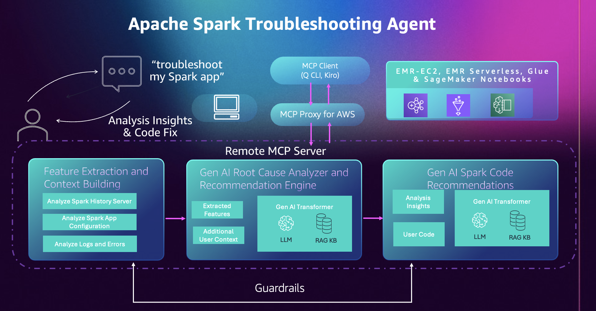

# What is Apache Spark Troubleshooting Agent for Amazon EMR

## Introduction

The Apache Spark Troubleshooting Agent for Amazon EMR is a conversational AI capability that simplifies the troubleshooting of Apache Spark applications on Amazon EMR, AWS Glue and Amazon SageMaker Notebooks. Traditional Spark troubleshooting requires extensive manual analysis of logs, performance metrics, and error patterns to identify root causes and code fixes. The agent simplifies this process through natural language prompts, automated workload analysis, and intelligent code recommendations.

You can use the agent to troubleshoot PySpark and Scala applications failures. The agent analyzes your failed jobs, identifies performance bottlenecks, and provides actionable recommendations and code fixes while giving you full control over implementation decisions.

## Architecture Overview

The troubleshooting agent has three main components: an MCP-compatible AI Assistant in your development environment for interaction, the [MCP Proxy for AWS](https://github.com/aws/mcp-proxy-for-aws "https://github.com/aws/mcp-proxy-for-aws") that handles secure communication and authentication between your client and AWS services, and the Amazon SageMaker Unified Studio Remote MCP Server `(preview)` that provides specialized Spark troubleshooting tools for Amazon EMR, AWS Glue and Amazon SageMaker Notebooks. This diagram illustrates how you interact with the Amazon SageMaker Unified Studio Remote MCP Server through your AI Assistant.

The AI assistant will orchestrate the troubleshooting using specialized tools provided by the MCP server following these steps:

- **Feature Extraction and Context Building:** The agent automatically collects and analyzes telemetry data from your Spark application including Spark History Server logs, configuration settings, and error traces. It extracts key performance metrics, resource utilization patterns, and failure signatures to build a comprehensive context profile for intelligent troubleshooting.
- **GenAI Root Cause analyzer and Recommendation Engine:** The agent leverages AI models and Spark knowledge base to correlate extracted features and identify root causes of performance issues or failures. It provides diagnostic insights and analysis of what went wrong in your Spark application execution.
- **GenAI Spark Code Recommendation:** Based on the root cause analysis from the previous step, the agent analyzes your existing code patterns and identifies inefficient operations that need code fixes for application failures. It provides actionable recommendations including specific code modifications, configuration adjustments and architectural improvements with concrete examples.

###### Topics

- [Setup for Troubleshooting Agent](spark-troubleshooting-agent-setup.md "spark-troubleshooting-agent-setup.md")
- [Using the
  Troubleshooting Agent](spark-troubleshooting-using-troubleshooting-agent.md "spark-troubleshooting-using-troubleshooting-agent.md")
- [Features and Capabilities](spark-troubleshooting-features.md "spark-troubleshooting-features.md")
- [Troubleshooting and Q&A](spark-troubleshooting-agent-troubleshooting.md "spark-troubleshooting-agent-troubleshooting.md")
- [Spark Troubleshooting Agent Workflow in Details](spark-troubleshooting-agent-workflow.md "spark-troubleshooting-agent-workflow.md")
- [Prompt Examples](spark-troubleshooting-agent-prompt-examples.md "spark-troubleshooting-agent-prompt-examples.md")
- [IAM Role Setup](spark-troubleshooting-agent-iam-setup.md "spark-troubleshooting-agent-iam-setup.md")
- [Using Spark Troubleshooting Tools](spark-troubleshooting-agent-using-tools.md "spark-troubleshooting-agent-using-tools.md")
- [Configuring Interface VPC Endpoints for Amazon SageMaker Unified Studio MCP](spark-troubleshooting-agent-vpc-endpoints.md "spark-troubleshooting-agent-vpc-endpoints.md")
- [Cross-Region Processing for
  the Apache Spark
  Troubleshooting Agent](spark-troubleshooting-cross-region-processing.md "spark-troubleshooting-cross-region-processing.md")
- [Logging Amazon SageMaker Unified Studio MCP calls using AWS CloudTrail](spark-troubleshooting-cloudtrail-integration.md "spark-troubleshooting-cloudtrail-integration.md")
- [Service Improvements for Apache Spark Agents](spark-agents-service-improvements.md "spark-agents-service-improvements.md")
