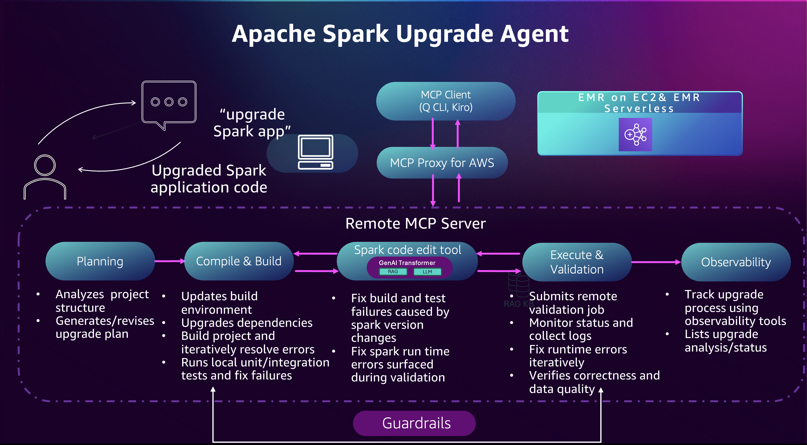

# What is Apache Spark Upgrade Agent for Amazon EMR

## Introduction

The Apache Spark Upgrade Agent for Amazon EMR is a conversational AI capability that accelerates Apache Spark version upgrades for your EMR applications. Traditional Spark upgrades require months of engineering effort to analyze API changes, resolve dependency conflicts, and validate functional correctness. The agent simplifies the upgrade process through natural language prompts, automated code transformation, and data quality validation.

You can use the agent to upgrade PySpark and Scala applications running on Amazon EMR on EC2 and Amazon EMR Serverless. The agent analyzes your code, identifies required changes, and performs automated transformations while maintaining your approval control over all modifications.

## Architecture Overview

The upgrade agent has three main components: any MCP-compatible AI Assistant in your development environment for interaction, the
[MCP Proxy for AWS](https://github.com/aws/mcp-proxy-for-aws "https://github.com/aws/mcp-proxy-for-aws") that handles secure communication between your client and the MCP server, and the Amazon SageMaker Unified Studio Managed MCP Server (in preview) that provides specialized Spark upgrade tools for Amazon EMR. This diagram illustrates how you interact with the Amazon SageMaker Unified Studio Managed MCP Server through your AI Assistant.

The AI assistant will orchestrate the upgrade using specialized tools provided by the MCP server following these steps:

1. **Planning**: The agent analyzes your project structure and generates or revises an upgrade plan that guides the end-to-end Spark upgrade process.
2. **Compile and Build**: The agent updates the build environment and dependencies, compiles the project, and iteratively fixes build and test failures.
3. **Spark code edit tools**: The agent applies targeted code updates to resolve Spark version incompatibilities, fixing both build-time and runtime errors.
4. **Execute & Validation**: The agent submits remote validation jobs to EMR, monitors execution and logs, and iteratively fixes runtime and data-quality issues.
5. **Observability**: The agent tracks upgrade progress using EMR observability tools and allows users to view upgrade analyses and status at any time.

Please refer to [Using Spark Upgrade Tools](emr-spark-upgrade-agent-tools.md "emr-spark-upgrade-agent-tools.md") for a list of major tools for each steps.

###### Topics

- [Setup for Upgrade Agent](emr-spark-upgrade-agent-setup.md "emr-spark-upgrade-agent-setup.md")
- [Using the Upgrade Agent](emr-spark-upgrade-agent-using.md "emr-spark-upgrade-agent-using.md")
- [Features and Capabilities](emr-spark-upgrade-agent-features.md "emr-spark-upgrade-agent-features.md")
- [Troubleshooting and Q&A](emr-spark-upgrade-agent-troubleshooting.md "emr-spark-upgrade-agent-troubleshooting.md")
- [Spark Upgrade Agent Workflow In Details](emr-spark-upgrade-agent-workflow-details.md "emr-spark-upgrade-agent-workflow-details.md")
- [Enable Data Quality Validation](emr-spark-upgrade-agent-data-quality-validation.md "emr-spark-upgrade-agent-data-quality-validation.md")
- [Prompt Examples for the Spark Upgrade Agent](emr-spark-upgrade-agent-prompt-examples.md "emr-spark-upgrade-agent-prompt-examples.md")
- [Creating target EMR Cluster/EMR-S application from existing ones](emr-spark-upgrade-agent-target-cluster.md "emr-spark-upgrade-agent-target-cluster.md")
- [IAM Role Setup](emr-spark-upgrade-agent-iam-role.md "emr-spark-upgrade-agent-iam-role.md")
- [Configuring Interface VPC Endpoints for Amazon SageMaker Unified Studio MCP](spark-upgrade-agent-vpc-endpoints.md "spark-upgrade-agent-vpc-endpoints.md")
- [Using Spark Upgrade Tools](emr-spark-upgrade-agent-tools.md "emr-spark-upgrade-agent-tools.md")
- [Cross-region processing for the Apache Spark Upgrade Agent](emr-spark-upgrade-agent-cross-region.md "emr-spark-upgrade-agent-cross-region.md")
- [Logging Amazon SageMaker Unified Studio MCP calls using AWS CloudTrail](spark-upgrade-cloudtrail-integration.md "spark-upgrade-cloudtrail-integration.md")
- [Service improvements for Apache Spark Agents](emr-spark-agent-service-improvements.md "emr-spark-agent-service-improvements.md")
