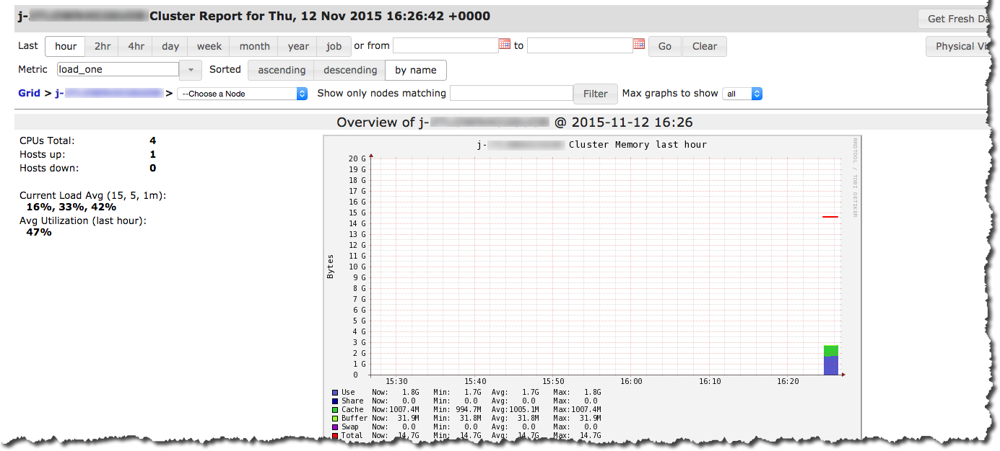

# View Ganglia metrics

###### Note

The last release of Amazon EMR to include Ganglia was Amazon EMR 6.15.0. To monitor your
cluster, releases higher than 6.15.0 include the [Amazon CloudWatch agent](emr-AmazonCloudWatchAgent.md "emr-AmazonCloudWatchAgent.md").

Ganglia provides a web-based user interface that you can use to view the metrics
Ganglia collects. When you run Ganglia on Amazon EMR, the web interface runs on the master
node and can be viewed using port forwarding, also known as creating an SSH tunnel. For
more information about viewing web interfaces on Amazon EMR, see [View web interfaces hosted on EMR
clusters](../ManagementGuide/emr-web-interfaces.md "../ManagementGuide/emr-web-interfaces.md") in the _Amazon EMR Management Guide_.

###### To view the Ganglia web interface

1. Use SSH to tunnel into the master node and create a secure connection. For
   information about how to create an SSH tunnel to the master node, see [Option 2, part 1: Set up an SSH
   tunnel to the master node using dynamic port forwarding](../ManagementGuide/emr-ssh-tunnel.md "../ManagementGuide/emr-ssh-tunnel.md") in the
   _Amazon EMR Management Guide_.
2. Install a web browser with a proxy tool, such as the FoxyProxy plug-in for
   Firefox, to create a SOCKS proxy for domains of the type \*ec2\*.amazonaws.com\*.
   For more information, see [Option 2, part 2:
   Configure proxy settings to view websites hosted on the master node](../ManagementGuide/emr-connect-master-node-proxy.md "../ManagementGuide/emr-connect-master-node-proxy.md")
   in the _Amazon EMR Management Guide_.
3. With the proxy set and the SSH connection open, you can view the Ganglia UI
   by opening a browser window with
   http://`master-public-dns-name`/ganglia/, where
   `master-public-dns-name` is the public DNS address
   of the master server in the EMR cluster.

