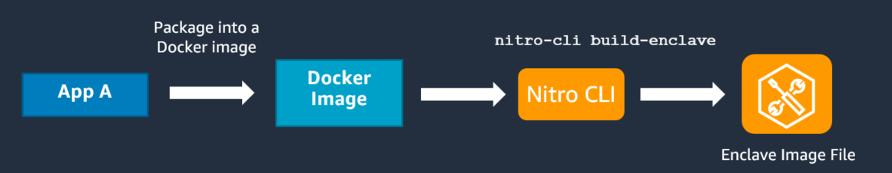

# Building an enclave image file

After you have developed an enclave application, you are ready to package it as an enclave image
file (.eif). An enclave image file provides the information that is required to launch an enclave. It
contains everything that is needed to run the application inside the enclave, including the application
code, runtimes, dependencies, operating system, and file system.

This section explains how to create an enclave image file.


First, you need to package the enclave application and its dependencies into a Docker image.
A Docker image is a read-only template that provides instructions for creating a Docker
container. Nitro Enclaves uses Docker images as a convenient file format for packaging your
applications. Docker images are typically used to create Docker containers. However, in
this case, you use the Docker image to create an enclave image file instead. For more
information about Docker, see the following resources:

- [Docker overview](https://docs.docker.com/get-started/overview/ "https://docs.docker.com/get-started/overview/")
- [Orientation and setup](https://docs.docker.com/get-started/ "https://docs.docker.com/get-started/")
- [Build and run your image](https://docs.docker.com/get-started/part2/ "https://docs.docker.com/get-started/part2/")
- [Best practices for writing Docker images](https://docs.docker.com/develop/develop-images/dockerfile_best-practices/ "https://docs.docker.com/develop/develop-images/dockerfile_best-practices/")
  After you have packaged your enclave application into a Docker image, you need to convert the Docker
  image to an enclave image file. To do this, use the [nitro-cli build-enclave](cmd-nitro-build-enclave.md "cmd-nitro-build-enclave.md") AWS Nitro Enclaves CLI command.

###### Important

The `nitro-cli build-enclave` command is not supported on Windows instances. If you are
using a Windows instance, you must complete this step on a temporary Linux instance and then transfer
the resulting enclave image file (`.eif`) to your Windows parent instance.

After you have launched the temporary Linux instance and you have installed the AWS Nitro Enclaves CLI,
connect to that instance and run the `nitro-cli build-enclave` command. After you have
run the command, transfer the enclave image file (`.eif`) to your Windows parent instance
where you will create the enclave.

The [nitro-cli build-enclave](cmd-nitro-build-enclave.md "cmd-nitro-build-enclave.md") creates an enclave
image file and it provides the enclave's measurements. The enclave image file is used to launch the enclave
on the parent instance, and the measurements are used to set up the attestation process. For more information,
see [Cryptographic attestation](set-up-attestation.md "set-up-attestation.md").

For example, to create an enclave image file from the `hello-world` sample Docker
image, use the following command.

```
`$` `nitro-cli build-enclave --docker-uri hello-world:latest --output-file hello-world.eif`
```

This command creates an enclave image file named `hello-world.eif`, along with the following output.

```
Start building the Enclave Image...
Enclave Image successfully created.
{
"Measurements": {
    "HashAlgorithm": "Sha384 { ... }",
    "PCR0":"7fb5EXAMPLEcbb68ed99a13d7122abfc0666b926a79d537EXAMPLE445c84217f59cfdd36c08b2c79552928702EXAMPLE",
    "PCR1":"235cEXAMPLEbf6b993c915505f3220e2d82b51aff830ad1EXAMPLEeec1bf0b4ae749d311c663f464cde9f718aEXAMPLE",
    "PCR2":"0f0aEXAMPLE289e872e6ac4d19b0b5ac4a9b020c9829564EXAMPLE610750ce6a86f7edff24e3c0a4a445f2ff8EXAMPLE"
}
}
```
