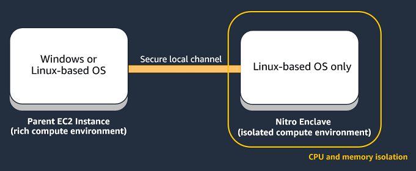

# Nitro Enclaves Application development

on Windows instances

This section provides information for Nitro Enclaves application development on
Windows instances.

###### Topics

- [Considerations for using Nitro Enclaves on
  a Windows parent instance](#windows-considerations "#windows-considerations")
- [Nitro Enclaves for Windows release notes](#release-notes "#release-notes")
- [Subscribe to notifications of new versions](#sns-topic "#sns-topic")
- [Working with the vsock socket in Windows](vsock-win.md "vsock-win.md")

## Considerations for using Nitro Enclaves on

a Windows parent instance

The EC2 parent instance and the enclaves operate as separate virtual machines.
This means that each of them (the parent instance and all of its enclaves) must
run its own operating system. The parent instance, supports both Linux and
Windows (2016 and later) operating systems. However, the enclaves support only
operating systems that support the Linux boot protocol. This means that even if
you have a Windows parent instance, you must run a Linux environment inside your
enclaves.



This also means that you must use a Linux-based instance to build your enclave
image file (`.eif`).

###### Topics

Keep the following in mind when using a Windows parent instance.

- Only Windows 2016 and later is supported on the parent
  instance.
- You must run a Linux-based environment inside the enclave.
- The Hello enclaves sample application is supported on Windows parent
  instances, but the enclave image file (`.eif`) must be built
  on a Linux instance. For more information, see [Getting started with the Hello Enclaves sample application](getting-started.md "getting-started.md").
- The KMS Tool sample application is supported on Windows parent
  instances, but the enclave image file (`.eif`) must be built
  on a Linux instance. For more information, see [Getting started with cryptographic attestation using the KMS Tool sample application](hello-kms.md "hello-kms.md").
- On Windows, the vsock uses the standard Windows sockets (Winsock2)
  API. For more information, see [Working with the vsock socket in Windows](vsock-win.md "vsock-win.md").
- AWS Certificate Manager for Nitro Enclaves is not supported with Windows parent
  instances.
- To use the AWS Nitro Enclaves CLI software on your parent instance,
  you must install the **AWSNitroEnclavesWindows** package using AWS Systems Manager
  Distributor. For more information, see [Install the Nitro Enclaves CLI on
  Windows](nitro-enclave-cli-install-win.md "nitro-enclave-cli-install-win.md").
- The `nitro-cli build-enclave` command is not supported on
  Windows parent instances. For more information, see [nitro-cli build-enclave](cmd-nitro-build-enclave.md "cmd-nitro-build-enclave.md").

## Nitro Enclaves for Windows release notes

This section describes Nitro Enclaves (for Windows) features, improvements, and
bug fixes by release date.

| Release date     | version | Updates and bug fixes                                                                                                                                                                                                                                                                                                                                                                                                                                                                                                                                                                                                                                                                                                                                                                                                                                                              |
| ---------------- | ------- | ---------------------------------------------------------------------------------------------------------------------------------------------------------------------------------------------------------------------------------------------------------------------------------------------------------------------------------------------------------------------------------------------------------------------------------------------------------------------------------------------------------------------------------------------------------------------------------------------------------------------------------------------------------------------------------------------------------------------------------------------------------------------------------------------------------------------------------------------------------------------------------- |
| July 24, 2024    | 1.2.3   | The release updated the Nitro Enclaves for Windows installer to<br>use WiX Toolset v5.                                                                                                                                                                                                                                                                                                                                                                                                                                                                                                                                                                                                                                                                                                                                                                                             |
| October 18, 2023 | 1.2.2   | The release improved installation of Nitro Enclaves for Windows<br>and deprecated support for Windows Server 2012 R2.                                                                                                                                                                                                                                                                                                                                                                                                                                                                                                                                                                                                                                                                                                                                                              |
| March 27, 2023   | 1.2.1   | The release fixed a bug related to terminating multiple<br>enclaves. This is the last version to support Windows Server<br>2012 R2.                                                                                                                                                                                                                                                                                                                                                                                                                                                                                                                                                                                                                                                                                                                                                |
| May 4, 2022      | 1.2.0   | The release added the following commands, arguments, and<br>output for Nitro CLI:<br>• Added `pcr` and<br>`describe-eif` commands.<br>• Added `--enclave-name` argument for<br>`run-enclave`, `console`,<br>and `terminate-enclave` commands.<br>• Added `--disconnect-timeout` argument<br>for `console` command.<br>• Added `--config` argument and<br>`--attach-console` flag to<br>`run-enclave` command<br>• Updated `describe-enclaves` and<br>`run-enclave` commands to display<br>`EnclaveName`.<br>• Added `--metadata` flag to<br>`describe-enclaves` command.<br>The release added the following bug fixes and<br>enhancements:<br>• Improved Nitro CLI error messages.<br>• Fixed bugs in vsock `select()` when it<br>blocks or returns certain calls.<br>• Fixed bug in vsock `shutdown()` on<br>nonblocking sockets, which can result in connection<br>reset errors. |
| July 27, 2021    | 1.1.0   | The release added the following bug fixes and<br>enhancements:<br>• Improved vsock error codes and Nitro CLI<br>error messages.<br>• Improved vsock driver stability when enabling and<br>disabling the vsock device.<br>• Improved Nitro CLI efficiency during failed<br>enclave startups.<br>• Improved vsock-proxy stability.<br>• Fixed the bug that prevented installation using<br>SSM Distributor after a failed installation<br>attempt.                                                                                                                                                                                                                                                                                                                                                                                                                                   |
| April 27, 2021   | 1.0     | Initial release of Nitro Enclaves for Windows.                                                                                                                                                                                                                                                                                                                                                                                                                                                                                                                                                                                                                                                                                                                                                                                                                                     |

## Subscribe to notifications of new versions

Amazon SNS can notify you when new versions of Nitro Enclaves for Windows are released.
Use one of the following procedures to subscribe to these notifications.

Amazon SNS console

###### To subscribe to notifications using the Amazon SNS console

1. Open the Amazon SNS console at
   [https://console.aws.amazon.com/sns/v3/home](https://console.aws.amazon.com/sns/v3/home "https://console.aws.amazon.com/sns/v3/home").
2. In the navigation bar, change the Region to **US
   West (Oregon)**, if necessary. You must select
   this Region because the SNS notifications that you are
   subscribing to are in this Region.
3. In the navigation pane, choose
   **Subscriptions**.
4. Choose **Create subscription**.
5. In the **Create subscription** dialog
   box, do the following:
   1. For **Topic ARN**, enter
      `arn:aws:sns:us-west-2:404587003957:aws-nitro-enclaves-windows`.
   2. For **Protocol**, choose
      `Email`.
   3. For **Endpoint**, type an email
      address that you can use to receive the
      notifications.
   4. Choose **Create
      subscription**.

6. You'll receive a confirmation email. Open the email and
   follow the directions to complete your subscription.

AWS Tools for PowerShell Core

###### To subscribe to notifications using the Tools for Windows PowerShell

Use the following command.

```
`C:\>` Connect-SNSNotification -TopicArn 'arn:aws:sns:us-west-2:404587003957:aws-nitro-enclaves-windows' -Protocol email -Region us-west-2 -Endpoint `'your_email_address'`
```

AWS Command Line Interface

###### To subscribe to notifications using the AWS CLI

Use the following command.

```
`C:\>` aws sns subscribe \
--topic-arn arn:aws:sns:us-west-2:404587003957:aws-nitro-enclaves-windows \
--protocol email \
--notification-endpoint `your_email_address`
```

If you no longer want to receive these notifications, use the following
procedure to unsubscribe.

###### To unsubscribe to notifications using the Amazon SNS console

1. Open the Amazon SNS console at
   [https://console.aws.amazon.com/sns/v3/home](https://console.aws.amazon.com/sns/v3/home "https://console.aws.amazon.com/sns/v3/home").
2. In the navigation bar, change the Region to **US West
   (Oregon)**.
3. In the navigation pane, choose
   **Subscriptions**.
4. Select the check box for the subscription and then choose
   **Delete**. When prompted for confirmation, choose
   **Delete**.
