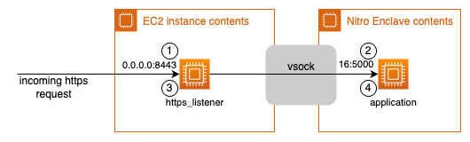

# Getting started: Connect the parent instance with an enclave by using virtio-vsock

The vsock socket is the only communication channel between an Amazon EC2 instance
(also called the parent instance) and its associated AWS Nitro Enclaves.

Vsock (VM sockets) is a Linux socket family that enables socket-based communication. A
socket address consists of a 32-bit context identifier (CID) and a
32-bit port number. The CID identifies the source or destination, which is either an
enclave or the parent instance. By default, the first enclave on a parent instance is
assigned CID `16`. The parent instance is always reachable at CID
`3`.

For more information about vsock sockets and packet details, see [LINKTYPE\_VSOCK](https://www.tcpdump.org/linktypes/LINKTYPE_VSOCK.html "https://www.tcpdump.org/linktypes/LINKTYPE_VSOCK.html")
on the tcpdump website.

###### Topics

- [Overview: Connect the parent instance with an enclave by using virtio-vsock](#connect-parent-enclave-vsock "#connect-parent-enclave-vsock")
- [Example: Connect the parent instance and enclave with Python](#vsock-example "#vsock-example")

## Overview: Connect the parent instance with an enclave by using virtio-vsock

This pattern shows a simple way to establish a connection between the parent
instance and the enclave by using virtio-vsock language bindings, and to pass data over
that connection.

With virtio-vsock language bindings, you can create custom, highly restricted,
bidirectional communication channels between the parent instance and the enclave. You
can initiate connections from the application on the parent instance, or
from the application inside the enclave.

###### Topics

- [Communication overview](#vsock-schematics "#vsock-schematics")
- [Integrate this pattern in your own application](#vsock-integration "#vsock-integration")

### Communication overview

The following diagram shows how the parent instance and enclave communicate over
vsock.



_Figure 1: vsock language binding_

The preceding diagram depicts a standard scenario where the application on the
parent instance dials out to the enclave over vsock and sends data. The enclave
accepts the connection, receives the data, processes it, and responds over the open
vsock connection.

1. The application on the parent instance starts the enclave.
2. The enclave process starts a vsock listener on CID `16`, port
   `5000`, and waits for incoming connections from the parent
   instance.
3. The application on the parent instance dials out to the enclave listening on
   `16:5000` and passes the serialized payload.
4. The enclave application accepts the incoming connection, receives and
   deserializes the payload, and processes it. It responds to the application on
   the parent instance over the open vsock connection.
5. The connection closes.

### Integrate this pattern in your own application

Keep the following in mind when you use virtio-vsock language bindings to connect
the parent and enclave parts of your application:

- Virtio-vsock libraries are available for different programming languages,
  such as Rust, Go, and Python.
- Consider a non-blocking, multi-threaded implementation inside the enclave to
  allow parallel processing of requests.

## Example: Connect the parent instance and enclave with Python

This example walks you through a setup that connects an application
on the parent instance with its enclave by using virtio-vsock language
bindings for Python.

The application on the parent instance fetches a fresh set of credentials from the
Amazon EC2 Instance Metadata Service Version 2 (IMDSv2), serializes them, and sends them
to the enclave over vsock. The enclave receives the credentials and exports them as
environment variables so that other processes or SDKs can use them. These
credentials are not required for the vsock connection itself. They are necessary if,
for example, an AWS SDK must be used inside the enclave to communicate with AWS KMS,
as described in [Getting started: Connect an enclave with AWS KMS for cryptographic attestation and secrets management](connect-enclave-kms.md "connect-enclave-kms.md").

###### Topics

- [Prerequisites](#vsock-example-prerequisites "#vsock-example-prerequisites")
- [Step 1: Prepare and run the enclave](#vsock-example-step1 "#vsock-example-step1")
- [Step 2: Prepare and run the application on the parent instance](#vsock-example-step2 "#vsock-example-step2")
- [Step 3: Provide the ciphertext by using curl](#vsock-example-step3 "#vsock-example-step3")

### Prerequisites

Before you begin, make sure you have the following:

- A virtio-vsock library
- The Nitro CLI. For more information, see [Install the Nitro Enclaves CLI on Linux](nitro-enclave-cli-install.md "nitro-enclave-cli-install.md").

### Step 1: Prepare and run the enclave

First, set up the enclave. The application inside the enclave opens a vsock
listener, accepts incoming connections, and receives data from the
application on the parent instance. The enclave application parses the data and
exports it as environment variables.

1. Copy the following Python code into a file named `enclave.py`.

```
import socket
import json
import os
import subprocess
import base64


def export_dict_to_env(data: dict):
    # Export the temporary IMDSv2 session credentials as environment variables.
    # These are short-term credentials from IMDSv2. Do not use long-term access keys.
    os.environ['AWS_ACCESS_KEY_ID'] = data['AccessKeyId']
    os.environ['AWS_SECRET_ACCESS_KEY'] = data['SecretAccessKey']
    os.environ['AWS_SESSION_TOKEN'] = data['Token']
    os.environ['CIPHERTEXT'] = data['ciphertext']


def call_subprocess():
    subprocess_args = [
        "/app/per_request.sh"
    ]

    proc = subprocess.Popen(subprocess_args, stdout=subprocess.PIPE)

    # returns b64 encoded plaintext
    result = proc.communicate()[0].decode()

    return result


def parse_cli_result(result: str):
    plaintext_b64 = result.split(":")[1].strip()
    plaintext = base64.standard_b64decode(plaintext_b64).decode()

    return plaintext


if __name__ == "__main__":

    # Create a vsock socket object
    s = socket.socket(socket.AF_VSOCK, socket.SOCK_STREAM)

    # Listen for connection from any CID
    cid = socket.VMADDR_CID_ANY

    # The port should match the client running in parent EC2 instance
    port = 5000

    # Bind the socket to CID and port
    s.bind((cid, port))

    # Listen for connection from client
    s.listen()

    initial = True

    # run receive and print in while loop to keep main thread alive
    while True:
        c, addr = s.accept()

        payload = c.recv(4096)
        payload_json = json.loads(payload.decode())
        print("payload json: {}".format(payload_json))

        export_dict_to_env(payload_json)
        # Demonstrate subprocess access to environment variables.
        # For production use cases, shell script interactions should be avoided due to the security implications.
        subprocess_result = call_subprocess()
        subprocess_result_parsed = parse_cli_result(subprocess_result)
        c.send(str.encode(json.dumps(subprocess_result_parsed)))

        c.close()
```

2. Copy the following into a file named `per_request.sh`. The script
   reads the `CIPHERTEXT` environment variable, converts it to base64,
   and writes it to `stdout`.

```
#!/usr/bin/env bash
# Mimic result of kmstool_enclave_cli for later parts
echo "CIPHERTEXT:$(echo $CIPHERTEXT | base64)"
```

3. Copy the following into a file named `Dockerfile`. This file uses
   a [multi-stage
   build](https://docs.docker.com/build/building/multi-stage/ "https://docs.docker.com/build/building/multi-stage/") as described on the Docker documentation website. The Dockerfile is used for both the enclave and the parent instance.

```
FROM amazonlinux:2023 AS base

# Install Python 3.12 and pip
RUN dnf install -y python3.12 python3.12-pip openssl && \
    dnf clean all

# Set python3.12 as default python and pip
RUN ln -sf /usr/bin/python3.12 /usr/bin/python3 && \
    ln -sf /usr/bin/pip3.12 /usr/bin/pip3

WORKDIR /app

FROM base AS enclave
COPY ./enclave.py ./
COPY ./per_request.sh ./

CMD ["python3", "/app/enclave.py"]

FROM base AS parent
RUN pip3 install requests
COPY ./parent.sh ./
COPY ./parent.py ./

CMD ["/app/parent.sh"]
```

4. Add execute permission to `per_request.sh` and build the enclave
   target of the Dockerfile.

```
chmod +x per_request.sh
docker build --target enclave -t enclave .
```

5. Verify that the Docker image was built successfully.

```
docker images
```

Example output

```
REPOSITORY            TAG             IMAGE ID       CREATED          SIZE
enclave               latest          27f96a96be9d   16 seconds ago   224MB
```

6. Build the enclave image file from the Docker image by using the
   Nitro CLI.

```
nitro-cli build-enclave --docker-uri enclave:latest --output-file enclave.eif
```

7. Run the enclave, and use the `--debug-mode` flag to enable debug
   mode.

```
nitro-cli run-enclave --enclave-cid 16 --enclave-name my-enclave --cpu-count 2 --memory 1600 --eif-path enclave.eif --debug-mode
```

8. Confirm that the enclave is running.

```
nitro-cli describe-enclaves
```

Example output

```
[
  {
    "EnclaveName": "my-enclave",
    "EnclaveID": "i-016e846cc7c56af05-enc196a64a382f7715",
    "ProcessID": 4494,
    "EnclaveCID": 16,
    "NumberOfCPUs": 2,
    "CPUIDs": [
      1,
      3
    ],
    "MemoryMiB": 2048,
    "State": "RUNNING",
    "Flags": "DEBUG_MODE",
    "Measurements": {
      "HashAlgorithm": "Sha384 { ... }",
      "PCR0": "26bd4234c3cb6ef9e57d64fd7325ba7a926a3b89ce93981854195a7e397daebe51fcd5002b8af202a5e0ba6f107ac500",
      "PCR1": "0343b056cd8485ca7890ddd833476d78460aed2aa161548e4e26bedf321726696257d623e8805f3f605946b3d8b0c6aa",
      "PCR2": "a7369cee5c5c945fdbf7a1c71e99c45417379804ed5f50433c587023c815cfbe65f8ff3986038ff77f44b08ee7afbe09"
    }
  }
]
```

9. Because the enclave is running in debug mode, you can attach to its console
   to view the enclave's console output, such as the `print` statement
   in `enclave.py`.

```
nitro-cli console --enclave-name my-enclave
```

### Step 2: Prepare and run the application on the parent instance

The application on the parent instance initiates a connection to a
specific enclave, identified by its unique CID and port. It then fetches
fresh credentials from IMDSv2 and transmits them to the enclave, along with a
ciphertext field, in serialized JSON format.

1. Validate that the enclave is running by using the `nitro-cli
 describe-enclaves` command, and verify that the enclave is assigned CID
   `16` (the default for the first enclave). The output is similar to
   the following.

```
[
  {
    "EnclaveName": "my-enclave",
    "EnclaveID": "i-016e846cc7c56af05-enc196aaa3fb3bf6f4",
    "ProcessID": 14717,
    "EnclaveCID": 16,
    "NumberOfCPUs": 2,
    "CPUIDs": [
      1,
      3
    ],
    "MemoryMiB": 2048,
    "State": "RUNNING",
    "Flags": "DEBUG_MODE",
    "Measurements": {
      "HashAlgorithm": "Sha384 { ... }",
      "PCR0": "b078785234059e040259dd555d9008041240568772950f08602812b301e4b2b94c0ca68c50218564437d6d43b38f1de2",
      "PCR1": "0343b056cd8485ca7890ddd833476d78460aed2aa161548e4e26bedf321726696257d623e8805f3f605946b3d8b0c6aa",
      "PCR2": "4366c961ee795e2c85523ca4949778d4ea1659676890939347651c37f062a3e560b44fcc2eca5edbc1593f513c9687b1"
    }
  }
]
```

2. Copy the following code into a file named `parent.py`. This code
   creates a simple HTTPS listener inside the Docker container. When a
   `POST` request arrives, the listener fetches a fresh set of
   credentials from IMDSv2, merges them with the passed payload, and sends the
   result into the enclave.

```
import requests
import json
import socket
import argparse
from http.server import HTTPServer, BaseHTTPRequestHandler
import ssl


class HelloHandler(BaseHTTPRequestHandler):

    def _get_aws_credentials_from_imdsv2(self):
        """Get AWS credentials from IMDSv2 and return as JSON."""
        # Get IMDSv2 token
        token_headers = {'X-aws-ec2-metadata-token-ttl-seconds': '21600'}
        token_url = 'http://169.254.169.254/latest/api/token'
        token = requests.put(token_url, headers=token_headers).text

        # Set headers for subsequent requests
        headers = {'X-aws-ec2-metadata-token': token}

        # Get IAM role name
        role_url = 'http://169.254.169.254/latest/meta-data/iam/security-credentials/'
        role_name = requests.get(role_url, headers=headers).text

        # Get credentials
        creds_url = f'http://169.254.169.254/latest/meta-data/iam/security-credentials/{role_name}'
        credentials = requests.get(creds_url, headers=headers).json()

        # Return formatted credentials
        return {
            'AccessKeyId': credentials['AccessKeyId'],
            'SecretAccessKey': credentials['SecretAccessKey'],
            'Token': credentials['Token'],
            'Expiration': credentials['Expiration']
        }

    def _call_enclave(self, cid, port, payload):

        # Create a vsock socket object
        s = socket.socket(socket.AF_VSOCK, socket.SOCK_STREAM)

        # Connect to the enclave
        s.connect((cid, port))

        # Get fresh AWS credentials from EC2 metadata service
        payload = {**self._get_aws_credentials_from_imdsv2(),
                   'ciphertext': payload['ciphertext']}

        # Send payload to enclave
        s.send(str.encode(json.dumps(payload)))

        # receive data from the server
        payload_processed = s.recv(1024).decode()

        # close the connection
        s.close()
        return payload_processed

    def _set_response(self, http_status=200):
        self.send_response(http_status)
        self.send_header("Content-type", "application/json")
        self.end_headers()

    def do_POST(self):
        content_length = int(self.headers["Content-Length"])
        post_data = self.rfile.read(content_length)
        payload = json.loads(post_data.decode("utf-8"))

        enclave_result = self._call_enclave(16, 5000, payload)
        response = {'enclaveResult': enclave_result}

        self._set_response()
        self.wfile.write(json.dumps(response).encode("utf-8"))


if __name__ == "__main__":
    parser = argparse.ArgumentParser(description="Minimal HTTPS server")
    parser.add_argument('--port', type=int, default=8443, help='Port to listen on')
    args = parser.parse_args()

    httpd = HTTPServer(('0.0.0.0', args.port), HelloHandler)
    print(f"Serving on https://0.0.0.0:{args.port}")
    context = ssl.SSLContext(ssl.PROTOCOL_TLS_SERVER)
    context.load_cert_chain(certfile="cert.pem", keyfile="key.pem")
    httpd.socket = context.wrap_socket(httpd.socket, server_side=True)
    httpd.serve_forever()
```

3. Copy the following into a file named `parent.sh`. The script
   creates a self-signed certificate by using `openssl` and starts the
   HTTPS server defined in `parent.py`.

```
#!/usr/bin/env bash

# Create self signed cert via openssl and start simple https server listening on 8443
openssl req -nodes -new -x509 -keyout key.pem -out cert.pem -days 1 \
   -subj "/C=US/ST=State/L=City/O=Company/OU=Org/CN=enclave"

# Start https server in foreground to keep main thread alive
python3 parent.py --port 8443
```

4. Add execute permissions to `parent.sh` and build the Docker image
   by using the parent target.

```
chmod +x parent.sh
docker build --target parent -t parent .
```

5. Start the Docker container on the parent instance with the required
   `seccomp` permissions.

```
docker run -d --rm --security-opt seccomp=unconfined --name parent -p 8443:8443 parent:latest
```

6. Inspect the Docker logs on the parent instance.

```
docker logs -f parent
```

### Step 3: Provide the ciphertext by using curl

Use `curl` to post your ciphertext to the local HTTPS endpoint
on port `8443`.

```
curl -k --header "Content-Type: application/json" \
  --request POST \
  --data '{"ciphertext":"MySecretCipherText"}' \
  https://localhost:8443 | jq '.'
```

The output is similar to the following.

```
{
  "enclaveResult": "\"MySecretCipherText\\n\""
}
```

The HTTPS server on the parent instance parsed the request from
`curl` and sent the payload to the enclave. The enclave processed
it and returned the result over vsock as the response to the `POST`
request.
