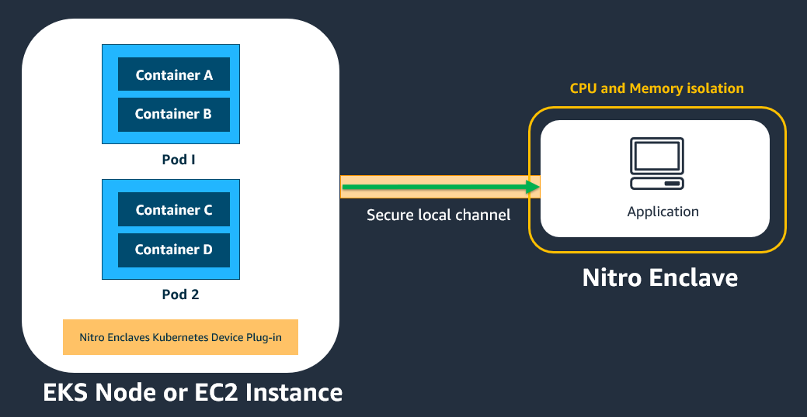

# Using Nitro Enclaves with Amazon EKS

You can use Amazon Elastic Kubernetes Service to orchestrate, scale, and deploy Nitro Enclaves from a Kubernetes pod.
Kubernetes is an open source platform for container orchestration. The following diagram
provides a conceptual overview of how Nitro Enclaves integrates with Amazon EKS.



###### Important

All pods and containers in the same Amazon EKS node or Amazon EC2 instance that has the
Nitro Enclaves Kubernetes device plugin installed will be able to communicate with the
enclave that is attached to that parent Amazon EC2 instance.

For more information about Amazon EKS see the [Amazon Elastic Kubernetes Service User Guide.](../../../eks/latest/userguide/what-is-eks.md "../../../eks/latest/userguide/what-is-eks.md")

This tutorial shows how to create an Amazon EKS cluster with a managed node group and one
enclave-enabled node. It shows how to install the Nitro Enclaves Kubernetes device plugin, how
to prepare the Hello Enclaves sample application for deployment, and how to deploy the
prepared Hello Enclaves Docker image to the cluster.

There are two key components to this process:

- Launch templates. The process requires a launch template that is properly
  configured. The launch template must have enclaves enabled and an it must include
  specific user data that is provided in [Step 1: Create a launch template](#create-lt "#create-lt"). This launch template will be used to create the
  enclave-enabled nodes in the cluster.
- The Nitro Enclaves Kubernetes device plugin. This device plugin gives your pods and
  containers the ability to create and terminate enclaves using the [Nitro Enclaves Command Line Interface](nitro-enclave-cli.md "nitro-enclave-cli.md"). The device
  plugin works with both Amazon EKS and self-managed Kubernetes nodes.

###### Tip

To simplify the build process, we also provide an open source tool called **enclavectl** that you can use to build and deploy your enclave
applications to an Amazon EKS cluster. Using **enclavectl**, you
can create an enclave-enabled Amazon EKS cluster and install the Nitro Enclaves device plugin as
a [daemonset](https://kubernetes.io/docs/concepts/workloads/controllers/daemonset/ "https://kubernetes.io/docs/concepts/workloads/controllers/daemonset/"). We also provide some sample applications and a tutorial to
demonstrate how to build and run your own enclave applications in an Amazon EKS cluster. For
more information about **enclavectl**, see the [Nitro Enclaves with Kubernetes
GitHub repo](https://github.com/aws/aws-nitro-enclaves-with-k8s "https://github.com/aws/aws-nitro-enclaves-with-k8s").

###### Topics

- [Prerequisites](#prereqs "#prereqs")
- [Step 1: Create a launch template](#create-lt "#create-lt")
- [Step 2: Create Kubernetes cluster and node](#create-cluster "#create-cluster")
- [Step 3: Install the Nitro Enclaves Kubernetes device
  plugin](#enable-plugin "#enable-plugin")
- [Step 4: Prepare the image](#prepare-image "#prepare-image")
- [Step 5: Deploy the application to the cluster](#deploy-image "#deploy-image")

## Prerequisites

- This tutorial assumes familiarity with Kubernetes concepts. For more
  information, see the [Kubernetes documentation](https://kubernetes.io/docs/concepts/overview/ "https://kubernetes.io/docs/concepts/overview/").
- The following tools are required to complete this tutorial:
  - bash shell
  - **AWS CLI** version 2. For more information
    about installing the AWS CLI, see [Getting
    started with the AWS CLI](../../../cli/latest/userguide/cli-chap-getting-started.md "../../../cli/latest/userguide/cli-chap-getting-started.md").
  - **eksctl**, a simple command line tool
    for creating and managing Kubernetes clusters on Amazon EKS. For more
    information, see [Installing or updating
    eksctl](../../../eks/latest/userguide/eksctl.md "../../../eks/latest/userguide/eksctl.md").
  - **Docker**, an open platform used for
    packaging your enclave applications into images that can be deployed
    into containers on your worker nodes. For more information, see [Get Docker](https://docs.docker.com/get-docker/ "https://docs.docker.com/get-docker/").
  - **jq**, a command line JSON processor.
    For more information, see [Download
    jq](https://stedolan.github.io/jq/download/ "https://stedolan.github.io/jq/download/").
  - **kubectl** version 1.20 and later
    versions that include the Docker runtime. kubectl is the Kubernetes
    command line tool that enables you to deploy applications, inspect and
    manage cluster resources, and view logs. For more information, see
    [Installing or
    updating kubectl](../../../eks/latest/userguide/install-kubectl.md "../../../eks/latest/userguide/install-kubectl.md") in the _Amazon EKS User
    Guide_.

## Step 1: Create a launch template

Create a launch template that will be used to launch the enclave-enabled worker nodes
(Amazon EC2 instances) in the cluster. You can create the launch template using either the
`create-launch-template` AWS CLI command or the Amazon EC2
console.

###### When you create the launch template, you must do the following:

1. Specify a supported [instance
   type](nitro-enclave.md#nitro-enclave-reqs "nitro-enclave.md#nitro-enclave-reqs").
2. Enable Nitro Enclaves.
3. Specify the following user data, which automates the AWS Nitro Enclaves CLI
   installation, and preallocates the memory and the vCPUs for enclaves on the
   instance.

The `CPU_COUNT` and `MEMORY_MIB` variables in the user
data specify the number of vCPUs and amount of memory (in MiB) respectively. For
the purpose of this tutorial, the user data below specifies `2` vCPUs
and `768` MiB of memory.

###### Note

You can specify a custom number of vCPUs and amount of memory, depending
on your workload and instance type. When you create an enclave on the worker
node, the requested memory and vCPUs can't exceed the values that you
specified here.

You can also include any other instructions in the user data that are
required for your application.

Amazon Linux 2023

```
MIME-Version: 1.0
Content-Type: multipart/mixed; boundary="==MYBOUNDARY=="

--==MYBOUNDARY==
Content-Type: text/cloud-config; charset="us-ascii"
MIME-Version: 1.0
Content-Transfer-Encoding: 7bit
Content-Disposition: attachment; filename="cloud-config.txt"

#cloud-config
bootcmd:
 - dnf install aws-nitro-enclaves-cli -y

--==MYBOUNDARY==
Content-Type: text/x-shellscript; charset="us-ascii"

#!/bin/bash -e
readonly NE_ALLOCATOR_SPEC_PATH="/etc/nitro_enclaves/allocator.yaml"
# Node resources that will be allocated for Nitro Enclaves
readonly CPU_COUNT=$CONFIG_NODE_ENCLAVE_CPU_LIMIT
readonly MEMORY_MIB=$CONFIG_NODE_ENCLAVE_MEMORY_LIMIT_MIB

# Update enclave's allocator specification: allocator.yaml
sed -i "s/cpu_count:.*/cpu_count: \$CPU_COUNT/g" \$NE_ALLOCATOR_SPEC_PATH
sed -i "s/memory_mib:.*/memory_mib: \$MEMORY_MIB/g" \$NE_ALLOCATOR_SPEC_PATH
# Restart the nitro-enclaves-allocator service to take changes effect.
systemctl enable --now nitro-enclaves-allocator.service
echo "NE user data script has finished successfully."
--==MYBOUNDARY==--
```

Amazon Linux 2

```
MIME-Version: 1.0
Content-Type: multipart/mixed; boundary="==MYBOUNDARY=="

--==MYBOUNDARY==
Content-Type: text/x-shellscript; charset="us-ascii"

#!/bin/bash -e
readonly NE_ALLOCATOR_SPEC_PATH="/etc/nitro_enclaves/allocator.yaml"
# Node resources that will be allocated for Nitro Enclaves
readonly CPU_COUNT=`2`
readonly MEMORY_MIB=`768`

# This step below is needed to install nitro-enclaves-allocator service.
amazon-linux-extras install aws-nitro-enclaves-cli -y

# Update enclave's allocator specification: allocator.yaml
sed -i "s/cpu_count:.*/cpu_count: $CPU_COUNT/g" $NE_ALLOCATOR_SPEC_PATH
sed -i "s/memory_mib:.*/memory_mib: $MEMORY_MIB/g" $NE_ALLOCATOR_SPEC_PATH
# Restart the nitro-enclaves-allocator service to take changes effect.
systemctl restart nitro-enclaves-allocator.service
echo "NE user data script has finished successfully."
--==MYBOUNDARY==--
```

###### Note

If you create the launch template using the AWS CLI, you must provide the
user data as base64-encoded text. 4. Note the launch template ID (for example, `lt-01234567890abcdef`;
you'll need it in the following step.

For more information about creating a launch template, see [Create a launch template](../../../AWSEC2/latest/UserGuide/ec2-launch-templates.md#create-launch-template "../../../AWSEC2/latest/UserGuide/ec2-launch-templates.md#create-launch-template") in the _Amazon EC2 User
Guide_.

## Step 2: Create Kubernetes cluster and node

Create the cluster with node groups and worker nodes. In this tutorial, we use the
**eksctl** command line tool to create an Amazon EKS cluster
with one managed node group with one worker node using the launch template created in
the previous step.

###### To create the cluster, node group, and worker node

1.  Create a cluster configuration file named
    `cluster_config.yaml` and add the following
    configuration, which specifies the following:

        * The name of the cluster (`metadata:name`)
        * The AWS Region in which to create the cluster
         (`region`)
        * The name of the node group
         (`managedNodeGroups:name`)
        * The ID and version of the launch template to use to create the worker
         nodes (`id` and `version`)
        * The number of nodes in the node group
         (`desiredCapacity`)

    For the purpose of this tutorial, the configuration file creates a cluster
    named `ne-cluster` in `us-east-1`, it creates
    `1` node in a node group named `ne-group` using
    version `1` of launch template
    `lt-01234567890abcdef`.

```
apiVersion: eksctl.io/v1alpha5
kind: ClusterConfig

metadata:
  name: ne-cluster
  region: `us-east-1`
  version: "1.30"

managedNodeGroups:
  - name: ne-group
    launchTemplate:
      id: `lt-01234567890abcdef`
      version: "`1`"
    desiredCapacity: `1`
```

For more information about cluster configuration files, see [Using Config Files](https://eksctl.io/usage/creating-and-managing-clusters/#using-config-files "https://eksctl.io/usage/creating-and-managing-clusters/#using-config-files") in the _eksctl
documentation_. 2. Create the cluster, node group, and worker node using the cluster
configuration file. Run the following **eksctl**
command and specify the cluster configuration file created in the previous
step.

```
`$` eksctl create cluster -f `cluster_config.yaml`
```

After the cluster is created, you will see output similar to the
following.

```
...
[✓]  EKS cluster "ne-cluster" in `us-east-1` region is ready
```

###### Note

When you create an Amazon EKS cluster using **eksctl**,
the tool automatically preconfigures **kubectl** so
that it can find and access the Amazon EKS cluster. If you create a self-managed cluster
using other tooling, you might need to manually configure **kubectl** so that it can communicate with your cluster. To check the
**kubectl** configuration, run `kubectl
 cluster-info`. If you see a URL response, **kubectl** is correctly configured to access your cluster. For more
information, see [Organizing Cluster Access Using kubeconfig Files](https://kubernetes.io/docs/concepts/configuration/organize-cluster-access-kubeconfig/ "https://kubernetes.io/docs/concepts/configuration/organize-cluster-access-kubeconfig/") in the
_Kubernetes documentation_.

## Step 3: Install the Nitro Enclaves Kubernetes device

plugin

Deploy the Nitro Enclaves Kubernetes device plugin to the cluster and then enable it on
each worker node in the cluster using **kubectl**. The
plugin enables the pods on each worker node to access the [Nitro Enclaves device
driver](https://docs.kernel.org/virt/ne_overview.html "https://docs.kernel.org/virt/ne_overview.html"). The plugin is deployed to the Kubernetes cluster as a [daemonset](https://kubernetes.io/docs/concepts/workloads/controllers/daemonset/ "https://kubernetes.io/docs/concepts/workloads/controllers/daemonset/").

###### To deploy and enable the Nitro Enclaves Kubernetes device plugin

1. Deploy the Nitro Enclaves Kubernetes device plugin to the cluster using the
   following command.

```
`$` kubectl apply -f https://raw.githubusercontent.com/aws/aws-nitro-enclaves-k8s-device-plugin/main/aws-nitro-enclaves-k8s-ds.yaml
```

To customize the Nitro Enclaves Kubernetes device plugin before deployment (for
example, turning on the `ENCLAVE_CPU_ADVERTISEMENT` feature, download
and edit the manifest before deployment.

**Download**

```
curl -O https://raw.githubusercontent.com/aws/aws-nitro-enclaves-k8s-device-plugin/main/aws-nitro-enclaves-k8s-ds.yaml
```

**Edit**

You can use any editor to manipulate the
`aws-nitro-enclaves-k8s-ds.yaml` file or a command line tool,
such as `yq`. See the following example.

````
yq ea '
  select(.kind == "DaemonSet")
|= ( .spec.template.spec.containers[]
|= ( select(.name == "aws-nitro-enclaves-k8s-dp").env[]
|= ( select(.name == "ENCLAVE_CPU_ADVERTISEMENT").value = "true" ) ) ) // . ' -i aws-nitro-enclaves-k8s-ds.yaml ``` **Deployment** ``` kubectl apply -f aws-nitro-enclaves-k8s-ds.yaml ``` 2. Get the name of the worker node on which to install the Nitro Enclaves Kubernetes device plugin using the following command. ``` `$` kubectl get nodes ``` The following is example output. ``` NAME                                            STATUS  ROLES  AGE  VERSION ip-123-123-123-123.us-east-1.compute.internal   Ready   <none> 21h  v1.30.15-eks-fb459a0 ``` 3. Enable the Nitro Enclaves Kubernetes device plugin on the worker node. Use the following **kubectl** command and specify the node name from the previous step. ``` `$` kubectl label node `node_name` aws-nitro-enclaves-k8s-dp=enabled ``` For example: ``` `$` kubectl label node `ip-123-123-123-123.us-east-1.compute.internal` aws-nitro-enclaves-k8s-dp=enabled ``` ## Step 4: Prepare the image Nitro Enclaves uses Docker images as a convenient file format for packaging your applications. You must build the Docker image that includes your enclave application and any other commands that are needed to run the application. This Docker image will be deployed to the worker node in the following step. AWS provides a command line tool, **enclavectl** that automates the steps that are needed to build an enclave image file and to package your enclave image file into a Docker image. Additionally, the tool includes features that automate Amazon EKS cluster and node group creation, and application deployment. For an end-to-end tutorial on how to use the **enclavectl** tool to automate cluster creation, application packaging, and application deployment, see the [aws-nitro-enclaves-with-k8s readme file](https://github.com/aws/aws-nitro-enclaves-with-k8s/blob/main/README.md "https://github.com/aws/aws-nitro-enclaves-with-k8s/blob/main/README.md"). ###### Note You can also perform these steps manually using Docker and the Nitro CLI. For more information, see [Building an enclave image file](building-eif.md "building-eif.md"). In this tutorial, we use the **enclavectl** tool to package the *Hello Enclaves* sample application into a Docker image. ###### To prepare the image 1. The **enclavectl** utility can be found in the `aws-nitro-enclaves-with-k8s` GitHub repo. Clone the GitHub repo and navigate into the directory. ``` `$` git clone git@github.com:aws/aws-nitro-enclaves-with-k8s.git && cd aws-nitro-enclaves-with-k8s ``` 2. Source the `env.sh` script to add the **enclavectl** tool to you PATH variable. ``` `$` source env.sh ``` 3. Configure the **enclavectl** for the tutorial. The `settings.json` file includes some default parameters that are used only if you create a cluster using **enclavectl**. Since the cluster was created manually in the previous steps, the parameters in the `settings.json` are not used; but you must run this command to configure the tool before using it. ``` `$` enclavectl configure --file settings.json ``` 4. Build the Hello Enclaves enclave image file and package it into a Docker image. The required files are located in the `/container/hello` directory. Use the `enclavectl build` command and specify the name of the directory. ``` `$` enclavectl build --image hello ``` ###### Tip You can also use the **enclavectl** tool to package your own enclave applications into a Docker image. To do this, you must create a new directory with the name of your application in the `/container` directory. For example, `/aws-nitro-enclaves-with-k8s/container/`my-app``. Then, you must create your Dockerfile and an `enclave_manifest.json` file in this directory. Then, when you run the `enclavectl build` command, for `--image` specify the name of the directory that you created. For example, `enclavectl build --image my-app`. For more information about how to use the **enclavectl** tool to package you applications, see  [How to create your own application](https://github.com/aws/aws-nitro-enclaves-with-k8s/blob/main/container/README.md "https://github.com/aws/aws-nitro-enclaves-with-k8s/blob/main/container/README.md") 5. The Docker image is created with a name in the following format: `hello-*unique\_uuid*`. To view the full name of the image, run the following command. ``` `$` docker image ls | grep hello ``` ## Step 5: Deploy the application to the cluster Finally, you need to deploy the application to your cluster. ###### To deploy the application to the cluster 1. Create a deployment specification. Create a new file named `deployment_spec.yaml` and add the following content. ``` apiVersion: apps/v1 kind: Deployment metadata: name: `unique_deployment_name` spec: replicas: 1 selector: matchLabels: app: `application_name` template: metadata: labels: app: `application_name` spec: containers: <br>• name: `unique container_name` image: `docker_image_name`:`image_tag` command: [`"docker_image_entry_point"`] resources: limits: aws.ec2.nitro/nitro_enclaves: "`1`" hugepages-2Mi: `768Mi` cpu: `250m` requests: aws.ec2.nitro/nitro_enclaves: "`1`" hugepages-2Mi: `768Mi` volumeMounts: <br>• mountPath: /dev/hugepages name: hugepage readOnly: false volumes: <br>• name: hugepage-2mi emptyDir: medium: HugePages-2Mi <br>• name: hugepage-1gi emptyDir: medium: HugePages-1Gi tolerations: <br>• effect: NoSchedule operator: Exists <br>• effect: NoExecute operator: Exists ``` The deployment specification must include the following Nitro Enclaves specific sections: <br>• ``` limits: aws.ec2.nitro/nitro_enclaves: "1" hugepages-2Mi: 768Mi ``` The `limits` section defines the resource limits for the container. A container can't use more resources than what is defined in the limits. For more information, see  [Requests and limits](https://kubernetes.io/docs/concepts/configuration/manage-resources-containers/#requests-and-limits "https://kubernetes.io/docs/concepts/configuration/manage-resources-containers/#requests-and-limits"). `aws.ec2.nitro/nitro_enclaves` is the resource name of the [enclaves device driver](https://docs.kernel.org/virt/ne_overview.html "https://docs.kernel.org/virt/ne_overview.html") defined in the device plugin. When the device plugin is registered, it advertises this name to  [kubelet](https://kubernetes.io/docs/reference/command-line-tools-reference/kubelet/ "https://kubernetes.io/docs/reference/command-line-tools-reference/kubelet/"). The resource name can be requested as part of a specification any time. In the template above, we specify `1` so that only one application can use the enclaves device driver at the same time. You can modify this value depending on your requirements. `hugepages` specifies the huge page size limit for your application. Nitro Enclaves uses large contiguous memory regions and therefore requires huge pages support. In the template above, the huge page size limit for the application is set to `768 MiB` of memory. Keep in mind that the `nitro-enclaves-allocator` service, which was installed to the node through the user data specified in the launch template, already allocated a huge page size based the value specified for ``MEMORY_MIB`` in the user data. For example, if the value for `MEMORY_MIB` in the user data is `1024`, the `nitro-enclaves allocator` allocated one page of 1 GiB huge page type for the whole node. In this case, the field in the deployment spec be defined as `hugepages-1Gi: 1Gi`. For more information, see  [Managing huge pages](https://kubernetes.io/docs/tasks/manage-hugepages/scheduling-hugepages/ "https://kubernetes.io/docs/tasks/manage-hugepages/scheduling-hugepages/"). <br>• ``` requests: aws.ec2.nitro/nitro_enclaves: "1" hugepages-2Mi: 768Mi ``` The `requests` section is used to define the node on which to place the pod For more information, see  [Requests and limits](https://kubernetes.io/docs/concepts/configuration/manage-resources-containers/#requests-and-limits "https://kubernetes.io/docs/concepts/configuration/manage-resources-containers/#requests-and-limits"). In the template above, we request a pod that has one enclave device (`aws.ec2.nitro/nitro_enclaves: "1"`), and a huge page size of 768 MiB ( `hugepages-2Mi: 768Mi`). The following is an example deployment specification for the Hello Enclaves application created in the previous steps. ``` apiVersion: apps/v1 kind: Deployment metadata: name: `hello_deployment` spec: replicas: 1 selector: matchLabels: app: `hello` template: metadata: labels: app: `hello` spec: containers: <br>• name: `hello_container` image: `123456789012.dkr.ecr.eu-central-1.amazonaws.com/hello-b0f89e0a-7d83-4928-853c-9a3f941fa769`:`latest` command: [`"/home/run.sh"`] resources: limits: aws.ec2.nitro/nitro_enclaves: "`1`" hugepages-2Mi: `768Mi` cpu: `250m` requests: aws.ec2.nitro/nitro_enclaves: "`1`" hugepages-2Mi: `768Mi` volumeMounts: <br>• mountPath: /dev/hugepages name: hugepage readOnly: false volumes: <br>• name: hugepage emptyDir: medium: HugePages-2Mi tolerations: <br>• effect: NoSchedule operator: Exists <br>• effect: NoExecute operator: Exists ``` 2. If the `ENCLAVE_CPU_ADVERTISEMENT` feature flag has been set, then the workloads can request a specific amount of CPUs for their enclaves. The Kubernetes scheduler can place the workloads on the EKS worker nodes according to the available CPUs. For more information, see [`aws-nitro-enclaves-k8s-device-plugin` documentation](https://github.com/aws/aws-nitro-enclaves-k8s-device-plugin?tab=readme-ov-file#enclave_cpu_advertisement "https://github.com/aws/aws-nitro-enclaves-k8s-device-plugin?tab=readme-ov-file#enclave_cpu_advertisement"). Kubernetes workloads can request CPUs for their enclaves (for example, 2) by adding `aws.ec2.nitro/nitro_enclaves_cpus: "2"` to the limits and sections under resources. ``` resources: limits: aws.ec2.nitro/nitro_enclaves_cpus: "2" requests: aws.ec2.nitro/nitro_enclaves_cpus: "2" ``` These values need to be combined with the limits and requests from the previous step. The following example shows a fully populated `resources` section for a Kubernetes pod requesting access to a single enclave that requires 2Gi of memory and access to 2 CPUs. ``` resources: limits: aws.ec2.nitro/nitro_enclaves: "1" aws.ec2.nitro/nitro_enclaves_cpus: "2" hugepages-1Gi: 2Gi cpu: 250m requests: aws.ec2.nitro/nitro_enclaves: "1" aws.ec2.nitro/nitro_enclaves_cpus: "2" hugepages-1Gi: 2Gi ``` 3. Apply the deployment specification to the cluster and deploy the application. Use the `kubectl apply` command and specify the deployment specification file. ``` `$` kubectl apply -f `deployment_spec.yaml` ``` ###### Tip The **enclavectl** tool automates and simplifies the steps required to deploy an application to a cluster. You can use the `enclavectl run --image `image_name`` command to automatically generate a deployment specification for your application and to automatically deploy it to your cluster. For example, `enclavectl run --image hello`. If you prefer automatically generate a deployment specification for your application, but deploy it manually, add the `--prepare-only` flag. For example, `enclavectl run --image hello --prepare-only`. Doing this will generate the deployment specification but it will not deploy the application to the cluster. Once the deployment specification has been generated, you can deploy the application using the `kubectl apply` command.
````
