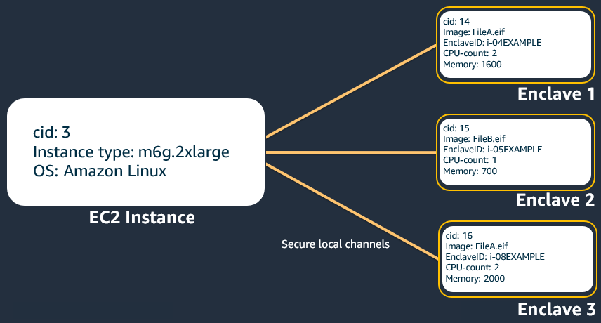

# Working with multiple enclaves

You can create up to four separate enclaves from a single Amazon EC2 parent
instance. Consider the following before using multiple enclaves.

- When launching a parent instance, choose an instance type that has
  enough vCPUs and memory for both the parent instance and the additional
  enclaves. If multi-threading is enabled, you must leave at least 2 vCPUs
  for the parent instance. If multi-threading is not enabled, you must
  leave at least 1 vCPU for the parent instance. For example, if
  multi-threading is enabled and you intend to run 4 enclaves with 4 vCPUs
  each, you must select an instance type that has at least 18 vCPUs (2
  for the parent instance and 16 for the enclaves).
- When you install the Nitro CLI, you must configure the allocator
  service to preallocate enough vCPUs and memory for all of the enclaves.
  For example, if you intend to run 3 enclaves with 4 vCPUs and 2 GiB memory
  each, you must preallocate 12 vCPUs and 6 GiB of memory. For more information,
  see [Install the Nitro Enclaves CLI on Linux](nitro-enclave-cli-install.md "nitro-enclave-cli-install.md").
- Each enclave communicates with the parent instance over vsock. Each
  enclave has its own vsock address that is defined by a context identifier
  (CID). There is no vsock connection between the enclaves.
- Each enclave has its own unique ID.
- Each enclave can be individually terminated by specifying its enclave
  ID.
- Each enclave can be configured with a different number of vCPUs or
  amount of memory.
- Each enclave on a parent instance can be created from the same or a
  different enclave image file.
  The following image illustrates an example of using multiple enclaves. In this
  example, there is a single parent instance with 3 running enclaves. The parent instance is a
  `m6g.2xlarge`, which has `8` vCPUs and `32` GiB memory,
  running Amazon Linux 2. The parent instance has a CID of `3`, and enclaves 1, 2, and 3 have
  unique CIDs of `14`, `15`, `16` respectively. Each enclave
  has a unique enclave ID; each ID is prefixed with the parent instance ID. Enclaves 1 and 3 were
  launched with the same enclave image file (`FileA.eif`), while enclave 2 was
  launched with a different enclave image file (`FileB.eif`). Enclave 1 has been
  launched with `2` vCPUs and `1600` MiB memory, enclave 2 with
  `1` vCPU and `700` MiB memory, and enclave 3 with `2` vCPUs
  and `2000` MiB memory. In total, the enclaves have been allocated with
  `5` vCPUs and `4300` MiB (`4.2` GiB) of memory, which leaves
  the parent instance with `3` vCPUs and `27.8` GiB of memory. Each
  enclave has a vsock channel to communicate with the parent instance.

