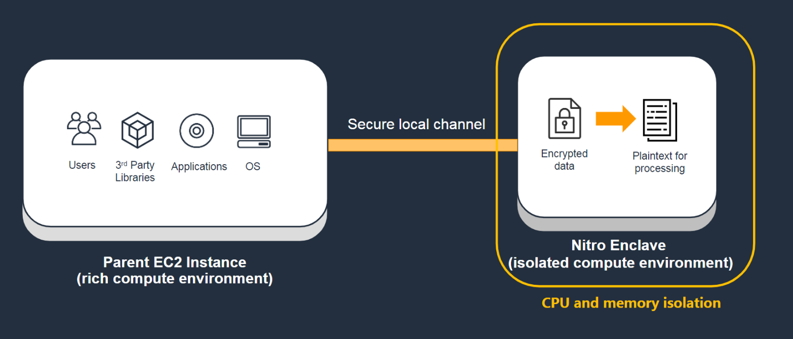

# What is Nitro Enclaves?

AWS Nitro Enclaves is an Amazon EC2 feature that allows you to create isolated execution
environments, called _enclaves_, from Amazon EC2 instances. Enclaves are
separate, hardened, and highly-constrained virtual machines. They provide only secure local
socket connectivity with their parent instance. They have no persistent storage, interactive
access, or external networking. Users cannot SSH into an enclave, and the data and
applications inside the enclave cannot be accessed by the processes, applications, or users
(root or admin) of the parent instance. Using Nitro Enclaves, you can secure your most sensitive
data, such as personally identifiable information (PII), and your data processing applications.

###### Note

Nitro Enclaves is processor agnostic and it is supported on most Intel, AMD, and AWS
Graviton-based Amazon EC2 instance types built on the AWS Nitro System.

Nitro Enclaves also supports an attestation feature, which allows you to verify an enclave's identity
and ensure that only authorized code is running inside it. Nitro Enclaves is integrated with the
AWS Key Management Service, which provides built-in support for attestation and enables you to prepare and
protect your sensitive data for processing inside enclaves. Nitro Enclaves can also be used with
other key management services.

Nitro Enclaves use the same Nitro Hypervisor technology that provides CPU and memory isolation
for Amazon EC2 instances in order to isolate the vCPUs and memory for an enclave from a parent
instance. The Nitro Hypervisor ensures that the parent instance has no access to the
isolated vCPUs and memory of the enclave.

To learn more about creating your first
enclave using a sample enclave application, see [Getting started with the Hello Enclaves sample application](getting-started.md "getting-started.md").

###### Topics

- [Learn more](#learn-more "#learn-more")
- [Requirements](#nitro-enclave-reqs "#nitro-enclave-reqs")
- [Considerations](#nitro-enclave-considerations "#nitro-enclave-considerations")
- [Pricing](#nitro-enclave-pricing "#nitro-enclave-pricing")
- [Related services](#nitro-enclave-related "#nitro-enclave-related")

## Learn more

- To learn about the concepts used in Nitro Enclaves, see [Nitro Enclaves concepts](nitro-enclave-concepts.md "nitro-enclave-concepts.md").
- To get started with your first enclave using a sample enclave application, see
  [Getting started with the Hello Enclaves sample application](getting-started.md "getting-started.md").
- To learn about using the AWS Nitro Enclaves CLI to manage the lifecycle of
  enclaves, see [Nitro Enclaves Command Line Interface](nitro-enclave-cli.md "nitro-enclave-cli.md").
- To learn about developing custom enclave applications and the
  AWS Nitro Enclaves SDK, see [Nitro Enclaves application development](developing-applications.md "developing-applications.md").
- To learn about multiple enclaves, see [Working with multiple enclaves](multiple-enclaves.md "multiple-enclaves.md").

## Requirements

Nitro Enclaves has the following requirements:

- **Parent instance requirements:**
  - The parent instance must use one of the following instance types and a Linux or Windows (2016 or later) operating system.

  General purpose

  | Instance family | Instance types                                |
  | --------------- | --------------------------------------------- | ----------------- | ----------------- |
  | M5              | All instance types, **except**: `m5.large`    | `m5.metal`        |
  | M5a             | All instance types, **except**: `m5a.large`   |
  | M5ad            | All instance types, **except**: `m5ad.large`  |
  | M5d             | All instance types, **except**: `m5d.large`   | `m5d.metal`       |
  | M5dn            | All instance types, **except**: `m5dn.large`  | `m5dn.metal`      |
  | M5n             | All instance types, **except**: `m5n.large`   | `m5n.metal`       |
  | M5zn            | All instance types, **except**: `m5zn.large`  | `m5zn.metal`      |
  | M6a             | All instance types, **except**: `m6a.large`   | `m6a.metal`       |
  | M6g             | All instance types, **except**: `m6g.medium`  | `m6g.metal`       |
  | M6gd            | All instance types, **except**: `m6gd.medium` | `m6gd.metal`      |
  | M6i             | All instance types, **except**: `m6i.large`   | `m6i.metal`       |
  | M6id            | All instance types, **except**: `m6id.large`  | `m6id.metal`      |
  | M6idn           | All instance types, **except**: `m6idn.large` | `m6idn.metal`     |
  | M6in            | All instance types, **except**: `m6in.large`  | `m6in.metal`      |
  | M7a             | All instance types, **except**: `m7a.medium`  | `m7a.large`       | `m7a.metal-48xl`  |
  | M7g             | All instance types, **except**: `m7g.medium`  | `m7g.metal`       |
  | M7gd            | All instance types, **except**: `m7gd.medium` | `m7gd.metal`      |
  | M7i             | All instance types, **except**: `m7i.large`   | `m7i.metal-24xl`  | `m7i.metal-48xl`  |
  | M8a             | All instance types, **except**: `m8a.medium`  | `m8a.metal-24xl`  | `m8a.metal-48xl`  |
  | M8g             | All instance types, **except**: `m8g.medium`  | `m8g.metal-24xl`  | `m8g.metal-48xl`  |
  | M8gd            | All instance types, **except**: `m8gd.medium` | `m8gd.metal-24xl` | `m8gd.metal-48xl` |
  | M8i             | All instance types, **except**: `m8i.large`   | `m8i.metal-48xl`  | `m8i.metal-96xl`  |

  Compute optimized

  | Instance family | Exceptions                                    |
  | --------------- | --------------------------------------------- | ----------------- | ----------------- |
  | C5              | All instance types, **except**: `c5.large`    | `c5.metal`        |
  | C5a             | All instance types, **except**: `c5a.large`   |
  | C5ad            | All instance types, **except**: `c5ad.large`  |
  | C5d             | All instance types, **except**: `c5d.large`   | `c5d.metal`       |
  | C5n             | All instance types, **except**: `c5n.large`   | `c5n.metal`       |
  | C6a             | All instance types, **except**: `c6a.large`   | `c6a.metal`       |
  | C6g             | All instance types, **except**: `c6g.medium`  | `c6g.metal`       |
  | C6gd            | All instance types, **except**: `c6gd.medium` | `c6gd.metal`      |
  | C6gn            | All instance types, **except**: `c6gn.medium` |
  | C6i             | All instance types, **except**: `c6i.large`   | `c6i.metal`       |
  | C6id            | All instance types, **except**: `c6id.large`  | `c6id.metal`      |
  | C6in            | All instance types, **except**: `c6in.large`  | `c6in.metal`      |
  | C7a             | All instance types, **except**: `c7a.medium`  | `c7a.large`       | `c7a.metal-48xl`  |
  | C7g             | All instance types, **except**: `c7g.medium`  | `c7g.metal`       |
  | C7gd            | All instance types, **except**: `c7gd.medium` | `c7gd.metal`      |
  | C7i             | All instance types, **except**: `c7i.large`   | `c7i.metal-24xl`  | `c7i.metal-48xl`  |
  | C8g             | All instance types, **except**: `c8g.medium`  | `c8g.metal-24xl`  | `c8g.metal-48xl`  |
  | C8gd            | All instance types, **except**: `c8gd.medium` | `c8gd.metal-24xl` | `c8gd.metal-48xl` |
  | C8gn            | All instance types, **except**: `c8gn.medium` | `c8gn.metal-24xl` | `c8gn.metal-48xl` |
  | C8i             | All instance types, **except**: `c8i.large`   | `c8i.metal-48xl`  | `c8i.metal-96xl`  |

  Memory optimized

  | Instance family | Instance types                                 |
  | --------------- | ---------------------------------------------- | ----------------- | ----------------- |
  | R5              | All instance types, **except**: `r5.large`     | `r5.metal`        |
  | R5a             | All instance types, **except**: `r5a.large`    |
  | R5ad            | All instance types, **except**: `r5ad.large`   |
  | R5b             | All instance types, **except**: `r5b.large`    | `r5b.metal`       |
  | R5d             | All instance types, **except**: `r5d.large`    | `r5d.metal`       |
  | R5dn            | All instance types, **except**: `r5dn.large`   | `r5dn.metal`      |
  | R5n             | All instance types, **except**: `r5n.large`    | `r5n.metal`       |
  | R6a             | All instance types, **except**: `r6a.large`    | `r6a.metal`       |
  | R6g             | All instance types, **except**: `r6g.medium`   | `r6g.metal`       |
  | R6gd            | All instance types, **except**: `r6gd.medium`  | `r6gd.metal`      |
  | R6i             | All instance types, **except**: `r6i.large`    | `r6i.metal`       |
  | R6id            | All instance types, **except**: `r6id.large`   | `r6id.metal`      |
  | R6idn           | All instance types, **except**: `r6idn.large`  | `r6idn.metal`     |
  | R6in            | All instance types, **except**: `r6in.large`   | `r6in.metal`      |
  | R7a             | All instance types, **except**: `r7a.medium`   | `r7a.large`       | `r7a.metal-48xl`  |
  | R7g             | All instance types, **except**: `r7g.medium`   | `r7g.metal`       |
  | R7gd            | All instance types, **except**: `r7gd.medium`  | `r7gd.metal`      |
  | R7i             | All instance types, **except**: `r7i.large`    | `r7i.metal-24xl`  | `r7i.metal-48xl`  |
  | R7iz            | All instance types, **except**: `r7iz.large`   | `r7iz.metal-16xl` | `r7iz.metal-32xl` |
  | R8a             | All instance types, **except**: `r8a.medium`   | `r8a.metal-24xl`  | `r8a.metal-48xl`  |
  | R8g             | All instance types, **except**: `r8g.medium`   | `r8g.metal-24xl`  | `r8g.metal-48xl`  |
  | R8gb            | All instance types, **except**: `r8gb.medium`  | `r8gb.metal-24xl` |
  | R8gd            | All instance types, **except**: `r8gd.medium`  | `r8gd.metal-24xl` | `r8gd.metal-48xl` |
  | R8gn            | All instance types, **except**: `r8gn.medium`  | `r8gn.metal-24xl` | `r8gn.metal-48xl` |
  | R8i             | All instance types, **except**: `r8i.large`    | `r8i.metal-48xl`  | `r8i.metal-96xl`  |
  | X2gd            | All instance types, **except**: `x2gd.medium`  | `x2gd.metal`      |
  | X2idn           | All instance types, **except**: `x2idn.metal`  |
  | X2iedn          | All instance types, **except**: `x2iedn.metal` |
  | X2iezn          | All instance types, **except**: `x2iezn.metal` |
  | X8g             | All instance types, **except**: `x8g.medium`   | `x8g.metal-24xl`  | `x8g.metal-48xl`  |
  | z1d             | All instance types, **except**: `z1d.large`    | `z1d.metal`       |

  Storage optimized

  | Instance family | Instance types                                    |
  | --------------- | ------------------------------------------------- | ----------------- | ----------------- |
  | D3              | All instance types.                               |
  | D3en            | All instance types.                               |
  | I3en            | All instance types, **except**: `i3en.large`      | `i3en.metal`      |
  | I4g             | All instance types.                               |
  | I4i             | All instance types, **except**: `i4i.large`       | `i4i.metal`       |
  | I7i             | All instance types, **except**: `i7i.large`       | `i7i.metal-24xl`  | `i7i.metal-48xl`  |
  | I7ie            | All instance types, **except**: `i7ie.large`      | `i7ie.metal-24xl` | `i7ie.metal-48xl` |
  | I8g             | All instance types, **except**: `i8g.metal-24xl`  |
  | I8ge            | All instance types, **except**: `i8ge.metal-24xl` | `i8ge.metal-48xl` |

  Accelerated computing

  | Instance family | Instance types                               |
  | --------------- | -------------------------------------------- |
  | DL1             | All instance types.                          |
  | DL2q            | All instance types.                          |
  | F2              | All instance types.                          |
  | G4dn            | All instance types, **except**: `g4dn.metal` |
  | G5              | All instance types.                          |
  | G6              | All instance types.                          |
  | G6e             | All instance types.                          |
  | G6f             | All instance types, **except**: `g6f.large`  |
  | Gr6             | All instance types.                          |
  | Gr6f            | All instance types.                          |
  | Inf1            | All instance types.                          |
  | Inf2            | All instance types.                          |
  | P3dn            | All instance types.                          |
  | P4d             | All instance types.                          |
  | P4de            | All instance types.                          |
  | P5              | All instance types.                          |
  | P5e             | All instance types.                          |
  | P5en            | All instance types.                          |
  | Trn2            | All instance types.                          |
  | Trn2u           | All instance types.                          |

- **Enclave requirements:**
  - The enclave must run a Linux operating system.

## Considerations

Keep the following in mind when using Nitro Enclaves:

- Nitro Enclaves is supported in all AWS Regions, including the AWS GovCloud (US)
  Regions.
- You can create up to four individual enclaves per parent instance.
- Enclaves can communicate only with the parent instance. Enclaves
  running on the same or different parent instances cannot communicate
  with each other.
- Enclaves are active only while their parent instance is in the
  `running` state. If the parent instance is stopped or
  terminated, its enclaves are terminated.
- You cannot enable hibernation and enclaves on the same instance.
- Nitro Enclaves is not supported on Outposts.
- Nitro Enclaves is not supported in Local Zones or Wavelength Zones.

## Pricing

There are no additional charges for using Nitro Enclaves. You are billed the standard
charges for the Amazon EC2 instance and for the other AWS services that you use.

## Related services

Nitro Enclaves is integrated with the following AWS services:

**AWS Key Management Service**

AWS Key Management Service (KMS) makes it easy for you to create and manage cryptographic
keys and control their use across a wide range of AWS services and in your
applications. Nitro Enclaves integrates with AWS KMS and it allows you to perform
selected KMS operations from the enclave using the [AWS Nitro Enclaves SDK](https://github.com/aws/aws-nitro-enclaves-sdk-c "https://github.com/aws/aws-nitro-enclaves-sdk-c"). These operations can be tied to the [cryptographic attestation](set-up-attestation.md "set-up-attestation.md") process of
Nitro Enclaves by setting a AWS KMS key policy to ensure that the operation works
only when the measurements of the enclave match the KMS key policy. For more
information, see [AWS KMS condition keys for Nitro Enclaves](../../../kms/latest/developerguide/policy-conditions.md#conditions-nitro-enclaves "../../../kms/latest/developerguide/policy-conditions.md#conditions-nitro-enclaves") in the
_AWS Key Management Service Developer Guide_.

**AWS Certificate Manager**

AWS Certificate Manager (ACM) is a service that lets you easily provision, manage, and
deploy public and private Secure Sockets Layer/Transport Layer Security
(SSL/TLS) certificates for use with AWS services and your internal connected
resources. SSL/TLS certificates are used to secure network communications
and to establish the identity of websites over the internet, as well as
resources on private networks. ACM removes the time-consuming manual process
of purchasing, uploading, and renewing SSL/TLS certificates. For more
information, see [AWS Certificate Manager for Nitro Enclaves](nitro-enclave-refapp.md "nitro-enclave-refapp.md").
