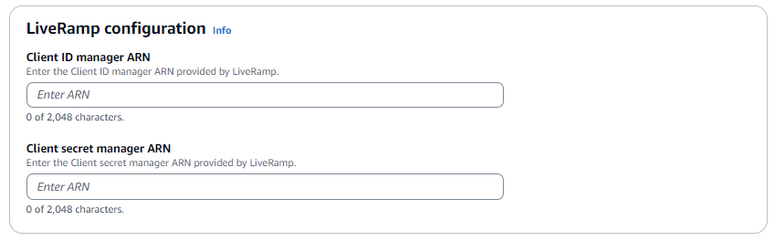
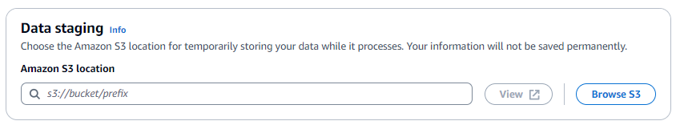

# Creating an ID mapping workflow

(provider services)

This topic describes the process of creating an ID mapping workflow for one
AWS account using a provider service called LiveRamp. LiveRamp translates a set of source
RampIDs to another set using either maintained or derived RampIDs.

###### To create a provider service-based ID mapping workflow for one AWS account

1.  Sign in to the AWS Management Console and open the AWS Entity Resolution console at [https://console.aws.amazon.com/entityresolution/](https://console.aws.amazon.com/entityresolution/ "https://console.aws.amazon.com/entityresolution/").
2.  In the left navigation pane, under **Workflows**, choose
    **ID mapping**.
3.  On the **ID mapping workflows** page, in the upper right corner,
    choose **Create ID mapping workflow**.
4.  For **Step 1: Specify ID mapping workflow details**, do the
    following.
    1. Enter an **ID mapping workflow name** and an optional
       **Description**.

     2. For the **ID mapping method**, choose **Provider
    services**.

    AWS Entity Resolution currently offers the LiveRamp provider service as an ID mapping method. If
    you have a subscription to LiveRamp, then the status appears as
    **Subscribed**. For more information about how to subscribe to
    LiveRamp, see [Step 1: Subscribe to a provider service on
    AWS Data Exchange](prepare-third-party-input-data.md#subscribe-provider-service "prepare-third-party-input-data.md#subscribe-provider-service").

    

    ###### Note

    Ensure that your data input file format aligns with the provider service's
    guidelines. For more information about LiveRamp's input file formatting
    guidelines, see [Perform Translation Through ADX](https://docs.liveramp.com/identity/en/perform-transcoding-through-adx.html "https://docs.liveramp.com/identity/en/perform-transcoding-through-adx.html") on the LiveRamp documentation
    website. 3. For **LiveRamp configuration**, enter the following values that
    LiveRamp provides:

        * **Client ID manager ARN**
        * **Client secret manager ARN**

     4. (Optional) To enable **Tags** for the resource, choose
    **Add new tag**, and then enter the **Key** and
    **Value** pair. 5. Choose **Next**.

5.  For **Step 2: Specify source and target**, do the following.
    1. For **Source**, choose the scenario that applies to you and
       then take the recommended action.

| Scenario                                                                                                     | Recommended action                                                                                                                                                                                                                                                                                                                                                                                                                                                                                                                                                       |
| ------------------------------------------------------------------------------------------------------------ | ------------------------------------------------------------------------------------------------------------------------------------------------------------------------------------------------------------------------------------------------------------------------------------------------------------------------------------------------------------------------------------------------------------------------------------------------------------------------------------------------------------------------------------------------------------------------ | ---------------------------------------------------------------------------------------------------------------------------------------------------------------------------------------------------------------------------------------------------------------------------------------------------------------------------------------------------------------------------------------------------------------------------------------------------------------------------------------------------------------------------------------------------------------------------------------------------------------------------------------------------------------------------------------------------------------------------------------------------------------------------------------------------------------------------------------------------------------------------------------------------------------------------------------------------------------- |
| Use your own AWS Glue database, AWS Glue table, and schema mapping in the ID mapping workflow.               | 1. Choose **Schema mapping**. 2. Select an **AWS Region**, **AWS Glue database**, the **AWS Glue table**, and then the corresponding **Schema mapping**. You can add up to 19 data inputs.                                                                                                                                                                                                                                                                                                                                                                               |
| Use an existing matching workflow that points to the record data you want to use in the ID mapping workflow. | 1. Choose **Matching workflow**. 2. Select an existing **Matching workflow** from the dropdown list.                                                                                                                                                                                                                                                                                                                                                                                                                                                                     | 2. For **Target**, take one of the following actions based on your chosen ID mapping method.                                                                                                                                                                                                                                                                                                                                                                                                                                                                                                                                                                                                                                                                                                                                                                                                                                                                     |
| ID mapping method                                                                                            | Recommended action                                                                                                                                                                                                                                                                                                                                                                                                                                                                                                                                                       |
| ---                                                                                                          | ---                                                                                                                                                                                                                                                                                                                                                                                                                                                                                                                                                                      |
| **Rule-based**                                                                                               | Select an existing **Matching workflow** from the dropdown list.                                                                                                                                                                                                                                                                                                                                                                                                                                                                                                         |
| **Provider services**                                                                                        | Enter the LiveRamp client domain identifier targeted for transcoding that LiveRamp provides in the **Target domain**. The Target field on the Specify source and target page                                                                                                                                                                                                                                                                                                                                                                                             | 3. For **Data staging**, choose the **Amazon S3 location** where you want to temporarily write the ID mapping workflow output.  4. To specify the **Service access** permissions, choose an option and take the recommended action.                                                                                                                                                                                                                                                                                                                                                                                                                                                                        |
| Option                                                                                                       | Recommended action                                                                                                                                                                                                                                                                                                                                                                                                                                                                                                                                                       |
| ---                                                                                                          | ---                                                                                                                                                                                                                                                                                                                                                                                                                                                                                                                                                                      |
| **Create and use a new service role**                                                                        |  • AWS Entity Resolution creates a service role with the required policy for this table.  • The default **Service role name** is `entityresolution-id-mapping-workflow-<timestamp>`.  • You must have permissions to create roles and attach policies.  • If your input data is encrypted, choose the **This data is encrypted by a KMS key** option. Then, enter an **AWS KMS key** that is used to decrypt your data input.                                                                                                                                |
| **Use an existing service role**                                                                             | 1. Choose an **Existing service role name** from the dropdown list. The list of roles are displayed if you have permissions to list roles. If you don't have permissions to list roles, you can enter the Amazon Resource Name (ARN) of the role that you want to use. If there are no existing service roles, the option to **Use an existing service role** is unavailable. 2. View the service role by choosing the **View in IAM** external link. By default, AWS Entity Resolution doesn't attempt to update the existing role policy to add necessary permissions. | 6. Choose **Next**. 7. For **Step 3: Specify data output location – _optional_**, do the following. 1. For **Data output destination**, do the following: 1. Choose the **Amazon S3 location** for the data output. 2. For **Encryption**, if you choose to **Customize encryption settings**, then enter the **AWS KMS key** ARN or choose **Create an AWS KMS key**. 2. View the **LiveRamp generated output**. 3. Choose **Next**.  8. For **Step 4: Review and create**, do the following. 1. Review the selections that you made for the previous steps and edit them if necessary. 2. Choose **Create**. A message appears, indicating that the ID mapping workflow has been created. 9. After you create the ID mapping workflow, you're ready to [run an ID mapping workflow](run-id-mapping-workflow.md "run-id-mapping-workflow.md"). |
